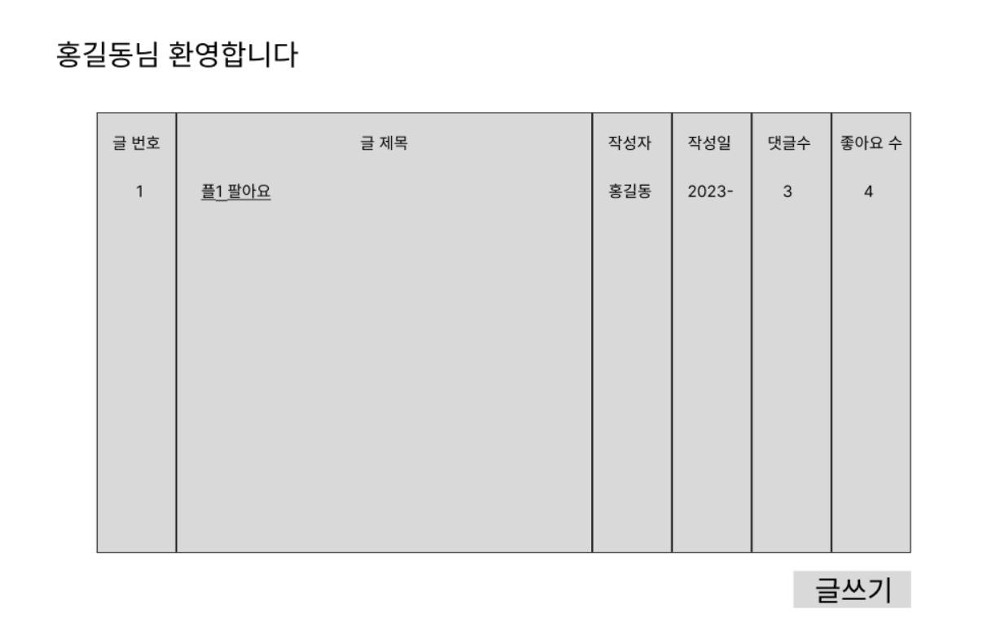
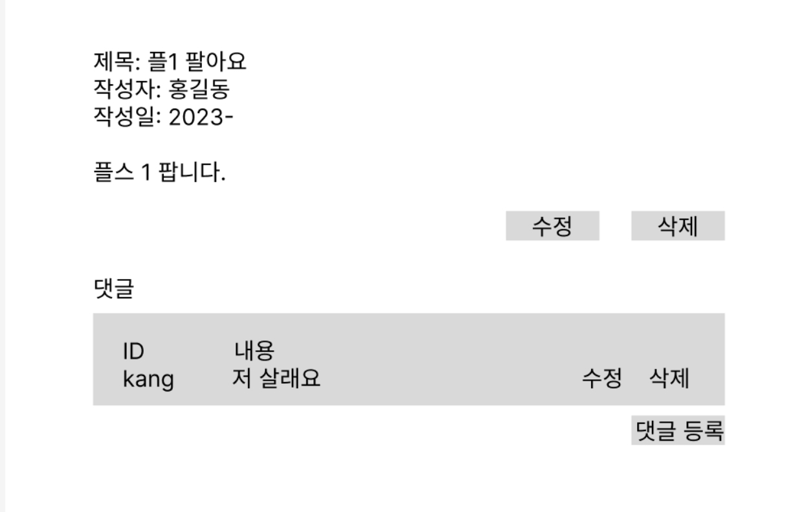
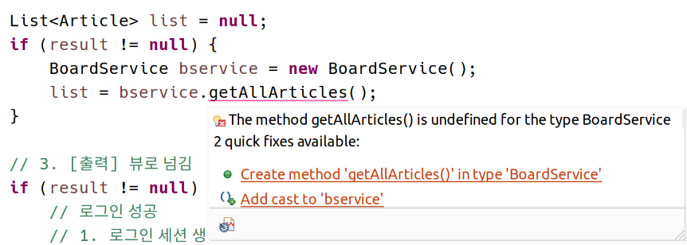

# 게시판 구현 (이어서)

## 오늘의 일정

- 오전: 스토리보드 완성, 게시글 리스트 화면
- 오후: 나머지 기능 구현 시작
    - 글 작성
    - 수정
    - 삭제
    - 댓글 등록
    - 수정
    - 삭제

- 다음주 수요일: 기능 구현 완료
- 목~금: Vue.js 적용
- 그 다음주: 스프링 시작

## 스토리보드





댓글 수정, 등록, 삭제는 JQuery를 이용한 AJAX 요청으로 구현

## 구현

### 로그인 성공 후 게시글 리스트

#### loginSuccess.jsp 수정

```java
<h1><%= ((Member)session.getAttribute("member")).getMemberName() %>님 환영합니다.</h1>

<h3>게시글 목록</h3>
<table border=1>
    <thead>
        <th>글 번호</th>
        <th>글 제목</th>
        <th>작성자</th>
        <th>작성일</th>
        <th>댓글 수</th>
        <th>좋아요</th>
    </thead>
    <tbody>
        <tr>
            <td>1</td>
            <td>플스 팔아요</td>
            <td>홍길동</td>
            <td>2023-02-10</td>
            <td>3</td>
            <td>5</td>
        </tr>		
    </tbody>
</table>
```

#### 데이터베이스 잡기

```sql
-- 게시글 테이블 만들기
CREATE TABLE articles (
	articleNum  INTEGER  NOT NULL PRIMARY KEY auto_increment,
	articleTitle  VARCHAR(30)  NOT NULL,
	articleContent  VARCHAR(256)  NOT NULL,
	articleAuthor  VARCHAR(10),
	articleDate  DATETIME  NOT NULL DEFAULT NOW(),
	articleLike  INTEGER,
	FOREIGN KEY (articleAuthor) REFERENCES members(memberId)
);

-- 게시글 테이블 테스트 데이터
INSERT INTO articles(articleTitle, articleAuthor, articleContent, articleLike)
		VALUES('플스 팔아요', 'hong', '싸게 팝니다. 네고 사절', 5);

INSERT INTO articles(articleTitle, articleAuthor, articleContent, articleLike)
		VALUES('갤럭시 팔아요', 'hong', '5만원에 팝니다. 네고 사절', 2);
```

#### 데이터베이스 연동

- 게시판에 해당하는 패키지 board를 만들고, board.vo에 Article VO 생성

- board.service에 BoardService를 생성

- LoginServlet.java 수정

```java
// 전략

List<Article> list = null;
if (result != null) {
    BoardService bservice = new BoardService();
    list = bservice.getAllArticles();
}

// 3. [출력] 뷰로 넘김
if (result != null) {
    // 로그인 성공
    // 1. 로그인 세션 생성
    //    -- 서비스는 '비즈니스 로직'을 처리하는 '일반 자바 클래스'이므로.
    //    -- 세션 처리는 서블릿에서 한다.
    // 2. 게시판 페이지 전송 (JSP)
    //    -- 동적 페이지이므로 JSP를 보내준다.

    HttpSession session = request.getSession(true);
    session.setAttribute("member", result); // VO 자체를 저장

    // 게시판 JSP(=Servlet)로 이동 => 서블릿에서 서블릿으로 이동
    // HTML 페이지로 이동하는 것과 다름. RequestDispatcher(JSP_Location) 사용
    RequestDispatcher dispatcher
        = request.getRequestDispatcher("loginSuccess.jsp");

    request.setAttribute("boardList", list);  // 세션이 아닌 request에 불러온 게시글을 넣고 JSP에 넘긴다

    dispatcher.forward(request, response); // 해당 JSP에 현재 Request와 Response 객체를 넘기며 제어권을 넘긴다.

// 후략
```

- loginSuccess.jsp 수정

```jsqp
<!-- 전략 -->

<%@ page import="member.vo.Member, board.vo.Article, java.util.List " %> <!-- 페이지 디렉티브로 임포트 -->

<!-- 중략 -->

<tbody>
    <%
        List<Article> list = (List<Article>)request.getAttribute("boardList"); // 세션과 마찬가지로 request 바로 참조
        for(Article article : list) { %>
    <tr>
        <td><%= article.getArticleNum() %></td>
        <td><%= article.getArticleTitle() %></td>
        <td><%= article.getArticleAuthor() %></td>
        <td><%= article.getArticleDate() %></td>
        <td>0</td>
        <td><%= article.getArticleLike() %></td>
    </tr>
    <% } %>
</tbody>

<!-- 후략 -->
```

- DB 로직 처리




```java
// BoardService.java
public List<Article> getAllArticles() {
		BoardDAO dao = new BoardDAO();
		List<Article> list = dao.selectAll();
		return list;
	}
```

SqlMapConfig에서 Article VO에 대한 Alias 추가하고, Mapper Board.xml 추가. Mapper 작성.

```xml
<!-- SqlMapConfig.xml -->
	 <typeAliases>
	 	<typeAlias type="member.vo.Member" alias="Member"/>
	 	<typeAlias type="board.vo.Article" alias="Article"/>
	 </typeAliases>

	<mappers>
		<mapper resource="./sqlmap/Member.xml"/>
		<mapper resource="./sqlmap/Board.xml"/>
	</mappers>
```

```xml
<!-- sqlmap/Board.xml -->
<mapper namespace="myBoard">

	<select id="allArticles" resultType="Member">		
		<![CDATA[
			SELECT articleNum, articleTitle, articleContent, articleAuthor, articleDate, articleLike
			FROM articles 
			WHERE memberId = #{memberId} AND memberPw = #{memberPw}
		]]>
	</select>

</mapper>
```