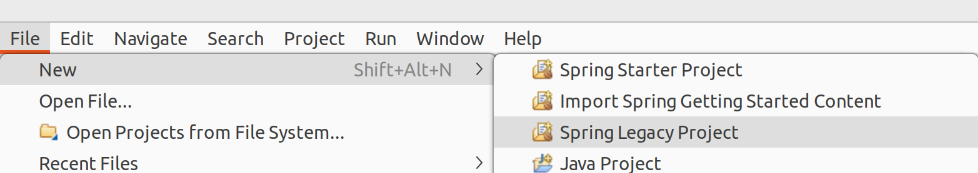
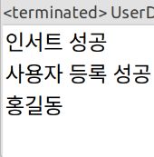

# 스프링 개요

## 개발 환경 구성

### 사용 가능한 환경

1. 이클립스에 스프링 플러그인 설치
2. STS(Spring Tool Suite) 사용: 이클립스를 기반으로 스프링 개발을 위한 도구를 통합한 것. 우리는 이것을 사용.

### 스프링과 스프링 부트

스프링 부트는 스프링 레거시에 대한 설정을 간편화한 것. 우선 스프링을 이해하고 스프링 부트를 학습하는 것이 적합함.

## STS 설치 및 설정

### 설치

1. [스프링 홈페이지](https://dist.springsource.com/release/STS/index.html)에서 STS 압축 파일을 다운로드하고 압축 해제
2. 실습을 위해 C:\tools에 sts-build, apache tomcat, MySQL connector-J 위치. (본인은 ~/tools에 넣었음)
3. sts-bundle/sts-3.9.12.RELEASE/STS를 실행
4. 워크스페이스는 C:/springedu/sts-workspace로 지정 (본인은 ~/sts-workspace로 지정)

### 인코딩 설정

상단 메뉴 – WIndow – Preferences

- General
    - Content Types
        - Java Class File
            - Default encoding: UTF-8 -> Update
        - Editors
            - Text Editors
                - Spelling
                    - Encoding: UTF-8
        - Workspace
            - Text file encoding: UTF-8
- Web
    - CSS Files
    - HTML Files
    - JSP Fiels
        - Encoding:UTF-8
- XML
    - XML Files
        - Encoding: UTF-8

## 스프링에 대한 기반 지식

### 프로젝트 생성



### STEP1

JDBC를 이용하여 사용자의 ID와 비밀번호를 데이터베이스에 저장, 조회하는 프로그램 작성.
패키지 이름: step1

#### (1) VO 작성

##### 패키지 작성

- step1.dao
- step1.vo

step1.vo에 User 클래스 작성 (User외에도 UserEntity, UserVO로 작명하기도 함)

우리가 해왔듯이, 자바 빈 규약에 기반하여 VO를 작성한다.

> **Java Beans 규약**  
> - 클래스를 작성하는 규칙
> 1. 인자가 없는 기본 생성자가 존재해야 한다
> 2. 필드는 private으로 생성해야한다
> 3. getter와 setter가 존재해야 하며, public으로 지정해야 한다.
> 이러한 규약을 따라 만든 클래스의 객체를 자바 빈 객체라고 한다.

나중에는 롬북을 이용하여 이 절자조차 간편화할 것이다.

#### (2) 테이블 만들기

```sql
CREATE SCHEMA spring;
USE spring;

CREATE TABLE users (
	id			varchar(10) PRIMARY KEY,
	password	varchar(10) NOT NULL,
	name		varchar(10) NOT null
);

SELECT * FROM users;
```

#### (3) DAO 만들기

step1.dao 패키지에 UserDao 작성

2개의 메서드 작성

1. 사용자 입력
2. 사용자 조회

```java
package step1.dao;

import java.sql.Connection;
import java.sql.DriverManager;
import java.sql.PreparedStatement;
import java.sql.ResultSet;

import step1.vo.User;

public class UserDao {

	public void insert(User user) throws Exception {
		// 순수 JDBC 처리
		// 1. Driver Loading
		Class.forName("com.mysql.cj.jdbc.Driver");
		
		// 2. Connection 객체
		String jdbUrl = "jdbc:mysql://127.0.0.1:3306/spring?characterEncoding=UTF-8&serverTimezone=UTC&useSSL=false&allowPublicKeyRetrieval=true\"";
		String id = "root";
		String pw = "test1234";
		
		Connection con = DriverManager.getConnection(jdbUrl, id, pw);
		
		// 3. Statement 객체
		String sql = "INSERT INTO users VALUES (?, ?, ?)";
		PreparedStatement pstmt = con.prepareStatement(sql);
		pstmt.setString(1, user.getId());
		pstmt.setString(2, user.getPassword());
		pstmt.setString(3, user.getName());
		
		// 4. SQL 문 실행
		int result = pstmt.executeUpdate();
		
		// 5. 결과 처리
		if (result == 1) {
			System.out.println("인서트 성공"); // 테스트용이므로 결과 처리를 여기서 마무리했음
		}
		
		// 6. 리소스 할당 해제
		pstmt.close();
		con.close();
	}
	
	public User select(String id) throws Exception {
		// 1. Driver Loading
		Class.forName("com.mysql.cj.jdbc.Driver");
		
		// 2. Connection 객체
		String jdbUrl = "jdbc:mysql://127.0.0.1:3306/spring?characterEncoding=UTF-8&serverTimezone=UTC&useSSL=false&allowPublicKeyRetrieval=true\"";
		String db_id = "root";
		String db_pw = "test1234";
		
		Connection con = DriverManager.getConnection(jdbUrl, db_id, db_pw);
		
		// 3. Statement 객체
		String sql = "SELECT * FROM users WHERE id = ?";
		PreparedStatement pstmt = con.prepareStatement(sql);
		pstmt.setString(1, id);
		
		// 4. SQL 문 실행
		ResultSet result = pstmt.executeQuery();
		
		// 5. 결과 처리
		result.next();
		User user = new User(result.getString("id"),
							result.getString("password"),
							result.getString("name"));

		// 6. 리소스 할당 해제
		pstmt.close();
		con.close();
		
		return user;
	}
}
```

#### (4) main 메서드 작성

```java
package step1;

import step1.dao.UserDao;
import step1.vo.User;

public class UserDaoTest {

	public static void main(String[] args) throws Exception {
		
		// 1. 사용자 VO 생성
		User user = new User("hong", "1234", "홍길동");
		
		// 2. DAO 생성
		UserDao dao = new UserDao();
		
		// 3. 사용자 입력
		dao.insert(user);
		System.out.println("사용자 등록 성공");
		
		// 4. 사용자 조회
		User result = dao.select("hong");
		System.out.println(result.getName());
		
	}
}
```

빌드패스에 Connector/J를 잡아줘야 실행된다.



의도한대로 프로그램이 잘 실행되었다.

#### 생각할 점: 객체지향과 변화 대응

개발 및 유지보수 과정 중 요구사항은 언제나 변화할 수 있음. 따라서, 코드를 작성할 때에는 이러한 변화에 효과적으로 대응할 수 있도록 해야 함. 어떻게 하면 변화에도 유연하게, 최소한의 부분만 수정할 수 있도록 설계할 수 있는가?

이를 위해서는,  
1. 분리  
2. 확장  
의 관점에서 코드를 설계할 필요가 있다.

