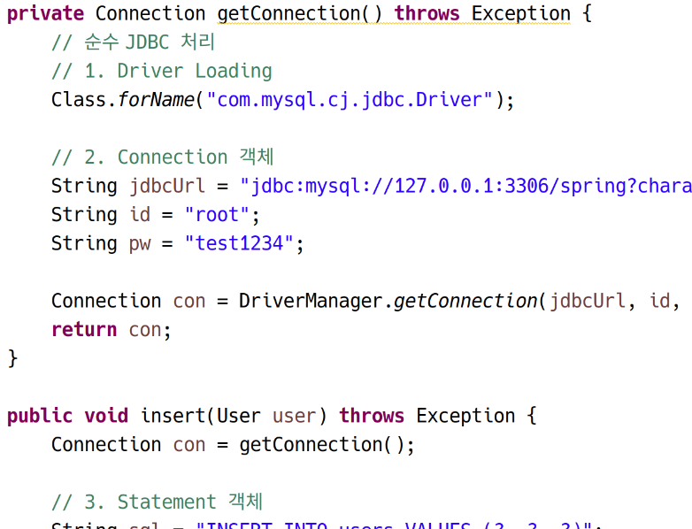
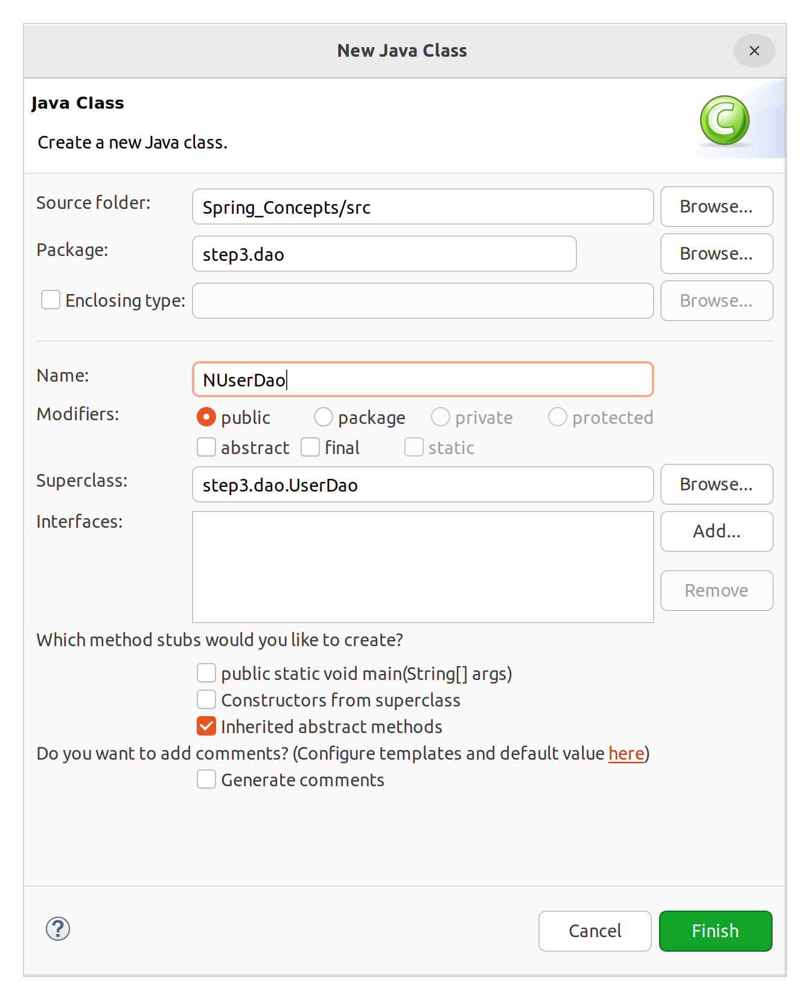
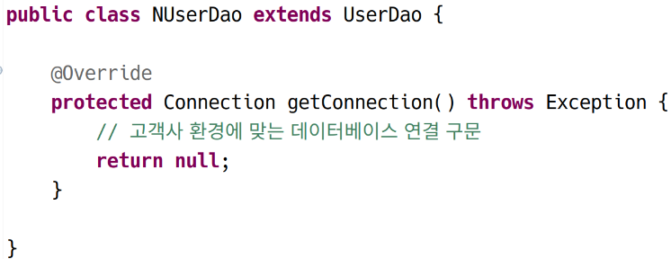
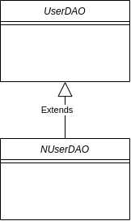

# 스프링에 대한 기반 지식 1

## STEP 2

 ### 분리
 
 **Soc (Separation of Concerns): 관심사의 분리**
 
 같은 관심사는 여기저기 분산되어서는 안되며 한 곳에 함께 존재해야 한다. 반대로 서로 다른 관심사는 서로 명확하게 분리되어야 한다.
 
 가장 쉽게 검사하는 방법: 중복 코드가 있는지 확인하라. 특정 코드가 중복되는 경우 분리되어야 할 관심사가 분리되지 않아 다른 관심사의 영역에서 무분별하게 재생산되는 것일 수 있다.
 
 - 데이터베이스 연결 준비를 위한 구문: UserDao의 두 개 메서드에 병존하고 있다. 각 메서드 insert, select는 SQL 실행을 관심사로 하므로, 데이터베이스 연결 준비 부분인 위의 구문은 해당 메서드들로부터 분리되어야 한다.

```java
// 1. Driver Loading
Class.forName("com.mysql.cj.jdbc.Driver");

// 2. Connection 객체
String jdbcUrl = "jdbc:mysql://127.0.0.1:3306/spring?characterEncoding=UTF-8&serverTimezone=UTC&useSSL=false&allowPublicKeyRetrieval=true";
String id = "root";
String pw = "test1234";

Connection con = DriverManager.getConnection(jdbcUrl, id, pw);
```

### 실습: 메서드를 통해 관심사 분리

- step2.dao, step2.vo 패키지 생성
- step1.vo.User을 step2.vo에 복사
- step1.dao.UserDao를 step2.dao에 복사하고, import 구문을 확인 (step1의 vo를 참조하지 않는지)



커넥션 반환을 수행하는 메서드를 만들고, 중복 로직을 분리하였다. insert와 update 메서드에서는 해당 메서드를 호출하여 Connection 객체를 얻도록 처리했다.

step1과 동일한 작업을 수행하는 코드이지만, 내부 설계가 개선되었다. 이렇게 입출력을 같지만, 내부의 구조를 효율적으로 개선시키는 작업을 리팩토링이라고 한다. (리팩토링이라는 용어만 알아두기를 알아두기를 바란다. 구체적인 리팩토링의 방법은 나중에 자바를 어느정도 공부하고 나서 진행하는 것이 좋다.)

DELETE 문을 통해 user 테이블의 내용을 지우고, UserDaoTest.java를 step1 패키지에서 복사하여(또한 import 수정) 실행해본다. 잘 동작된다.

## STEP 3

### 확장

#### 개요

> - 우리가 작성한 코드는 확장성있게 디자인되었는가?  
> - 나중에 기능이 추가가 필요하여 DAO의 기능을 학장할 필요가 있다면?  
> - 확장성을 고려하여 DAO를 작성하려면 어떻게 해야하는가?

우리가 작성한 DAO를 N사, K사, KOSA 등 타사에 판매한다고 가정해보자. 이때 소스코드 자체를 판매하려는 것은 아니다. 이미 컴파일이 완료된 클래스를 제공하려고 한다. 그러나 각 고객사마다 사용하는 DB 제품과 접속 정보가 다를 것이다. 소스코드를 수정하지 않아도 해당 정보를 수정할 수 있도록 하려면, 즉 사용성에 따라 쉽게 확장시키려면 어떻게 해야할까?

#### 상속

그럼 변화가능성이 있는 부분(concern)을 추상클래스로 바꾸어, 고객사가 해당 클래스를 상속받게 하되 해당 부분을 환경에 맞게 재정의할 수 있게 하자. 추상화한다는 것은, 기능이 확정되지 않은 메서드나 클래스를 만드는 것을 의미한다. 자바에서는 abstract 키워드를 사용할 수 있다.


### 실습

step3.vo, step3.dao 패키지를 만들고, step2의 소스 코드를 복사한다. UserDao는 다시 열어서 Dao를 수정해준다.

```java
public abstract class UserDao {
	
	protected abstract Connection getConnection() throws Exception;
	
    // 후략
```

위와 같이 연결 부분을 추상화하였다. 메서드의 기존 접근제어자는 protected로 변경하여, 상속 클래스가 접근할 수 있게 한다.

그렇다면, 고객사에서는 위의 클래스를 상속받아 abstract 메서드를 구현하면 된다.





&nbsp;

**step3.UserDaoTest**

```java
package step3;

import step3.dao.NUserDao;
import step3.dao.UserDao;
import step3.vo.User;

public class UserDaoTest {

	public static void main(String[] args) throws Exception {
		
		System.out.println("[STEP3]");
		
		// 1. 사용자 VO 생성
		User user = new User("hong", "1234", "홍길동");
		
		// 2. DAO 생성
		UserDao dao = new NUserDao(); // 추상 메서드를 구현한 하위 클래스
		
		// 3. 사용자 입력
		dao.insert(user);
		System.out.println("사용자 등록 성공");
		
		// 4. 사용자 조회
		User result = dao.select("hong");
		System.out.println(result.getName());
		
	}
}

```

### 리뷰

잘 작동하며, 구조도 보다 효율적으로 개선되었다. 

보다 자세하게 디자인 패턴 측면에서 살펴 보자. 



위와 같이 NUserDAO가 UserDAO를 상속하고 있으며, 핵심 로직은 여전히 상위 클래스인 UserDAO에 포함되고 있다. NUserDAO는 일부를 재정의하고 있을 뿐이다.

이러한 구조를 디자인 패턴에서는 **템플릿 메서드 패턴(Template method pattern)** 이라고 한다. 예컨대 상위클래스의 핵심 로직이 아래와 같을 때,

```java
protected abstract void C_needed_to_overriding();

public void someOperation() {
    A();
    B();
    C_needed_to_overriding();
}
```

C_needed_to_overriding 메서드는 해당 클래스에서 abstract로 정의되어 있어 클래스를 상속한 하위 클래스에서 오버라이딩해야 하는 메서드이다.

이와 같이 템플릿 메서드 패턴은 상황에 맞게 변화해야하는 특정 로직을 추상화해 하위 클래스가 재정의하도록 하는 패턴을 말한다. 상속을 통해 필요한 부분을 재정희하게 하여 확장가능한 형태로 만든 것이다.

관점을 바꾸어 상속관계 측면에서 볼수도 있다. UserDAO에서 추상화하고 있는 getConnection은 Conncetion의 객체를 생성하는 메서드이다. UserDAO에서는 해당 메서드의 존재와 역할을 확인할 수는 있지만, 구체적인 절차와 방법은 그 하위 클래스인 NUserDAO에 기술된다.

즉, 상위 클래스의 로직에 필요한 객체를 하위 클래스의 로직을 통해 얻어 가져온 것이다. 이러한 측면에서는 일종의 **팩토리 메서드 패턴(Factory method pattern)** 을 구현한 것이라고 볼 수도 있겠다. 팩토리 메서드 패턴이란 구체적인 객체 생성 방법을 하위 클래스에서 결정하는 디자인 패턴이다. \* 여기서 팩토리 메서드 패턴은 팩토리를 이용하여 객체를 생성하는 방식을 말하는 것이 아니다.

그러나 아직 해결해야할 문제가 많이 남았다.

### 상속의 단점

1. 자바는 단일 상속만을 지원한다.

NUserDao는 UserDao를 상속하고 있기 때문에 다른 클래스를 상속할 수 없음.

2. 상속은 클래스를 강하게 결합시키는 방법이다.

결합도를 높이기 때문에 재사용성을 떨어뜨린다.


그렇다면 상속을 사용하지 않고 확장하기 위해서는 어떻게 해야하는가?