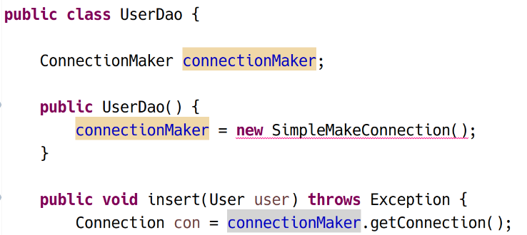
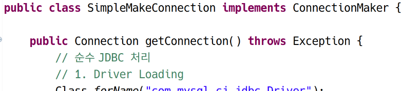
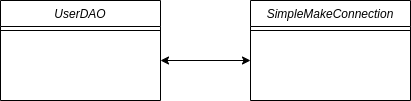
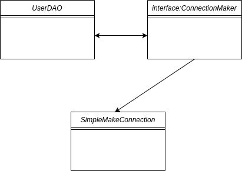
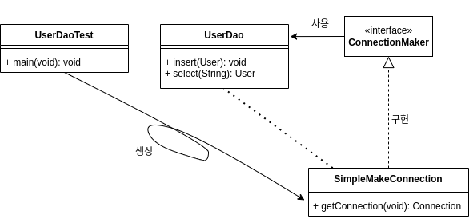

# 스프링에 대한 기반 지식 2

## 상속의 대안

다시 분리. 두 클래스를 분리하여 상속에 의한 결합력을 낮출 것이다.

## STEP 4

step4.vo, step4.dao 패키지 생성, step2.dao.UserDao, step4.vo.User를 복사, import 구문 수정

step4.dao.SimpleMakeConnection 빈 클래스 생성; UserDao의 getConnection을 잘라 붙여넣기. private에서 public으로 변경하여 밖에서 접근할 수 있도록 하기.

SimpleMakeConnection을 UserDao의 필드에 넣고, 디폴트 생성자에서 생성.


**UserDao**

```java
package step4.dao;

import java.sql.Connection;
import java.sql.DriverManager;
import java.sql.PreparedStatement;
import java.sql.ResultSet;
import java.sql.SQLException;

import step4.vo.User;

public class UserDao {
	
	SimpleMakeConnection simpleMakeConnection;
	
	public UserDao() {
		simpleMakeConnection = new SimpleMakeConnection();
	}

	public void insert(User user) throws Exception {
		Connection con = simpleMakeConnection.getConnection();
		
		// 3. Statement 객체
		String sql = "INSERT INTO users VALUES (?, ?, ?)";
		PreparedStatement pstmt = con.prepareStatement(sql);
		pstmt.setString(1, user.getId());
		pstmt.setString(2, user.getPassword());
		pstmt.setString(3, user.getName());
		
		// 4. SQL 문 실행
		int result = pstmt.executeUpdate();
		
		// 5. 결과 처리
		if (result == 1) {
			System.out.println("인서트 성공"); // 테스트용이므로 결과 처리를 여기서 마무리했음
		}
		
		// 6. 리소스 할당 해제
		pstmt.close();
		con.close();
	}
	
	public User select(String id) throws Exception {
		Connection con = simpleMakeConnection.getConnection();
		
		// 3. Statement 객체
		String sql = "SELECT * FROM users WHERE id = ?";
		PreparedStatement pstmt = con.prepareStatement(sql);
		pstmt.setString(1, id);
		
		// 4. SQL 문 실행
		ResultSet result = pstmt.executeQuery();
		
		// 5. 결과 처리
		result.next();
		User user = new User(result.getString("id"),
							result.getString("password"),
							result.getString("name"));

		// 6. 리소스 할당 해제
		pstmt.close();
		con.close();
		
		return user;
	}
}
```

&nbsp;

**SimpleMakeConnection**

```java
package step4.dao;

import java.sql.Connection;
import java.sql.DriverManager;

public class SimpleMakeConnection {

	public Connection getConnection() throws Exception {
		// 순수 JDBC 처리
		// 1. Driver Loading
		Class.forName("com.mysql.cj.jdbc.Driver");
		
		// 2. Connection 객체
		String jdbcUrl = "jdbc:mysql://127.0.0.1:3306/spring?characterEncoding=UTF-8&serverTimezone=UTC&useSSL=false&allowPublicKeyRetrieval=true";
		String id = "root";
		String pw = "test1234";
		
		Connection con = DriverManager.getConnection(jdbcUrl, id, pw);
		return con;
	}
}

```

UserDaoTest를 이전 패키지에서 복사하여 실행하면 잘 된다.

그러나 확장성이 좋아졌다고 할 수 있는가? 고객사는 이제 getConnection 메서드를 포함하는 SimpleMakeConnection이라는 클래스를 작성하여 컴파일하고, 우리가 판매한 라이브러리의 클래스패스에서 복사하여야 한다. 제약이 심하고 번거롭기 때문에 아무도 사려고 하지 않을 것이다.  

결과적으로는 확장성을 확보하지 못한 것이다.
그 이유를 따져본다면, UserDao가 SimpleMakeConnection의 내부를 상세하게 알고 있고, 직접적으로 의존하고 있기 때문이다. 애초에 UserDao의 필드에 SimpleMakeConnection이라는 클래스 명을 명시하고 있다. 또한 SimpleMakeConnection의 getConnection이라는 메서드를 UserDao 내에서 직접 호출하고 있다. ⇒ 결국 Tightly Coupled 관계를 벗어나지 못했다.

Loosely Coupled 관계를 만들기 위해서 자바의 인터페이스 기능을 사용해볼 수 있다.

## STEP 5

step4.vo.User, step4.dao.UserDao, step4.dao.SimpleMakeConnection을 복사하여 step5 패키지에 붙여넣는다.

ConnectionMaker라는 인터페이스를 dao 패키지에 생성한다. getConnection 메서드를 내부에 정의한다. 인터페이스 내에는 추상 메서드만 위치할 수 있다.

```java
package step5.dao;

import java.sql.Connection;

public interface ConnectionMaker {

	Connection getConnection() throws Exception;
}

```

&nbsp;

**UserDao**



&nbsp;

**SimpleMakeConnection()**



클래스를 인터페이스로 대체하여 결합도가 낮아졌고 느슨해졌다. 그러나 아직, new SimpleMakeConnection()와 같이 클래스를 직접 명시하는 구문이 완전히 없어지지 않았다는 점에서 완벽하지은 않다.

&nbsp;

**기존**



&nbsp;

**변경**



보다 확장성있는 형태로 인터페이스를 토대로 확장성 확보한 것처럼 보임. 그러나 아직 실사용 가능한 상태는 아님. 여전히 고객사는 문서를 따로 참고하여 SimpleMakeConnection을 작성해야함. 결국 클래스 내에 다른 클래스의 이름이 등장하는 것을 막아야 해결되는 문제…

## STEP 6

```java
connectionMaker = new SimpleMakeConnection();
```

이 구문이 UserDao 클래스 내에 나오지 않으면 되는 것이므로, 밖으로 빼주면 어떨까?



UserDaoTest에서 SimpleMakeConnection의 객체를 생성하고, UserDao에 넣어주는 것이다. 그러면 UserDao와 SImpleMakeConnection 사이에 직접적인 관계는 끊어지게 된다.

```java
public class UserDaoTest {

	public static void main(String[] args) throws Exception {
		
		System.out.println("[STEP6]");
		
		// 1. 사용자 VO 생성
		User user = new User("hong", "1234", "홍길동");
		
		ConnectionMaker connectionMaker = new SimpleMakeConnection(); // 의존성 제거를 위해 밖에서 생성
		
		// 2. DAO 생성
		UserDao dao = new UserDao(connectionMaker);
        
        // 후략
```

```java
public class UserDao {
	
	ConnectionMaker connectionMaker;
	
	public UserDao(ConnectionMaker connectionMaker) { // 생성자를 통해 주입할 수도 있고, setter를 통해 주입할 수도 있음
		this.connectionMaker = connectionMaker;
	}
```

이러한 방식을 통해 UserDao와 SimpleMakeConnection은 인터페이스를 통한 느슨한 결합 관계에 있게 된다. 이를 **의존성 주입**이라고 한다. (패턴으로 이야기하면 **전략 패턴**)  
보통은 이렇게 생성자를 통해 주입하는 방식이 선호되며, setter를 통해 주입할 수도 있다. 스프링에서는 xml 설정을 통할 수도 있다.

이렇게 인터페이스를 통해 UserDao를 확장성있는, 재사용 가능한 형태로 만들 수 있었다. 여기까지가 1차적인 내용이다.

> **Template method pattern v.s. Strategy pattern**  
> - [템플릿 메서드 패턴](./2023-02-20-2-스프링에-대한-기반-지식-1-DI.md): 상속 관계를 이용하여 상위 클래스의 기능 일부를 하위 클래스에서 재정의
> - 전략 패턴
>    - 자신의 기능 컨텍스트의 일부분을 인터페이스를 통해 통째로 외부로 분리시킴.
>    - 전략 패턴을 사용하기 위해서는 전략을 주입해 줄 또 다른 객체 (UserDaoTest)가 필요.
> \* 두 패턴 모두 기능을 분리시키는 패턴이지만, 전략 패턴은 상속 관계를 활용하지 않고, 클래스 외부로 특정 기능을 옮겨 완전히 관계를 단절시킴. 전략 패턴은 스프링이 활용하는 가장 대표적인 패턴.

