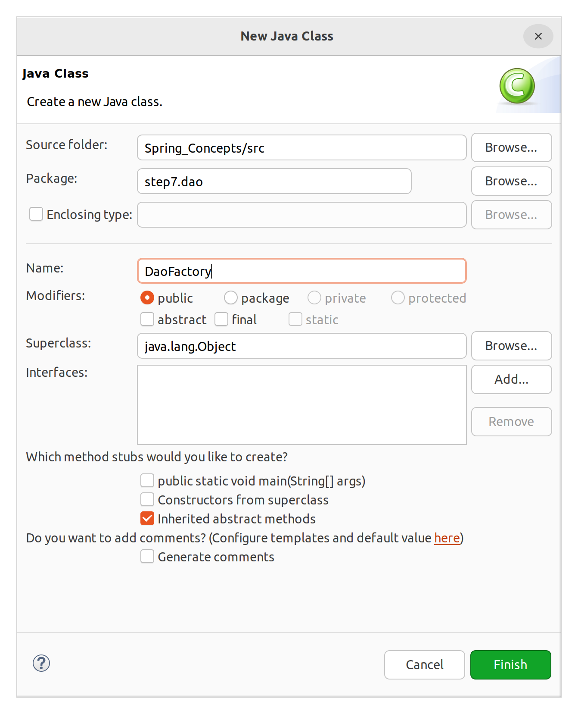

# 스프링에 대한 기반 지식 3
## IoC (Inversion of Control)

### 개요

제어의 역전

스프링에는 빈(bean, 스프링이 관리하는 객체의 총칭)을 관리하는 컨테이너가 있다. 서블릿과 비슷하다. 이때 스프링의 컨테이너는 IoC 방식으로 작동한다. 사실은 서블릿도 IoC가 사용되고 있었다. 다만 스프링에서는 IoC 개념을 모르면 이해하기 어렵다.

### UserDao 개선의 한계 (STEP 7)

이전 시간동안의 작업에서 분명히 UserDao가 개선되었다. 그러나 UserDaoTest는 본래 기능이 정상적으로 동작하는지 확인하기 위해 만들어진 클래스이다. 테스트용 클래스에 두 핵심 클래스의 관계를 주입을 통해 맺어주는 역할/책임을 추가로 부여한 것이다.

즉, 기능 테스트라는 UserDaoTest의 본래 관심사를 변질시킨 것이며, SoC 방법론에 따라 이러한 작업을 새로운 클래스로 분리해야만 한다.  
분리해야할 기능은 1) SimpleMakeConnection 객체를 만들고 2) UserDao에 주입시켜 관계를 맺어주는 것이다.

```java
ConnectionMaker connectionMaker = new SimpleMakeConnection();
```

위와 같은 1번, 2번 기능은 팩토리가 수행하게 할 수 있다. UserDao의 생산을 전담하는 별도의 클래스를 두는 것이다.



&nbsp;

**DaoFactory**

```java
package step7.dao;

public class DaoFactory {

	public UserDao userDao() {
		UserDao dao = new UserDao(connectionMaker());
		return dao;
	}
	
	public ConnectionMaker connectionMaker() {
		return new SimpleMakeConnection();
	}
}

```

&nbsp;

**UserDaoTest**

```java
public class UserDaoTest {

	public static void main(String[] args) throws Exception {
		
		System.out.println("[STEP7]");
		
		// 1. 사용자 VO 생성
		User user = new User("hong", "1234", "홍길동");
		
		// 2. DAO 생성
//		ConnectionMaker connectionMaker = new SimpleMakeConnection(); // 의존성 제거를 위해 밖에서 생성
//		UserDao dao = new UserDao(connectionMaker);
		
		UserDao dao = new DaoFactory().userDao();
		
		// 3. 사용자 입력
		dao.insert(user);
		System.out.println("사용자 등록 성공");
		
		// 4. 사용자 조회
		User result = dao.select("hong");
		System.out.println(result.getName());
		
	}
}
```


위의 다이어그램을 위와 아래로 나누면, 위는 로직의 핵심 객체간의 관계를 표현한다. 아래는 DaoFactory로부터 각 객체가 생성되고 있음을 보여준다. 이렇게 팩토리 객체는 객체 간 관계를 정의하는 일을 담당한다. 이 외의 비즈니스 로직은 가지고 있지 않다.

이러한 패턴을 적용하기 전의 일반 프로그램과 비교해보자. 
- main(): 프로그램 시작점
    - 어떤 클래스로부터 객체를 생성할 것인지 결정
    - 객체 생성
    - 객체의 메서드 호출
    - 이 과정 반복
중요한 것은 이러한 로직, 알고리즘의 반복을 개발자가 main에 작성하고, main 로직이 프로그램의 핵심이 되어 프로그램이 동작한다.

반면에 이번에 우리가 도입한 패턴은, main은 구체적인 객체의 생성 방법이나 절차를 알 수 없다. Factory가 각종 객체를 만드는 것을 전담하며, 그 관계를 맺도록 해준다. 고객사는 객체간의 관계를 신경쓸 필요가 없으며 직접적으로 제어하지 않는다. 팩토리를 생성하면 팩토리가 알아서 해주기 때문에 고객사의 개발자가 직접 객체를 만들 필요가 없다.

스프링이나 서블릿도 마찬가지이다. 스프링 개발자는 프로그램의 전체 로직에 관여하지 않는다. 이미 작성된 스프링 컨테이너가 절차와 상황에 맞게 객체를 관리하고 운용하며, 개발자는 그 일부 과정에 참여하기만 하면 된다. 제어권이 개발자에게서 컨테이너로 넘어갔다는 의미에서 이를 **IoC(Inversion of Control), 즉 제어의 역전**이라고 한다.  
개발자는 모든 객체의 생성과 운용, 할당 해제의 과정에 관여할 필요 없이, 필요한 로직을 작성하여 채어 넣어주기만 하면 된다는 것이다.


## 어노테이션(Annotation)

### 형식

- '@(앳)'으로 시작한다.

- '@'' 뒤에
    - 정해져 있는 키워드(Java)
    - 사용자가 만든 키워드

- 굉장히 많은 어노테이션이 있다.

- 의미와 역할
    - 사전적으로는 주석이라고 해석되지만, 실제 주석과는 거리가 있다.
    - 로직에는 영향을 미치지 않지만, 프로그램의 구조에 영향을 미치는 구문이다.
    - 스프링에서는 어노테이션을 설정하는데 많이 활용한다. 중요한 것은 모두 외워야 한다.
