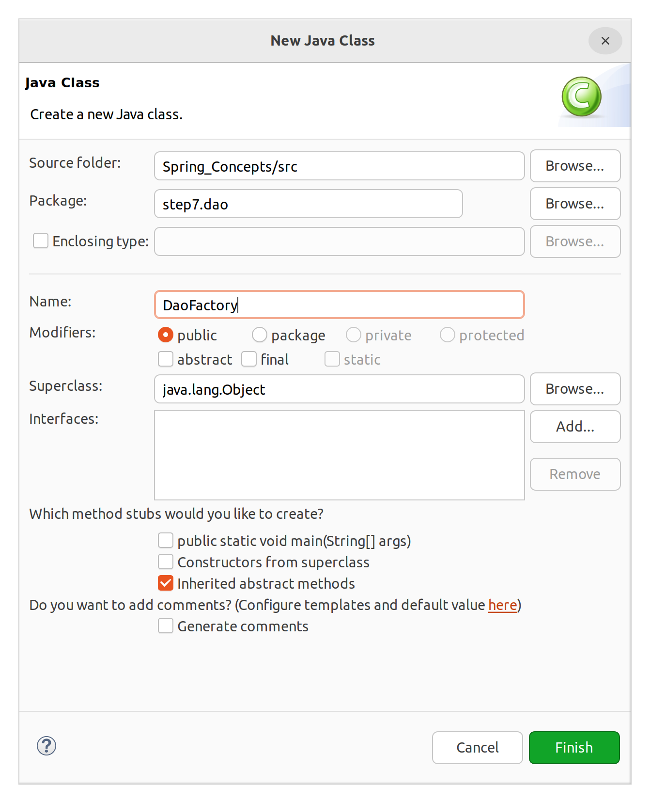

# IoC (Inversion of Control)

## 개요

제어의 역전

스프링에는 빈(bean, 스프링이 관리하는 객체의 총칭)을 관리하는 컨테이너가 있다. 서블릿과 비슷하다. 이때 스프링의 컨테이너는 IoC 방식으로 작동한다. 사실은 서블릿도 IoC가 사용되고 있었다. 다만 스프링에서는 IoC 개념을 모르면 이해하기 어렵다.

## UserDao 개선의 한계

이전 시간동안의 작업에서 분명히 UserDao가 개선되었다. 그러나 UserDaoTest는 본래 기능이 정상적으로 동작하는지 확인하기 위해 만들어진 클래스이다. 테스트용 클래스에 두 핵심 클래스의 관계를 주입을 통해 맺어주는 역할/책임을 추가로 부여한 것이다.

즉, 기능 테스트라는 UserDaoTest의 본래 관심사를 변질시킨 것이며, SoC 방법론에 따라 이러한 작업을 새로운 클래스로 분리해야만 한다.  
분리해야할 기능은 1) SimpleMakeConnection 객체를 만들고 2) UserDao에 주입시켜 관계를 맺어주는 것이다.

```java
ConnectionMaker connectionMaker = new SimpleMakeConnection();
```

위와 같은 1번, 2번 기능은 팩토리가 수행하게 할 수 있다. UserDao의 생산을 전담하는 별도의 클래스를 두는 것이다.



&nbsp;

**DaoFactory**

```java
package step7.dao;

public class DaoFactory {

	public UserDao userDao() {
		UserDao dao = new UserDao(connectionMaker());
		return dao;
	}
	
	public ConnectionMaker connectionMaker() {
		return new SimpleMakeConnection();
	}
}

```

&nbsp;

**UserDaoTest**

```java
public class UserDaoTest {

	public static void main(String[] args) throws Exception {
		
		System.out.println("[STEP7]");
		
		// 1. 사용자 VO 생성
		User user = new User("hong", "1234", "홍길동");
		
		// 2. DAO 생성
//		ConnectionMaker connectionMaker = new SimpleMakeConnection(); // 의존성 제거를 위해 밖에서 생성
//		UserDao dao = new UserDao(connectionMaker);
		
		UserDao dao = new DaoFactory().userDao();
		
		// 3. 사용자 입력
		dao.insert(user);
		System.out.println("사용자 등록 성공");
		
		// 4. 사용자 조회
		User result = dao.select("hong");
		System.out.println(result.getName());
		
	}
}
```

