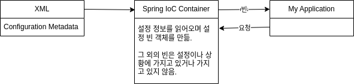

# 스프링 컨테이너

## 스프링 컨테이너의 여러 이름
**스프링 컨테이너**는 사실 **Application Context**라는 객체이다. 빈을 생성하고 빈 간의 관계를 설정하는 스프링의 핵심 작업을 수행한다. 빈의 생성과 관리를 전담하기 때문에 **빈 팩토리**라고 불리기도 한다. 컨테이너라고 지칭되는 것은 빈의 생성과 관리를 위해 빈을 가지고 있기 때문이다.

어제 작성했던 초반부의 프로그램을 보면 ConnectionMaker를 생성하고, UserDao에 인젝션하는 등 객체를 결정하고 생성하며 객체간 관계를 맺어주는 총체의 작업을 개발자가 직접 UserDaoTest의 main 메서드 내에 기술한다.

이후 팩토리를 도입하고 나서는, 팩토리에 객체 생성 및 관계 구성의 전권을 넘겨주게 되며, 해당 팩토리를 작성한 사람이 아니라면 그 동작 방식을 알지 못하더라도 UserDao를 사용하는데 어려움이 없다. 이를 객체에 대한 제어권을 이임한다는 의미로 IoC라고 불렀다.  
스프링 컨테이너는 팩토리처럼 IoC를 전담하는 엔진으로 이해할 수 있으며, 객체를 생성하고 인젝션하여 관계를 맺어주는 일을 알아서 해주게 된다. 이러한 측면에서 스프링 컨테이너를 **Spring IoC 컨테이너**, **Spring DI 컨테이너**라고 지칭하기도 한다.

## 빈

### 개요

그래서 정확히 빈이 무엇인가?

빈은 POJO(Plain Old Java Object)이다. 직역하자면 평범한 오래된 자바 오브젝트가 된다. 서블릿의 경우 특수한 클래스를 상속받는 과정을 통해 얻을 수 있기 때문에 POJO라고 할 수 없지만, 스프링 빈은 그냥 _평범한 자바 오프젝트_ 라는 것이다.  
그렇지만 우리가 직접 만들거나 관리할 수는 없고, 스프링 컨테이너에게 생성을 맡겨야 한다는 점이 특수한 것이다.

### 빈의 주요 속성

1. 클래스: 빈으로 등록할 자바 속성
2. ID: 각 빈을 구별하기 위한 식별자. 빈을 요청할 때에 사용할 수 있음
3. 스코프
    - singleton, prototype, …
    - 웹에 들어가기 전이기 때문에 위의 두 개만 알면 된다.
    - 어플리케이션 컨텍스트는 빈을 기본적으로 싱글톤으로 관리한다. 해당 객체가 단 한 번 생성됨을 보장한다는 것이다.
    - 프로토타입은 객체를 요청할 때 마다 새로 객체를 생성하여 반환한다.
    - 스프링은 주로 엔터프라이즈 환경에서 사용되기 때문에 기본값이 싱글톤이다. 대량의 요청이 들어올텐데 매 요청마다 객체를 생성하는 경우 부하가 막대할 것이기 떄문이다.
4. constructor-arg: 애플리케이션 컨텍스트에 의해 빈 객체가 생성될 때, 생성자에 전달할 인자
5. property: 위와 유사.  애플리케이션 컨텍스트에 의해 빈 객체가 생성될 때, setter에 전달할 인자

위와 같은 설정 정보를 애플리케이션 컨텍스트가 읽어 빈을 관리하게 된다. 이 설정 정보를 **Configuration Metadata**라고 한다.

기본적으로는 XML을 통해 만들 수 있다. XML을 사용하는 경우 한 문서에 모든 빈에 대한 정보와 관계가 나타나있다는 점이 장점이지만, 프로그램의 스케일이 커지는 경우 XML 자체를 관리하고 유지보수하는 것이 어려워진다는 문제가 있다.  
대안으로 어노테이션으로 설정을 할 수도 있다. 소스코드 내에 설정 정보가 삽입되기 때문에 어노테이션을 사용하면 편하다. 그러나 코드 전체에 설정 정보가 분산되기 때문에 다른 의미로 관리가 어려워진다는 문제가 있기도 하다. 일장일단이 있으니 상황에 맞게 사용할 것. XML과 어노테이션을 혼용할 수도 있다.



오늘의 실습에서는 어노테이션을 통해 스프링 빈 설정을 하고, 어제 실습 프로젝트에 스프링을 적용해도록 한다.

### 빈의 등록

> **빈을 등록한다?**  
> 
> 설정 정보를 컨테이너가 가져가서 빈을 만들기 위한 준비 작업을 마치는 것. 기본값은 준비를 마친 후 바로 객체를 작성하게 됨. 그러나 빈 생성의 타이밍도 지정할 수 있기 떄문에 빈을 등록했다고 해서 컨테이너 내에 빈이 존재하고 있다고 보장할 수는 없음.

빈을 등록하는 방법에는 두 가지가 있다.  
- 수동: 빈을 일일이 지정하여 어플리케이션 컨텍스트에 등록
- 자동: 컴포넌트 스캔을 통해 자동으로 빈을 어플리케이션 컨텍스트에 등록
    - 일반적으로 자동 방법이 더 편하기 떄문에 자동 방법 사용.
    - 그러나 수동으로 등록해야만 하는 때가 있음. 외부 라이브러리를 빈으로 등록하는 경우, 본인의 코드가 아니기 때문에 어노테이션을 붙일 수 없으므로 수동으로 등록함.
    - 따라서 두 방법 모두 알아놓아야 함.

#### 수동으로 빈 등록

**기본 꼴**

```java
class MyResource {
    // 이 클래스를 빈으로 등록하고 싶다면
    // 설정 클래스를 만들고 어노테이션을 만들어야 함
}

class MyResourceConfig {
    // 빈으로 등록할 클래스의 객체를 만드는 메서드
    public MyResource getResource() {
        return new MyResource();
    }
}
```

&nbsp;

**어노테이션 붙이기**

```java
class MyResource {
    // 
}

@Configuration
class MyResourceConfig {
    @Bean
    public MyResource getResource() {
        return new MyResource();
    }
}
```

@Bean과 함꼐 @Configuration 어노테이션을 잊으면 안된다.  

위와 같이 빈을 등록한 경우 MyResource가 빈의 이름/클래스이기는 하지만, 빈의 ID는 getResource가 된다. 메서드의 이름이 ID가 되는 것이다. 스코프는 기본값으로 싱글톤이며, 나머지 속성은 생성자나 setter가 없으므로 사용되지 않는다.

이렇게 설정 클래스를 수동으로 만들어 처리하는 방식과 반대로, @Component를 MyResource 클래스 바로 위에 붙이면 자동적으로 빈을 등록해준다.

이때 @Component를 상속받은 몇몇의 어노테이션이 있다.

- @Component
    - @Controller:컨트롤러 빈 등록
    - @Service:서비스 빈 등록
    - @Repositoy: DAO 빈 등록
    - @Configuration: 설정 빈 등록

위의 설정 클래스 MyResourceConfig도 @Component의 하위 클래스인 @Configuration에 의해 자동으로 애플리케이션 컨텍스트에 등록된다. 컨테이너는 설정 빈을 읽고, 내부의 @Bean 어노테이션을 참조하여 MyResource 클래스를 빈으로 등록하게 되는 것이다. 즉, 수동 방법이라고 하지만 사실 자동 방법과 수동 방법이 같이 사용되고 있다.

그렇다면 자동으로 등록된 MyResourceConfig 빈의 ID는 무엇이 될까? 바로 myResourceConfig가 된다. MyResourceConfig의 객체는 생성자인 MyResourceConfig의 호출을 통해 얻을 수 있으므로, 생성자의 이름 MyResourceConfig에서 딴 명칭이라고 생각하면 된다.

#### 자동으로 빈 등록

컴포넌트 스캔을 통해 특정 패키지 아래의 클래스를 모두 읽어 설정된 클래스를 빈으로 등록해줌

## STEP 8


