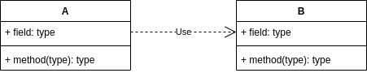
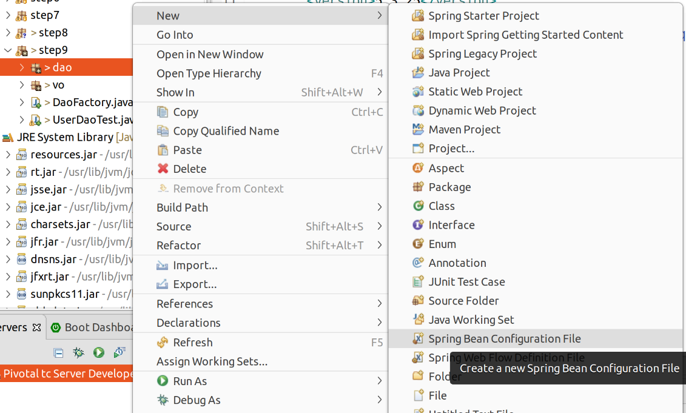
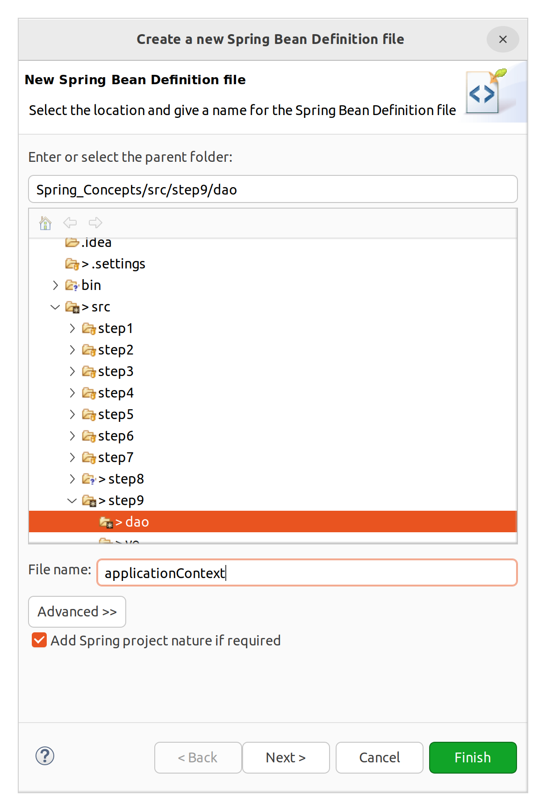
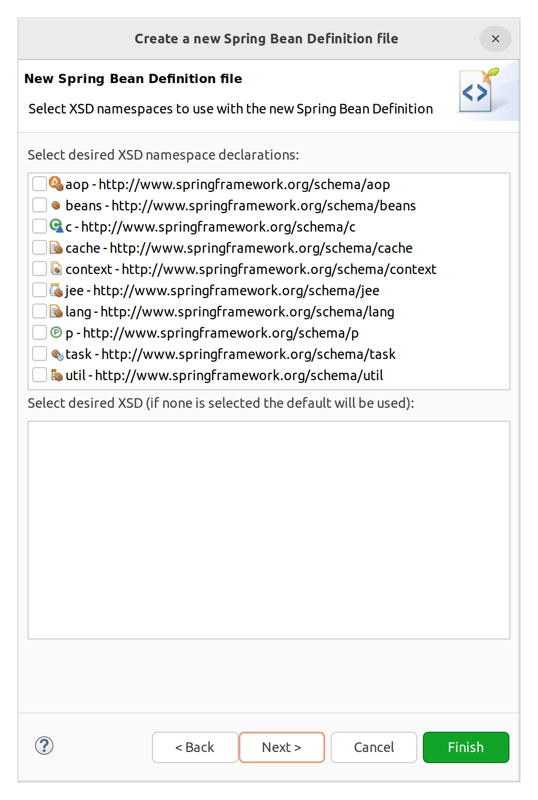

# 스프링 컨테이너 2

## 의존관계

의존관계를 논하려면,

- 두 개의 클래스에 대해 이야기해야한다.
- 의존의 방향성을 명시해야 한다.

UML로 그리면 다음과 같다.

**_A가 B에 의존하고 있다_**



점선과 열린 화살표를 이용하여 나타낸다. (레이블은 없어도 되는 것 같다.)  
의존 대상인 B가 변화하면, 그 영향이 A에 미치게 되는 관계를 말한다.

## Step 9

step9 패키지에 기존 step8 코드를 모두 복사하고 import 수정.

이번 실습에서는 두 가지 수정을 해보자.

1. XML을 이용해서 설정
2. 인젝션 방법 변경 (XML로 표현하는 방법이 다르므로 굳이 바꿔본다)

Step 8을 보면 UserDao가 ConnectionMaker에 의존하고 있다. ConnectionMaker 객체는 생성자를 통해 주입받고 있다.

### 생성자를 통한 주입

**UserDao**

```java
public class UserDao {
	
	ConnectionMaker connectionMaker;

	public UserDao() {
		System.out.println("[UserDao] 기본 생성자 호출됨");
	}

	public UserDao(ConnectionMaker connectionMaker) { // 생성자를 통해 주입할 수도 있고, setter를 통해 주입할 수도 있음
		System.out.println("[UserDao] 인자 받는 생성자 호출됨");
	}

	public void setConnectionMaker(ConnectionMaker connectionMaker) {
		System.out.println("[UserDao] setConnectionMaker 호출됨");
		this.connectionMaker = connectionMaker;
	}

```

&nbsp;

**DaoFactory**

```java
@Configuration
public class DaoFactory {

	@Bean
	public UserDao userDao() {
//		UserDao dao = new UserDao(connectionMaker());
		UserDao dao = new UserDao();
		dao.setConnectionMaker(connectionMaker());
		return dao;
	}

	@Bean
	public ConnectionMaker connectionMaker() {
		return new SimpleMakeConnection();
	}
}
```

### XML 파일 작성

우선 DaoFactory의 어노테이션을 제거한다. 이 클래스 자체를 지우는 것은 아니다. XML 파일에서 이 클래스를 가지고 설정을 할 것이다.

그 전에 XML 파일 작성을 보조해주는 DTD/스키마를 설정하자. DTD/스키마는 문서의 구조를 사전에 정의한 것이며, 이를 통해 문서 구조와 요소가 올바른지 검증할 수 있다.  
XML 파일의 구조와 태그는 자유롭게 만들 수 있기 때문에 이러한 검증 작업이 필요하다.  
DTD든 스키마든 무엇을 사용해도 상관 없지만, 스키마를 사용하는 것이 좋다. 스키마는 별도의 namespace를 잡을 수 있기 때문에, XML 문서 검증을 위한 추가 기능을 덧붙이는 등의 부가 작업이 가능하다. 우리는 스키마를 사용해본다. 스키마는 이클립스 기준으로, XML 파일을 생성할 때 빌트인으로 설정할 수 있다.

그럼 XML 파일을 생성하자.  
어디에나 위치할 수 있기 때문에 step9.dao에 생성해보려고 한다.








우선 다른 스키마를 선택하지 않고 디폴트로 간다.

XML이 열리면, \<beans> 안에 \<bean> 요소를 기술해주면 된다. \<bean>은 @Bean에 해당하고, \<beans>는 @Configuration에 해당한다.

```xml
<bean id="connectionMaker" class="step9.dao.SimpleMakeConnection" />
```
id는 인스턴스를 생성하는 메서드의 이름이 된다.  
class는 등록할 클래스의 풀 패키지 경로가 된다.  
contructor-arg나 property는 지정할 것이 없다.  

```xml
<bean id="userDao" class="step9.dao.UserDao">  
   <property name="connectionMaker" ref="connectionMaker"></property>  
</bean>
```

UserDao는 ConnectionMaker와 다르게 setter을 통해 의존성을 주입한다. 따라서 자식 요소로 \<property>가 추가되었다.

\<property>에는 name이라는 attribute를 넣어줘야 하는데, setter의 이름에서 set을 떼고, 첫 글자를 바꿔준 것이다. 즉, setConnectionMaker라는 setter의 이름을 connectionMaker로 바꿔 쓴다.  
다음으로 ref라는 어트리뷰트를 넣어줘야 한다. 같은 값 connectionMaker이 들어갔지만, setter의 인자로 들어가는 객체의 빈 id를 넣어준 것이다. 즉, name="connectionMaker"은 setConnectionMaker의 변형이며, ref="connectionMaker"는 윗 라인에 정의된 빈의 id이다.


