# 스프링 컨테이너 2

## 의존관계

의존관계를 논하려면,

- 두 개의 클래스에 대해 이야기해야한다.
- 의존의 방향성을 명시해야 한다.

UML로 그리면 다음과 같다.

**_A가 B에 의존하고 있다_**


점선과 열린 화살표를 이용하여 나타낸다. (레이블은 없어도 되는 것 같다.)  
의존 대상인 B가 변화하면, 그 영향이 A에 미치게 되는 관계를 말한다.

## Step 9

step9 패키지에 기존 step8 코드를 모두 복사하고 import 수정.

이번 실습에서는 두 가지 수정을 해보자.

1. XML을 이용해서 설정
2. 인젝션 방법 변경 (XML로 표현하는 방법이 다르므로 굳이 바꿔본다)

Step 8을 보면 UserDao가 ConnectionMaker에 의존하고 있다. ConnectionMaker 객체는 생성자를 통해 주입받고 있다.

### 생성자를 통한 주입

**UserDao**

```java
public class UserDao {
	
	ConnectionMaker connectionMaker;

	public UserDao() {
		System.out.println("[UserDao] 기본 생성자 호출됨");
	}

	public UserDao(ConnectionMaker connectionMaker) { // 생성자를 통해 주입할 수도 있고, setter를 통해 주입할 수도 있음
		System.out.println("[UserDao] 인자 받는 생성자 호출됨");
	}

	public void setConnectionMaker(ConnectionMaker connectionMaker) {
		System.out.println("[UserDao] setConnectionMaker 호출됨");
		this.connectionMaker = connectionMaker;
	}

```

&nbsp;

**DaoFactory**

```java
@Configuration
public class DaoFactory {

	@Bean
	public UserDao userDao() {
//		UserDao dao = new UserDao(connectionMaker());
		UserDao dao = new UserDao();
		dao.setConnectionMaker(connectionMaker());
		return dao;
	}

	@Bean
	public ConnectionMaker connectionMaker() {
		return new SimpleMakeConnection();
	}
}
```

### XML 파일 작성

우선 DaoFactory의 어노테이션을 제거한다. 이 클래스 자체를 지우는 것은 아니다. XML 파일에서 이 클래스를 가지고 설정을 할 것이다.

그 전에 XML 파일 작성을 보조해주는 DTD/스키마를 설정하자. DTD/스키마는 문서의 구조를 사전에 정의한 것이며, 이를 통해 문서 구조와 요소가 올바른지 검증할 수 있다.  
XML 파일의 구조와 태그는 자유롭게 만들 수 있기 때문에 이러한 검증 작업이 필요하다.  
DTD든 스키마든 무엇을 사용해도 상관 없지만, 스키마를 사용하는 것이 좋다. 스키마는 별도의 namespace를 잡을 수 있기 때문에, XML 문서 검증을 위한 추가 기능을 덧붙이는 등의 부가 작업이 가능하다. 우리는 스키마를 사용해본다. 스키마는 이클립스 기준으로, XML 파일을 생성할 때 빌트인으로 설정할 수 있다.

그럼 XML 파일을 생성하자.  
어디에나 위치할 수 있기 때문에 step9.dao에 생성해보려고 한다.


우선 다른 스키마를 선택하지 않고 디폴트로 간다.

XML이 열리면, \<beans> 안에 \<bean> 요소를 기술해주면 된다. \<bean>은 @Bean에 해당하고, \<beans>는 @Configuration에 해당한다.

```xml
<bean id="connectionMaker" class="step9.dao.SimpleMakeConnection" />
```
id는 인스턴스를 생성하는 메서드의 이름이 된다.  
class는 등록할 클래스의 풀 패키지 경로가 된다.  
contructor-arg나 property는 지정할 것이 없다.  

```xml
<bean id="userDao" class="step9.dao.UserDao">  
   <property name="connectionMaker" ref="connectionMaker"></property>  
</bean>
```

UserDao는 ConnectionMaker와 다르게 setter을 통해 의존성을 주입한다. 따라서 자식 요소로 \<property>가 추가되었다.

\<property>에는 name이라는 attribute를 넣어줘야 하는데, setter의 이름에서 set을 떼고, 첫 글자를 바꿔준 것이다. 즉, setConnectionMaker라는 setter의 이름을 connectionMaker로 바꿔 쓴다.  
다음으로 ref라는 어트리뷰트를 넣어줘야 한다. 같은 값 connectionMaker이 들어갔지만, setter의 인자로 들어가는 객체의 빈 id를 넣어준 것이다. 즉, name="connectionMaker"은 setConnectionMaker의 변형이며, ref="connectionMaker"는 윗 라인에 정의된 빈의 id이다.


## 다양한 XML 설정

스프링  
- 스프링 레거시
- 스프링 부트
    - 스프링의 설정이 너무 어려워서 간단하게 만든 것
    - 그러나 기존 레거시의 설정 다수가 숨겨져 있기 때문에 처음 배우는 입장에서는 피상적으로 이해할 수밖에 없음
    - 우리는 레거시를 다루고, 나중에 부트를 공부해보기 바람
    - 레거시를 잘 하면 부트로 쉽게 넘어갈 수 있음

### 실습1


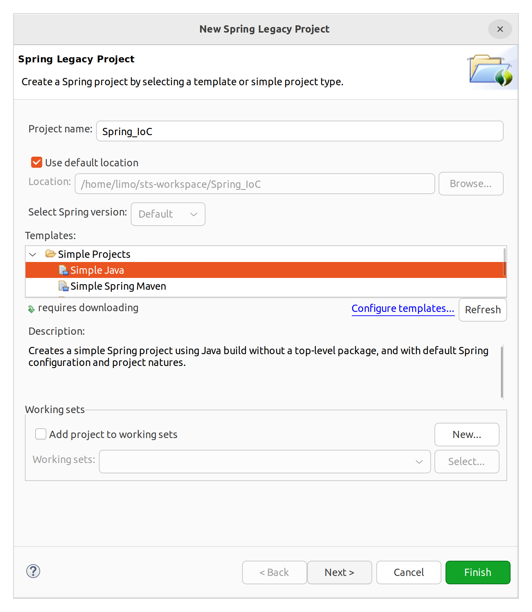

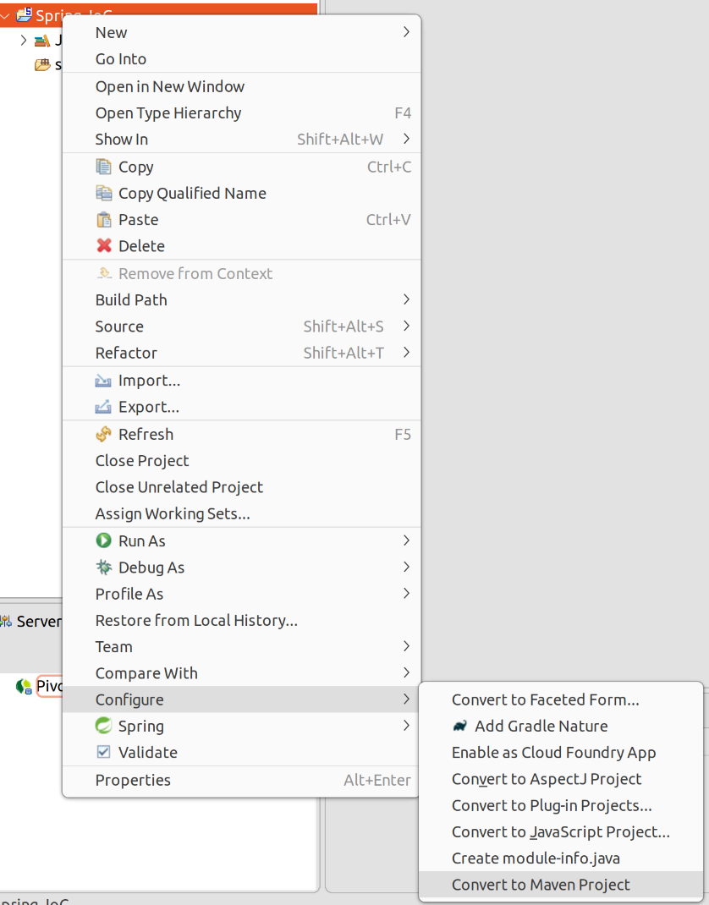

pom.xml에 Spring context 3.x 추가

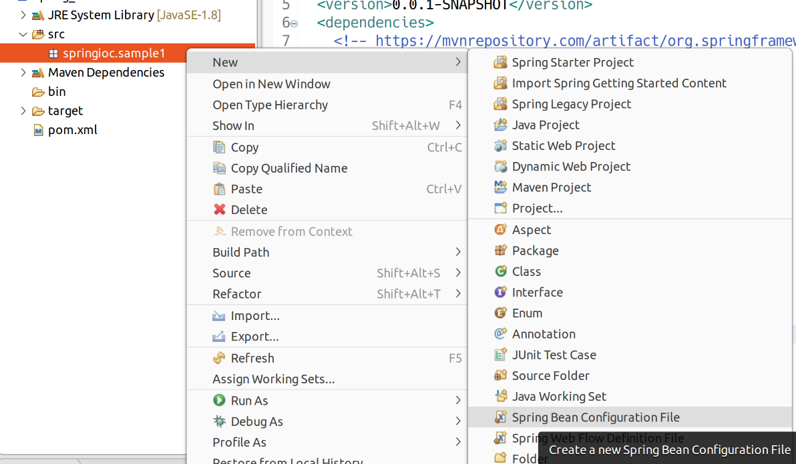

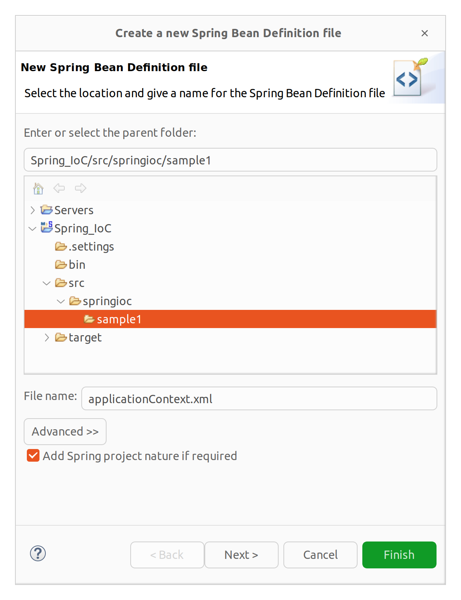

다른 네임스페이스의 스키마는 선택 X

```xml
<?xml version="1.0" encoding="UTF-8"?>
<beans xmlns="http://www.springframework.org/schema/beans"
	xmlns:xsi="http://www.w3.org/2001/XMLSchema-instance"
	xsi:schemaLocation="http://www.springframework.org/schema/beans http://www.springframework.org/schema/beans/spring-beans.xsd">

	<bean id="messageBean" class="springioc.sample1.MessageBeanImpl"></bean>
</beans>

```

인터페이스 생성

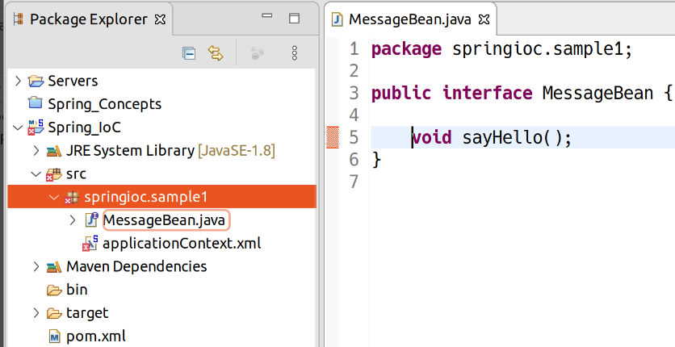

구현한 클래스 생성

```java
public class MessageBeanImpl implements MessageBean {

	private String fruit; // 무상태 아닌지 따져 설계하는 것은 잠시 넘기기
	private int cost;
	
	public MessageBeanImpl() {
		System.out.println("MessageBeanImple 기본 생성자 호출");
	}

	public MessageBeanImpl(String fruit) {
		this.fruit = fruit;
		System.out.println("MessageBeanImple 기본 생성자 호출 => " + fruit);
	}

	public void setCost(int cost) {
		System.out.println("MessageBeanImple 세터 호출");
		this.cost = cost;
	}

	@Override
	public void sayHello() {
		
	}
}


```

xml 설정

```java
<?xml version="1.0" encoding="UTF-8"?>
<beans xmlns="http://www.springframework.org/schema/beans"
	xmlns:xsi="http://www.w3.org/2001/XMLSchema-instance"
	xsi:schemaLocation="http://www.springframework.org/schema/beans http://www.springframework.org/schema/beans/spring-beans.xsd">

	<bean id="messageBean" class="springioc.sample1.MessageBeanImpl">
		<constructor-arg> <!-- 생성자 인자 -->
			<value>딸기</value>
		</constructor-arg>
		<property name="cost"> <!-- setter 인자  -->
			<value>3000</value>
		</property>
	</bean>
</beans>

```

Test 클래스 작성

```java
public static void main(String[] args) {
		// ApplicationContext
		ApplicationContext context =  // XML 설정 불러오기
				new ClassPathXmlApplicationContext("applicationContext.xml",
						MessageBean.class);
    
    // 후략
```

⇒ 빈 객체 등록과 동시에 생성자와 세터가 호출되어 sysout이 표시됨.

그럼 applicationContext.xml을 다음과 같이 수정

```java
<?xml version="1.0" encoding="UTF-8"?>
<beans xmlns="http://www.springframework.org/schema/beans"
	xmlns:xsi="http://www.w3.org/2001/XMLSchema-instance"
	xsi:schemaLocation="http://www.springframework.org/schema/beans http://www.springframework.org/schema/beans/spring-beans.xsd">

	<bean id="messageBean" class="springioc.sample1.MessageBeanImpl" scope="prototype">
		<constructor-arg> <!-- 생성자 인자 -->
			<value>딸기</value>
		</constructor-arg>
		<property name="cost"> <!-- setter 인자  -->
			<value>3000</value>
		</property>
	</bean>
</beans>

```

scope를 prototype으로 지정. 아무것도 출력되지 않음. prototype 스코프에서는 객체를 요청하기 전까지 생성 안함.

Test.main 수정

```java
public static void main(String[] args) {
    
        System.out.println("IoC/DI 컨테이너 생성");
    
		// ApplicationContext
		ApplicationContext context =  // XML 설정 불러오기
				new ClassPathXmlApplicationContext("applicationContext.xml",
						MessageBean.class); // 파일 이름과 해당 파일의 위치 지정. (두 번째 인자를 주면 해당 클래스가 있는 디렉토리에서 탐색)
		
        System.out.println("IoC/DI 컨테이너 생성 완료");
    
		MessageBean myBean = context.getBean("messageBean", MessageBean.class);
		MessageBean myBean2 = context.getBean("messageBean", MessageBean.class);
		// 싱글톤의 경우 이미 이 시점에 컨텍스트 안에 있는 Bean을 찾아 리턴
		// 포로토탸입의 경우 이 시점에 Bean 객체가 생성됨.
		
		myBean.sayHello();
		
		// 또한 두 객체 동일성 여부 비교
		System.out.println(myBean);
		System.out.println(myBean2);
		
		((ClassPathXmlApplicationContext) context).close(); // ApplicationContext 닫
	}
```

- scope="singleton"인 경우:  
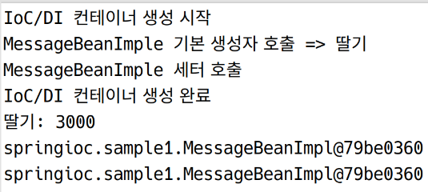

객체가 한 번만 생성된다.

- scope="prototype"인 경우:  
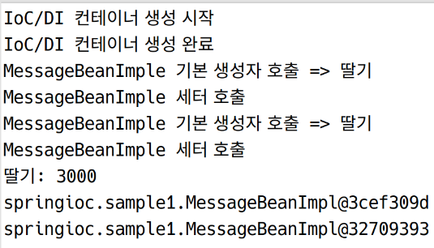

### 실습 2: 여러 개의 빈

```java
<?xml version="1.0" encoding="UTF-8"?>
<beans xmlns="http://www.springframework.org/schema/beans"
	xmlns:xsi="http://www.w3.org/2001/XMLSchema-instance"
	xsi:schemaLocation="http://www.springframework.org/schema/beans http://www.springframework.org/schema/beans/spring-beans.xsd">

	<bean id="messageBean" class="springioc.sample1.MessageBeanImpl">
		<constructor-arg> <!-- 생성자 인자 -->
			<value>딸기</value>
		</constructor-arg>
		<property name="cost"> <!-- setter 인자  -->
			<value>3000</value>
		</property>
	</bean>
	
	<bean id="messageBean_1" class="springioc.sample1.MessageBeanImpl">
	</bean> <!-- 이 경우 디폴트 생성자로 빈을 만들게 됨 -->
	
	<bean id="messageBean_2" class="springioc.sample1.MessageBeanImpl">
		<property name="cost">
			<value>3500</value>
		</property>
	</bean> <!-- 이 경우 디폴트 생성자로 빈을 만들고 세터로 값을 넣어주게 됨. -->
</beans>
```

상황에 맞게 1개의 클래스를 가지고 여러 개의 빈을 등록할 수도 있음. scope가 생략되어 singleton이기 때문에 ApplicationContext가 만들어지면서 3개의 객체가 같이 생성될 것임.

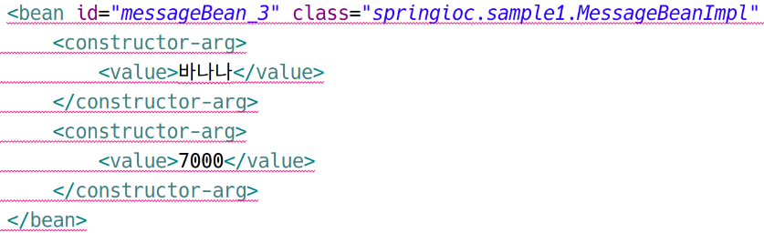

이렇게 하면 오류가 난다. 두 개의 인자를 받는 생성자가 없기 떄문이다.

MessageBeanImpl에 아래의 생성자를 추가한다.

```java
	public MessageBeanImpl(String fruit, int cost) {
		this.fruit = fruit;
		this.cost = cost;
		System.out.println("MessageBeanImple 생성자 호출 => " + fruit + " / " + cost);
	}
```

```java
	<bean id="messageBean_3_1" class="springioc.sample1.MessageBeanImpl" scope="singleton">
		<constructor-arg value="오렌지" />
		<constructor-arg value="6500" />
	</bean>
```
위와 같이 줄여 쓸 수도 있다. 그런데 첫번쨰 인자는 String이지만, 두 번째 인자는 int인데, 괜찮은걸까? 자동으로 맵핑해주기 때문에 상관없다. XML에서 문자열로 넘어간 값이 자동으로 int로 캐스팅된다.

아래와 같이 타입을 명시적으로 지정할 수도 있다.

```java
	<bean id="messageBean_3_2" class="springioc.sample1.MessageBeanImpl" scope="singleton">
		<constructor-arg type="java.lang.String" value="고오급 오렌지" />
		<constructor-arg type="int" value="6500" />
	</bean>
```

타입을 명시하면 순서가 달라도 오류가 나지 않고 작동이 된다. 그러나 좋은 방법은 아니다.

```java
	<bean id="messageBean_3_2" class="springioc.sample1.MessageBeanImpl" scope="singleton">
		<constructor-arg type="int" value="6500" />
		<constructor-arg type="java.lang.String" value="고오급 오렌지" />
	</bean>
```

차라리 불가피하게 순서를 바꿔 써야하는 경우, 아래처럼 index 어트리뷰트를 넣는 것이 좋다.

```java
	<bean id="messageBean_3_2" class="springioc.sample1.MessageBeanImpl" scope="singleton">
		<constructor-arg index="1" type="int" value="6500" />
		<constructor-arg index="0" type="java.lang.String" value="고오급 오렌지" />
	</bean>
```

### 실습 3

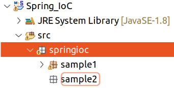

sample2에 Foo, Bar라는 클래스 생성

```java
// Foo
package springioc.sample2;

public class Foo {

	public Foo() {
		System.out.println("[Foo] 기본 생성자 호출");
	}
	
	public Foo(String str) {
		System.out.println("[Foo] 생성자 호출: " + str);
	}
	
	public Foo(String str, int num) {
		System.out.println("[Foo] 생성자 호출: " + str + ", " + num);
	}
	
	public Foo(Bar bar) { // 디펜던시 인젝션 같은 상황을 가정
		System.out.println("[Foo] 생성자 호출: " + bar);
	}
}

```

```java
// Bar
package springioc.sample2;

public class Bar {

	public Bar() {
		System.out.println("[Bar] 기본 생성자 호출됨");
	}
}

```

applicationContext.xml 생성

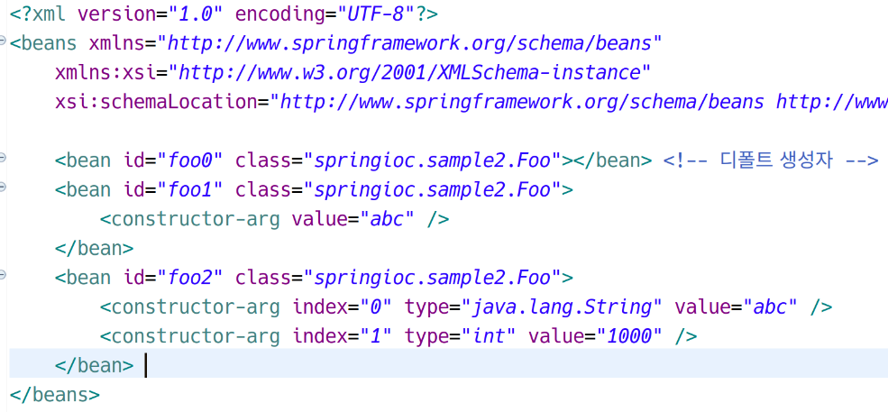

여기까지는 쉽다.. 그런데 Bar를 주입하는 생성자를 쓰려면 어떻게 설정해야할까?

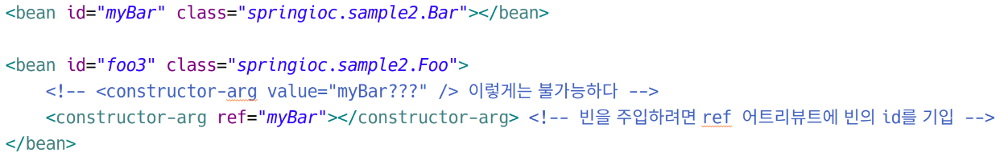

&nbsp;

**전체 XML**

```xml
<?xml version="1.0" encoding="UTF-8"?>
<beans xmlns="http://www.springframework.org/schema/beans"
	xmlns:xsi="http://www.w3.org/2001/XMLSchema-instance"
	xsi:schemaLocation="http://www.springframework.org/schema/beans http://www.springframework.org/schema/beans/spring-beans.xsd">

	<bean id="foo0" class="springioc.sample2.Foo"></bean> <!-- 디폴트 생성자 -->
	<bean id="foo1" class="springioc.sample2.Foo">
		<constructor-arg value="abc" />
	</bean>
	<bean id="foo2" class="springioc.sample2.Foo">
		<constructor-arg index="0" type="java.lang.String" value="abc" />
		<constructor-arg index="1" type="int" value="1000" />
	</bean>  
	
	<!-- 우선 Bar를 빈으로 등록한다 -->
	<bean id="myBar" class="springioc.sample2.Bar"></bean>
	
	<bean id="foo3" class="springioc.sample2.Foo">
		<!-- <constructor-arg value="myBar???" /> 이렇게는 불가능하다 -->
		<constructor-arg ref="myBar"></constructor-arg> <!-- 빈을 주입하려면 ref 어트리뷰트에 빈의 id를 기입 -->
	</bean>  
</beans>

```

테스트를 위해 Test클래스를 생성하고 main 메서드를 기술한다.

```java
package springioc.sample2;

import org.springframework.context.ApplicationContext;
import org.springframework.context.support.ClassPathXmlApplicationContext;

public class Test {

	public static void main(String[] args) {
		ApplicationContext context =
				new ClassPathXmlApplicationContext("applicationContext.xml", Bar.class);
		
		((ClassPathXmlApplicationContext)context).close();
	}
}
```

실행 결과는 다음과 같다.

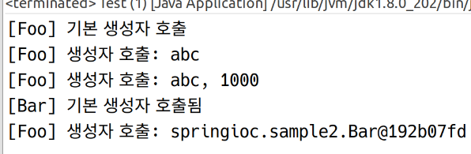

### 연습

**sample3 패키지 생성**

**VO용도의 User 클래스 생성**

```java
// User
package springioc.sample3;

public class User {

	private String userName;
	
	public User() {
		System.out.println("[User] 기본 생성자 호출됨");
	}

	public User(String userName) {
		System.out.println("[User] 생성자 호출됨: " + userName);
		this.userName = userName;
	}

	public String getUserName() {
		return userName;
	}

	public void setUserName(String userName) {
		this.userName = userName;
	}
}
```

**UserService 클래스 생성**

앞으로는 바로 서비스 클래스를 생성하여 기능을 구현하지 않고, 인터페이스를 먼저 만들것임. 어떤 기능이 있어야 하는지를 먼저 기술

```java
// Interface: UserService
package springioc.sample31;

public interface UserService {

	public void addUser(User user);
}

```

```java
// Class: UserServiceImpl
package springioc.sample31;

public class UserServiceImpl implements UserService {

	// 원래 서비스에서는 필드가 들어가면 안되지만 실습을 위해... 실제로는 Stateless하게 구현해야 함
	private User user;
	
	public UserServiceImpl() {
		System.out.println("[UserServiceImpl] 기본 생성자 호출됨");
	}

	public UserServiceImpl(User user) {
		System.out.println("[UserServiceImpl] 생성자 호출됨: " + user);
		this.user = user;
	}

	@Override
	public void addUser(User user) {

		System.out.println("[UserServiceImpl] addUser 메서드 호출됨");
		
		// 비즈니스 로직 처리가 들어가는 부
	}

	public User getUser() {
		return user;
	}

	public void setUser(User user) {
		this.user = user;
	}

	
}
```

Test 클래스의 main 메서드 작성

```java
package springioc.sample31;

import org.springframework.context.ApplicationContext;
import org.springframework.context.support.ClassPathXmlApplicationContext;

public class Test {

	public static void main(String[] args) {
		// ApplicationContext 객체 생성
		ApplicationContext context =
				new ClassPathXmlApplicationContext("applicationContext.xml", User.class);
		
		UserService service = context.getBean("userService", UserService.class);
		User user = context.getBean("obj1", User.class); // 실제 프로젝트에서는 VO를 빈으로 등록하지 않는다.
		service.addUser(user);
		
		((ClassPathXmlApplicationContext)context).close();
	}
}
```

위의 기능이 정상적으로 작동하도록, xml 문서를 작성하라.

```xml
<?xml version="1.0" encoding="UTF-8"?>
<beans xmlns="http://www.springframework.org/schema/beans"
	xmlns:xsi="http://www.w3.org/2001/XMLSchema-instance"
	xsi:schemaLocation="http://www.springframework.org/schema/beans http://www.springframework.org/schema/beans/spring-beans.xsd">

	<bean id="obj1" class="springioc.sample31.User">
		<constructor-arg value="홍길동"></constructor-arg>
	</bean>
	
	<bean id="obj2" class="springioc.sample31.User">
		<property name="userName" value="신사임당"></property>
	</bean>

	<bean id="userService" class="springioc.sample31.UserServiceImpl">
	</bean>
	
	<bean id="userService2" class="springioc.sample31.UserServiceImpl">
		<constructor-arg ref="obj2"></constructor-arg>
	</bean>
</beans>
```

\* 이해를 돕기 위해 만든 예제이며, 실제 프로젝트와는 다르다.

### 실습 4

sample4 패키지 작성

```java
package springioc.sample4;

import java.util.Calendar;
import java.util.GregorianCalendar;

public abstract class AbstractDay {

	public abstract String dayInfo();
	
	public static AbstractDay getInstance() {
		// 오늘 날짜의 요일 반환
		GregorianCalendar cal = new GregorianCalendar();
		
		int day = cal.get(Calendar.DAY_OF_WEEK); // 금일 요일을 숫자로 반환. 1 -> 일, 2-> 월, ...
		
		AbstractDay my_day = null;
		
		switch(day) {
		case 1:
			my_day = new Sunday(); // Sunday는 AbstractDay를 상속
			break;
		case 2:
			my_day = new Monday(); // Monday는 AbstractDay를 상속
			break;
		case 3:
			my_day = new Tuesday(); // Tuesday는 AbstractDay를 상속
			break;
		}
		
		return my_day;
	}
}
```

위의 AbstractDay 클래스는 추상 클래스이므로 앞에서 했던 방법으로는 빈으로 등록이 불가능한 것처럼 보인다. 생성자를 통해 객체를 생성할 수 없기 때문이다.

그러나 getInstance 메서드를 통해 이를 상속받은 하위 클래스의 객체를 반환한다. 즉 getInstance 메서드가 일종의 팩토리 메서드의 역할을 하는 것이다. 실질적으로는 객체를 생성할 수 있는 능력이 있는 것이다.

```java
// Sunday
package springioc.sample4;

public class Sunday extends AbstractDay {

	@Override
	public String dayInfo() {
		return "일요일";
	}

}

```

그럼 xml을 어떻게 만들어야 할까?  
우선 아까 해왔듯이 해보자.

```xml
<?xml version="1.0" encoding="UTF-8"?>
<beans xmlns="http://www.springframework.org/schema/beans"
	xmlns:xsi="http://www.w3.org/2001/XMLSchema-instance"
	xsi:schemaLocation="http://www.springframework.org/schema/beans http://www.springframework.org/schema/beans/spring-beans.xsd">

	<bean id="day" class="springioc.sample4.AbstractDays"></bean>
</beans>

```

```java
// sample4.Test

package springioc.sample4;

import org.springframework.context.ApplicationContext;
import org.springframework.context.support.ClassPathXmlApplicationContext;

public class Test {

	public static void main(String[] args) {
		ApplicationContext context =
				new ClassPathXmlApplicationContext("applicationContext.xml", AbstractDay.class);
	}
}
```

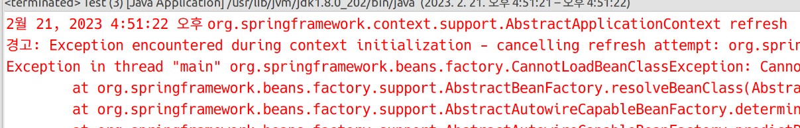

역시나 오류가 발생한다.

이럴 떄에는 bean 요소의 factory-method 어트리뷰트를 활용하면 된다.

```java
<?xml version="1.0" encoding="UTF-8"?>
<beans xmlns="http://www.springframework.org/schema/beans"
	xmlns:xsi="http://www.w3.org/2001/XMLSchema-instance"
	xsi:schemaLocation="http://www.springframework.org/schema/beans http://www.springframework.org/schema/beans/spring-beans.xsd">

	<bean id="day" class="springioc.sample4.AbstractDay"
			factory-method="getInstance"></bean>
</beans>

```

오류가 발생하지 않는다.

### 실습 5

```java
// sample5.User

package springioc;

public class User {

	private String name;
	private String birth;
	
	public User() {
	}

	public User(String name, String birth) {
		super();
		this.name = name;
		this.birth = birth;
	}

	public String getName() {
		return name;
	}

	public void setName(String name) {
		this.name = name;
	}

	public String getBirth() {
		return birth;
	}

	public void setBirth(String birth) {
		this.birth = birth;
	}
	
	@Override
	public String toString() {
		return name + "의 생일은: " + birth;
	}
}
```

```java
// sample5.Test

package springioc.sample5;

import org.springframework.context.ApplicationContext;
import org.springframework.context.support.ClassPathXmlApplicationContext;

public class Test {

	public static void main(String[] args) {
		ApplicationContext context =
				new ClassPathXmlApplicationContext("applicationContext.xml", User.class);
		
		User user1 = context.getBean("f1", User.class);
		User user2 = context.getBean("f1", User.class);
		User user3 = context.getBean("f1", User.class);
		
		((ClassPathXmlApplicationContext)context).close();
	}
}

```

```xml
<?xml version="1.0" encoding="UTF-8"?>
<beans xmlns="http://www.springframework.org/schema/beans"
	xmlns:xsi="http://www.w3.org/2001/XMLSchema-instance"
	xsi:schemaLocation="http://www.springframework.org/schema/beans http://www.springframework.org/schema/beans/spring-beans.xsd">
	
	<bean id="f1" class="springioc.sample5.User"></bean>
	<bean id="f2" class="springioc.sample5.User">
		<constructor-arg index="0" value="홍길동"></constructor-arg>
		<constructor-arg index="1" value="2000-01-01"></constructor-arg>
	</bean>
	<bean id="f3" class="springioc.sample5.User">
		<property name="name" value="신사임당"></property>
		<property name="birth" value="2001-12-01"></property>
	</bean>
</beans>

```

이런 코드가 있다고 하자. 그런데 매번 자식 요소로 값을 주는 것이 너무 번거롭다. 이럴 때에는 p 스키마와 c 스키마를 사용할 수 있다. c는 컨스트럭터를, p는 프로퍼티를 의미한다.

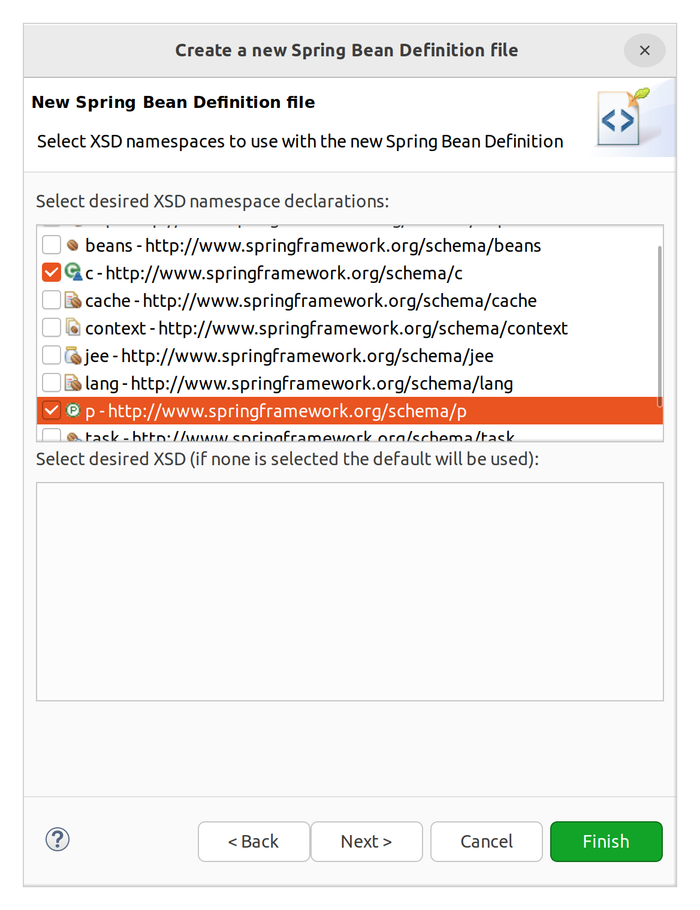

아래와 같이 쓸 수 있다.

```xml
<?xml version="1.0" encoding="UTF-8"?>
<beans xmlns="http://www.springframework.org/schema/beans"
	xmlns:xsi="http://www.w3.org/2001/XMLSchema-instance"
	xmlns:c="http://www.springframework.org/schema/c"
	xmlns:p="http://www.springframework.org/schema/p"
	xsi:schemaLocation="http://www.springframework.org/schema/beans http://www.springframework.org/schema/beans/spring-beans.xsd">
	
	<bean id="f1" class="springioc.sample5.User"></bean>
	<bean id="f2" class="springioc.sample5.User">
		<constructor-arg index="0" value="홍길동"></constructor-arg>
		<constructor-arg index="1" value="2000-01-01"></constructor-arg>
	</bean>
	<bean id="f3" class="springioc.sample5.User">
		<property name="name" value="신사임당"></property>
		<property name="birth" value="2001-12-01"></property>
	</bean>
	<bean id="f4" class="springioc.sample5.User"
		c:name="홍길동" c:birth="2000-01-01" /> <!-- name, birth 파라미터에 각각 값 전달 -->
	<bean id="f4_1" class="springioc.sample5.User"
		c:_1="홍길동" c:_2="2000-01-01" /> <!-- 혹은 _index를 통해 인덱스 번호로 파라미터 위치 전달 -->
	<bean id="f5" class="springioc.sample5.User"
		p:name="신사임당" p:birth="2000-01-01" /> <!-- setName, setBirth 세터에 값 전달 -->
</beans>

```

내일은 이러한 방식으로 ref를 주는 법을 배운다.