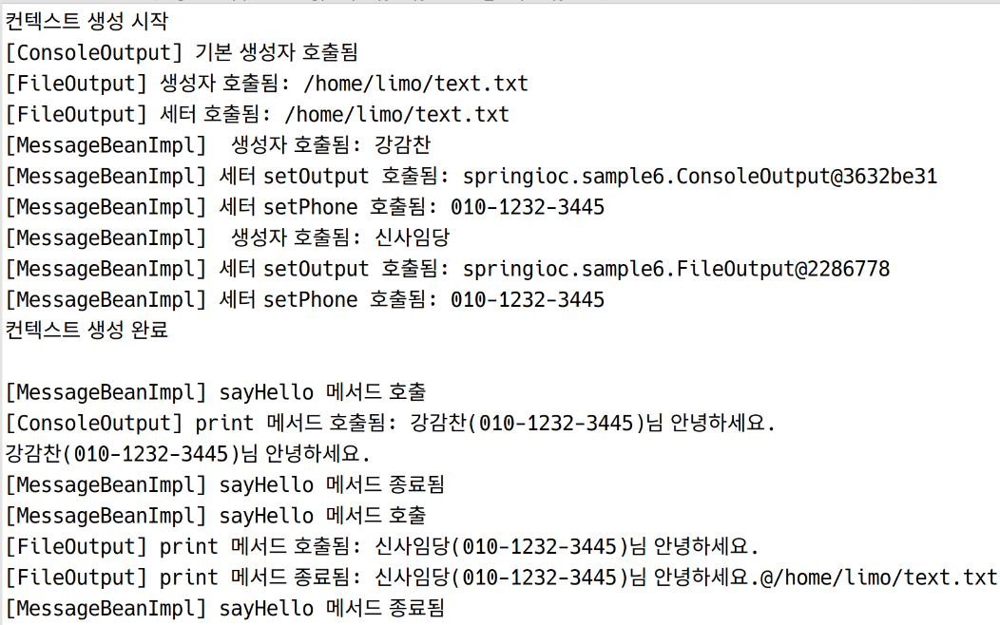

# XML을 통한 DI 심화

## 개요

- 요구사항: 문자열을 출력하는 빈을 만들자. 이 빈은 방향성을 설정할 수 있다. 콘솔로도, 파일로도, DB로도 출력할 수 있도록 한다.
- 구현 방향: 전략 패턴을 사용한다.
    - 해당 빈의 세부 기능 각각이 하나의 전략이 되게 설계한다.
        - Console 출력
        - File 출력
    - 빈 자체와 전략 사이에는 인터페이스를 위치시켜 연결고리 기능을 수행하도록 한다.

> **전략 패턴**  
> 
> 상속을 사용하지 않고, 기능 로직 중 일부를 외부로 분리시키는 패턴

## 실습: sample 6

```java
//smaple6.Output

package springioc.sample6;

public interface Output {

	void print(String message) throws Exception;
}

```

연결고리 역할을 해주는 인터페이스를 작성하였다. 이제 이 인터페이스를 구현하여 각 전략을 만든다.

```java
// sample6.FileOutput
package springioc.sample6;

import java.io.File;
import java.io.FileWriter;

public class FileOutput implements Output {

	private String filePath;
	
	public FileOutput() {
		System.out.println("[FileOutput] 기본 생성자 호출됨");
	}
	
	public FileOutput(String filePath) {
		super();
		this.filePath = filePath;
		System.out.println("[FileOutput] 생성자 호출됨: " + filePath);
	}

	public void setFilePath(String filePath) {
		this.filePath = filePath;
		System.out.println("[FileOutput] 세터 호출됨: " + filePath);
	}

	@Override
	public void print(String message) throws Exception {
		System.out.println("[FileOutput] print 메서드 호출됨: " + message);
		
		FileWriter out = new FileWriter(filePath); // PrintWriter와 비슷. 파일로 향하는 스트림
		out.write(message);
		out.close();
		
		System.out.println("[FileOutput] print 메서드 종료됨: " + message + "@" + filePath);
	}
}

```

```java
// sample6.ConsoleOutput
package springioc.sample6;

public class ConsoleOutput implements Output {

	public ConsoleOutput() {
		System.out.println("[ConsoleOutput] 기본 생성자 호출됨");
	}
	
	@Override
	public void print(String message) throws Exception {
		System.out.println("[ConsoleOutput] print 메서드 호출됨: " + message);
		System.out.println(message);
	}
}

```

빈 역시 나중의 확장을 대비하여 인터페이스를 먼저 만들고 이를 구현하는 방식으로 작성한다.

```java
// sample6.MessageBean
package springioc.sample6;

public interface MessageBean {

	void sayHello();
}

```

```java
// sample6.MessageBeanImpl
package springioc.sample6;

public class MessageBeanImpl implements MessageBean {

	private String name;
	private String phone;
	private Output output; // 전략을 받을 인터페이스를 필드로 갖는다.
	
	public MessageBeanImpl() {
		System.out.println("[MessageBeanImpl] 기본 생성자 호출됨");
	}

	public MessageBeanImpl(String name) { // 여러 상황을 연습해보기 위해 이름만 생성자로 받는다
		this.name = name;
		System.out.println("[MessageBeanImpl]  생성자 호출됨: " + name);
	}


	// 나머지 필드는 세터로 입력받을 것이다
	
	public void setPhone(String phone) {
		this.phone = phone;
		System.out.println("[MessageBeanImpl] 세터 setPhone 호출됨: " + phone);
	}

	public void setOutput(Output output) {
		this.output = output;
		System.out.println("[MessageBeanImpl] 세터 setOutput 호출됨: " + output);
	}

	@Override
	public void sayHello() {
		System.out.println("[MessageBeanImpl] sayHello 메서드 호출");
		
		String msg = name + "(" + phone +")님 안녕하세요.";
		
		try {
			output.print(msg);
			System.out.println("[MessageBeanImpl] sayHello 메서드 종료됨");
		} catch (Exception e) {
			// TODO Auto-generated catch block
			e.printStackTrace();
		}
	}
}
```
인적 사항과 Output 인터페이스를 필드로 갖는 빈 클래스를 구현. 전략을 필요에 따라 바꿔만 주면 얼마든 확장할 수 있음. 클래스를 직접 들고 있지 않아 Loosely Couplued를 지향

엔트리포인트 작성

```java
// sample6.Test
package springioc.sample6;

import org.springframework.context.ApplicationContext;
import org.springframework.context.support.ClassPathXmlApplicationContext;

public class Test {

	public static void main(String[] args) {
		
		ApplicationContext context =
				new ClassPathXmlApplicationContext("applicationContext.xml", Output.class);
		
		MessageBean bean = context.getBean("myBean", MessageBean.class);
		
		bean.sayHello(); // 필드의 output에 어떤 클래스가 주입되는지에 따라 출력 디렉션이 정해짐
		
		((ClassPathXmlApplicationContext)context).close();
	}
}
```

이제 XML만 설정해주면 잘 작동할 것이다.

```xml
<!-- applicationContext.xml --> 
<?xml version="1.0" encoding="UTF-8"?>
<beans xmlns="http://www.springframework.org/schema/beans"
	xmlns:xsi="http://www.w3.org/2001/XMLSchema-instance"
	xmlns:c="http://www.springframework.org/schema/c"
	xmlns:p="http://www.springframework.org/schema/p"
	xsi:schemaLocation="http://www.springframework.org/schema/beans http://www.springframework.org/schema/beans/spring-beans.xsd">

	<bean id="consoleRef" class="springioc.sample6.ConsoleOutput" />
	
	<bean id="fileRef" class="springioc.sample6.FileOutput"
		c:filePath="~/text.txt" p:filePath="/home/limo/text.txt" /> <!-- 중복 지정됨. 일반적으로는 1번만 -->

<!-- 	<bean id="myBeanOld" class="springioc.sample6.MessageBeanImpl">
		<constructor-arg name="name" value="홍길동" />
		<property name="phone" value="010-1234-3456" />
		<property name="output" ref="myConsole"></property>
	</bean> -->

	<bean id="myBean" class="springioc.sample6.MessageBeanImpl"
		c:name="강감찬" p:phone="010-1232-3445" p:output-ref="consoleRef" />
		
	<bean id="anotherBean" class="springioc.sample6.MessageBeanImpl"
		c:name="신사임당" p:phone="010-1232-3445" p:output-ref="fileRef" />
</beans>
```

잘 작동한다. 두 개의 MessageBeanImpl 객체를 사용해보기 위해 Test.main을 수정하고 다시 테스트해보자.

```java
public static void main(String[] args) {
		System.out.println("컨텍스트 생성 시작");
		
		ApplicationContext context =
				new ClassPathXmlApplicationContext("applicationContext.xml", Output.class);
		
		System.out.println("컨텍스트 생성 완료\n");
		
		MessageBean bean1 = context.getBean("myBean", MessageBean.class);
		MessageBean bean2 = context.getBean("anotherBean", MessageBean.class);
		
		bean1.sayHello(); // 필드의 output에 어떤 클래스가 주입되는지에 따라 출력 디렉션이 정해짐
		bean2.sayHello();
		
		((ClassPathXmlApplicationContext)context).close();
	}
```




## 실습: sample 7

앞으로는 이렇게 하지맙시다.

상위클래스와, 이를 상속받는 하위 클래스를 만든다.

```java
package springioc.sample7;

public class Emp { // 종업원을 표현하는 클래스

	private String name;
	private int salary;
	
	public Emp() {	
	}

	public Emp(String name, int salary) {
		super();
		this.name = name;
		this.salary = salary;
	}
	
}
```

```java
package springioc.sample7;

public class Developer extends Emp {

	private String dept;
	
	public Developer() {
	}

	public Developer(String name, int salary, String dept) {
		super(name, salary);
		this.dept = dept;
	}

	
}
```

```xml
<?xml version="1.0" encoding="UTF-8"?>
<beans xmlns="http://www.springframework.org/schema/beans"
	xmlns:xsi="http://www.w3.org/2001/XMLSchema-instance"
	xsi:schemaLocation="http://www.springframework.org/schema/beans http://www.springframework.org/schema/beans/spring-beans.xsd">

	<bean id="developer" class="springioc.sample7.Developer">
		<constructor-arg index="0" value="홍길동"></constructor-arg>
		<constructor-arg index="1" type="int" value="5000"></constructor-arg>
		<constructor-arg index="2" value="개발1팀"></constructor-arg>
	</bean>
</beans>
```

문제 없어보이며, 실제로 기능에 문제가 없다. 그러나 두 클래스가 항상 붙어다닌다는 문제가 있다. 앞으로는 인터페이스 기반으로 주입하여 구현을 해보자.

```java
package springioc.sample7;

public class Engineer {

	private Emp emp; // 상속받지 않기 위해 필드로 잡는다.
	private String dept;
	
	public Engineer() {
	}

	public Engineer(Emp emp, String dept) {
		this.emp = emp;
		this.dept = dept;
	}
}
```

이렇게 하면 상속받지 않고도 상위 클래스의 속성과 기능을 사용할 수 있다. 그럼 XML 설정은 아래와 같이 해주면 된다.

```xml
<?xml version="1.0" encoding="UTF-8"?>
<beans xmlns="http://www.springframework.org/schema/beans"
	xmlns:xsi="http://www.w3.org/2001/XMLSchema-instance"
	xmlns:c="http://www.springframework.org/schema/c"
	xmlns:p="http://www.springframework.org/schema/p"
	xsi:schemaLocation="http://www.springframework.org/schema/beans http://www.springframework.org/schema/beans/spring-beans.xsd">

	<bean id="developer" class="springioc.sample7.Developer">
		<constructor-arg index="0" value="홍길동"></constructor-arg>
		<constructor-arg index="1" type="int" value="5000"></constructor-arg>
		<constructor-arg index="2" value="개발1팀"></constructor-arg>
	</bean>
	
	<bean id="emp" class="springioc.sample7.Emp"
		c:name="신사임당" c:salary="7000"/>
	
	<bean id="engineer" class="springioc.sample7.Engineer"
		c:dept="개발1팀" c:emp-ref="emp"/>
</beans>
```

이렇게 XML을 통해 관계를 일일이 잡아주면, 세세하고 정확하게 지정해줄 수 있다. 그러나 스케일이 커지고 복잡해지면 오류가 발생할 가능성이 높아진다. 또 오류를 잡기 어려워진다. 어떻게 하면 편하게 할 수 있을까? 자동으로 의존성을 주입해줄 수 있는 방법이 있다. ⇒ **Auto-Wiring**

## Auto-wiring

명시적 선언 없이도 자동으로 의존 Bean을 주입하는 기능이다. 앞으로는 이 기능을 사용할 것이다.

위와 같은 XML 설정은 의존 관계 파악이 용이하지만, 쓸게 너무 많아진다는 한계점이 있다. 결국 프로그램이 발전하면 관리가 힘들어지게 된다. Auto-wiring은 이를 보완한다.

### Auto-wiring의 방식

1. XML에서 빈 요소에 autowire 어트리뷰트를 지정
     - 1-1. autowire="byName"
         - byName: 빈의 식별자(id)를 가지고 자동 연결
     - 1-2. autowire="byType"
         - byType: 클래스 타입이 같은 객체를 자동 연결
2. @Autowired 어노테이션 사용
    - 컴포넌트 스캔 기능을 통해 자동 연결. 이때는 byType을 기반으로 주입.
    - XML에서 annotaion config가 들어감.

## Auto-wiring 실습: byName

아래와 같이 두 개의 클래스를 잡자.

```java
package springioc.sample8;

public class DataBean {

	private String name;
	
	public DataBean() {
		System.out.println("[DataBean] 기본 생성자 호출");
	}

	public DataBean(String name) {
		super();
		this.name = name;
		System.out.println("[DataBean] 생성자 호출: " + name);
	}

	public String getName() {
		return name;
	}

	public void setName(String name) {
		this.name = name;
	}
	
	
}
```

```java
package springioc.sample8;

public class TestBaen {

	private DataBean data1;
	private DataBean data2;
	
	public TestBaen() {
		System.out.println("[TestBean] 기본 생성자 호출");
	}

	public DataBean getData1() {
		return data1;
	}

	public void setData1(DataBean data1) {
		this.data1 = data1;
	}

	public DataBean getData2() {
		return data2;
	}

	public void setData2(DataBean data2) {
		this.data2 = data2;
	}
}
```

TestBean은 DataBean에 의존하고 있다.

그럼 XML을 작성하자.

```xml
<?xml version="1.0" encoding="UTF-8"?>
<beans xmlns="http://www.springframework.org/schema/beans"
	xmlns:xsi="http://www.w3.org/2001/XMLSchema-instance"
	xsi:schemaLocation="http://www.springframework.org/schema/beans http://www.springframework.org/schema/beans/spring-beans.xsd">

	<bean id="myObj" class="springioc.sample8.TestBaen" autowire="byName" />
	<!-- 아래의 작업을 자동으로 해준다.
	<bean id="myObj" class="springioc.sample8.TestBaen">
		<property name="data1" ref="data1" />
		<property name="data2" ref="data2" />
	</bean>
	-->
	
	<bean id="data1" class="springioc.sample8.DataBean" /> <!-- 두 개는 구분되는 다른 빈 -->
	<bean id="data2" class="springioc.sample8.DataBean" />
</beans>
```

TestBean에서, setter의 선언부를 보면,

> public void setData1(DataBean data1) {
> 
> public void setData2(DataBean data2) {

위와 같이 되어있다. 그럼 autowire="byName"이 지정된 경우 data1, data2라는 패러미터 네임과 같은 id의 빈을 찾아 맵핑해준다.

잘 되는지 main을 작성하자.

```java
package springioc.sample8;

import org.springframework.context.ApplicationContext;
import org.springframework.context.support.ClassPathXmlApplicationContext;

public class Test {

	public static void main(String[] args) {
		ApplicationContext context =
				new ClassPathXmlApplicationContext("applicationContext.xml", DataBean.class);
		
		TestBaen bean = context.getBean("myObj", TestBaen.class);
		
		System.out.println(bean.getData1());
		System.out.println(bean.getData2());
		
		((ClassPathXmlApplicationContext)context).close();
	}
}
```


자동 주입이 잘 되었다.

만약에 DataBean의 id를 바꾼다면? 자동 주입에 실패한다.


주입이 되지 않아 null이 출력되었다.

기본 값으로는 세터를 통해 주입되게 된다. 이는 세터에 sysout을 찍도록 하면 알 수 있다.


세터를 통해 빈을 주입받기 떄문에 세터가 호출되었다. 올바르지 않은 id의 빈의 경우 세터를 찾지 못해 실행되지 않았음도 볼 수 있다.

그렇다면 byName은 필드 명을 기준으로 하는 것인가 패러미터 명을 기준으로 하는 것인가?

아래와 같이 수정해보자.

```java

public void setData1(DataBean data111) {
		this.data1 = data111;
		System.out.println("[TestBean] setData1 메서드 호출");
	}
```

패러미터 명을 수정했는데도 실행하면 잘된다. 즉, byName은 패러미터 명이 아닌 필드를 기준으로 작업을 수행하는 것임을 알 수 있다.

## Auto-wiring 실습: byType

byType으로 지정하면, 이름은 상관 없다. 객체의 타입만을 보고 비교한다.


```xml
<?xml version="1.0" encoding="UTF-8"?>
<beans xmlns="http://www.springframework.org/schema/beans"
	xmlns:xsi="http://www.w3.org/2001/XMLSchema-instance"
	xsi:schemaLocation="http://www.springframework.org/schema/beans http://www.springframework.org/schema/beans/spring-beans.xsd">

	<bean id="myObj" class="springioc.sample9.TestBaen" autowire="byType" />
	
	<bean id="data1" class="springioc.sample9.DataBean" />
	<bean id="data2" class="springioc.sample9s.DataBean" />
</beans>
```

그런데 위와 같은 경우 같은 타입이 컨텍스트 내에 두 개 있다.

일단 되는지 그대로 실행해보자.


오류가 발생한다.

반면에 XML에서 data2를 주석처리 하면 잘 된다.


같은 타입이 혼재하는 것이 원인임이 확실해졌다.

이 경우 타입을 가지고 주입하므로 data1, data2에 같은 객체가 주입되는 것을 볼 수 있다.

기본은 이름보다는 타입을 가지고 주입하는 것이다. 그러나 이 경우 위와 같이 동일한 타입의 다른 빈은 주입하지 못하게 된다는 한계가 있다.

이 떄에는, **primary="ture"** 를 지정해주면 된다.

```java
<?xml version="1.0" encoding="UTF-8"?>
<beans xmlns="http://www.springframework.org/schema/beans"
	xmlns:xsi="http://www.w3.org/2001/XMLSchema-instance"
	xsi:schemaLocation="http://www.springframework.org/schema/beans http://www.springframework.org/schema/beans/spring-beans.xsd">

	<bean id="myObj" class="springioc.sample9.TestBaen" autowire="byType" />
	
	<bean id="data1" class="springioc.sample9.DataBean" primary="true" />
	<bean id="data2" class="springioc.sample9.DataBean" />
</beans>
```


오류가 발생하지 않는다. 그러나 primary로 잡힌 빈이 모든 필드에 들어갔음을 볼 수 있다.

## Auto-wiring 실습: 생성자로 주입

sample10

생성자로 주입하려면 어떻게 해야할까? autowire="constructor"를 사용하면 된다.

우선 생성자를 추가한다

```java
// TestBean
	public TestBaen(DataBean data1, DataBean data2) {
		super();
		this.data1 = data1;
		this.data2 = data2;
	}

```

XML의 TestBean에 대한 bean 요소에 autowire 어트리뷰트 밸류를 수정한다.

```xml
<bean id="myObj" class="springioc.sample10.TestBaen" autowire="constructor" />
```


생성자를 통해 주입되었다.

이러한 설정을 한 번에 해줄 수도 있다. beans 요소의 default-autowire 어트리뷰트에 원하는 방식을 지정하면 된다.

```xml
<!-- 전략 -->
<beans xmlns="http://www.springframework.org/schema/beans"
	xmlns:xsi="http://www.w3.org/2001/XMLSchema-instance"
	xsi:schemaLocation="http://www.springframework.org/schema/beans http://www.springframework.org/schema/beans/spring-beans.xsd"
	default-autowire="byName">
<!-- 후략 -->
```

이 경우 하위의 bean 요소에 대해서는 autowire 어트리뷰트가 지정되지 않아도 알아서 auto-wiring이 수행된다. 특정 빈에 대해 비활성화하려면,

```xml
	<bean id="myObj" class="springioc.sample10.TestBaen" autowire="no" />
```
위와 같이 지정해주면 된다.

