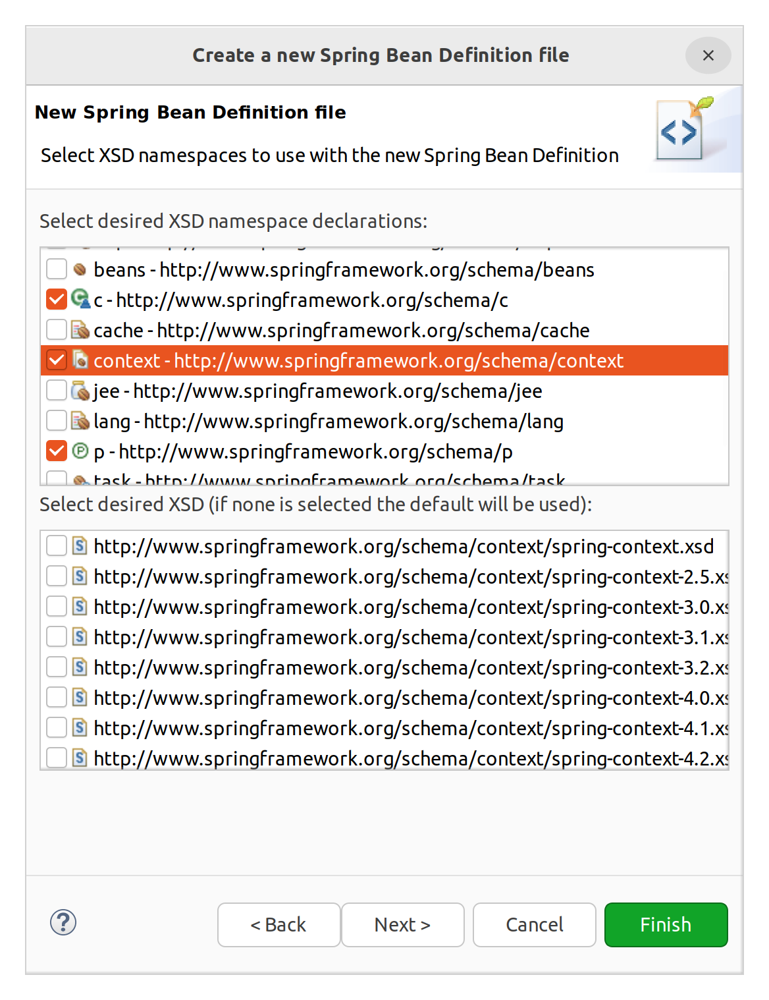
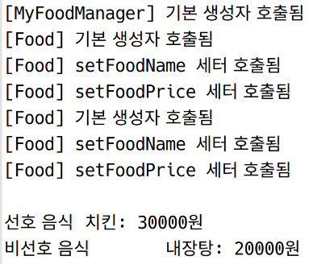
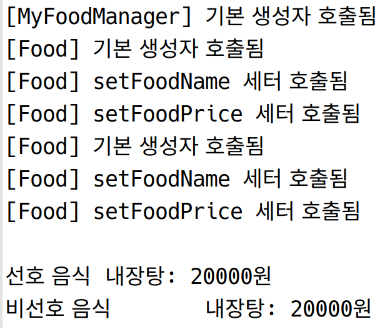
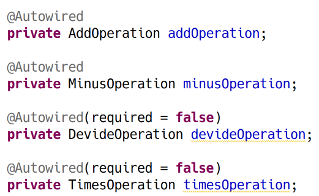
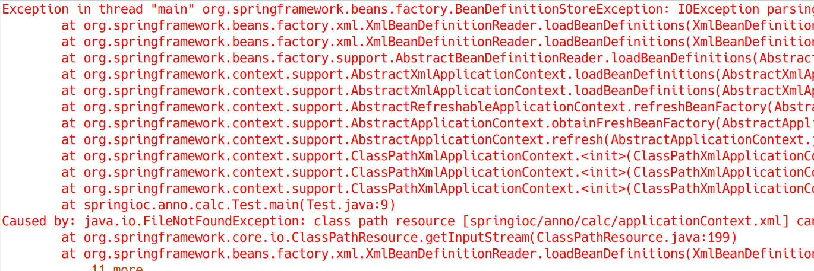
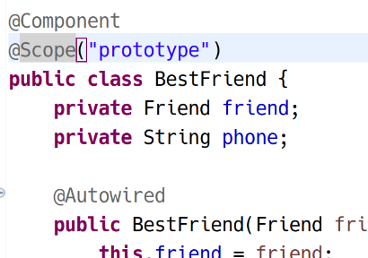
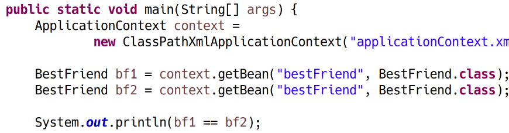

# Annotaion 기반의 설정

## 개요

XML을 사용하지 않고 소스코드 본문에 설정 내용을 기술하는 방법. 

## @Component

- 기능: 가장 대표적인 어노테이션.
- 위치: 클래스에 대해 지정할 수 있음. 클래스 위에 명시하면 해당 클래스를 빈으로 등록해줌. (그 즉시 생성되는지 아닌지는 설정에 따라 다름)

XML설정에서는 각 빈에 대한 id를 직접 설정해줬었음. 반면에 @Component를 이용하면 id가 클래스 이름에서 첫 글자를 소문자로 바꾼 문자열로 지정됨.  
예> ClassName → className

수동으로 지정하고자 하는 경우,  
@Component("beanID")로 지정가능.


Annotaion 설정을 이용하려면 XML에 특정한 구문이 들어가야 함. → 실습에서 살펴보겠음

## @Autowired

- 기능: 자동으로 Dependency를 설정하기 위해 사용
- 위치
    1. 컨스트럭터 위
        - 해당 클래스 내의 모든 필드를 자동으로 주입
    2. 필드 위
        - 주입을 원하는 필드 위에 지정
    3. 메서드 위
        - 일반적으로 setter 위에 붙임
        - 하지만 일반 메서드 위에도 붙일 수 있음

_기본적으로 맞는 Type을 찾아줌.
그러나 동일한 타입의 객체가 두 개 이상이 있다면, 필드명, 패러미터명을 알아서 찾아 주입해줌. 다 못찾으면 에러 발생_

@Autowired(required=false)로 지정하면, 주입할 빈이 없어도 오류가 발생하지 않음 (컨스트럭터에 붙인 어노테이션의 경우 이 옵션 적용 안됨)

## @Qualifier

- 기능: @Autowired와 함께 사용하여, 이름으로 특정 빈을 찾아 주입하고자 할 때 사용

## 어노테이션을 통한 설정 실습 1

```java
package springioc.anno.sample1;

public class Food {

	private String foodName;
	private String foodPrice;
	
	public Food() {
		System.out.println("[Food] 기본 생성자 호출됨");
	}

	public void setFoodName(String foodName) {
		this.foodName = foodName;
		System.out.println("[Food] setFoodName 세터 호출됨");
	}

	public void setFoodPrice(String foodPrice) {
		this.foodPrice = foodPrice;
		System.out.println("[Food] setFoodPrice 세터 호출됨");
	}
	
	@Override
	public String toString() {
		return foodName + ": " + foodPrice +"원";
	}
}
```

```java
package springioc.anno.sample1;

public class MyFoodManager {

	private Food favoriteFood;
	private Food unfavoriteFood;
	
	public MyFoodManager() {
		System.out.println("[MyFoodManager] 기본 생성자 호출됨");
	}
	
	@Override
	public String toString() {
		return "\n선호 음식\t" + favoriteFood +
				"\n비선호 음식\t" + unfavoriteFood;
	}
}
```

그럼 MyFoodManager에 Food의 객체 두 개를 추가해줘야 한다.

XML을 만들고 어노테이션으로 설정할 수 있도록 특정 설정을 해준다. 이를 위해서는 context 스키마가 필요하므로, XML 파일을 생성할 때 아래와 같이 설정한다.




XML은 아래와 같이 지정한다.

```xml
<?xml version="1.0" encoding="UTF-8"?>
<beans xmlns="http://www.springframework.org/schema/beans"
	xmlns:xsi="http://www.w3.org/2001/XMLSchema-instance"
	xmlns:c="http://www.springframework.org/schema/c"
	xmlns:context="http://www.springframework.org/schema/context"
	xmlns:p="http://www.springframework.org/schema/p"
	xsi:schemaLocation="http://www.springframework.org/schema/beans http://www.springframework.org/schema/beans/spring-beans.xsd
		http://www.springframework.org/schema/context http://www.springframework.org/schema/context/spring-context-4.3.xsd">

	<!-- base-package - 찾을 위치 지정 -->
	<context:component-scan base-package="springioc.anno.sample1"></context:component-scan> 
</beans>
```

그럼 base-package 어트리뷰트에 지정한 패키지 위치에서 빈을 찾게 된다.

계속 XML을 작성하자.

```xml
<?xml version="1.0" encoding="UTF-8"?><?xml version="1.0" encoding="UTF-8"?>
<beans xmlns="http://www.springframework.org/schema/beans"
	xmlns:xsi="http://www.w3.org/2001/XMLSchema-instance"
	xmlns:c="http://www.springframework.org/schema/c"
	xmlns:context="http://www.springframework.org/schema/context"
	xmlns:p="http://www.springframework.org/schema/p"
	xsi:schemaLocation="http://www.springframework.org/schema/beans http://www.springframework.org/schema/beans/spring-beans.xsd
		http://www.springframework.org/schema/context http://www.springframework.org/schema/context/spring-context-4.3.xsd">

	<!-- base-package - 찾을 위치 지정 -->
	<context:component-scan base-package="springioc.anno.sample1"></context:component-scan> 
	
	<bean id="favoriteFood" class="springioc.anno.sample1.Food"
		p:foodName="치킨" p:foodPrice="30000" />
		
	<bean id="unfavoriteFood" class="springioc.anno.sample1.Food"
		p:foodName="내장탕" p:foodPrice="20000" />
</beans>

<beans xmlns="http://www.springframework.org/schema/beans"
	xmlns:xsi="http://www.w3.org/2001/XMLSchema-instance"
	xmlns:c="http://www.springframework.org/schema/c"
	xmlns:context="http://www.springframework.org/schema/context"
	xmlns:p="http://www.springframework.org/schema/p"
	xsi:schemaLocation="http://www.springframework.org/schema/beans http://www.springframework.org/schema/beans/spring-beans.xsd
		http://www.springframework.org/schema/context http://www.springframework.org/schema/context/spring-context-4.3.xsd">

	<!-- base-package - 찾을 위치 지정 -->
	<context:component-scan base-package="springioc.anno.sample1"></context:component-scan> 
	
	<bean id="favoriteFood" class="springioc.anno.sample1.Food"
		p:foodName="치킨" p:foodPrice="30000" />
		
	<bean id="unfavoriteFood" class="springioc.anno.sample1.Food"
		p:foodName="내장탕" p:foodPrice="20000" />
</beans>
```


MyFoodManager에 어노테이션을 추가한다.

```java
package springioc.anno.sample1;

import org.springframework.beans.factory.annotation.Autowired;
import org.springframework.stereotype.Component;

//@Component // 기본 biean id:MyFoodManager
@Component("myFood")
public class MyFoodManager {

	@Autowired
	private Food favoriteFood;
	
	@Autowired
	private Food unfavoriteFood;
	
	public MyFoodManager() {
		System.out.println("[MyFoodManager] 기본 생성자 호출됨");
	}
	
	@Override
	public String toString() {
		return "\n선호 음식\t" + favoriteFood +
				"\n비선호 음식\t" + unfavoriteFood;
	}
}
```

실행해보면 정상 작동한다.



@Qualifier 어노테이션을 사용하여 아래와 같이 이름으로 찾을 수도 있다.

```java
	@Autowired
	@Qualifier(value="unfavoriteFood")
	private Food favoriteFood;
```



이름을 기준으로 찾는 것을 확인할 수 있다.

## @Resource

@Autowired와 기능이 거의 동일하다. 다만 @Autowired는 타입을 기준으로 자동 주입을 해준다면, @Resource는 이름을 기준으로 자동 주입을 해준다.

## 어노테이션을 통한 설정 실습 2

```java
package springioc.anno.sample2;

public class Emp {

	private String name;
	private int age;
	
	public Emp() {
	}

	public Emp(String name, int age) {
		super();
		this.name = name;
		this.age = age;
	}

	public void setName(String name) {
		this.name = name;
	}

	public void setAge(int age) {
		this.age = age;
	}
	
	@Override
	public String toString() {
		return name + "\t" + age;
	}
}
```

```java
package springioc.anno.sample2;

import org.springframework.beans.factory.annotation.Autowired;
import org.springframework.stereotype.Component;

@Component
public class Engineer {

	@Autowired
	private Emp emp;
	
	private String dept;
	
	public Engineer() {
	}
	
	@Autowired // 패러미터 dept를 주입해줌. id가 dept인 빈 필요. 필드가 아닌 패러미터의 이름을 따라감. 
	public void my_dept(String dept) {  // Setter 역할을 대신하는 일반 메서드
		this.dept = dept;
		System.out.println("[Engineer] 일반 메서드 my_dept 호출됨");
	}
}
```

일반 메서드에도 @Autowired 어노테이션을 붙일 수 있다. 이 경우 패러미터의 이름과 동일한 id를 가진 빈을 자동 주입한다.  
필드를 보면 emp에는 @Autowired가 걸려있고

```xml
<?xml version="1.0" encoding="UTF-8"?>
<beans xmlns="http://www.springframework.org/schema/beans"
	xmlns:xsi="http://www.w3.org/2001/XMLSchema-instance"
	xmlns:c="http://www.springframework.org/schema/c"
	xmlns:context="http://www.springframework.org/schema/context"
	xmlns:p="http://www.springframework.org/schema/p"
	xsi:schemaLocation="http://www.springframework.org/schema/beans http://www.springframework.org/schema/beans/spring-beans.xsd">
	
	<context:component-scan base-package="springioc.anno.sample2"></context:component-scan>
	
	<bean id="emp1" class="springioc.anno.sample2.Emp"
		p:name="홍길동" p:age="20" /> <!-- Engineer에 자동 주입 -->
		
	<bean id="dept" class="java.lang.String" c:_0="개발1팀" /> <!-- new String("개발1팀") -->
</beans>

```

String을 빈으로 잡아 자동 주입하였다.

## @Scope

@Component 하단에 나온다.

```java
@Component
@Scope("prototype")
```

## 과제
 
 아래의 사항을 직접 테스트 해보라.
 
 - @Autowired(required=false)
 - 컨스트럭터에 대해 @Autowired 지정
 - @Scope("prototype")

### 1. @Autowired(required=false)



@Autowired(required=false) 옵션을 주면 등록되지 않은 빈이더라도 오류가 발생하지 않는다.

옵션을 주지 않으면 아래처럼 오류가 발생한다.



### 2. 컨스트럭터에 대해 @Autowired 지정

```java
package springioc.homework1;

import org.springframework.beans.factory.annotation.Autowired;
import org.springframework.stereotype.Component;

@Component
public class BestFriend {
	private Friend friend;
	private String phone;
	
	@Autowired
	public BestFriend(Friend friend, String phone) {
		this.friend = friend;
		this.phone = phone;
	}
	
	@Override
	public String toString() {
		return friend.getName() + ", " + friend.getAge() + "세, " + phone;
	}
}
```

위와 같이 생성자 위에 붙이니 생성자에 자동 주입이 되었다.

phone 빈을 xml에서 지우니 오류가 발생하였으며, required = false는 먹히지 않았다.

### 3. @Scope("prototype")





결과로 false가 출력된다.