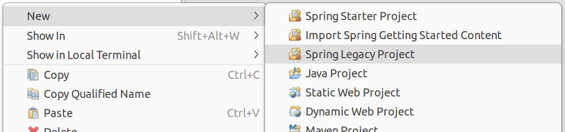
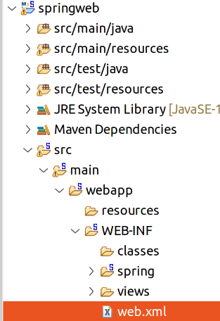
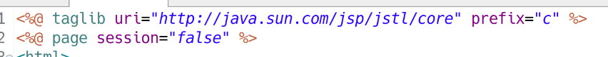
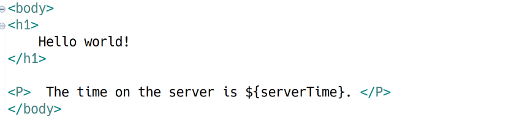
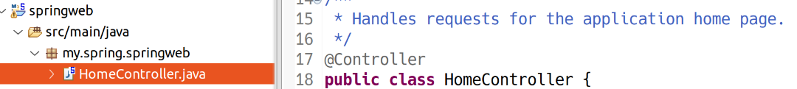
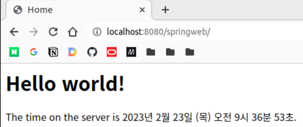
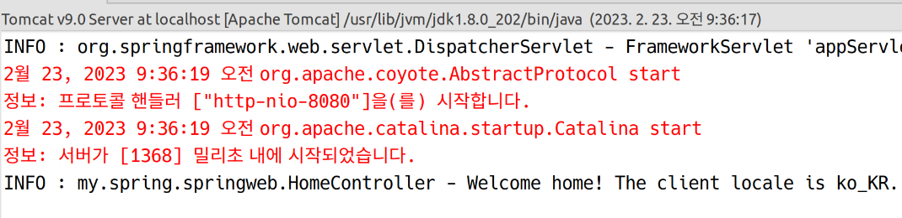
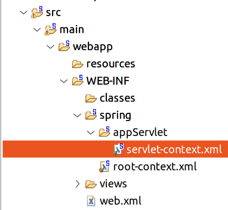
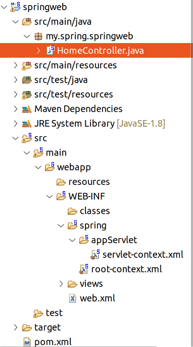

# Spring Web MVC

## 개요

어제까지 Spring Context를 통해 ApplicationContext를 다뤘다. XML과 어노테이션을 사용하여 빈을 만들고 빈 간의 관계를 맺어주는 것을 배웠다.

Spring Web MVC는 서블릿을 기반으로 한 웹 프레임워크이며, 위의 IoC 기능들이 내장되어 있다.

## 우선 따라하기



my.spring.springweb

톰캣 추가

한글 처리를 위해 web.xml에 필터 추가



web.xml의 \<webapp> 요소 하위에 아래 추가

```xml
	<filter>
		<filter-name>encodingFilter</filter-name> <!-- 필터 이름 짓기 -->
		<filter-class> <!-- 필터의 클래스를 지정. 풀패키지 경 -->
			org.springframework.web.filter.CharacterEncodingFilter <!-- 스프링이 제공 -->
		</filter-class>
		<init-param> <!-- 넣어줄 인자 -->
			<param-name>encoding</param-name>
			<param-value>UTF-8</param-value>
		</init-param>
	</filter>
	
	<filter-maping>
		<filter-name>encodingFilter</filter-name> <!-- 필터 이름 -->
		<url-pattern>/*</url-pattern> <!-- 모든 요청에 맵핑 -->
	</filter-maping>
```

JSP는 WEB-INF/views에 들어가게 된다. 물론 원하는 경우 설정을 변경하여 이동 가능하다. 처음이니까 이 경로를 그대로 사용하도록 한다.



상단에 우리가 알던 JSP에는 볼 수 없었던 taglib가 보인다. jstl이라는 태그 라이브러리를 추가하는 구문이다.  
이것은 이전에 사용했던 scriptlet(<% %>)를 태그의 형태로 사용하기 위해 추가해주는 것이다. 즉, 앞으로는 스트립트렛을 직접 사용하지 않고, 태그를 사용하게 될 것이다.



바디에도 ${serverTime}이라는 새로운 표현이 보인다. 이를 el이라고 하며, JSP의 익스프레션 문법(>%= %>)을 대신한다. 나중에 더 자세하게 알아보기로 한다.

또한, 아래의 부분이 빠져있다. 이 구문은 수동으로 상단에 추가해준다.

```jsp
<%@ page contentType="text/html; charset=UTF-8" pageEncoding="UTF-8" language="java" %>
```

스프링에서는 컨트롤러가 서블릿이 아닌 일반 클래스이다. (POJO)



@Controller라는 어노테이션이 보인다. 이는 어제 배웠던 @Component의 하위 어노테이션이다. 즉, 자동으로 빈으로 등록시킨다. 그 외에 특별히 추가되는 기능은 없으며, 컨트롤러임을 명시하는 시맨틱의 목적을 한다고 보면 된다.  

상단에 Logger라는 필드가 잡혀있다. 앞으로는 sysout을 사용하지 않고 log4j를 통해 로그를 찍을 것이다.

```java
@RequestMapping(value = "/", method = RequestMethod.GET)
	public String home(Locale locale, Model model) {
		logger.info("Welcome home! The client locale is {}.", locale);
		
		Date date = new Date();
		DateFormat dateFormat = DateFormat.getDateTimeInstance(DateFormat.LONG, DateFormat.LONG, locale);
		
		String formattedDate = dateFormat.format(date);
		
		model.addAttribute("serverTime", formattedDate );
		
		return "home";
	}
```

위와 같은 메서드가 들어가있다. @RequestMapping을 통해 맵핑할 요청 URL과 HTTP 메서드를 지정해준다. 메서드의 이름은 상관 없다.

오늘 날짜를 계산한 후 결과적으로는 "home"이라는 문자열을 리턴한다. 그럼 home.jsp가 전송된다. 관련해서는 나중에 자세히 살펴본다.

톰캣에 현재 프로젝트를 추가하고, 실행해보자. 브라우저로 http://localhost:8080/springweb/에 접속한다.



프로젝트 명인 springweb이 ContextRoot가 되며, '/'는 home 메서드에 맵핑된 URL이다.

STS의 콘솔을 보면 로그가 찍혀있다.



@Controller가 붙은 POJO 클래스를 자동으로 스프링이 빈으로 등록하고, 특정 URL에 메서드를 맵핑하여 알아서 호출해 준 것이다. 우리는 POJO 클래스만 작성하면 된다. 

## 프로젝트 설정

1. servlet-context.xml
    - 어제 다루었던 applicationContext.xml과 같은 역할
    - 스프링 프레임워크에는 기본적으로 두 개의 IoC 컨테이너가 있다.
    - 두 컨테이너 중 Servlet Web ApplicationContext의 설정 파일이다.



2. root-context.xml
    - Root Web ApplicationContext의 설정 파일

### servlet-context.xml


```xml
<context:component-scan base-package="my.spring.springweb" />
```

우리 프로젝트의 루트 경로가 스캔 경로로 잡혀있다. 스프링은 루트 경로 하위를 돌면서 @Component 어노테이션(혹은 그 하위 어노테이션)이 달려있는 클래스의 객체를 빈으로 등록할 것이다.

@Component의 하위 어노테이션
- @Controller:컨트롤러
- @Service: 서비스
- @Repository: DAO
- @Configuration: 빈을 수동으로 잡기 위한 설정 클래스

위의 어노테이션이 붙은 경우 IoC 컨테이너가 자동으로 빈으로 등록해준다. 명칭이 상세해진다고 하더라도 어노테이션 자체의 기능이 달리지지는 않는다. 다만 시맨틱하게 명시할 수 있도록 하여 코드의 가독성을 높여준다.

다만!!! servlet-context.xml는 Servlet Web ApplicationContext의 설정파일로, Servlet Web ApplicationContext는 컨트롤러만을 관리하도록 하는 것이 권장된다. 나머지 Service, DAO, … 등의 빈은 Root Web ApplicationContext가 관리하도록 하는 것이 좋다.

그러나 위와 같이 <context:component-scan>을 잡아주면 해당 서브 패키지 하위의 모든 어노테이션된 클래스의 객체를 Servlet Web ApplicationContext가 관리하게 되므로, 아래와 같이 수정해준다.

```xml
	<context:component-scan base-package="my.spring.springweb" use-default-filters="false">
		<context:include-filter type="annotation" expression="org.springframework.stereotype.Controller"/>
	</context:component-scan>
```

use-default-filter 속성은 명시하지 않으면 기본값이 true이다. true로 지정된 경우 @Component, @Repository, @Service, @Controller와 같은 모든 기본 어노테이션을 스캔한다. 위의 코드에서는 이것을 false로 지정하여 비활성화하고, <context:include-filter>를 통해 @Controller 만을 스캔하도록 지정한다.

### root-context.xml

Root Web ApplicationContext에 대한 설정 파일이다. 열어보면 아무 것도 없다. 이제 여기에 @Controller를 제외한 다른 어노테이션을 스캔하도록 설정해준다.

```java
<?xml version="1.0" encoding="UTF-8"?>
<beans xmlns="http://www.springframework.org/schema/beans"
	xmlns:xsi="http://www.w3.org/2001/XMLSchema-instance"
	xmlns:beans="http://www.springframework.org/schema/beans"
	xmlns:context="http://www.springframework.org/schema/context" <!-- 추가해줘야 context 네임스페이스를 사용할 수 있다. -->
	xsi:schemaLocation="http://www.springframework.org/schema/mvc https://www.springframework.org/schema/mvc/spring-mvc.xsd
		http://www.springframework.org/schema/beans https://www.springframework.org/schema/beans/spring-beans.xsd
		http://www.springframework.org/schema/context https://www.springframework.org/schema/context/spring-context.xsd">

	<!-- Root Context: defines shared resources visible to all other web components -->
		
	<context:component-scan base-package="my.spring.springweb" use-default-filters="true"> <!-- true로 지정 -->
		<context:exclude-filter type="annotation" expression="org.springframework.stereotype.Controller"/> <!-- @Controller는 제외 -->
	</context:component-scan>
</beans>

```

## 프로젝트 구조를 잡는 전략

### 1. 계층형

- src/main/java
    - my
        - spring
            - springweb
                - controller
                - dao
                - vo
                - service

- 장점: 한 눈에 구조를 볼 수 있다.
- 단점: 도메인이 섞인다.

### 2. 도메인형

- src/main/java
    - my
        - spring
            - springweb
                - member
                    - controller
                    - dao
                    - vo
                    - service
                - board
                    - controller
                    - dao
                    - vo
                    - service

- 장점: 도메인 구분이 명확하다.
- 단점: 한 눈에 구조를 보기 힘들다.

협업시에는 위와 같은 구조가 유리하다.

## pom.xml 수정

### 자바 버전

```xml
	<properties> <!-- 아래에서 자식 요소 각각을 변수처럼 사용한다. -->
		<java-version>1.8</java-version> <!-- 자바 버전 -->
		<org.springframework-version>3.1.1.RELEASE</org.springframework-version>
		<org.aspectj-version>1.6.10</org.aspectj-version>
		<org.slf4j-version>1.6.6</org.slf4j-version>
	</properties>
```

```xml
            <plugin>
                <groupId>org.apache.maven.plugins</groupId>
                <artifactId>maven-compiler-plugin</artifactId>
                <version>2.5.1</version>
                <configuration>
                    <source>${java-version}</source> <!-- <java-version> -->
                    <target>${java-version}</target>
                    <compilerArgument>-Xlint:all</compilerArgument>
                    <showWarnings>true</showWarnings>
                    <showDeprecation>true</showDeprecation>
                </configuration>
            </plugin>
```

### 스프링 및 나머지 디펜던시 버전

```xml
	<properties> <!-- 아래에서 자식 요소 각각을 변수처럼 사용한다. -->
		<java-version>1.8</java-version> <!-- 자바 버전 -->
		<org.springframework-version>5.3.23</org.springframework-version> <!-- 스프링 버전 -->
		<org.aspectj-version>1.9.9.1</org.aspectj-version>
		<org.slf4j-version>1.7.36</org.slf4j-version>
		<log4j2.version>2.17.1</log4j2.version> <!-- 이따 Log4J 2도 사용해볼 예정. 우선 여기에 버전을 잡아주자 -->
	</properties>
```

꼭 위의 버전을 써야하는 것은 아니지만 충돌을 방지하기 위해 저 버전으로 통일하자.

```xml
		<dependency>
			<groupId>log4j</groupId>
			<artifactId>log4j</artifactId>
			<version>1.2.15</version>
			<exclusions>
				<exclusion>
					<groupId>javax.mail</groupId>
					<artifactId>mail</artifactId>
				</exclusion>
				<exclusion>
					<groupId>javax.jms</groupId>
					<artifactId>jms</artifactId>
				</exclusion>
				<exclusion>
					<groupId>com.sun.jdmk</groupId>
					<artifactId>jmxtools</artifactId>
				</exclusion>
				<exclusion>
					<groupId>com.sun.jmx</groupId>
					<artifactId>jmxri</artifactId>
				</exclusion>
			</exclusions>
			<scope>runtime</scope>
		</dependency>
```

위 부분은 지워준다.

### 서블릿 버전

```xml
		<!-- Servlet -->
		<!-- https://mvnrepository.com/artifact/javax.servlet/javax.servlet-api -->
	     <dependency>
	        <groupId>javax.servlet</groupId>
	        <artifactId>javax.servlet-api</artifactId>
	        <version>4.0.1</version>
	        <scope>provided</scope>
	     </dependency>
	     <!-- https://mvnrepository.com/artifact/javax.servlet.jsp/javax.servlet.jsp-api -->
	     <dependency>
	        <groupId>javax.servlet.jsp</groupId>
	        <artifactId>javax.servlet.jsp-api</artifactId>
	        <version>2.3.3</version>
	        <scope>provided</scope>
	     </dependency>
	     <dependency>
	        <groupId>javax.servlet</groupId>
	        <artifactId>jstl</artifactId>
	        <version>1.2</version>
	     </dependency>
```

서블릿도 높은 버전으로 지정해준다. 주의할 것은 id가 변경되어 새로운 id로 교체해줘야 한다는 것이다.

### 나머지 디펜던시

```xml
<dependency>
         <groupId>com.jslsolucoes</groupId>
         <artifactId>ojdbc6</artifactId>
         <version>11.2.0.1.0</version>
      </dependency>
      <dependency>
         <groupId>org.springframework</groupId>
         <artifactId>spring-jdbc</artifactId>
         <version>${org.springframework-version}</version>
      </dependency>
      <dependency>
         <groupId>org.springframework</groupId>
         <artifactId>spring-tx</artifactId>
         <version>${org.springframework-version}</version>
      </dependency>
      <dependency>
         <groupId>org.mybatis</groupId>
         <artifactId>mybatis</artifactId>
         <version>3.5.9</version>
      </dependency>
      <dependency>
         <groupId>org.mybatis</groupId>
         <artifactId>mybatis-spring</artifactId>
         <version>2.0.7</version>
      </dependency>
      <dependency>
         <groupId>org.apache.logging.log4j</groupId>
         <artifactId>log4j-api</artifactId>
         <version>${log4j2.version}</version>
      </dependency>
      <dependency>
         <groupId>org.apache.logging.log4j</groupId>
         <artifactId>log4j-core</artifactId>
         <version>${log4j2.version}</version>
      </dependency>
      <dependency>
         <groupId>org.apache.logging.log4j</groupId>
         <artifactId>log4j-web</artifactId>
         <version>${log4j2.version}</version>
      </dependency>
      <!-- https://mvnrepository.com/artifact/commons-fileupload/commons-fileupload -->
      <dependency>
         <groupId>commons-fileupload</groupId>
         <artifactId>commons-fileupload</artifactId>
         <version>1.4</version>
      </dependency>

      <!-- https://mvnrepository.com/artifact/com.fasterxml.jackson.core/jackson-databind -->
      <dependency>
         <groupId>com.fasterxml.jackson.core</groupId>
         <artifactId>jackson-databind</artifactId>
         <version>2.14.1</version>
      </dependency>
```

업데이트 프로젝트 후 다시 톰캣을 기동한다. 오류가 나지 않는지 확인한다.

## 프로젝트 구조 조금 더 보기



HomeController는 DispatcherServlet으로부터 전달된 Request를 처리하는 핸들러이다.

모든 요청은 DispatcherServlet으로 들어오고, URL에 따라 컨트롤러 클래스에 전달되는 것이다. 즉 DispatcherServlet은 가장 앞단에 위치하는 서블릿이다.

\* 핸들러라는 말은 컨트롤러 자체를 지칭할 떄 사용되기도 하고, 컨트롤러 클래스 내의 특정 메서드를 지칭하기도 한다. 맥락에 따라 구분한다.

&nbsp;

\#

webapp 폴더는 Web Home이라고 한다. 

webapp/resources에는 HTML, CSS, JS, Imeage 같은 정적 리소스를 위치시킨다.

&nbsp;

\#

WEB-INF/spring에는 설정 파일이 들어간다. 위에서 살펴봤던 servlet-context.xml, root-context.xml 등이 있다.

WEB-INF/views에는 JSP 파일이 들어간다. 설정으로 경로를 바꿀 수 있다.

WEB-INF/web.xml에는 DispatcherServlet에 대한 맵핑 설정이 들어가있다. Root Web ApplicationContext의 설정파일의 위치도 들어가있다. 여기서 위치를 바꾸면 root-context.xml을 다른 곳에 둘 수도 있다.

WEB-INF는 클라이언트가 직접 접근할 수 없다. 그런데 JSP가 여기에 위치해있으니 이제는 클라이언트가 직접 JSP로 접근하는 것이 불가능하게 되었다. 반드시 컨트롤러에 의해 뷰로 제공하는 것만 가능하다는 것이다.

&nbsp;

\#

pom.xml에는 프로젝트의 전체적 설정이 들어간다.

&nbsp;

\#

소스코드는 src/main/java/패키지 아래에 작성한다

