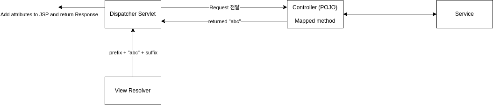
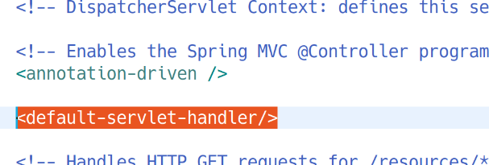

# Spring Web MVC 프로젝트 구경

## web.xml

이 파일에는 DispatcherServlet에 대한 설정 정보가 들어가있다.

```xml
<!-- Processes application requests -->
<servlet>
    <servlet-name>appServlet</servlet-name>
    <servlet-class>org.springframework.web.servlet.DispatcherServlet</servlet-class>
    <init-param>
        <param-name>contextConfigLocation</param-name>
        <param-value>/WEB-INF/spring/appServlet/servlet-context.xml</param-value>
    </init-param>
    <load-on-startup>1</load-on-startup>
</servlet>

<servlet-mapping>
    <servlet-name>appServlet</servlet-name>
    <url-pattern>/</url-pattern>
</servlet-mapping>
```

DispatcherServlet을 appServlet이라는 이름으로 등록하고 '/'에 맵핑하고 있다. DispatcherServlet은 스프링이 제공하는 클래스임을 볼 수 있다.

서블릿은 DispatcherServlet 단 한계만 사용하고, 모든 클라이언트 요청을 받아서 URL에 따라 POJO 컨트롤러에 Request를 전달해주는 것이다.

## servlet-context.xml


```xml
<!-- Resolves views selected for rendering by @Controllers to .jsp resources in the /WEB-INF/views directory -->
<beans:bean class="org.springframework.web.servlet.view.InternalResourceViewResolver">
    <beans:property name="prefix" value="/WEB-INF/views/" />
    <beans:property name="suffix" value=".jsp" />
</beans:bean>
```

ViewResolver는 핸들러(컨트롤러)로부터 String이 리턴되는 경우 DispatcherServlet이 호출한다. 그럼 ViewResolver는 위의 설정에 따라 전달된 문자열에 해당하는 jsp를 찾아준다. 예컨대 abc라는 문자열이 리턴된 경우, 위에서 설정해준 prefix와 suffix에 따라, /WEB-INF/views/abc.jsp 파일을 찾아주게 되는 것이다.




```xml
<!-- Handles HTTP GET requests for /resources/** by efficiently serving up static resources in the ${webappRoot}/resources directory -->
<resources mapping="/resources/**" location="/resources/" />
```

정적 리소스의 경로를 맵핑하는 설정이다.

예컨대, test.html이라는 정적 리소스를 서비스하고 싶다면, 설정에 따라 /resources/에 파일을 위치시키고, (location="/resources/")  
http://localhost:8080/springweb/resources/test.html으로 요청을 하면 된다. (mapping="/resources/**")

그런데, web.xml에서

```xml
<!-- Processes application requests -->
<servlet>
    <servlet-name>appServlet</servlet-name>
    <servlet-class>org.springframework.web.servlet.DispatcherServlet</servlet-class>
    <init-param>
        <param-name>contextConfigLocation</param-name>
        <param-value>/WEB-INF/spring/appServlet/servlet-context.xml</param-value>
    </init-param>
    <load-on-startup>1</load-on-startup>
</servlet>
```

DispatcherServlet을 모든 요청 URL에 맵핑해놨으므로, /resources/test.html 요청도 DispatcherServlet에 맵핑된다. 따라서 이를 방지해주기 위해 servlet-context.xml에 아래를 추가한다.



&nbsp;

**\<default-servlet-handler/>**

DispatcherServlet(프론트 컨트롤러)이 요청을 받은 후 요청 URL에 맵핑된 핸들러가 없다면 기본적으로 오류가 발생.

그러나 \<default-servlet-handler/>가 설정되어 있다면 DispatcherServlet의 뒤에 DefaultServlet이 생기고, DispatcherServlet가 핸들러를 찾지 못하면 DefaultServlet으로 요청이 전달된다. DefaultServlet이 요청 URL이 처리할 수 있는 경우 리스폰스를 반환하고, DefaultServlet 조차 처리할 수 없는 경우 오류가 발생하게 된다.

## HomeController

```java
/**
 * Handles requests for the application home page.
 */
@Controller
public class HomeController {
	
	private static final Logger logger = LoggerFactory.getLogger(HomeController.class);
	
	/**
	 * Simply selects the home view to render by returning its name.
	 */
	@RequestMapping(value = "/", method = RequestMethod.GET)
	public String ㅏㅗㅠㅑ(Locale locale, Model model) {
		logger.info("Welcome home! The client locale is {}.", locale);
		
		Date date = new Date();
		DateFormat dateFormat = DateFormat.getDateTimeInstance(DateFormat.LONG, DateFormat.LONG, locale);
		
		String formattedDate = dateFormat.format(date);
		
		model.addAttribute("serverTime", formattedDate );
		
		return "home";
	}
	
}
```

**Model?**

핸들러는 인자로 Model 객체를 받을 수 있다. (원하지 않는 경우 메서드 선언시 인자를 넣지 않으면 된다)

Model 객체를 받도록 명시하여 메서드를 선언하면, Servlet Web ApplicationContext가 주입해준다.

Model 객체는 서블릿에서 Request 객체를 활용했던 방식과 유사하게 사용할 수 있다. model에 값을 세팅(addAttribute)해주면 JSP에서 그 값을 꺼내서 쓸 수 있다. 따로 포워딩 처리를 하지 않아도 JSP에서 model에 접근할 수 있다.

스코프는 Request 스코프이다. 요청이 들어오면 생기고, 처리가 끝나면 소멸한다.

```java
model.addAttribute("Key", value);
```

Locale은 클라이언트의 로케일을 담고 있다. 역시 자동으로 주입되며, 필요 없는 경우 선언시 명시하지 않으면 된다.

Request 객체 자체를 주입받을 수도 있다.

```java
public String home(Locale locale, Model model, HttpServletRequest request) {
    
// 후략
```

신기방기…


## JSP - EL(Expression Language)

```jsp
<P>  The time on the server is ${serverTime}. </P>
<P>  The time on the server is <%= request.getAttribute("serverTime") %>. </P>
```

모델 안에 있는 값을 가져오려면 EL을 사용해야 함

