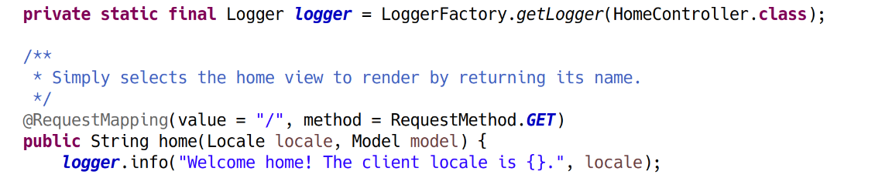

# Spring Web MVC 매커니즘

## 기존 서블릿 구조


요청마다 서블릿 작성 필요.

서블릿 관리가 힘들어지고, 한글처리 등 중복 코드가 생긴다는 단점이 있음

## 프론트 컨트롤러 패턴


하나의 컨트롤러로 모든 요청을 받고, 해당 컨트롤러가 조건에 맞게 개별 로직에 요청 전달

이전처럼 순수 서블릿을 다뤄도 활용할 수 있는 구조. 스프링에서는 DispatcherServlet이 이 역할 수행.

새로운 컨트롤러를 만들 때 서블릿 만들 필요가 없어짐. 개별 로직은 POJO로 만들 수 있으므로 서블릿보다 상속 등의 측면에서 훨씬 유연하고 확장성이 높음.

## 스프링 프레임워크의 요청 처리 방식

### 전체적인 그림


\* [바로잡기] 단지 존재 여부를 확인하는 것이 아니다. 요청처리를 담당할 컨트롤러를 맵핑하는 작업까지 수행

### 세부 과정


### HandlerMapping Interface

위 과정의 handler mapping의 정체는 HandlerMapping이라는 인터페이스이다. 스프링은 그 구현체로 4가지 클래스를 제공하고 있다. 그러나 보통은 기본적으로 사용하는 한 개만 기억하여 사용하면 된다. ⇒ **RequestMappingHandlerMapping** 

이를 사용하기 때문에 @RequestMapping 어노테이션을 사용하게 되는 것이다.


다른 구현체보다 사용하기 좋은 이유는 클래스 내의 여러 메서드 개개를 맵핑하여 핸들러로 지정할 수 있다는 것이다. 다른 구현체는 클래스에 대해 핸들러로 지정하게 되므로 불편하다.

### HandlerAdaptor Interface

위 과정의 handler adaptor 역시 인터페이스로 되어 있으며, 구현체로 RequestMappingHandlerAdapter를 많이 사용한다.

### View 객체

View Interface를 구현한 객체를 지칭한다. MVC에서의 논리적인 View를 말하는 것이 아니라, 실제 객체를 말하는 것이다.

View 객체는 Model이 가진 정보를 어떻게 표현해야하는 지에 대한 로직을 가지고 있는 컴포넌트이다.

실제로 사용자에게 전송할 리스폰스는 JSP뿐 아니라 JSON 혹은 이미지나 영상과 같은 파일일 수도 있다. 따라서 View라는 인터페이스를 구현한 클래스가 여러 개 제공된다.

- InernalResourceView: 가장 대표적인 뷰 클래스. JSP를 보여줄 때 사용된다.

위의 다이어그램에서는 컨트롤러가 String을 반환하여 리졸버를 통해 JSP를 찾아 리스폰스를 전송하는 일반적인 과정을 나타냈다. 그러나 실제로 컨트롤러가 직접 View 객체를 만들 수도 있다. 결론적으로 DispatcherServlet이 리스폰스를 전송하기 전에 View 객체를 가지고 있게 하면 된다.

```java
// 컨트롤러 내부
// 전략
View view = new InternalResourceView("sample.jsp");
return new ModelAndView(view, model); // 디스패쳐 서블릿에 반환. 뷰 뿐 아니라 모델도 같이 반환해준다.
```

#### 리다이렉트

서블릿이라면 response.sendRedirect()를 통해 리다이렉트 리스폰스를 보낼 수 있었다. 그러나 스프링의 컨트롤러에서는 response의 직접 사용하기 보다는, RedirectView 객체를 반환하면 된다.

```java
new ModelAndView(new RedirectView(), model);
```

서블릿처럼 스트림을 직접 열어 리스폰스를 주는 것이 아니라, 뷰 객체를 통해 리스폰스를 다루게 되는 것이다.

InernalResourceView나 RedirectView 외에도 여러 View 구현체가 있다.

- MarshallingView: XML 리스폰스
- MappingJacksonJsonView: JSON 리스폰스

## 로거

sysout은 이제 쓰지 않는다. 배포하기 전에 지우는 것이 번거롭기도 할 뿐더러 퍼포먼스에도 앙영향.

당장은 log4j 1버전대를 사용한다.



컨트롤러 클래스를 작성할 때 private static final로 Looger 필드를 잡고 할당.

