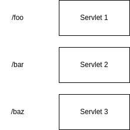
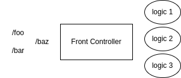
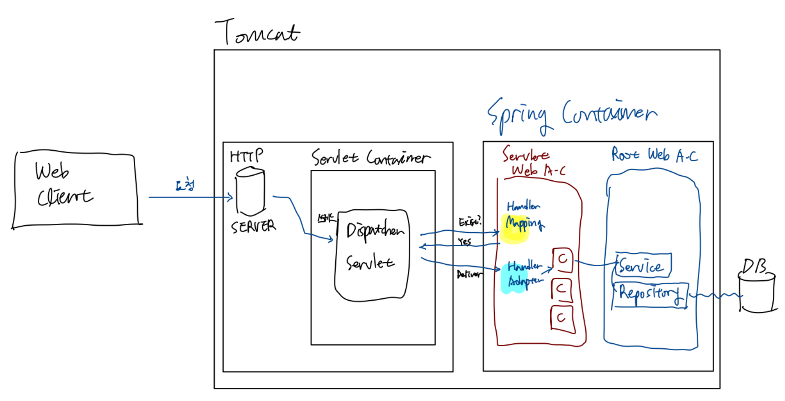
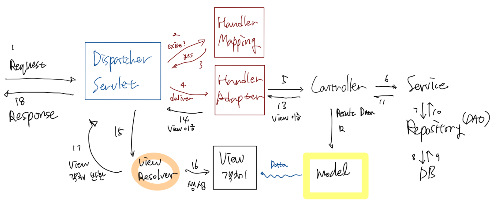
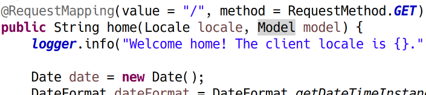

# 제목1

## 기존 서블릿 구조

요청마다 서블릿 작성 필요.

서블릿 관리가 힘들어지고, 한글처리 등 중복 코드가 생긴다는 단점이 있음

## 프론트 컨트롤러 패턴

하나의 컨트롤러로 모든 요청을 받고, 해당 컨트롤러가 조건에 맞게 개별 로직에 요청 전달

이전처럼 순수 서블릿을 다뤄도 활용할 수 있는 구조. 스프링에서는 DispatcherServlet이 이 역할 수행.

새로운 컨트롤러를 만들 때 서블릿 만들 필요가 없어짐. 개별 로직은 POJO로 만들 수 있으므로 서블릿보다 상속 등의 측면에서 훨씬 유연하고 확장성이 높음.

## 스프링 프레임워크의 요청 처리 방식

### 전체적인 그림

### 세부 과정

### HandlerMapping Interface

위 과정의 handler mapping의 정체는 HandlerMapping이라는 인터페이스이다. 스프링은 그 구현체로 4가지 클래스를 제공하고 있다. 그러나 보통은 기본적으로 사용하는 한 개만 기억하여 사용하면 된다. ⇒ **RequestMappingHandlerMapping** 

이를 사용하기 때문에 @RequestMapping 어노테이션을 사용할 수 있는 것이다.

다른 구현체보다 사용하기 좋은 이유는 클래스 내의 여러 메서드 개개를 맵핑하여 핸들러로 지정할 수 있다는 것이다. 다른 구현체는 클래스에 대해 핸들러로 지정하게 되므로 불편하다.

