# Spring Web MVC 실습 1

1. log4j (일단 version 1.x)
2. @Controller
3. @RequestMapping
4. InternalResourceView
    - JSP를 보내줄 때 주로 이 클래스를 사용
5. Model
    - Request Scope 안에 존재한다는 것을 이해하기
6. ModelAndView
    - 가장 대표적으로 컨트롤러 단에서 DispatcherServlet으로 리턴 가능한 클래스
7. EL(Expression Language), JSTL
    - EL: JSP에서 Expressions 대신 사용
    - JSTL: JSP에서 스크립트렛 대신 사용

## @Controller 및 @RequestMapping

특정 클래스가 Controller 빈임을 나타내줌.

### 실습: sample01

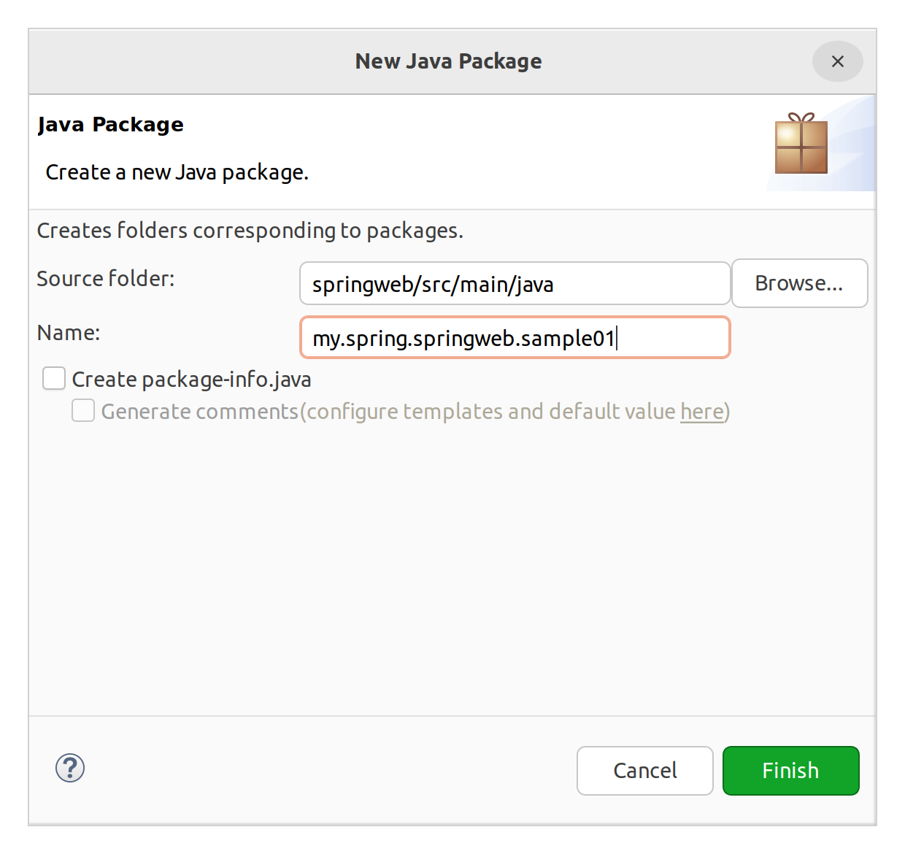

```java
package my.spring.springweb.sample01;

import org.slf4j.Logger; // 1버전대 인터페이스. 요걸로 잡는다. 
import org.slf4j.LoggerFactory;
import org.springframework.stereotype.Controller;
import org.springframework.web.bind.annotation.RequestMapping;
import org.springframework.web.bind.annotation.RequestMethod;

@Controller
public class TestController01 {

	private static final Logger logger = 
			LoggerFactory.getLogger(TestController01.class); // 로거 사용
	
	// http://localhost:8080/springweb + 뒤에 나올 꺼
	// http://localhost:8080/springweb/testController01
	@RequestMapping(value="/testController01", method=RequestMethod.GET) // '/' 생략 가능
	void myMethod() {
		logger.debug("[GET] /springweb/testController01"); // 원하는 레벨의 메서드 호출
	}
}
```

http://localhost:8080/springweb/testController01에 접속하면 아래와 같은 화면이 표시되고,

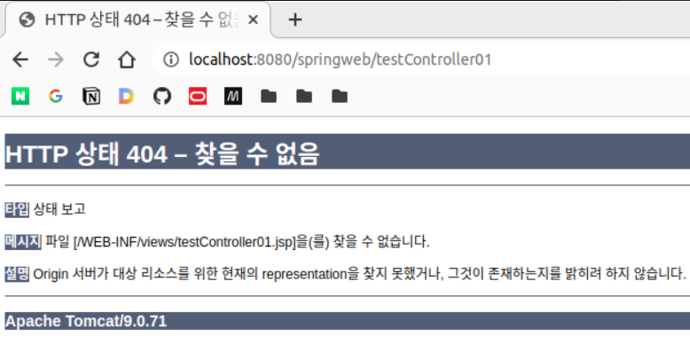

콘솔에는 로그가 표시된다.

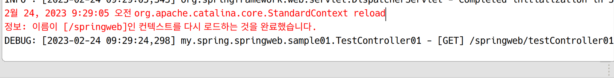

404가 리턴된 것은 컨트롤러에서 아무 것도 리턴하지 않았기 떄문이다. 컨트롤러가 아무것도 리턴하지 않으면, DispatchServlet에는 해당 컨트롤러가 맵핑된 URL이 전달된다. 즉, 위의 경우 /testController01이다.  
그럼 ViewResolver를 통해 prefix + testController01 + suffix의 경로에서 JSP를 찾게 되는데, 우리는 그런 JSP를 만들지 않았으므로, 404 Not Found를 리스폰스로 전달하는 것이다.

그럼 webapp/views에 testController01.jsp를 만들어주면 알아서 찾아서 보여주게 된다. 파일을 만들고, jstl taglib를 추가한다. el은 이미 JSP 스펙에 들어가 있으므로 따로 추가하지 않아도 사용할 수 있다.

```jsp
<%@ page language="java" contentType="text/html; charset=UTF-8"
    pageEncoding="UTF-8"%>
<%@ taglib uri="http://java.sun.com/jsp/jstl/core" prefix="c" %>
<!DOCTYPE html>
<html>
<head>
<meta charset="UTF-8">
<title>Insert title here</title>
</head>
<body>
	<h1>소리없는 아우성</h1>
</body>
</html>
```

아래와 같이 jsp 내용이 잘 표시되며, 로그도 잘 보인다.

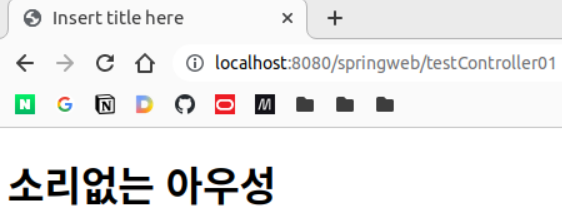

이렇게 스프링에서는 서블릿보다 자동으로 해주는 경우가 많다. 리턴될 문자열을 명시하여 원하는 JSP가 표시되도록 할지, 아니면 리턴하지 않고 맵핑된 URL에 해당하는 JSP를 자동으로 찾아가게 할지는 알아서 결정해야 한다.

위의 핸들러는 아래와 같이 써도 같은 동작을 한다.

```java
@RequestMapping(value="/testController01", method=RequestMethod.GET) // '/' 생략 가능
String myMethod() {
    logger.debug("[GET] /springweb/testController01"); // 원하는 레벨의 메서드 호출

    return "testController01";
}
```

보통은 기본 경로로 JSP를 위치시킨다고 하더라도 위처럼 명시적인 스트링을 리턴해주는 것이 일반적이다.

&nbsp;

**JSP나누기**

그러나 위의 방법대로 하면 JSP 파일들이 views에 같이 위치하게 되어 복잡해진다. sample01 디렉토리를 views에 만들고 JSP를 옮긴다. return 문자열을 "sample01/testController01"로 바꾼다.

&nbsp;

**\#**
smaple01 패키지 아래에 TestController02 클래스를 만든다.

```java
package my.spring.springweb.sample01;

import org.slf4j.Logger;
import org.slf4j.LoggerFactory;
import org.springframework.stereotype.Controller;
import org.springframework.web.bind.annotation.RequestMapping;

@Controller
public class TestController02 {

	private static final Logger logger = 
			LoggerFactory.getLogger(TestController02.class);
	
	@RequestMapping("/testController02/info")
	String myMethod01() {
		logger.debug("[GET] testController02/info");
		return "sample01/testController02";
	}
	
	@RequestMapping("/testController02/profile")
	String myMethod02() {
		logger.debug("[GET] testController02/profile");
		return "sample01/testController02";
	}
}

```

서블릿과 달리 하나의 컨트롤러 클래스 내에 여러 URL로 맴핑된 여러 메서드가 들어갈 수 있다.

views/sample01/testController02.jsp를 작성하고 URL로 접속하여 테스트하면 잘 작동한다.

그런데 /testController02/ 부분은 각 메서드에 대해 공통이다. 이렇게 공통되는 부분에 대해서는 클래스에 @RequestMapping을 붙여 맵핑해주고, 그 하위 URL을 각 메서드에 맵핑해줄 수 있다.

```java 
@Controller
@RequestMapping("/testController02")
public class TestController02 {

	private static final Logger logger = 
			LoggerFactory.getLogger(TestController02.class);
	
	@RequestMapping("/info")
	String myMethod01() {
		logger.debug("[GET] testController02/info");
		return "sample01/testController02";
	}
	
	@RequestMapping("/profile")
	String myMethod02() {
		logger.debug("[GET] testController02/profile");
		return "sample01/testController02";
	}
}
```

&nbsp;

한 메서드에 대해서 여러 URL을 맵핑할 수 있다.

```java
@Controller
@RequestMapping("/testController02")
public class TestController02 {
    
    // 전략

    @RequestMapping(value = {"", "test01", "test02", "test03/*"})
    // /testController02, /testController02/test01, /testController02/test02, /testController02/test03/*
    String myMethod03() {
        logger.debug("[GET] testController02 다중 URL 맵핑");
        return "sample01/testController02";
    }
    
    // 후략
```

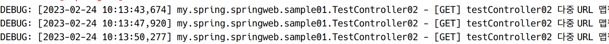

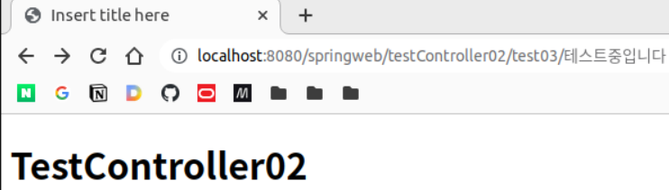

&nbsp;

**\#**

같은 URL에 대해서 다른 메서드를 각각 처리하려면 아래처럼 하면 된다.

```java
@Controller
@RequestMapping(value="/testController03")
public class TestController03 {

	private static final Logger logger = 
			LoggerFactory.getLogger(TestController03.class);
	
	@RequestMapping(value = "", method = RequestMethod.GET) // 같은 URL, 다른 메서드
	String myMethod1() {
		return null;
	}
	
	@RequestMapping(value = "", method = RequestMethod.POST)
	String myMethod2() {
		return null;
	}
}
```

&nbsp;

**\#**

보통은 @RequestMapping은 클래스에만 붙인다. 메서드에는 @GetMapping, @PostMapping을 붙일 수 있다.

```java
// @RequestMapping은 클래스 레벨에서 사용하는 것이 일반적
@Controller
@RequestMapping(value="testController04")
public class TestController04 {

	private static final Logger logger = 
			LoggerFactory.getLogger(TestController04.class);
	
	@GetMapping
	String myMethod01() {
		logger.debug("TestController04 Listening to a GET request...");
		return "sample01/testController04";
	}
	
	@PostMapping(value="/test001")
	String myMethod02() {
		logger.debug("TestController04 Listening to a POST request...");
		return "sample01/testController04";
	}
}
```

JSP를 만들고 브라우저로 접속하여 테스트해본다. 잘된다.

&nbsp;

**\#**  
**파라미터 받기**

GET 방식 요청을 처리할 때 쿼리스트링을 처리하는 법

```java
package my.spring.springweb.sample01;

import org.slf4j.Logger;
import org.slf4j.LoggerFactory;
import org.springframework.stereotype.Controller;
import org.springframework.web.bind.annotation.GetMapping;
import org.springframework.web.bind.annotation.RequestMapping;

import my.spring.springweb.HomeController;

@Controller
@RequestMapping(value="/testController05")
public class TestController05 {
	
	private static final Logger logger =
			LoggerFactory.getLogger(TestController05.class);
	
//	@GetMapping
//	String myMethod1() {
//		logger.debug("TestController05 Listening to a GET request...");
//		return "sample01/testController05";
//	}
	
	@GetMapping(params="myName") // 파라미터 중 myName이라는 파라미터가 있으면 호출
	String myMethod2() {
		logger.debug("TestController05 Listening to a GET request with myName param...");
		return "sample01/testController05";
	}
}

```

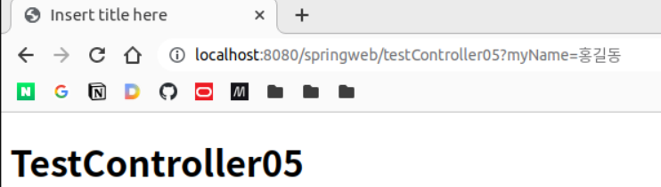

```
DEBUG: [2023-02-24 10:42:10,374] my.spring.springweb.sample01.TestController05 - TestController05 Listening to a GET request with myName param...
```

다른 파라미터를 주면 404오류가 표시되며, 콘솔에 경고가 발생한다.

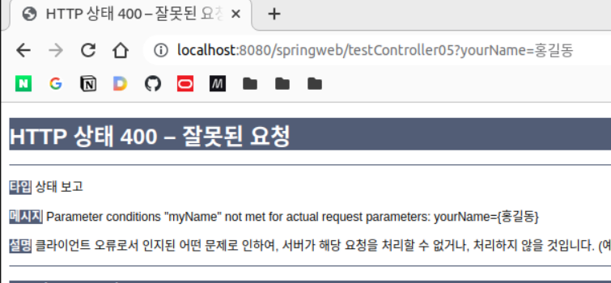

```
WARN : [2023-02-24 10:44:42,758] org.springframework.web.servlet.mvc.support.DefaultHandlerExceptionResolver - Resolved [org.springframework.web.bind.UnsatisfiedServletRequestParameterException: Parameter conditions "myName" not met for actual request parameters: yourName={홍길동}]
```

다음과 같이 특정 패러미터의 값에 맵핑할 수도 있다.

```java
@GetMapping(params="myName") // 파라미터 중 myName이라는 파라미터가 있으면 호출
String myMethod2() {
    logger.debug("TestController05 Listening to a GET request with myName param...");
    return "sample01/testController05";
}

@GetMapping(params="myName=신사임당") // 파라미터 중 myName이라는 파라미터가 있으면 호출
String myMethod3() {
    logger.debug("TestController05 Listening to a GET request with myName param=신사임당...");
    return "sample01/testController05";
}
```

http://localhost:8080/springweb/testController05?myName=홍길동 접속시 ⇒  
```
DEBUG: [2023-02-24 10:47:02,691] my.spring.springweb.sample01.TestController05 - TestController05 Listening to a GET request with myName param...
```

http://localhost:8080/springweb/testController05?myName=신사임당 접속시 ⇒  
```
DEBUG: [2023-02-24 10:47:49,870] my.spring.springweb.sample01.TestController05 - TestController05 Listening to a GET request with myName param=신사임당...
```

이 경우 @GetMapping(params="myName")과 @GetMapping(params="myName=신사임당")에 모두 해당되는 경우이지만, 더 상세한 조건까지 일치하는 @GetMapping(params="myName=신사임당")이 붙은 메서드가 호출되는 것을 볼 수 있다. 모호하므로 권장되는 방법은 아니다.

## InternalResourceView

뷰 리졸버 설정을 다시 보자.

```xml
<beans:bean class="org.springframework.web.servlet.view.InternalResourceViewResolver">
		<beans:property name="prefix" value="/WEB-INF/views/" />
		<beans:property name="suffix" value=".jsp" />
</beans:bean>
```

자세히 보면 InternalResourceViewResolver에 대한 설정이다. 즉, 핸들러가 스트링을 리턴하여 뷰 리졸버가 호출될 때에도 사실 리졸버가 InternalResourceView를 만들어 전달해주는 것이라고 보면 된다.

이번에는 직접 뷰 객체를 만들어 DispatcherServlet에 전달해주려고 한다.

### 실습: sample01

우선 webapp/resouces에 미리 폴더를 만든다.

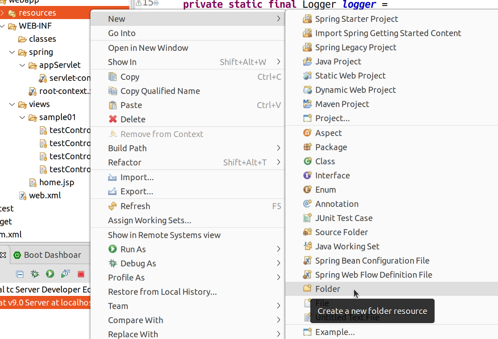

HTML은 sample01이라는 폴더를 만들어 저장하도록 하겠다.

```java
@Controller
@RequestMapping(value="testController06")
public class TestController06 {
	
	private static final Logger logger =
			LoggerFactory.getLogger(TestController06.class);
	
	public TestController06() {
		logger.debug("빈 생성됨");
	}
	
	// HTML
	@GetMapping
	public ModelAndView showStaticView() {
		logger.debug("TestController06");
		
		// HTML의 경우 webapp 하위부터 절대 경로를 이용하는 것이 편리
		InternalResourceView view = 
				new InternalResourceView("/resources/sample01/testController06.html"); // /resources... '/' 빠지면 안됨
		
		ModelAndView mav = new ModelAndView(view); // 모델은 없으면 안써도 됨. 혹은 선언부에 Model을 명시에서 주입받아도 됨
		
		return mav;
	}
}

```

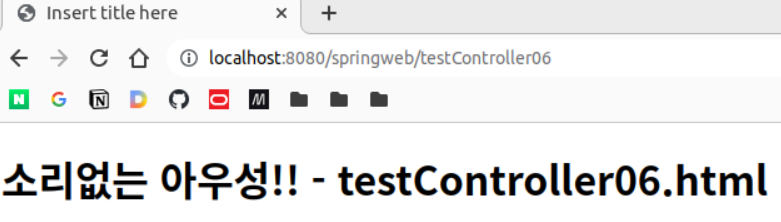

http://localhost:8080/springweb/resources/sample01/testController06.html로 요청해도 같은 HTML이 보이게 된다.

```xml
<default-servlet-handler/>

<!-- Handles HTTP GET requests for /resources/** by efficiently serving up static resources in the ${webappRoot}/resources directory -->
<resources mapping="/resources/**" location="/resources/" />
```

servlet-context.xml에 위와 같은 설정이 되어 있기 때문에, DispatcherServlet이 /resuorces/** 요청을 처리하지 못하므로 DefaultServlet에게 요청을 전달하고, resources 폴더에서 파일을 찾아 전송해주게 되는 것이다.


## Model 및 ModelAndView

### 실습: sample01

```java
@Controller
@RequestMapping(value="/testController07")
public class TestController07 {
	
	private static final Logger logger =
			LoggerFactory.getLogger(TestController07.class);
	
	@GetMapping
	public String myMethod1(Model model) { // ApplicationContext에 의해 Model 객체가 주입됨
		
		logger.debug("TestController07");
		
		// model은 key:value 형태로 데이터를 저장하는
		// 맵과 유사한 자료구조
		
		model.addAttribute("myName", "홍길동");
		model.addAttribute("myAge", 20);
		
		return "sample01/testController07";
	}
}
```

&nbsp;

**views/sample01/testController07.jsp**

```jsp
<%@ page language="java" contentType="text/html; charset=UTF-8"
    pageEncoding="UTF-8"%>
<%@ taglib uri="http://java.sun.com/jsp/jstl/core" prefix="c" %>
<!DOCTYPE html>
<html>
<head>
<meta charset="UTF-8">
<title>Insert title here</title>
</head>
<body>
	<h1>TestController07</h1>
	
	<h2>모델 속 데이터</h2>
	<ul>
		<li>이름: ${myName}</li>
		<li>나이: ${myAge}</li>
	</ul>
</body>
</html>
```

모델에 저장된 데이터를 추출하기 위해 EL을 사용했다.

기본 꼴은 ${  }이다. 괄호 내에 모델 속 데이터의 key를 적는다. Model 객체 자체에 접근하는 것이 아니라는게 중요하다. Model 객체는 RequestScope 안에 묶여있고, EL은 RequestScope 내의 객체를 통쨰로 검색하기 때문이다.

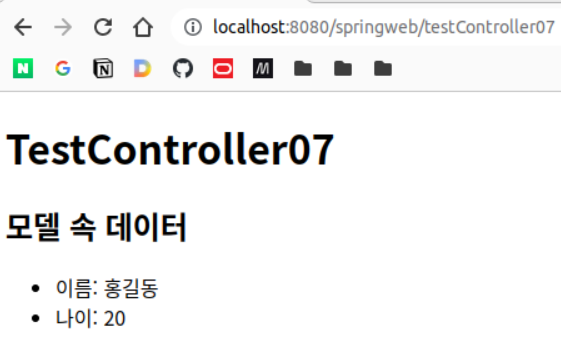

## EL(Expression Language)

JSP 2.0부터 표준으로 도입되었다.

Expression(<%= %>) 문법을 대체할 수 있다. 가독성 상승에 큰 도움이 된다.

Scriptlet(<% %>)은 JSTL로 대체할 수 있다.

&nbsp;

**기본 꼴**

```
${ name }
```

괄호 내에 읽어올 데이터의 key 값을 넣는다. 그럼 해당하는 key의 밸류를 pageScope, requestScope, sessionScope, applicationScope에서 순차적으로 찾아 반환해준다.

여러 스코프에 중복된 key 이름이 있는 경우, 앞 스코프의 값이 반환된다.  
예> requestScope와 sessionScope 모두에 myName이 있다면 ${ myName }에 requestScope의 myName 값이 들어간다.

각각의 스코프에는 대표 객체들이 있다.
- pageScope: pageContent 객체
- requestScope: request 객체, **model 객체**
- sessionScope: session 객체
- applicationScope: Servlet Context 객체. (톰캣에서 모든 서블릿이 공유)

기본 서블릿과 다르게 스프링 프레임워크에서는 requestScope에 model 객체도 포함된다.  
때문에 앞선 예제에서 model 객체에 담은 값을 JSP에서 EL로 가져왔던게 가능했던 이유가 이와 같다.

편리하지만 다수의 스코프를 한 번에 다루기 때문에 동시에 모호하기도 하다. 대신 EL은 특정 스코프를 명시할 수 있는 방법을 제공한다. 아래와 같이 하면 된다.

```
${ scopeName.name }

예> ${ sessionScope.userId }
```

이렇게 하면 스코프를 순환하지 않고 특정 스코프에서만 값을 찾는다.

### 실습: sample01

POST로 전송한 값을 읽어와 model 객체에 넣고, JSP에서 값을 EL을 통해 가져와보자. 또 테스트겸 다양한 데이터를 model 객체에 넣어 읽어와보자.

```HTML
<!-- resources/sample01/testController08.html -->
<!DOCTYPE html>
<html>
<head>
<meta charset="UTF-8">
<title>Insert title here</title>
</head>
<body>
	<h1>EL에 대해 알아보자</h1>
	<form action="/springweb/testController08/useEL" method="post">
		이름: <input type="text" name="userName"><br>
		나이: <input type="number" name="userAge">
		<button type="submit">전송</button>
	</form>
</body>
</html>
```

vo 값도 모델을 통해 전달해보자. 우선 vo 패키지를 만들고 User 클래스를 생성한다.

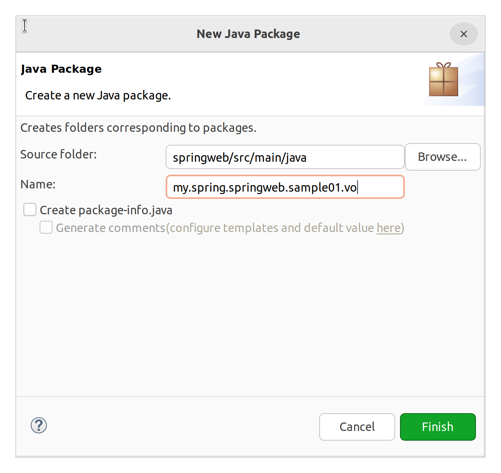

**sample1.vo.User**

```java
package my.spring.springweb.sample01.vo;

public class User {

	private String userName;
	private int userAge;
	
	public User() {
	}

	public User(String userName, int userAge) {
		super();
		this.userName = userName;
		this.userAge = userAge;
	}

	public String getUserName() {
		return userName;
	}

	public void setUserName(String userName) {
		this.userName = userName;
	}

	public int getUserAge() {
		return userAge;
	}

	public void setUserAge(int userAge) {
		this.userAge = userAge;
	}
}
```

VO는 자바 빈 객체라고도 한다.

> 자바 빈 규약  
> 1. 기본 생성자가 존재해야 한다.  
> 2. 모든 Field는 private이어야 한다.  
> 3. 각 Filed에는 public 메서드인 getter, setter를 이용해 접근해야 한다.  
> 이때 자바 빈 객체의 필드를 프로퍼티property라고 부른다.

일반적으로 저기에 toString이나 equals도 오버라이딩 하는 경우가 있다.

&nbsp;

**sample1.TestController08**

```java
package my.spring.springweb.sample01;

import java.util.ArrayList;
import java.util.List;

import org.slf4j.Logger;
import org.slf4j.LoggerFactory;
import org.springframework.stereotype.Controller;
import org.springframework.ui.Model;
import org.springframework.web.bind.annotation.PostMapping;
import org.springframework.web.bind.annotation.RequestMapping;

import my.spring.springweb.sample01.vo.User;

@Controller
@RequestMapping(value="/testController08")
public class TestController08 {

	private static final Logger logger =
			LoggerFactory.getLogger(TestController08.class);
	
	@PostMapping("useEL")
	public String myMethod(Model model) {
		
		model.addAttribute("myNmae", "홍길동");
		model.addAttribute("myAge", 20);
		
		List<String> list = new ArrayList<String>();
		list.add("강감찬");
		list.add("신사임당");
		
		model.addAttribute("myList", list);
		
		User user = new User("이순신", 40);
		model.addAttribute("myUser", user);
		
		return "sample01/testController08";
	}
}
```


&nbsp;

**views/smaple01/testController08.jsp**

```jsp
<%@ page language="java" contentType="text/html; charset=UTF-8"
    pageEncoding="UTF-8"%>
<%@ taglib uri="http://java.sun.com/jsp/jstl/core" prefix="c" %>
<!DOCTYPE html>
<html>
<head>
<meta charset="UTF-8">
<title>Insert title here</title>
</head>
<body>
	<h1>testController08.jsp</h1>
	
	EL을 이용해 데이터를 추출
	
	<ol>
		<li>일반 값
			<ul>
				<li>문자열 출력 1: ${ "test" }</li> <!-- test -->
				<li>문자열 출력 2: ${ 'test' }</li> <!-- test -->
				<li>수 출력: ${ 3.141592 }</li> <!-- 3.141592 -->
				<li>논리값 출력: ${ true }</li> <!-- true -->
				<li>널 출력: ${ null }</li> <!-- (아무 것도 출력 안됨) -->
			</ul>
		</li>
		<li>model 객체의 값
			<ul>
				<li>리스트의 특정 값 출력: ${ myList[1] }</li>
				<li>Java Bean (VO): ${ myUser.userName }</li>
				<li>일반 맵: ${ myName }</li>
			</ul>
		</li>
	</ol>
</body>
</html>
```

우선 패러미터를 다루기 전에, EL 표현법 예제를 작성해보았다.

추가적으로, EL에서 내장 객체를 사용할 수 있다.

1. pageScope
2. requestScope
3. sessionScope
4. applicationScope

위의 네 가지는 특정 스코프에 접근하고자 할 때 사용하는 내장객체이다.

5. param

param은 client request parameter의 이름과 값을 가지고 있는 내장 객체이다.

다음과 같이 요청으로 메서드로 넘어온 패러미터에 접근할 수 있다.

```jsp
<li>param 내장 객체의 값
    <ul>
        <li>이름: ${ param.userName }</li>
        <li>나이: ${ param.userAge }</li>
    </ul>
</li>
```

6. 헤더

HTTP 헤더에도 접근 가능하다.  
주로 referer 헤더 등을 활용한다. 뒤로가기 기능 구현 가능

```jsp
<li>header 내장 객체의 값
    <ul>
        <li>referer: ${ header.referer }</li>
        <li><a href=${ header.referer }>뒤로가기</a></a></li>
    </ul>
</li>
```

7. 쿠키

&nbsp;

http://localhost:8080/springweb/resources/sample01/testController08.html로 접속하여 테스트

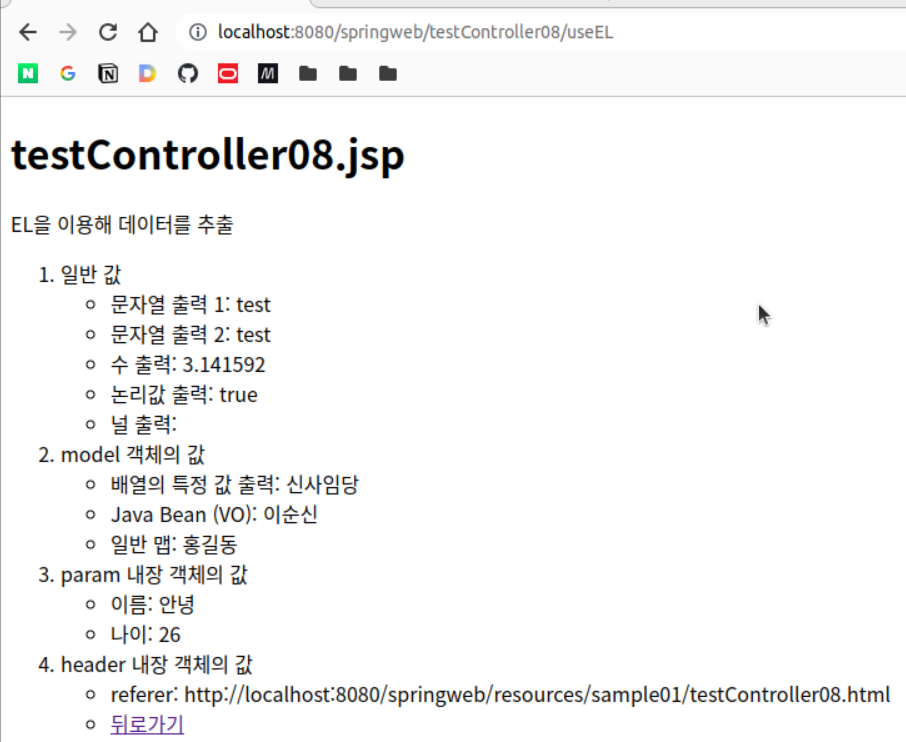


**#**  
EL에서의 연산

1. 산술연산

```jsp
<li>산술연산
    <ul>
        <li>userAge + 20: ${ param.userAge + 20 }</li>
    </ul>
</li>
```

2. 논리연산

&&, ||, !

```jsp
<li>논리연산
    <ul>
        <li>!false: ${ !false }</li>
    </ul>
</li>
```

3. 비교연산

==, !=, \<, …

```jsp
<li>비교연산
    <ul>
        <li>유저의 나이가 20세 미만인가?: ${ param.userAge < 20 }</li>
    </ul>
</li>
```

4. 삼항연산자

conditional_expression ? return_when_true : return_when_false

```jsp
<li>삼항연산자
    <ul>
        <li>유저가 미성년자인가: ${ param.userAge < 20 ? "미성년자" : "성인" }</li>
    </ul>
</li>
```

5. empty 연산

empty "문자열"  
⇒ 공백이면 true

empty null ⇒ true

empry 빈_리스트 ⇒ true

```jsp
<li>empty 연산자
    <ul>
        <li>"": ${ empty "" }</li>
        <li>"abcd": ${ empty "abcd" }</li>
        <li>null: ${ empty null }</li>
        <li>myList: ${ empty myList }</li>
        <li>{}: ${ empty {} }</li>
    </ul>
</li>
```

이러한 연산 결과는 JSTL과 결합하여 로직에 이용될 수 있다.

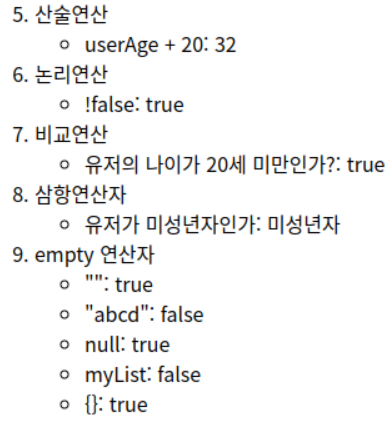


