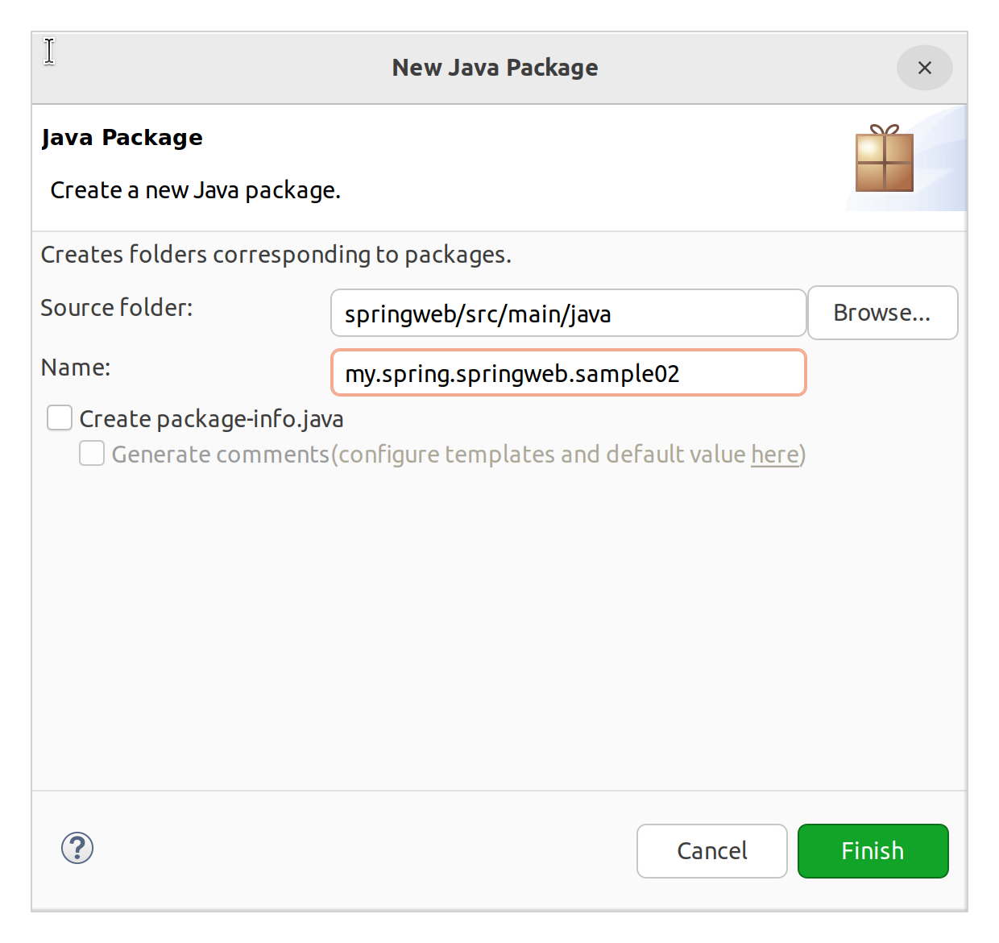
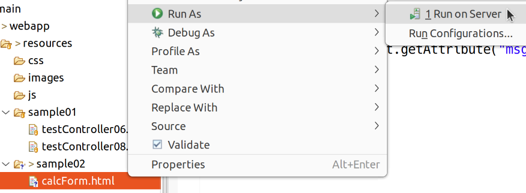

# Spring Web MVC 실습 2

## 실습 목표

### 파라미터 가져오기

일반 서블릿 개발에서는 아래와 같이 파라미터를 가져올 수 있었다.

```java
request.getParamenter("myNmae");
```

그러나 스프링에서 우리가 작성하는 컨트롤러는 서블릿이 아닌, 일반 클래스, 즉 POJO이다. 스프링이 제공해주는 다른 방식을 사용해야 할 것이다.

### ModelAndView 더 자세히

또한 ModelAndView에 대해 더 자세히 공부해본다.


## 실습 방법

이 실습에서는 sample02 패키지를 만들어 진행한다.



resources 아래에 HTML이 들어갈 sample02 폴더도 만든다.


## 실습

**resources/sample02/calcForm.html**

```html
<!DOCTYPE html>
<html>
<head>
<meta charset="UTF-8">
<title>Insert title here</title>
</head>
<body>
	<h1>연산할 두 개의 숫자를 입력하고 연산자를 선택하십시오.</h1>
	<br><br>
	
	<form action="/springweb/calc.do" method="post">
		<input type="number" name="firstNum" required="required">
		<select name="operator">
			<option value="plus"> + </option>
			<option value="minus"> - </option>
			<option value="multi"> * </option>
			<option value="div"> / </option>
		</select>
		<input type="number" name="secondNum" required="required">
		<br><br>
		<button type="submit">계산하기</button>
	</form>
</body>
</html>
```

핸들러를 구현하자. 기본 서블릿으로 하듯이 해도 자동으로 주입해주기 때문에 동작은 한다.


그렇지만 이건 좀… 그럴거면 그냥 서블릿 쓰는게 낫다...

스프링에서는 @RequestParam 어노테이션을 이용하여 메서드 인자로 바로 맵핑을 받을 수 있다. 좋은 점은 원하는 타입으로 자동 캐스팅된다는 점이다.


게다가, 메서드의 인자 이름이 패러미터의 name과 같다면 어노테이션 자체를 생략해도 알아서 맵핑해준다… 좀 죄짓는 기분인데이거…


그런데 어지간하면 써주는 것이 좋은 습관이다. 나중에 VO 자체를 클라이언트 단에서 받아와야 할 때가 있다(고하신다...) 그 때는 @RequestParam이 아닌 다른 어노테이션이 생략되기 때문에 혼동될 수 있기 때문이다.

> 다시 말하면 @RequestParam은 Primitive Type 및 String을 받을 때에만 사용한다.

&nbsp;

**sample02/CalcController**

```java
@Controller
@RequestMapping("/calc.do")
public class CalcController {

	private static final Logger logger = 
			LoggerFactory.getLogger(CalcController.class);
	
	@PostMapping
	public ModelAndView process(int firstNum, int secondNum, // @RequestParam 생략
			String operator) {
		
		ModelAndView mav = new ModelAndView();
		String viewName = "";
		
		if (operator.equals("div") && secondNum == 0) { //  자바가 처리할 수 없는 분모가 0인 나눗셈
			viewName = "sample02/errorResult";
			mav.addObject("msg", "분모는 0이 될 수 없습니다.");
			// Model의 객체를 주입받은 상황이 아닌, ModelAndView 객체를 생성하여 넣어주는 상황
			// addAttribute가 아닌 addObject 사용
			// 이때에는 Request의 객체에 데이터가 붙게 됨.
		} else {
			int result = 0;
			if (operator.equals("plus")) {
				result = firstNum + secondNum;
			} else if (operator.equals("minus")) {
				result = firstNum - secondNum;
			} else if (operator.equals("multi")) {
				result = firstNum * secondNum;
			} else {
				result = firstNum / secondNum;
			}
			viewName = "sample02/calcResult";
			mav.addObject("msg", result);
		}
		
		mav.setViewName(viewName); // 뷰 객체가 아닌 뷰의 이름을 넣어줌. View Resolver를 통해 파일을 찾아 뷰 객체 생성
		return mav;
	}
	
}
```

@RequestParam 어노테이션을 이용하여 메서드 인자로 바로 맵핑을 받을 수 있다. 좋은 점은 원하는 타입으로 자동 캐스팅된다는 점이다.

&nbsp;

**views/sample02/errorResult.jsp**

```jsp
<%@ page language="java" contentType="text/html; charset=UTF-8"
    pageEncoding="UTF-8"%>
<%@ taglib uri="http://java.sun.com/jsp/jstl/core" prefix="c" %>
<!DOCTYPE html>
<html>
<head>
<meta charset="UTF-8">
<title>Insert title here</title>
</head>
<body>
	<h1>연산 중 오류가 발생했습니다.</h1>
	<div>오류 메시지: ${ msg } </div><!-- requestScope에 달린 msg를 가져옴 -->
	<div>오류 메시지: ${ requestScope.msg } </div> <!-- requestScope에 달린 msg를 가져옴 -->
	<div>오류 메시지: <%= request.getAttribute("msg") %> </div> <!-- 내용 동일 -->
</body>
</html>
```

이렇게 하면 편하게 테스트가 가능하다.




기호를 나누기로 지정하고, 두번째 숫자를 0으로 지정하면 errorResult.jsp로 이동한다.


성공 페이지도 만들자.

&nbsp;

**views/sample02/calcResult.jsp**

```jsp
<%@ page language="java" contentType="text/html; charset=UTF-8"
    pageEncoding="UTF-8"%>
<%@ taglib uri="http://java.sun.com/jsp/jstl/core" prefix="c" %>
<!DOCTYPE html>
<html>
<head>
<meta charset="UTF-8">
<title>Insert title here</title>
</head>
<body>
	<% pageContext.setAttribute("msg",  "오늘은 치킨먹고 싶다!!!"); %>
	<h1>연산에 성공하였습니다.</h1>
	<div>요청 연산: ${ param.firstNum } ${ param.operator } ${ param.secondNum }</div>
	<div>연산 결과: ${ requestScope.msg } </div><!-- requestScope에 달린 msg를 가져옴 -->
	<div>연산 결과: <%= request.getAttribute("msg") %> </div><!-- 내용 동일 -->
	
	<a href="${ header.referer }">뒤로 가기</a>
	<div>하고 싶은 말: ${ msg }</div>
</body>
</html>
```

> **잠깐만~** pageScope는무엇인가  
> 페이지 내에서만 유효한 스코프를 말한다.  
> 페이지 내에서 아래와 같이 pageContext 객체에 값을 넣으면,  
>   
> <% pageContext.setAttribute("myData",  "소리없는 아우성!!!") %>
>  
> 해당 페이지 내에서만 myData 값이 유효하다.


