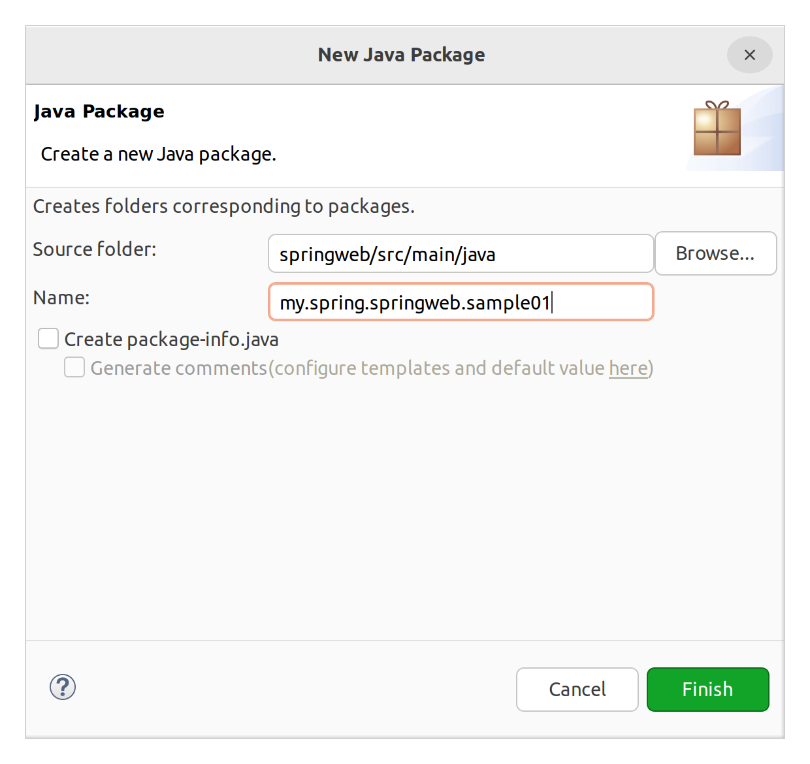
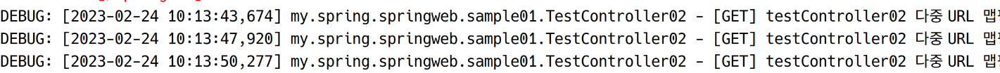
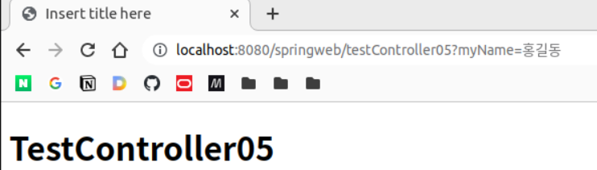

# Spring Web MVC 실습

1. log4j (일단 version 1.x)
2. @Controller
3. @RequestMapping
4. InternalResourceView
    - JSP를 보내줄 때 주로 이 클래스를 사용
5. Model
    - Request Scope 안에 존재한다는 것을 이해하기
6. ModelAndView
    - 가장 대표적으로 컨트롤러 단에서 DispatcherServlet으로 리턴 가능한 클래스
7. EL(Expression Language), JSTL
    - EL: JSP에서 Expressions 대신 사용
    - JSTL: JSP에서 스크립트렛 대신 사용

## @Controller 및 @RequestMapping

특정 클래스가 Controller 빈임을 나타내줌.

### 실습: sample01



```java
package my.spring.springweb.sample01;

import org.slf4j.Logger; // 1버전대 인터페이스. 요걸로 잡는다. 
import org.slf4j.LoggerFactory;
import org.springframework.stereotype.Controller;
import org.springframework.web.bind.annotation.RequestMapping;
import org.springframework.web.bind.annotation.RequestMethod;

@Controller
public class TestController01 {

	private static final Logger logger = 
			LoggerFactory.getLogger(TestController01.class); // 로거 사용
	
	// http://localhost:8080/springweb + 뒤에 나올 꺼
	// http://localhost:8080/springweb/testController01
	@RequestMapping(value="/testController01", method=RequestMethod.GET) // '/' 생략 가능
	void myMethod() {
		logger.debug("[GET] /springweb/testController01"); // 원하는 레벨의 메서드 호출
	}
}
```

http://localhost:8080/springweb/testController01에 접속하면 아래와 같은 화면이 표시되고,


콘솔에는 로그가 표시된다.


404가 리턴된 것은 컨트롤러에서 아무 것도 리턴하지 않았기 떄문이다. 컨트롤러가 아무것도 리턴하지 않으면, DispatchServlet에는 해당 컨트롤러가 맵핑된 URL이 전달된다. 즉, 위의 경우 /testController01이다.  
그럼 ViewResolver를 통해 prefix + testController01 + suffix의 경로에서 JSP를 찾게 되는데, 우리는 그런 JSP를 만들지 않았으므로, 404 Not Found를 리스폰스로 전달하는 것이다.

그럼 webapp/views에 testController01.jsp를 만들어주면 알아서 찾아서 보여주게 된다. 파일을 만들고, jstl taglib를 추가한다. el은 이미 JSP 스펙에 들어가 있으므로 따로 추가하지 않아도 사용할 수 있다.

```jsp
<%@ page language="java" contentType="text/html; charset=UTF-8"
    pageEncoding="UTF-8"%>
<%@ taglib uri="http://java.sun.com/jsp/jstl/core" prefix="c" %>
<!DOCTYPE html>
<html>
<head>
<meta charset="UTF-8">
<title>Insert title here</title>
</head>
<body>
	<h1>소리없는 아우성</h1>
</body>
</html>
```

아래와 같이 jsp 내용이 잘 표시되며, 로그도 잘 보인다.


이렇게 스프링에서는 서블릿보다 자동으로 해주는 경우가 많다. 리턴될 문자열을 명시하여 원하는 JSP가 표시되도록 할지, 아니면 리턴하지 않고 맵핑된 URL에 해당하는 JSP를 자동으로 찾아가게 할지는 알아서 결정해야 한다.

위의 핸들러는 아래와 같이 써도 같은 동작을 한다.

```java
@RequestMapping(value="/testController01", method=RequestMethod.GET) // '/' 생략 가능
String myMethod() {
    logger.debug("[GET] /springweb/testController01"); // 원하는 레벨의 메서드 호출

    return "testController01";
}
```

보통은 기본 경로로 JSP를 위치시킨다고 하더라도 위처럼 명시적인 스트링을 리턴해주는 것이 일반적이다.

&nbsp;

**JSP나누기**

그러나 위의 방법대로 하면 JSP 파일들이 views에 같이 위치하게 되어 복잡해진다. sample01 디렉토리를 views에 만들고 JSP를 옮긴다. return 문자열을 "sample01/testController01"로 바꾼다.

&nbsp;

**\#**
smaple01 패키지 아래에 TestController02 클래스를 만든다.

```java
package my.spring.springweb.sample01;

import org.slf4j.Logger;
import org.slf4j.LoggerFactory;
import org.springframework.stereotype.Controller;
import org.springframework.web.bind.annotation.RequestMapping;

@Controller
public class TestController02 {

	private static final Logger logger = 
			LoggerFactory.getLogger(TestController02.class);
	
	@RequestMapping("/testController02/info")
	String myMethod01() {
		logger.debug("[GET] testController02/info");
		return "sample01/testController02";
	}
	
	@RequestMapping("/testController02/profile")
	String myMethod02() {
		logger.debug("[GET] testController02/profile");
		return "sample01/testController02";
	}
}

```

서블릿과 달리 하나의 컨트롤러 클래스 내에 여러 URL로 맴핑된 여러 메서드가 들어갈 수 있다.

views/sample01/testController02.jsp를 작성하고 URL로 접속하여 테스트하면 잘 작동한다.

그런데 /testController02/ 부분은 각 메서드에 대해 공통이다. 이렇게 공통되는 부분에 대해서는 클래스에 @RequestMapping을 붙여 맵핑해주고, 그 하위 URL을 각 메서드에 맵핑해줄 수 있다.

```java 
@Controller
@RequestMapping("/testController02")
public class TestController02 {

	private static final Logger logger = 
			LoggerFactory.getLogger(TestController02.class);
	
	@RequestMapping("/info")
	String myMethod01() {
		logger.debug("[GET] testController02/info");
		return "sample01/testController02";
	}
	
	@RequestMapping("/profile")
	String myMethod02() {
		logger.debug("[GET] testController02/profile");
		return "sample01/testController02";
	}
}
```

&nbsp;

한 메서드에 대해서 여러 URL을 맵핑할 수 있다.

```java
@Controller
@RequestMapping("/testController02")
public class TestController02 {
    
    // 전략

    @RequestMapping(value = {"", "test01", "test02", "test03/*"})
    // /testController02, /testController02/test01, /testController02/test02, /testController02/test03/*
    String myMethod03() {
        logger.debug("[GET] testController02 다중 URL 맵핑");
        return "sample01/testController02";
    }
    
    // 후략
```




&nbsp;

**\#**

같은 URL에 대해서 다른 메서드를 각각 처리하려면 아래처럼 하면 된다.

```java
@Controller
@RequestMapping(value="/testController03")
public class TestController03 {

	private static final Logger logger = 
			LoggerFactory.getLogger(TestController03.class);
	
	@RequestMapping(value = "", method = RequestMethod.GET) // 같은 URL, 다른 메서드
	String myMethod1() {
		return null;
	}
	
	@RequestMapping(value = "", method = RequestMethod.POST)
	String myMethod2() {
		return null;
	}
}
```

&nbsp;

**\#**

보통은 @RequestMapping은 클래스에만 붙인다. 메서드에는 @GetMapping, @PostMapping을 붙일 수 있다.

```java
// @RequestMapping은 클래스 레벨에서 사용하는 것이 일반적
@Controller
@RequestMapping(value="testController04")
public class TestController04 {

	private static final Logger logger = 
			LoggerFactory.getLogger(TestController04.class);
	
	@GetMapping
	String myMethod01() {
		logger.debug("TestController04 Listening to a GET request...");
		return "sample01/testController04";
	}
	
	@PostMapping(value="/test001")
	String myMethod02() {
		logger.debug("TestController04 Listening to a POST request...");
		return "sample01/testController04";
	}
}
```

JSP를 만들고 브라우저로 접속하여 테스트해본다. 잘된다.

&nbsp;

**\#**  
**파라미터 받기**

GET 방식 요청을 처리할 때 쿼리스트링을 처리하는 법

```java
package my.spring.springweb.sample01;

import org.slf4j.Logger;
import org.slf4j.LoggerFactory;
import org.springframework.stereotype.Controller;
import org.springframework.web.bind.annotation.GetMapping;
import org.springframework.web.bind.annotation.RequestMapping;

import my.spring.springweb.HomeController;

@Controller
@RequestMapping(value="/testController05")
public class TestController05 {
	
	private static final Logger logger =
			LoggerFactory.getLogger(TestController05.class);
	
//	@GetMapping
//	String myMethod1() {
//		logger.debug("TestController05 Listening to a GET request...");
//		return "sample01/testController05";
//	}
	
	@GetMapping(params="myName") // 파라미터 중 myName이라는 파라미터가 있으면 호출
	String myMethod2() {
		logger.debug("TestController05 Listening to a GET request with myName param...");
		return "sample01/testController05";
	}
}

```



```
DEBUG: [2023-02-24 10:42:10,374] my.spring.springweb.sample01.TestController05 - TestController05 Listening to a GET request with myName param...
```

다른 파라미터를 주면 404오류가 표시되며, 콘솔에 경고가 발생한다.


```
WARN : [2023-02-24 10:44:42,758] org.springframework.web.servlet.mvc.support.DefaultHandlerExceptionResolver - Resolved [org.springframework.web.bind.UnsatisfiedServletRequestParameterException: Parameter conditions "myName" not met for actual request parameters: yourName={홍길동}]
```

다음과 같이 특정 패러미터의 값에 맵핑할 수도 있다.

```java
@GetMapping(params="myName") // 파라미터 중 myName이라는 파라미터가 있으면 호출
String myMethod2() {
    logger.debug("TestController05 Listening to a GET request with myName param...");
    return "sample01/testController05";
}

@GetMapping(params="myName=신사임당") // 파라미터 중 myName이라는 파라미터가 있으면 호출
String myMethod3() {
    logger.debug("TestController05 Listening to a GET request with myName param=신사임당...");
    return "sample01/testController05";
}
```

http://localhost:8080/springweb/testController05?myName=홍길동 접속시 ⇒  
```
DEBUG: [2023-02-24 10:47:02,691] my.spring.springweb.sample01.TestController05 - TestController05 Listening to a GET request with myName param...
```

http://localhost:8080/springweb/testController05?myName=신사임당 접속시 ⇒  
```
DEBUG: [2023-02-24 10:47:49,870] my.spring.springweb.sample01.TestController05 - TestController05 Listening to a GET request with myName param=신사임당...
```

이 경우 @GetMapping(params="myName")과 @GetMapping(params="myName=신사임당")에 모두 해당되는 경우이지만, 더 상세한 조건까지 일치하는 @GetMapping(params="myName=신사임당")에 맵핑되는 것을 볼 수 있다. 모호하므로 권장되는 방법은 아니다.

