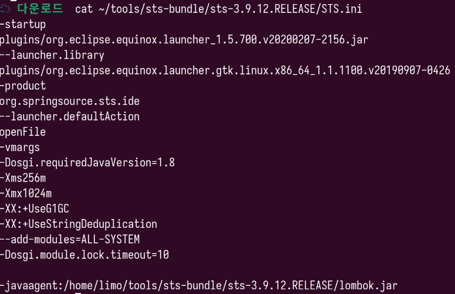
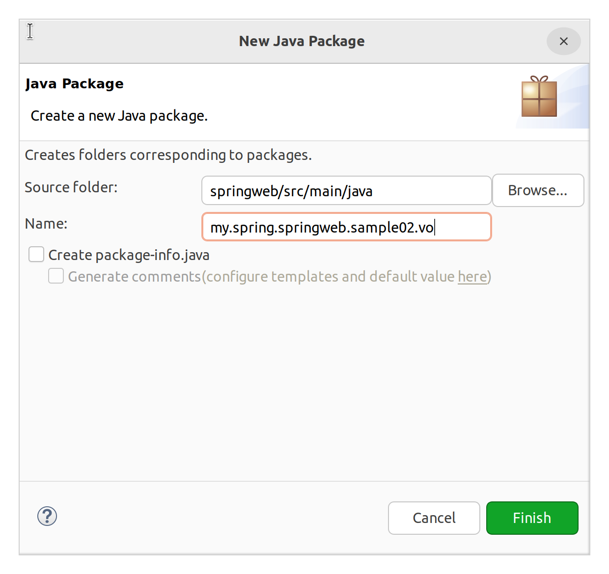
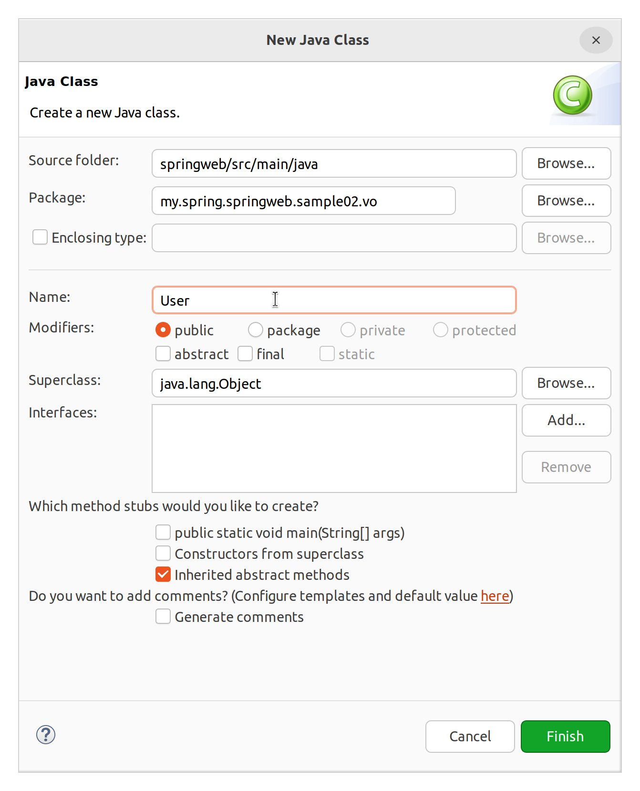

# 롬복(Lombok)

VO 작성을 쉽게 해주는 라이브러리.

## 설정

0. STS 종료

1. https://www.projectlombok.org/download 접속하여 lombok.jar 다운로드

2. JAR 실행
```bash
java -jar ./lombok.jar
```

3. STS 실행 바이너리를 선택하여 설치

4. 다시 STS 실행하여 pom.xml에 롬복 추가

```xml
<!-- https://mvnrepository.com/artifact/org.projectlombok/lombok -->
<dependency>
    <groupId>org.projectlombok</groupId>
    <artifactId>lombok</artifactId>
    <version>1.18.26</version>
    <scope>provided</scope>
</dependency>
```

5. 설치 완료 확인



6. 메이븐 업데이트

## 실습





```java
package my.spring.springweb.sample02.vo;

import lombok.AllArgsConstructor;
import lombok.Getter;
import lombok.NoArgsConstructor;
import lombok.Setter;
import lombok.ToString;

@Getter
@Setter
@NoArgsConstructor
@AllArgsConstructor
@ToString
public class User {

	private String userName;
	private int userAge;
	private String userDept;
	private String userAddress;
}
```

Getter, Setter, 생성자 등을 롬복 어노테이션을 이용하여 쉽게 만들 수 있다.

소스코드에는 어노테이션만 적었지만, 컴파일된 클래스에는 모두 들어가있다. 이는 단점이기도 한데, 사용하지 않는 메서드도 모두 들어간다는 점에서 프로덕션 환경의 퍼포먼스 측면에서 악영향을 미칠 여지도 있다.

위와 같은 어노테이션은 @Data로 줄여 쓸 수 있다. (@AllArgsConstructor는 따로 써줘야 된다.)

```java
package my.spring.springweb.sample02.vo;

import lombok.Data;

@AllArgsConstructor
@Data
public class User {

	private String userName;
	private int userAge;
	private String userDept;
	private String userAddress;
}
```