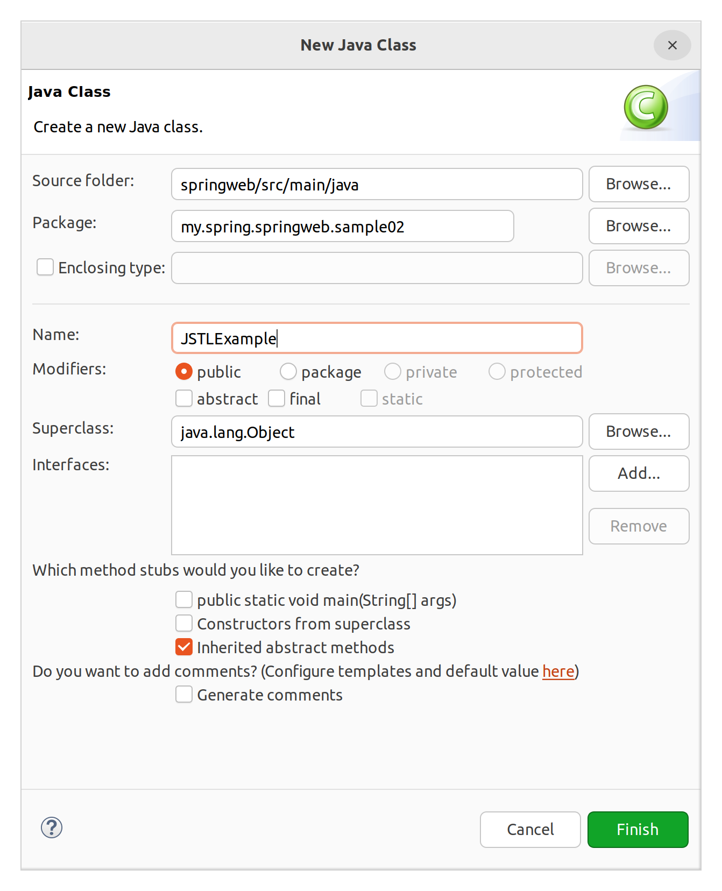
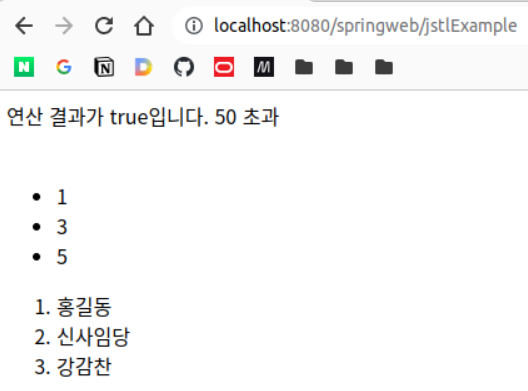
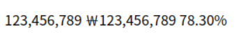
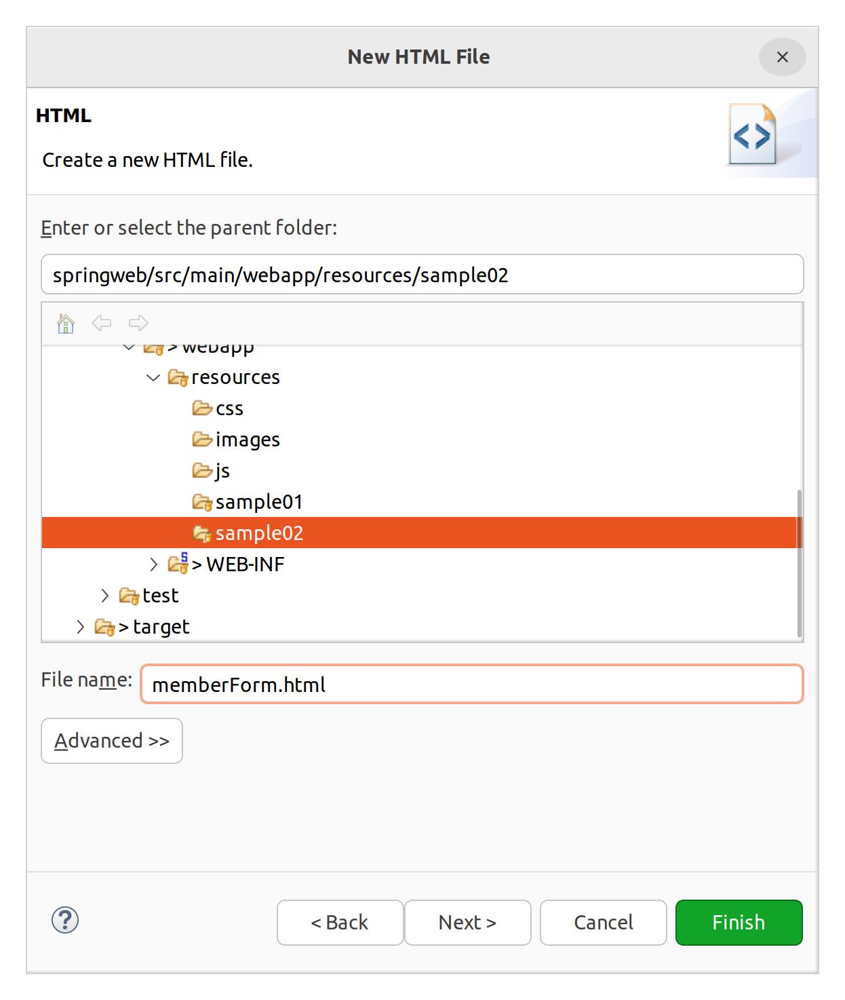
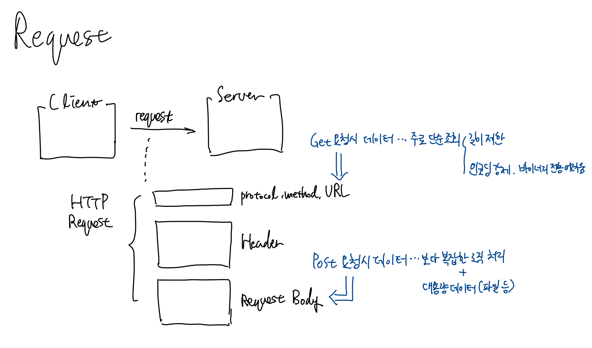
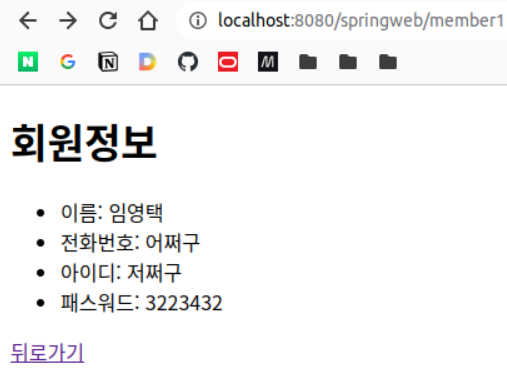

# 또 다시 스프링

## 그동안 뭐했지?

1. Log4J (1버전대를 봤고, 추후 2버전대를 볼 것임)
2. @Controller
    - servelt application context에 작성한 컨트롤러를 빈으로 등록
3. @RequestMapping
    - 컨트롤러를 특정 URL에 맵핑
4. InternalResourceView
    - HTML 또는 JSP를 이용해 뷰 객체 만들기
5. Model
    - requestScope에 위치. 컨트롤러의 핸들러에서 주입받아 사용할 수 있음
6. EL(Expression Language)
    - 여러 스코프에서 데이터 꺼내오기
7. Lombok 살짝

## 남은 것
1. Lombok 자세히
2. JSTL
    - 스크립트렛 대체
    - EL과 함께 사용할 수 있어야 함.

## Lombok

### 개요 및 세팅

다이어트 라이브러리. 코드의 양을 줄일 수 있도록 도와줌.

IDE에 설치 + pom.xml에 의존성 추가

### 테스트 실습

smaple02.vo에 Member을 만든다.

**우리가 기존에 만들었던 VO**  
자바 빈 규칙에 기초하여 작성했다.

```java
package my.spring.springweb.sample02.vo;

public class Member {

	private String memberName;
	private int memberAge;
	private String memberAddr;
	
	public Member() {
	}

	public Member(String memberName, int memberAge, String memberAddr) {
		super();
		this.memberName = memberName;
		this.memberAge = memberAge;
		this.memberAddr = memberAddr;
	}

	public String getMemberName() {
		return memberName;
	}

	public void setMemberName(String memberName) {
		this.memberName = memberName;
	}

	public int getMemberAge() {
		return memberAge;
	}

	public void setMemberAge(int memberAge) {
		this.memberAge = memberAge;
	}

	public String getMemberAddr() {
		return memberAddr;
	}

	public void setMemberAddr(String memberAddr) {
		this.memberAddr = memberAddr;
	}
	
	
}
```


&nbsp;

**Getter와 Setter 만들기 @Getter, @Setter**

그러나 우리가 일반적으로 다루게 되는 VO에는 필드가 아주 많고, 이렇게 하면 너무 복잡해진다. 롬복을 이용해보자.

```java
package my.spring.springweb.sample02.vo;

import lombok.Getter;
import lombok.Setter;

@Getter
public class Member {

	private String memberName;
	
	@Setter
	private int memberAge;
	
	private String memberAddr;
	
}
```

클래스에 붙이면 모든 필드에 대해 적용하고, 필드에 붙이면 필드별로 적용 가능


&nbsp;

**기본 생성자 만들기 @NoArgsConstructor**

```java
package my.spring.springweb.sample02.vo;

import lombok.NoArgsConstructor;

@NoArgsConstructor
public class Member {

	private String memberName;
	private int memberAge;
	private String memberAddr;
	
}

```


&nbsp;

**모든 필드에 대한 생성자 만들기 @AllArgsConstructor**

```java
package my.spring.springweb.sample02.vo;

import lombok.AllArgsConstructor;
import lombok.NoArgsConstructor;

@NoArgsConstructor
@AllArgsConstructor
public class Member {

	private String memberName;
	private int memberAge;
	private String memberAddr;
	
}

```

&nbsp;

**특정 필드에 대한 생성자 만들기 @RequiredArgsConstructor**

그렇다면, 선택한 필드에 대한 생성자를 만들려면?

```java
public Member(String memberName, int memberAge) {
    super();
    this.memberName = memberName;
    this.memberAge = memberAge;
}
```

```java
package my.spring.springweb.sample02.vo;

import lombok.NonNull;
import lombok.RequiredArgsConstructor;

@RequiredArgsConstructor
public class Member {

	@NonNull
	private String memberName;
	
	@NonNull
	private int memberAge;
	
	private String memberAddr;

	
}
```

위와 같이 인자로 받을 필드 위에 NonNull을 붙이면 이를 패러미터로 가지는 생성자를 만들어준다.

&nbsp;

**toString 오버라이딩 **

VO 내용 출력을 쉽게 하기 위해 아래와 같이 Object의 toString을 오버라이딩할 수 있다.

```java
package my.spring.springweb.sample02.vo;

public class Member {

	private String memberName;
	private int memberAge;
	private String memberAddr;
	
	@Override
	public String toString() {
		return memberName + ", " + memberAge + ", " + memberAddr;
	}
}
```

이는 아래의 어노테이션으로 대체할 수 있다.

```java
package my.spring.springweb.sample02.vo;

import lombok.ToString;

@ToString
public class Member {

	private String memberName;
	
	private int memberAge;
	
	@ToString.Exclude
	private String memberAddr;
	
}
```

@ToString.Exclude를 이용하여 toString에 나오지 않게 할 필드를 지정할 수 있다.

&nbsp;

**equals 오버라이딩 @EqualsAndHashCode**

객체의 내용을 비교하도록 Equals를 쉽게 오버라이딩 할 수 있다.

```java
package my.spring.springweb.sample02.vo;

import lombok.EqualsAndHashCode;

@EqualsAndHashCode
public class Member {

	private String memberName;
	private int memberAge;
	private String memberAddr;
	
}
```


&nbsp;

**종합 선물 세트 @Data**

위의 어노테이션 중 자주 쓰는 몇 가지를 자동으로 적용해준다.

@Getter, @Setter,  
@RequiredArgsConstructor,  
@EqualsAndHashCode  

\* @NoArgsConstructor, @AllArgsConsturctor는 @Data에 포함되지 않으니 주의.

## JSTL

태그 라이브러리. 태그의 집합.  

스크립트렛(<% %>)를 대체하기 위함. if문, for문 등 자주 쓰는 스크립트렛 로직을 태그로 사용할 수 있도록 해줌.  
스크립트렛은 기능적으로는 막강하지만, 표현과 로직이 섞이게 되므로 유지보수가 어렵다는 한계가 있었음.

EL은 JSP 2.0 표준 Spec에 정의된 것이므로 바로 사용하면 되지만, JSTL을 사용하려면 JSP 파일 상단에 디렉티브를 명시해줘야 함.

앞으로는 JSP를 JSTL + EL로 구현


### 코드로 사용법 알기

  \* 이름 수정: JSTLExampleController

1. @Controller 붙이기
2. 핸들러 메소드 껍데기 만들기
3. @RequestMapping(value = "", method = RequestMethod.METHOD) 붙이기
4. 핸들러 메소드 작성하기
    - 리턴 타입 정하기
        - void: RequestMapping에 맵핑된 URL 주소 문자열을 뷰 리졸버에 넘겨 JSP를 찾아 뷰 객체를 만들게 됨 
        - String: 문자열을 뷰 리졸버에 넘겨 JSP를 찾아 뷰 객체를 만들게 됨 
        - ModelAndView: 넘겨진 ModelAndView 속의 뷰 객체 사용
    - 주입될 객체 정하기
        - Model 등
    - 로직 짜기

```java
package my.spring.springweb.sample02;

import java.util.ArrayList;
import java.util.List;

import org.springframework.stereotype.Controller;
import org.springframework.ui.Model;
import org.springframework.web.bind.annotation.RequestMapping;
import org.springframework.web.bind.annotation.RequestMethod;

@Controller
public class JSTLExampleController {

	@RequestMapping(value="/jstlExample", method = RequestMethod.GET)
	public String jstlExampleHandler(Model model) {
		List<String> list = new ArrayList<String>();
		list.add("홍길동");
		list.add("신사임당");
		list.add("강감찬");
		
		model.addAttribute("myNum", 100);
		model.addAttribute("myList", list);
		
		return "sample02/jstlExample";
	}
	
}
```

&nbsp;

**views/sample02/jstlExample.jsp**

JSTL 사용을 위해 상단 page 디렉티브 아래에 다음과 같은 taglib 디렉티브를 추가.

```
<%@ taglib uri="http://java.sun.com/jsp/jstl/core" prefix="c"%>
<%@ taglib uri="http://java.sun.com/jsp/jstl/fmt" prefix="fmt"%>
```

코어 라이브러리와, 포맷을 잡아주는 포맷터를 잡아주었다. prefix는 보통 변경하지 않는다.

```jsp
<%@ page language="java" contentType="text/html; charset=UTF-8"
    pageEncoding="UTF-8"%>
<%@ taglib uri="http://java.sun.com/jsp/jstl/core" prefix="c"%>
<%@ taglib uri="http://java.sun.com/jsp/jstl/fmt" prefix="fmt"%>
<!DOCTYPE html>
<html>
<head>
<meta charset="UTF-8">
<title>Insert title here</title>
</head>
<body>
	<!-- 변수 만들고 값 할당 -->
	<%-- <% int test = 100; %> --%>
	<c:set var="num1" value="100" />
	
	<!-- if문 -->
	<!-- test에는 결과적으로 true 혹은 false가 들어가도록 -->
	<!-- EL을 넣으면 됨 -->
	<c:if test="${ num1 + myNum > 100 }">
		연산 결과가 true입니다.
	</c:if>
	<!-- else 문이 없다는 단점이 있다. -->
	
	<!-- choose문 -->
	<!-- 조건이 여러개인 경우 사용 -->
	<c:choose>
		<c:when test="${ num1 + myNum > 50 }">
			50 초과 <!-- 만족하면 다음 조건은 평가하지 않는다. switch가 아니라 if-else처럼 동작 -->
		</c:when>
		<c:when test="${ num1 + myNum > 100 }">
			100 초과
		</c:when>
		<c:when test="${ num1 + myNum > 300 }">
			300 초과
		</c:when>
		<c:otherwise>
			만족하는 조건이 없음
		</c:otherwise>
	</c:choose>
	
	<br><br>
	
	<!-- for문 (while문은 없음) -->
	<!-- -- 기본 forEach문 (반복 횟수 지정) -->
	<ul>
	<c:forEach var="tmp" begin="1" end="5" step="2"> <!-- 1, 3, 5 -->
		<li>${ tmp }</li>
	</c:forEach>
	</ul>
	
	<!-- -- 집합 자료 구조 (리스트, 셋, 맵 등)를 반복 -->
	<ol>
	<c:forEach var="name" items="${ myList }">
		<li>${ name }</li>
	</c:forEach>
	</ol>
	
</body>
</html>
```



&nbsp;

포맷터 사용 예제

```jsp
<!-- 전략 -->

	
	<!-- ------------------------------------ -->
	<!-- fmt 사용법 -->
	<c:set var="number" value="123456789" />
	<c:set var="number2" value="0.783" />
	<br><br>
	
	<!-- 숫자 표현시 콤마 -->
	<fmt:formatNumber value="${ number }" />
	
	<!-- 통화 표현 -->
	<fmt:formatNumber value="${ number }" type="currency" />
	
	<!-- 백분율 표현 -->
	<fmt:formatNumber value="${ number2 }" type="percent" pattern="0.00%" />
</body>
</html>
```



## RequestParam과 ModelAttributes

일단 HTML을 만들자.



### 그 전에!! 배경 지식 보충

request를 보낼 때, Get과 Post 간에는 차이가 있다.




### 실습: RequestParam

```html
<!DOCTYPE html>
<html>
<head>
<meta charset="UTF-8">
<title>Insert title here</title>
</head>
<body>
	<h1>회원정보를 입력하세요</h1>
	<form action="/springweb/member1" method="post">
		<input type="text" placeholder="이름을 입력하세요!" name="name"><br>
		<input type="text" placeholder="전화번호를 입력하세요!" name="phone"><br>
		<input type="text" placeholder="아이디를 입력하세요!" name="id"><br>
		<input type="password" placeholder="패스워드를 입력하세요!" name="password"><br>
		<input type="submit" value="전송">
	</form>
</body>
</html>
```

sample2.MemberController

```java
package my.spring.springweb.sample02;

import org.springframework.stereotype.Controller;
import org.springframework.web.bind.annotation.PostMapping;
import org.springframework.web.bind.annotation.RequestParam;
import org.springframework.web.servlet.ModelAndView;

@Controller
public class MemberController {

	@PostMapping
	public ModelAndView myMethod1(
			@RequestParam(value = "name", defaultValue = "없음") String name,
			@RequestParam(value = "phone", defaultValue = "없음") String phone,
			String id, // name과 패러미터 이름이 같으면 어노테이션 생략 가능
			@RequestParam(value = "password", defaultValue = "없음") String password) {
		
		ModelAndView mav = new ModelAndView(); // 보통 뷰와 함께 데이터를 같이 전달할 때 사용
		
		mav.setViewName("sample02/memberView"); // 뷰 이름(문자열)만 넘김. DispatcherServlet는 문자열을 뷰 리졸버에 넘겨서 뷰 객체를 받음
		mav.addObject("name", name); // Model 객체가 아닌 Request 객체에 들어감.
		mav.addObject("phone", phone);
		mav.addObject("id", id);
		mav.addObject("password", password);
		
		return mav;
		
	}
}
```

&nbsp;

**views/sample2/memberView.jsp**

```jsp
<%@ page language="java" contentType="text/html; charset=UTF-8"
    pageEncoding="UTF-8"%>
<%@ taglib uri="http://java.sun.com/jsp/jstl/core" prefix="c"%>
<%@ taglib uri="http://java.sun.com/jsp/jstl/fmt" prefix="fmt"%>
<!DOCTYPE html>
<html>
<head>
<meta charset="UTF-8">
<title>Insert title here</title>
</head>
<body>
	<h1>회원정보</h1>
	
	<ul>
		<li>이름: ${ name }</li>
		<li>전화번호: ${ phone }</li>
		<li>아이디: ${ id }</li>
		<li>패스워드: ${ password }</li>
	</ul>
	
	<a href="${ header.referer }">뒤로가기</a>
</body>
</html>
```




### 실습: ModelAttributes

아래와 같이 HTML을 수정하여 다른 컨트롤러로 전송하는 폼을 추가한다.

```html
<!DOCTYPE html>
<html>
<head>
<meta charset="UTF-8">
<title>Insert title here</title>
</head>
<body>
	<h1>회원정보를 입력하세요</h1>
	<h2>member1</h2>
	<form action="/springweb/member1" method="post">
		<input type="text" placeholder="이름을 입력하세요!" name="name"><br>
		<input type="text" placeholder="전화번호를 입력하세요!" name="phone"><br>
		<input type="text" placeholder="아이디를 입력하세요!" name="id"><br>
		<input type="password" placeholder="패스워드를 입력하세요!" name="password"><br>
		<input type="submit" value="전송">
	</form>
	
	<h2>member2</h2>
	<form action="/springweb/member2" method="post">
		<input type="text" placeholder="이름을 입력하세요!" name="name"><br>
		<input type="text" placeholder="전화번호를 입력하세요!" name="phone"><br>
		<input type="text" placeholder="아이디를 입력하세요!" name="id"><br>
		<input type="password" placeholder="패스워드를 입력하세요!" name="password"><br>
		<input type="submit" value="전송">
	</form>
</body>
</html>
```

이번엔 VO를 만든다.  
sample2.vo.Member

```java
package my.spring.springweb.sample02.vo;

import lombok.AllArgsConstructor;
import lombok.Data;
import lombok.NoArgsConstructor;

@Data
@NoArgsConstructor
@AllArgsConstructor
public class Member {

	private String name; // 일부러 폼의 name과 같게 필드명을 잡았음.
	private String phone;
	private String id;
	private String password;
	
}

```

&nbsp;

**sample02.MemberController 수정**

```java
package my.spring.springweb.sample02;

import org.slf4j.Logger;
import org.slf4j.LoggerFactory;
import org.springframework.stereotype.Controller;
import org.springframework.web.bind.annotation.PostMapping;
import org.springframework.web.bind.annotation.RequestParam;
import org.springframework.web.servlet.ModelAndView;

import my.spring.springweb.sample01.TestController04;
import my.spring.springweb.sample02.vo.Member;

@Controller
public class MemberController {
	
	private static final Logger logger = 
			LoggerFactory.getLogger(TestController04.class);

	@PostMapping(value = "/member1")
	public ModelAndView myMethod1(
			@RequestParam(value = "name", defaultValue = "없음") String name,
			@RequestParam(value = "phone", defaultValue = "없음") String phone,
			String id, // name과 패러미터 이름이 같으면 어노테이션 생략 가능
			@RequestParam(value = "password", defaultValue = "없음") String password) {
		
		ModelAndView mav = new ModelAndView(); // 보통 뷰와 함께 데이터를 같이 전달할 때 사용
		
		mav.setViewName("sample02/memberView"); // 뷰 이름(문자열)만 넘김. DispatcherServlet는 문자열을 뷰 리졸버에 넘겨서 뷰 객체를 받음
		mav.addObject("name", name); // Model 객체가 아닌 Request 객체에 들어감.
		mav.addObject("phone", phone);
		mav.addObject("id", id);
		mav.addObject("password", password);
		
		return mav;
	}
	
	@PostMapping(value = "/member2")
	public ModelAndView myMethod2(Member vo) {
		// 자동으로 Member의 객체인 vo가 주입된다.
		// Member의 필드명을 읽어와서, 해당 필드와 같은 이름을 request form에서 찾고
		// 그 값을 객체에 넣어 주입해준다.
		logger.debug(vo.toString()); // vo 값 확인. @Data에 의해 오버라이딩됨
		
		ModelAndView mav = new ModelAndView();
		
		mav.addObject("memberVO", vo);
		
		mav.setViewName("sample02/memberView");
		
		return mav;
	}
}
```

&nbsp;

**views/sample2/memberView.jsp**

```jsp
<%@ page language="java" contentType="text/html; charset=UTF-8"
    pageEncoding="UTF-8"%>
<%@ taglib uri="http://java.sun.com/jsp/jstl/core" prefix="c"%>
<%@ taglib uri="http://java.sun.com/jsp/jstl/fmt" prefix="fmt"%>
<!DOCTYPE html>
<html>
<head>
<meta charset="UTF-8">
<title>Insert title here</title>
</head>
<body>
	<h1>회원정보</h1>
	
	<c:choose>
		<c:when test="${ !empty requestScope.memberVO }">  <!-- memberVO가 있으면 -->
			<h2>memberVO</h2>
			<ul>
				<li>이름: ${ memberVO.name }</li>
				<li>전화번호: ${ memberVO.phone }</li>
				<li>아이디: ${ memberVO.id }</li>
				<li>패스워드: ${ memberVO.password }</li>
			</ul>
		</c:when>
		<c:otherwise>
			<h2>model</h2>
			<ul>
				<li>이름: ${ name }</li>
				<li>전화번호: ${ phone }</li>
				<li>아이디: ${ id }</li>
				<li>패스워드: ${ password }</li>
			</ul>
		</c:otherwise>
	</c:choose>
	
	<a href="${ header.referer }">뒤로가기</a>
</body>
</html>
```

requestScope.memberVO가 있는지 판별하여 있을 때와 없을 때 가져오는 값을 다르게 했다.  
잘 된다.

이때, 컨트롤러에서 vo를 주입받는 데에는 아래의 어노테이션이 생략된 것과 같다.

```java
// 전략

@PostMapping(value = "/member2")
public ModelAndView myMethod2(@ModelAttribute Member vo) {
    
// 후략
```

그럼, @RequsetParam이나 @ModelAttribute 중 무엇이 생략되었는지 스프링은 어떻게 판단할까? 패러미터의 타입을 보아 Primitive 계열(String 포함)의 경우 @RequestParam이 생략되었을 것으로 판단하며, 참조 타입의 경우 @ModelAttribute가 생략된 것으로 판단한다. 그러나 생략하면 모호하기 때문에 공부하는 단계에서는 써주는 편이 좋을 것이다.

### 실습: ModelAttributes 2

사실 @ModelAttributes로 넣어주는 경우 자동으로 Model 객체에 들어간다. 키 값은 VO 객체 클래스 이름에서 앞글자를 소문자로 바꾼 문자열이 된다.

일단 html에 member3로 가는 폼을 하나 더 추가

```html
	<h2>member3</h2>
	<form action="/springweb/member3" method="post">
		<input type="text" placeholder="이름을 입력하세요!" name="name"><br>
		<input type="text" placeholder="전화번호를 입력하세요!" name="phone"><br>
		<input type="text" placeholder="아이디를 입력하세요!" name="id"><br>
		<input type="password" placeholder="패스워드를 입력하세요!" name="password"><br>
		<input type="submit" value="전송">
	</form>
```

&nbsp;

컨트롤러에 member3에 맵핑된 메서드 추가

```java
	@PostMapping(value = "/member3")
	public String myMethod3(@ModelAttribute Member vo) { // 사실 자동으로 Model 객체에 들어간다. Key는 model (클래스 명에 앞글자 소문자)
		// 자동으로 Member의 객체인 vo가 주입된다.
		// Member의 필드명을 읽어와서, 해당 필드와 같은 이름을 request form에서 찾고
		// 그 값을 객체에 넣어 주입해준다.
		logger.debug(vo.toString()); // vo 값 확인. @Data에 의해 오버라이딩됨
		
		return "sample02/memberView";
	}
```

&nbsp;

JSP에서 c:choose 문에 c:when 조건 추가

```jsp
		<c:when test="${ !empty requestScope.member }">  <!-- member가 있으면 -->
			<h2>member</h2>
			<ul>
				<li>이름: ${ member.name }</li>
				<li>전화번호: ${ member.phone }</li>
				<li>아이디: ${ member.id }</li>
				<li>패스워드: ${ member.password }</li>
			</ul>
		</c:when>
```

컨트롤러에서 명시적으로 모델에 데이터를 넣지 않았는데도 JSP에서 EL을 통해 데이터를 잘 가져왔다.

&nbsp;

어노테이션에 value를 넣어서 모델에 저장할 key도 정해줄 수 있다.

```java
	@PostMapping(value = "/member3")
	public String myMethod3(@ModelAttribute(value = "mem") Member vo) {
        logger.debug(vo.toString());
		
		return "sample02/memberView";
	}
```


### 실습: ModelAttributes 3

아래처럼 vo 속성보다 더 많은 값이 들어온다면 어떻게 할까?

```html
	<h2>member4</h2>
	<form action="/springweb/member4" method="post">
		<input type="text" placeholder="이름을 입력하세요!" name="name"><br>
		<input type="text" placeholder="전화번호를 입력하세요!" name="phone"><br>
		<input type="text" placeholder="아이디를 입력하세요!" name="id"><br>
		<input type="password" placeholder="패스워드를 입력하세요!" name="password"><br>
		<input type="text" placeholder="주소를 입력하세요!" name="address"><br>
		<input type="submit" value="전송">
	</form>
```

```java
	@PostMapping(value = "/member4")
	public String myMethod4(Member vo, String address, Model model) { // 자동으로 이름따라 들어간다
		logger.debug(vo.toString());
		
		model.addAttribute("address", address);
		
		return "sample02/memberView";
	}
```

```jsp
		<c:when test="${ !empty requestScope.member }">
			<h2>member</h2>
			<ul>
				<li>이름: ${ member.name }</li>
				<li>전화번호: ${ member.phone }</li>
				<li>아이디: ${ member.id }</li>
				<li>패스워드: ${ member.password }</li>
				<li>주소: ${ address }</li>
			</ul>
		</c:when>
```

