# 스프링 조금 더

## Log4j2

### 개요

현재 의존성으로 1버전대와 2버전대가 같이 잡혀있음. 2버전대만 사용하기로 하고, pom.xml에서 1버전대 모두 제거

&nbsp;

**pom.xml**

```xml
	<properties>
		<java-version>1.8</java-version> 
		<org.springframework-version>5.3.23</org.springframework-version>
		<org.aspectj-version>1.9.9.1</org.aspectj-version>
		<!-- <org.slf4j-version>1.7.36</org.slf4j-version> -->
		<log4j2.version>2.17.1</log4j2.version>
	</properties>
```

1버전대 버전 변수 주석처리 → 그 후 아래에 오류나는 부분 주석처리

그 후 소스코드에서 log4j 1.x를 사용하는 부분 주석처리 (오류나있는 부분)

&nbsp;

**[덤] 프로젝트 초기화 하는 방법**

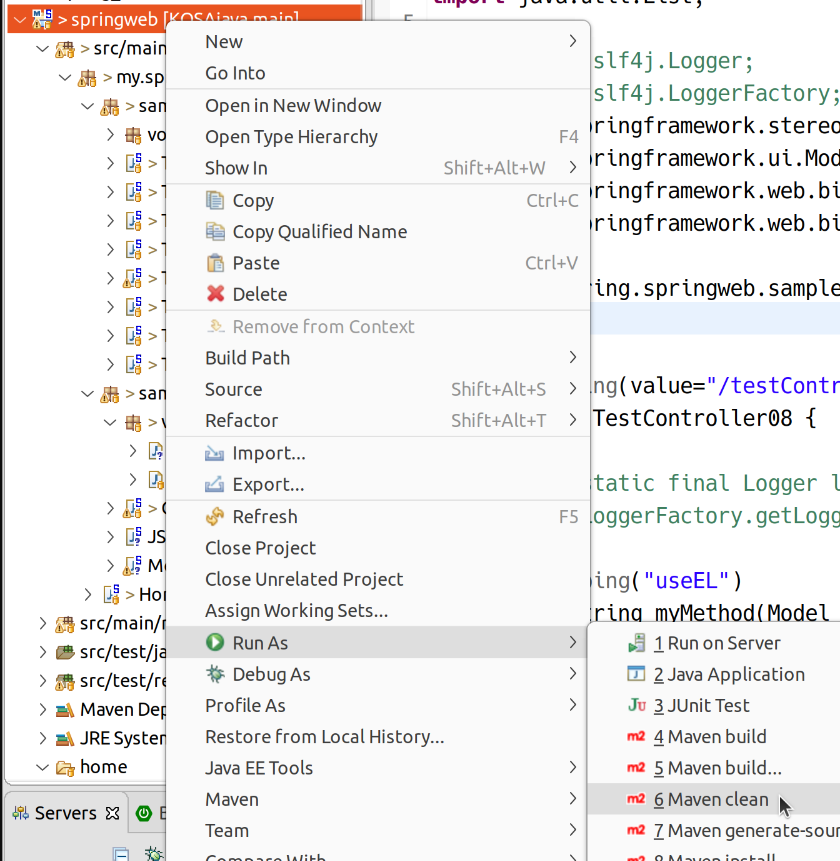

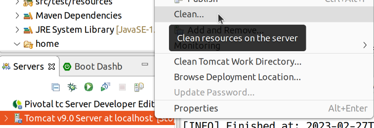

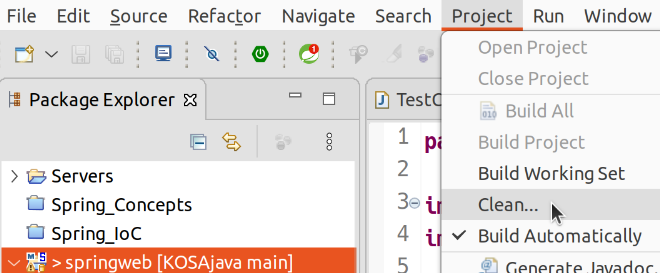

이제 log4j 1.x 설정파일(src/main/resources/log4j.xml)도 필요 없다. 물론 지우지 않아도 무방하다.

&nbsp;

**web.xml 설정 변경**

log4j 2.x를 사용하기 위해 설정을 추가한다.

src/main/webapp/WEB-INF/web.xml

```xml
     <!-- Log4j 설정 -->
      <context-param>
          <param-name>log4jConfiguration</param-name>
          <param-value>classpath:/log4j2.xml</param-value>
      </context-param>
        
      <listener>
          <listener-class>org.apache.logging.log4j.web.Log4jServletContextListener
          </listener-class>
      </listener>
```

설정 파일을 log4j2.xml로 잡았다. 'classpath:/'는 현재 src/main/resources이다.

&nbsp;

**log4j2.xml 작성**

```xml
<?xml version="1.0" encoding="UTF-8"?>
<Configuration>
  
    <Appenders>
        <File name="File_1" fileName="c:/log_test/myLog_1.log"
            append="true">
            <PatternLayout pattern="%t %-5p %c{2} - %m%n" />
        </File>
        <File name="File_2" fileName="c:/log_test/myLog_2.log"
            append="true">
            <PatternLayout pattern="%d - %m%n" />
        </File>
        <Console name="stdout_1" target="SYSTEM_OUT">
            <PatternLayout pattern="%p == %m == %d%n" />
        </Console>
        <Console name="stdout_2" target="SYSTEM_OUT">
            <PatternLayout pattern="%d{yyyy-MM-dd:HH:mm} >> %m%n" />
        </Console>
    </Appenders>
  
    <Loggers>
  
        <Logger name="case1" level="warn">
            <AppenderRef ref="File_1" />
        </Logger>
  
        <!-- additivity="false" 상위 appender를 상속받지 않습니다. 즉, 여기서는 Root를 제외시키는 역할을 
            합니다. 로그가 중복으로 출력되는것을 제어할 목적으로 사용됩니다. -->
        <Logger name="case2" level="info" additivity="false">
            <AppenderRef ref="File_2" />
            <AppenderRef ref="stdout_1" />
        </Logger>
  
        <Logger name="case3" level="debug" additivity="false">
            <AppenderRef ref="stdout_1" />
            <AppenderRef ref="File_1" />
        </Logger>
  
  
        <Root level="INFO">
            <AppenderRef ref="stdout_2" />
        </Root>
    </Loggers>
  
</Configuration>
```

- \<Appenders>: 로그 출력 방향
    - \<File>: 파일에 로그를 출력하고자 할 때 사용
        - name: 어펜더 이름
        - fileName: 파일 이름 (디렉토레 생성해놔야 함)
        - append: 기존 파일에 이어서 내용 추가
    - \<Console>: 콘솔에 출력
        - name="stdout_1": 어펜더 이름
        - target="SYSTEM_OUT": 표준 출력
        - \<PatternLayout>: 출력 패턴 지정
- \<Loggers>
    - \<Logger>: 이름과 로그 레벨 지정 가능. 특정 레벨에 대한 출력 destination 지정. 지정한 레벨 이상의 로그를 기록
    - \<Root>: 설정하지 않은 경우 기본값

### 테스트 실습

sample03 패키지 작성

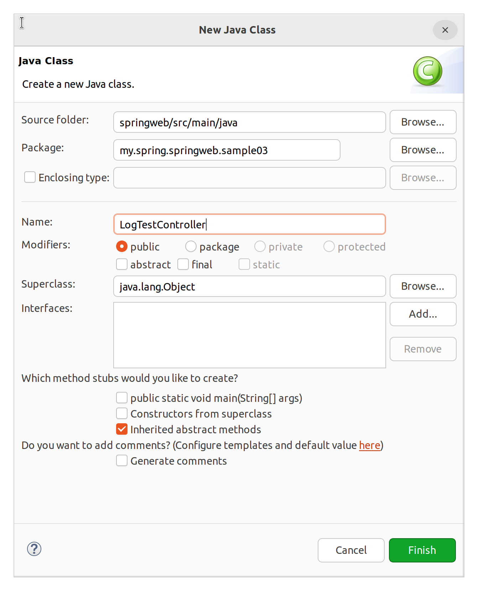

**sample03.LogTestController**

```java
package my.spring.springweb.sample03;

import org.apache.logging.log4j.LogManager;
import org.apache.logging.log4j.Logger;
import org.springframework.stereotype.Controller;
import org.springframework.web.bind.annotation.RequestMapping;

@Controller
public class LogTestController {

	Logger log = LogManager.getLogger("case3");  *중요* <Logger> name
	
	@RequestMapping(value = "/log1")
	public String myMethod1() {
		log.debug("소리 없는 아우성")
		
		return "sample03/logview";
	}
}
```

임포트 주의

로그가 콘솔과 파일에 잘 출력된다.

## @PathVariable

### 설명

클라이언트로부터 값을 가져오는 어노테이션 중 하나.

주로 REST API를 구현할 때 사용

ex> http://localhost:8080/springweb/mybook/3
    http://localhost:8080/springweb/mybook/13
     http://localhost:8080/springweb/mybook/76
     
쿼리 스트링(?로 시작, 키와 값)과는 다르다. URL 자체에 클라이언트로부터 들어온 값이 들어있다.

### 실습

예제 압축 파일을 풀어 src/main/webapp/resources/images에 복사

sample04 패키지 생성 및 PathController 작성

```java
package my.spring.springweb.sample04;

import org.springframework.stereotype.Controller;
import org.springframework.ui.Model;
import org.springframework.web.bind.annotation.PathVariable;
import org.springframework.web.bind.annotation.RequestMapping;

@Controller
public class PathController {

	@RequestMapping(value = "/character/detail/{name}/{number}")
	public String handler1(@PathVariable("name") String name,
			@PathVariable("number") int num,
			Model model) {
		
		if(name.equals("kakao")) {
			if(num == 1) {
				model.addAttribute("imgname", "ryan");
			} else if (num == 2) {
				model.addAttribute("imgname", "apeach");
			} else if (num == 3) {
				model.addAttribute("imgname", "frodoneo");
			}
		}
		
		if(name.equals("line")) {
			if(num == 1) {
				model.addAttribute("imgname", "brown");
			} else if (num == 2) {
				model.addAttribute("imgname", "james");
			} else if (num == 3) {
				model.addAttribute("imgname", "cony");
			}
		}
		
		return "sample04/detailView";
	}
}

```

@RequestMapping의 value 옵션에 '{value}'를 써서 변수를 넣을 수 있음. 이 값은 핸들러 메서드의 패러미터 자리에 @PathVariable 어노테이션을 써서 주입할 수 있음.

&nbsp;

**views/sample04/detailView.jsp**

```jsp
<%@ page language="java" contentType="text/html; charset=UTF-8"
    pageEncoding="UTF-8"%>
<%@ taglib uri="http://java.sun.com/jsp/jstl/core" prefix="c" %>
<%@ taglib uri="http://java.sun.com/jsp/jstl/fmt" prefix="fmt"%>
<!DOCTYPE html>
<html>
<head>
<meta charset="UTF-8">
<title>Insert title here</title>
</head>
<body>
	
</body>
</html>
```

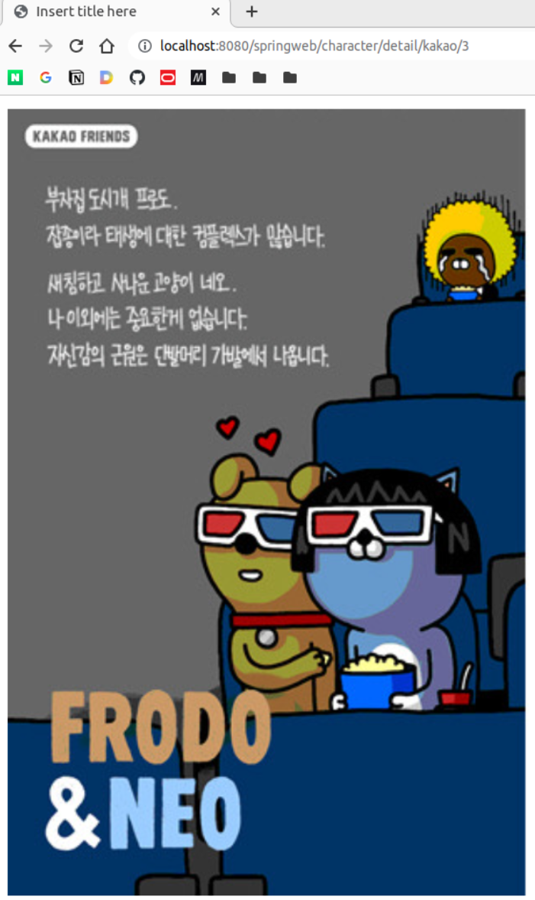


## @ModelAttributes

### 용도

- Request Body의 내용을 parameter VO로 받을 때 (아까 했던 것)
- method에 사용
- sessionAttribute와 같이 사용

### method에 사용

sample05, sample05.vo 패키지 생성

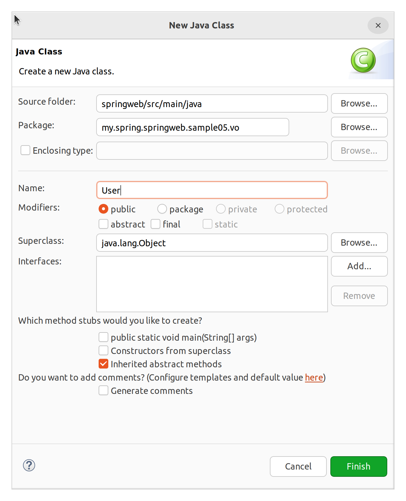

**sample05.vo.User**

```java
package my.spring.springweb.sample05.vo;

import lombok.AllArgsConstructor;
import lombok.Data;
import lombok.NoArgsConstructor;

@Data
@NoArgsConstructor
@AllArgsConstructor
public class User {

	private int userNumber;
	private String userName;
	private String userDept;
	
}

```

&nbsp;


```java
package my.spring.springweb.sample05;

import org.apache.logging.log4j.LogManager;
import org.apache.logging.log4j.Logger;
import org.springframework.stereotype.Controller;
import org.springframework.web.bind.annotation.ModelAttribute;
import org.springframework.web.bind.annotation.RequestMapping;

@Controller
public class ModelAttributeController {

	Logger log = LogManager.getLogger("case3");
	
	// 이름을 명시해줘야 함.
	// 해당 클래스 내의 핸들러가 실행되기 전에 이 메서드가 자동으로 호출됨
	// 리턴 값이 Model에 자동으로 등록됨
	@ModelAttribute("v1")
	public String createString() {
		log.debug("문자열 객체 생성");
		return "이것은 소리 없는 아우성";
	}
	
	@RequestMapping(value = "/modelAttributes1")
	public String myMethod1() {
		log.debug("Handler Invoked");
		return "sample05/modelResult";
	}
}
```

메서드 위에 @ModelAttribute를 붙일 수 있다. 이때에는 이름을 명시해줘야 한다.  
그럼 해당 클래스의 핸들러가 실행되기 전에 메서드가 자동으로 호출되며, 그 리턴값이 Model에 등록된다.

&nbsp;

**views/sample05/modelResult.jsp**

```java
<%@ page language="java" contentType="text/html; charset=UTF-8"
    pageEncoding="UTF-8"%>
<%@ taglib uri="http://java.sun.com/jsp/jstl/core" prefix="c" %>
<%@ taglib uri="http://java.sun.com/jsp/jstl/fmt" prefix="fmt"%>
<!DOCTYPE html>
<html>
<head>
<meta charset="UTF-8">
<title>Insert title here</title>
</head>
<body>
	모델 안에 있는 데이터: 
	${ v1 }
</body>
</html>
```

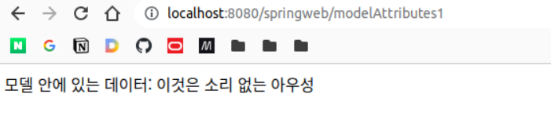

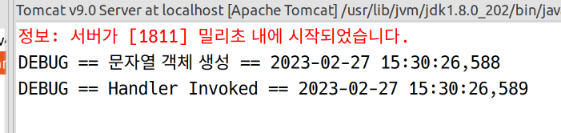

그럼 하나 더 늘려보자.

```java
package my.spring.springweb.sample05;

import org.apache.logging.log4j.LogManager;
import org.apache.logging.log4j.Logger;
import org.springframework.stereotype.Controller;
import org.springframework.web.bind.annotation.ModelAttribute;
import org.springframework.web.bind.annotation.RequestMapping;

import my.spring.springweb.sample05.vo.User;

@Controller
public class ModelAttributeController {

	Logger log = LogManager.getLogger("case3");
	
	// 이름을 명시해줘야 함.
	// 해당 클래스 내의 핸들러가 실행되기 전에 이 메서드가 자동으로 호출됨
	// 리턴 값이 Model에 자동으로 등록됨
	@ModelAttribute("v1")
	public String createString() {
		log.debug("문자열 객체 생성");
		return "이것은 소리 없는 아우성";
	}
	
	@ModelAttribute("v2")
	public User createUser() {
		log.debug("문자열 객체 생성");
		User user = new User(25, "홍길동", "철학과");
		return user;
	}
	
	@RequestMapping(value = "/modelAttributes1")
	public String myMethod1() {
		log.debug("Handler Invoked");
		return "sample05/modelResult";
	}
}

```

핸들러 실행 전 createString()이나 createUser()가 실행될텐데, 그 순서는 알 수 없다.

```jsp
<%@ page language="java" contentType="text/html; charset=UTF-8"
    pageEncoding="UTF-8"%>
<%@ taglib uri="http://java.sun.com/jsp/jstl/core" prefix="c" %>
<%@ taglib uri="http://java.sun.com/jsp/jstl/fmt" prefix="fmt"%>
<!DOCTYPE html>
<html>
<head>
<meta charset="UTF-8">
<title>Insert title here</title>
</head>
<body>
	모델 안에 있는 데이터: 
	${ v1 }<br><br>
	
	VO안의 데이터:
	${ v2.userName }, ${ v2.userNumber }, ${ v2.userDept }
</body>
</html>
```

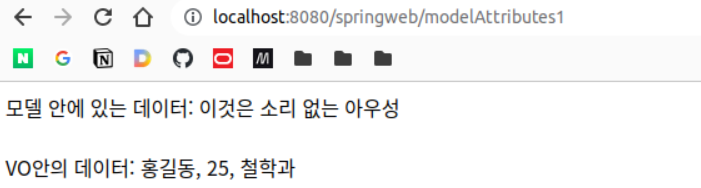

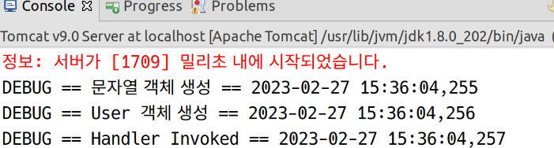

이번에는 이 값을 핸들러로 가져와본다.

```java
	@ModelAttribute("data1")
	public int createNumber1() {
		log.debug("숫자 1 생성");
		return 100;
	}
	
	@ModelAttribute("data2")
	public int createNumber2() {
		log.debug("숫자 2 생성");
		return 200;
	}
	
	@RequestMapping(value = "/modelAttributes1")
	public String myMethod1(@ModelAttribute("data1") int num1, // VO로 Request Body를 가져온 것이 아니라, 위의 메서드의 리턴값이 주입
			@ModelAttribute("data2") int num2,
			Model model) {
		log.debug("Handler Invoked");
		
		model.addAttribute("sum", num1 + num2)
		return "sample05/modelResult";
	}
```

```jsp
<%@ page language="java" contentType="text/html; charset=UTF-8"
    pageEncoding="UTF-8"%>
<%@ taglib uri="http://java.sun.com/jsp/jstl/core" prefix="c" %>
<%@ taglib uri="http://java.sun.com/jsp/jstl/fmt" prefix="fmt"%>
<!DOCTYPE html>
<html>
<head>
<meta charset="UTF-8">
<title>Insert title here</title>
</head>
<body>
	모델 안에 있는 데이터: 
	${ v1 }<br><br>
	
	VO안의 데이터:
	${ v2.userName }, ${ v2.userNumber }, ${ v2.userDept }<br><br>
	
	숫자 계산<br>
	num1: ${ data1 }<br>
	num2: ${ data2 }<br>
	합: ${ sum }<br>
</body>
</html>
```

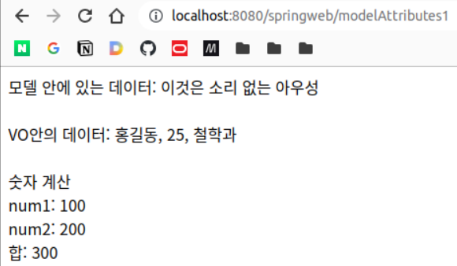

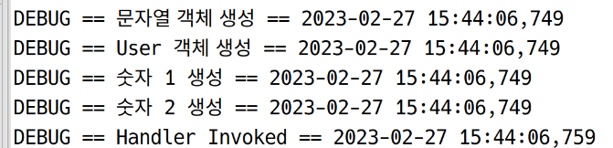

### 핸들러의 패러미터에 달 때 일어나는 일

**resources/sample05/userFrom.html 작성**

```html
<!DOCTYPE html>
<html>
<head>
<meta charset="UTF-8">
<title>Insert title here</title>
</head>
<body>
	<h1>학생정보를 입력하세요</h1>
	
	<form action="/springweb/modelAttribute2" method="post">
		<!-- 사용할 VO의 필드명과 name 어트리뷰트 동일하게  -->
		학번: <input type="number" name="userNumber"><br> 
		이름: <input type="text" name="userName"><br>
		학과: <input type="text" name="userDept"><br>
		<br>
		<input type="submit" value="전송">
	</form>
</body>
</html>
```

```java
	@PostMapping(value = "/modelAttributes2") // POST 메서드 대응
	public String myMethod2(/* @ModelAttribute */ User user) { // 생략
		log.debug("Handler2 Invoked");
		
		// 클라이언트가 보낸 데이터로 객체를 생성할 수 있음. => Command 객체
		// Command 객체는 대부분 VO를 가지고 생성함
		// 순서
		// // 1. 만약 클래스 레벨에 @SessionAttribute가 지정되어 있으면 (지정하는 방법은 내일 자세히 배움)
		// //    우선 session에서 user(User)를 찾는다.
		// //    @SessionAttribute가 지정되어있지 않으면 넘어간다.
		// // 2. User의 public 생성자를 찾아서 호출하여 객체를 생성
		// //    생성자가 만약 여러개면 인자가 가장 적은 생성자를 찾는다. (따라서 일반적으로 기본 생성자 선택됨)
		// //    찾은 생성자를 통해 객체 생성
		// // 3. setter를 이용하여 클라이언트가 보내준 데이터를 VO에 저장한다
		// // 4. Model 객체에 해당 VO를 저장한다. Model의 객체가 주입되지 않았더라도 상관 없다.
		// //    이때 기본 키는 VO의 클래스에서 앞 글자를 소문자로 바꾼 문자열.
		// //    키를 바꾸고 싶다면 어노테이션의 인자로 원하는 키 문자열을 전달하면 된다.
		// //    @ModelAttribute("custom-key") Type vo
		
		return "sample05/modelResult";
	}
```

- 클라이언트가 보낸 데이터로 객체를 생성할 수 있음. => Command 객체
- Command 객체는 대부분 VO를 가지고 생성함
- 순서
 1. 만약 클래스 레벨에 @SessionAttribute가 지정되어 있으면 (지정하는 방법은 내일 자세히 배움)
    우선 session에서 user(User)를 찾는다.
    @SessionAttribute가 지정되어있지 않으면 넘어간다.
 2. User의 public 생성자를 찾아서 호출하여 객체를 생성
    생성자가 만약 여러개면 인자가 가장 적은 생성자를 찾는다. (따라서 일반적으로 기본 생성자 선택됨)
    찾은 생성자를 통해 객체 생성
 3. setter를 이용하여 클라이언트가 보내준 데이터를 VO에 저장한다
 4. Model 객체에 해당 VO를 저장한다. Model의 객체가 주입되지 않았더라도 상관 없다.
    이때 기본 키는 VO의 클래스에서 앞 글자를 소문자로 바꾼 문자열.
    키를 바꾸고 싶다면 어노테이션의 인자로 원하는 키 문자열을 전달하면 된다.
    @ModelAttribute("customkey") Type vo

