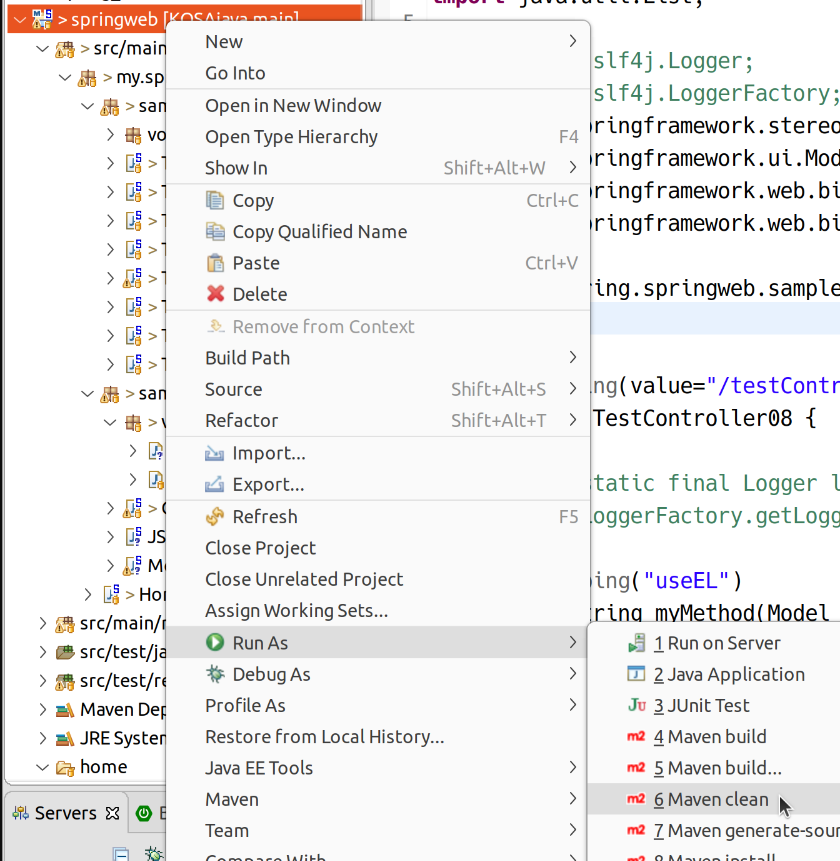
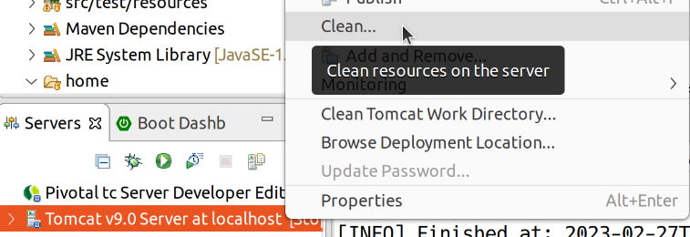
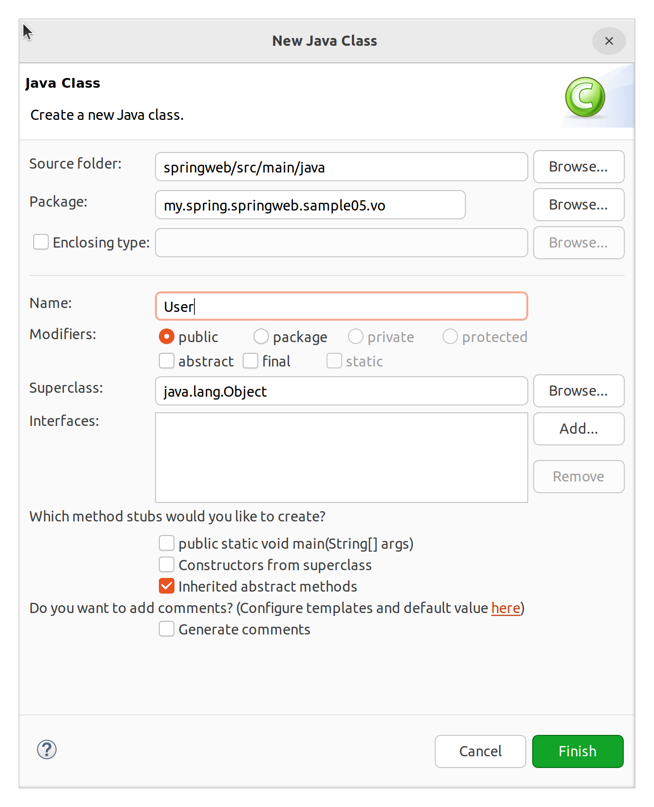
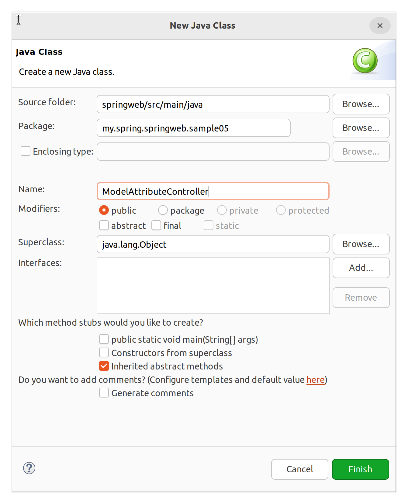
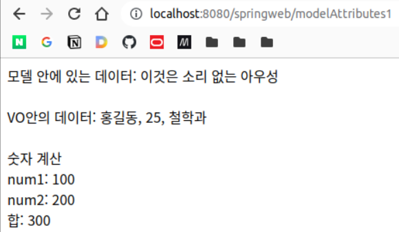

# 스프링 조금 더

## Log4j2

### 개요

현재 의존성으로 1버전대와 2버전대가 같이 잡혀있음. 2버전대만 사용하기로 하고, pom.xml에서 1버전대 모두 제거

&nbsp;

**pom.xml**

```xml
	<properties>
		<java-version>1.8</java-version> 
		<org.springframework-version>5.3.23</org.springframework-version>
		<org.aspectj-version>1.9.9.1</org.aspectj-version>
		<!-- <org.slf4j-version>1.7.36</org.slf4j-version> -->
		<log4j2.version>2.17.1</log4j2.version>
	</properties>
```

1버전대 버전 변수 주석처리 → 그 후 아래에 오류나는 부분 주석처리

그 후 소스코드에서 log4j 1.x를 사용하는 부분 주석처리 (오류나있는 부분)

&nbsp;

**[덤] 프로젝트 초기화 하는 방법**






이제 log4j 1.x 설정파일(src/main/resources/log4j.xml)도 필요 없다. 물론 지우지 않아도 무방하다.

&nbsp;

**web.xml 설정 변경**

log4j 2.x를 사용하기 위해 설정을 추가한다.

src/main/webapp/WEB-INF/web.xml

```xml
     <!-- Log4j 설정 -->
      <context-param>
          <param-name>log4jConfiguration</param-name>
          <param-value>classpath:/log4j2.xml</param-value>
      </context-param>
        
      <listener>
          <listener-class>org.apache.logging.log4j.web.Log4jServletContextListener
          </listener-class>
      </listener>
```

설정 파일을 log4j2.xml로 잡았다. 'classpath:/'는 현재 src/main/resources이다.

&nbsp;

**log4j2.xml 작성**

```xml
<?xml version="1.0" encoding="UTF-8"?>
<Configuration>
  
    <Appenders>
        <File name="File_1" fileName="c:/log_test/myLog_1.log"
            append="true">
            <PatternLayout pattern="%t %-5p %c{2} - %m%n" />
        </File>
        <File name="File_2" fileName="c:/log_test/myLog_2.log"
            append="true">
            <PatternLayout pattern="%d - %m%n" />
        </File>
        <Console name="stdout_1" target="SYSTEM_OUT">
            <PatternLayout pattern="%p == %m == %d%n" />
        </Console>
        <Console name="stdout_2" target="SYSTEM_OUT">
            <PatternLayout pattern="%d{yyyy-MM-dd:HH:mm} >> %m%n" />
        </Console>
    </Appenders>
  
    <Loggers>
  
        <Logger name="case1" level="warn">
            <AppenderRef ref="File_1" />
        </Logger>
  
        <!-- additivity="false" 상위 appender를 상속받지 않습니다. 즉, 여기서는 Root를 제외시키는 역할을 
            합니다. 로그가 중복으로 출력되는것을 제어할 목적으로 사용됩니다. -->
        <Logger name="case2" level="info" additivity="false">
            <AppenderRef ref="File_2" />
            <AppenderRef ref="stdout_1" />
        </Logger>
  
        <Logger name="case3" level="debug" additivity="false">
            <AppenderRef ref="stdout_1" />
            <AppenderRef ref="File_1" />
        </Logger>
  
  
        <Root level="INFO">
            <AppenderRef ref="stdout_2" />
        </Root>
    </Loggers>
  
</Configuration>
```

- \<Appenders>: 로그 출력 방향
    - \<File>: 파일에 로그를 출력하고자 할 때 사용
        - name: 어펜더 이름
        - fileName: 파일 이름 (디렉토레 생성해놔야 함)
        - append: 기존 파일에 이어서 내용 추가
    - \<Console>: 콘솔에 출력
        - name="stdout_1": 어펜더 이름
        - target="SYSTEM_OUT": 표준 출력
        - \<PatternLayout>: 출력 패턴 지정
- \<Loggers>
    - \<Logger>: 이름과 로그 레벨 지정 가능. 특정 레벨에 대한 출력 destination 지정. 지정한 레벨 이상의 로그를 기록
    - \<Root>: 설정하지 않은 경우 기본값

### 테스트 실습

sample03 패키지 작성


**sample03.LogTestController**

```java
package my.spring.springweb.sample03;

import org.apache.logging.log4j.LogManager;
import org.apache.logging.log4j.Logger;
import org.springframework.stereotype.Controller;
import org.springframework.web.bind.annotation.RequestMapping;

@Controller
public class LogTestController {

	Logger log = LogManager.getLogger("case3"); // *중요* <Logger> name
	
	@RequestMapping(value = "/log1")
	public String myMethod1() {
		log.debug("소리 없는 아우성")
		
		return "sample03/logview";
	}
}
```

임포트 주의

로그가 콘솔과 파일에 잘 출력된다.

### @PathVariable

#### 설명

클라이언트로부터 값을 가져오는 어노테이션 중 하나.

주로 REST API를 구현할 때 사용

ex> http://localhost:8080/springweb/mybook/3
    http://localhost:8080/springweb/mybook/13
     http://localhost:8080/springweb/mybook/76
     
쿼리 스트링(?로 시작, 키와 값)과는 다르다. URL 자체에 클라이언트로부터 들어온 값이 들어있다.

#### 실습

예제 압축 파일을 풀어 src/main/webapp/resources/images에 복사

sample04 패키지 생성 및 PathController 작성

```java
package my.spring.springweb.sample04;

import org.springframework.stereotype.Controller;
import org.springframework.ui.Model;
import org.springframework.web.bind.annotation.PathVariable;
import org.springframework.web.bind.annotation.RequestMapping;

@Controller
public class PathController {

	@RequestMapping(value = "/character/detail/{name}/{number}")
	public String handler1(@PathVariable("name") String name,
			@PathVariable("number") int num,
			Model model) {
		
		if(name.equals("kakao")) {
			if(num == 1) {
				model.addAttribute("imgname", "ryan");
			} else if (num == 2) {
				model.addAttribute("imgname", "apeach");
			} else if (num == 3) {
				model.addAttribute("imgname", "frodoneo");
			}
		}
		
		if(name.equals("line")) {
			if(num == 1) {
				model.addAttribute("imgname", "brown");
			} else if (num == 2) {
				model.addAttribute("imgname", "james");
			} else if (num == 3) {
				model.addAttribute("imgname", "cony");
			}
		}
		
		return "sample04/detailView";
	}
}

```

@RequestMapping의 value 옵션에 '{value}'를 써서 변수를 넣을 수 있음. 이 값은 핸들러 메서드의 패러미터 자리에 @PathVariable 어노테이션을 써서 주입할 수 있음.

&nbsp;

**views/sample04/detailView.jsp**

```jsp
<%@ page language="java" contentType="text/html; charset=UTF-8"
    pageEncoding="UTF-8"%>
<%@ taglib uri="http://java.sun.com/jsp/jstl/core" prefix="c" %>
<%@ taglib uri="http://java.sun.com/jsp/jstl/fmt" prefix="fmt"%>
<!DOCTYPE html>
<html>
<head>
<meta charset="UTF-8">
<title>Insert title here</title>
</head>
<body>
	
</body>
</html>
```


### @ModelAttributes

#### 용도

- Request Body의 내용을 parameter VO로 받을 때 (아까 했던 것)
- method에 사용
- sessionAttribute와 같이 사용

#### method에 사용

sample05, sample05.vo 패키지 생성



**sample05.vo.User**

```java
package my.spring.springweb.sample05.vo;

import lombok.AllArgsConstructor;
import lombok.Data;
import lombok.NoArgsConstructor;

@Data
@NoArgsConstructor
@AllArgsConstructor
public class User {

	private int userNumber;
	private String userName;
	private String userDept;
	
}

```

&nbsp;



```java
package my.spring.springweb.sample05;

import org.apache.logging.log4j.LogManager;
import org.apache.logging.log4j.Logger;
import org.springframework.stereotype.Controller;
import org.springframework.web.bind.annotation.ModelAttribute;
import org.springframework.web.bind.annotation.RequestMapping;

@Controller
public class ModelAttributeController {

	Logger log = LogManager.getLogger("case3");
	
	// 이름을 명시해줘야 함.
	// 해당 클래스 내의 핸들러가 실행되기 전에 이 메서드가 자동으로 호출됨
	// 리턴 값이 Model에 자동으로 등록됨
	@ModelAttribute("v1")
	public String createString() {
		log.debug("문자열 객체 생성");
		return "이것은 소리 없는 아우성";
	}
	
	@RequestMapping(value = "/modelAttributes1")
	public String myMethod1() {
		log.debug("Handler Invoked");
		return "sample05/modelResult";
	}
}
```

메서드 위에 @ModelAttribute를 붙일 수 있다. 이때에는 이름을 명시해줘야 한다.  
그럼 해당 클래스의 핸들러가 실행되기 전에 메서드가 자동으로 호출되며, 그 리턴값이 Model에 등록된다.

&nbsp;

**views/sample05/modelResult.jsp**

```java
<%@ page language="java" contentType="text/html; charset=UTF-8"
    pageEncoding="UTF-8"%>
<%@ taglib uri="http://java.sun.com/jsp/jstl/core" prefix="c" %>
<%@ taglib uri="http://java.sun.com/jsp/jstl/fmt" prefix="fmt"%>
<!DOCTYPE html>
<html>
<head>
<meta charset="UTF-8">
<title>Insert title here</title>
</head>
<body>
	모델 안에 있는 데이터: 
	${ v1 }
</body>
</html>
```


그럼 하나 더 늘려보자.

```java
package my.spring.springweb.sample05;

import org.apache.logging.log4j.LogManager;
import org.apache.logging.log4j.Logger;
import org.springframework.stereotype.Controller;
import org.springframework.web.bind.annotation.ModelAttribute;
import org.springframework.web.bind.annotation.RequestMapping;

import my.spring.springweb.sample05.vo.User;

@Controller
public class ModelAttributeController {

	Logger log = LogManager.getLogger("case3");
	
	// 이름을 명시해줘야 함.
	// 해당 클래스 내의 핸들러가 실행되기 전에 이 메서드가 자동으로 호출됨
	// 리턴 값이 Model에 자동으로 등록됨
	@ModelAttribute("v1")
	public String createString() {
		log.debug("문자열 객체 생성");
		return "이것은 소리 없는 아우성";
	}
	
	@ModelAttribute("v2")
	public User createUser() {
		log.debug("문자열 객체 생성");
		User user = new User(25, "홍길동", "철학과");
		return user;
	}
	
	@RequestMapping(value = "/modelAttributes1")
	public String myMethod1() {
		log.debug("Handler Invoked");
		return "sample05/modelResult";
	}
}

```

핸들러 실행 전 createString()이나 createUser()가 실행될텐데, 그 순서는 알 수 없다.

```jsp
<%@ page language="java" contentType="text/html; charset=UTF-8"
    pageEncoding="UTF-8"%>
<%@ taglib uri="http://java.sun.com/jsp/jstl/core" prefix="c" %>
<%@ taglib uri="http://java.sun.com/jsp/jstl/fmt" prefix="fmt"%>
<!DOCTYPE html>
<html>
<head>
<meta charset="UTF-8">
<title>Insert title here</title>
</head>
<body>
	모델 안에 있는 데이터: 
	${ v1 }<br><br>
	
	VO안의 데이터:
	${ v2.userName }, ${ v2.userNumber }, ${ v2.userDept }
</body>
</html>
```


이번에는 이 값을 핸들러로 가져와본다.

```java
	@ModelAttribute("data1")
	public int createNumber1() {
		log.debug("숫자 1 생성");
		return 100;
	}
	
	@ModelAttribute("data2")
	public int createNumber2() {
		log.debug("숫자 2 생성");
		return 200;
	}
	
	@RequestMapping(value = "/modelAttributes1")
	public String myMethod1(@ModelAttribute("data1") int num1, // VO로 Request Body를 가져온 것이 아니라, 위의 메서드의 리턴값이 주입
			@ModelAttribute("data2") int num2,
			Model model) {
		log.debug("Handler Invoked");
		
		model.addAttribute("sum", num1 + num2)
		return "sample05/modelResult";
	}
```

```jsp
<%@ page language="java" contentType="text/html; charset=UTF-8"
    pageEncoding="UTF-8"%>
<%@ taglib uri="http://java.sun.com/jsp/jstl/core" prefix="c" %>
<%@ taglib uri="http://java.sun.com/jsp/jstl/fmt" prefix="fmt"%>
<!DOCTYPE html>
<html>
<head>
<meta charset="UTF-8">
<title>Insert title here</title>
</head>
<body>
	모델 안에 있는 데이터: 
	${ v1 }<br><br>
	
	VO안의 데이터:
	${ v2.userName }, ${ v2.userNumber }, ${ v2.userDept }<br><br>
	
	숫자 계산<br>
	num1: ${ data1 }<br>
	num2: ${ data2 }<br>
	합: ${ sum }<br>
</body>
</html>
```




