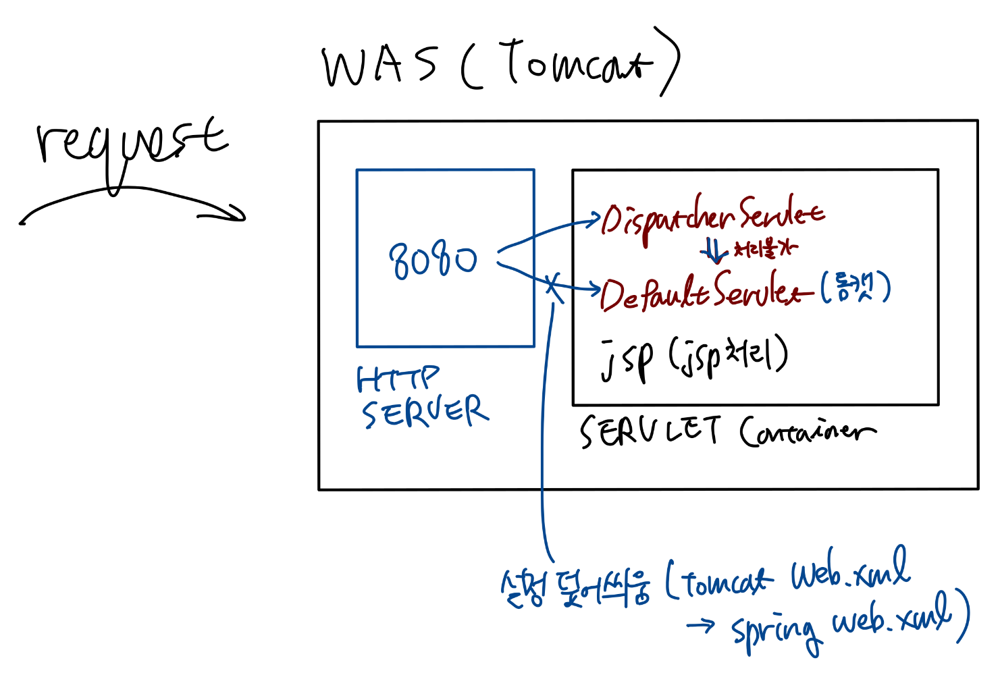

# 스프링 돌아보기

## 여러가지 어노테이션

@Autowired는 우선 타입을 기준으로 빈을 찾아 자동주입. 타입이 같은 필드가 없으면 이름으로 자동주입하게 됨.

처음부터 이름을 기준으로 찾고 싶으면 @Autowired와 함께 @Qualifier 사용

@Resource는 @Autowired와 거의 기능상 동일함. 그런데 우선순위가 이름이 먼저이고, 그다음 못찾으면 타입으로 찾게 된다는 차이가 있음.

일반적으로는 타입을 기준으로 찾는 @Autowired를 사용함.

여기까지 Spring IoC를 배울때 나왔던 어노테이션이고, Web MVC에서는 새로운 어노테이션이 등장함.

@Service, @Controller, @Repository  
위 각각은 @Component의 하위 어노테이션. 각각은 @Component 및 다른 하위 어노테이션과 비교할 때 기능 상 차이는 없다고 봐도 무방함. 다만 의미를 분명하게 해서 코드의 가독성을 높이려는 것. (@Controller는 예외. 특별한 기능이 있음) 

## 전체 구조 간단하게

### 전체

본래 톰캣에는 디폴트 서블릿이 있으며, '/'로 할당되어 있음. (톰캣의 web.xml 참조)  
그러나 우리가 스프링 프로젝트의 web.xml에서 '/'에 맵핑되는 기본 서블릿을 DispatcherServlet로 잡고 설정을 덮어씌움. servlet-context.xml에서 DispatcherServlet이 처리하지 못한 것을 디폴트 서블릿이 받아 처리하도록 설정을 손봐준 것임.

### 루트 웹 어플리케이션 컨테이너와 서블릿 웹 어플리케이션 컨테이너

두 컨테이너는 별개가 아니며, 루트 웹 어플리케이션 컨테이너가 먼저 만들어진 후, 그 자식 컨테이너로 서블릿 웹 어플리케이션 컨테이너가 만들어지게 됨.

서블릿 웹 어플리케이션 컨테이너에는 @Controller로 등록된 컨트롤러 빈이 위치하게 되며, @Service와 @Repository로 등록된 서비스 및 컨트롤러 빈은 루트 웹 어플리케이션 컨테이너에 위치하게 됨.