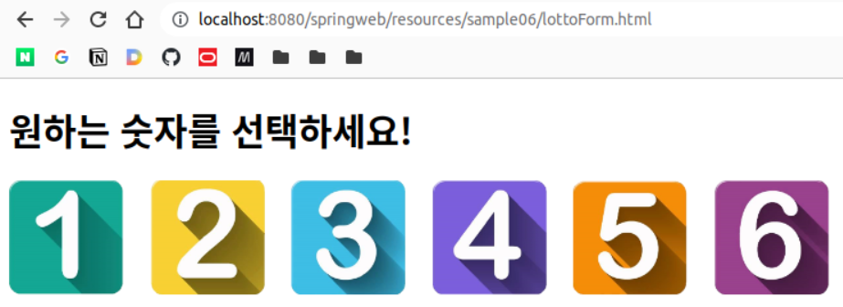
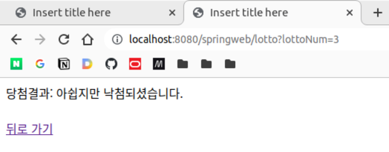
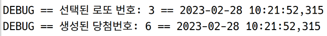

# @Service, @Repository

## HTML 만들기

src/main/webapp/resources에 lottoFrom.html 작성

> - context root: springweb  
> - web root: src/main/webapp  
>     - resources: 정적 리소스  
>     - WEB-INF (클라이언트 직접 접근 불가)  

```html
<!DOCTYPE html>
<html>
<head>
<meta charset="UTF-8">
<title>Insert title here</title>
<style>
div {
    display: inline-block;
    width: 120px;
    height: 120px;
}
  
img {
    width: 100px;
    height: 100px;
}
  
.shadow img {
    transition: .5s ease;
}
  
.shadow img:hover {
    box-shadow: 1px 1px #d9d9d9, 2px 2px #d9d9d9, 3px 3px #d9d9d9, 4px 4px
        #d9d9d9, 5px 5px #d9d9d9, 6px 6px #d9d9d9;
    transform: translateX(-3px);
    transition: .5s ease;
}
</style>
</head>

<body>
	<h1>원하는 숫자를 선택하세요!</h1>
	<div>
		<a href="/springweb/lotto?lottoNum=1">
			
		</a>
	</div>
		<div>
		<a href="/springweb/lotto?lottoNum=2">
			
		</a>
	</div>
		<div>
		<a href="/springweb/lotto?lottoNum=3">
			
		</a>
	</div>
		<div>
		<a href="/springweb/lotto?lottoNum=4">
			
		</a>
	</div>
		<div>
		<a href="/springweb/lotto?lottoNum=5">
			
		</a>
	</div>
		<div>
		<a href="/springweb/lotto?lottoNum=6">
			
		</a>
	</div>
</body>
</html>
```

### VO 만들기

sample06.vo.Lotto

로또 번호 및 당첨 여부 문자열이 들어가는 VO

```java
package my.spring.springweb.sample06.vo;

import lombok.AllArgsConstructor;
import lombok.Data;
import lombok.NoArgsConstructor;

@Data
@NoArgsConstructor
@AllArgsConstructor
public class Lotto {

	private int lottoNum;
	private String result;
}

```

### 컨트롤러 껍데기

sample06.LottoController

```java
package my.spring.springweb.sample06;

import org.springframework.stereotype.Controller;
import org.springframework.web.bind.annotation.GetMapping;
import org.springframework.web.bind.annotation.RequestParam;

@Controller
public class LottoController {
	
	@GetMapping(value = "/lotto")
	public String lottoProcess(@RequestParam int lottoNum) {
		// 서비스 객체를 만들어 로직처리
		
		return null;
	}
}

```

### 서비스 껍데기

sample06.service.LottoService

```java
package my.spring.springweb.sample06.service;

public class LottoService {

	public LottoService() {
	}
	
	public boolean checkLottoNumber() {
		
		return false;
	}
}

```

### 컨트롤러

```java
		LottoService service = new LottoService();
		boolean result = service.checkLottoNumber();
```

원래는 이런 식으로 했지만, 이렇게 하면 클라이언트 접속마다 서비스 객체(DAO 객체도 마찬가지)를 매번 만들어야함. 그러나 서비스는 그 자체로 스테이트리스이므로, 싱글톤으로 운용하여 제공하는 것이 효율적임.

따라서 서비스를 빈으로 등록하여 싱글톤으로 사용해보려고 함.

### 서비스

다시 서비스로 돌아가서 @Service 어노테이션 부착. 그럼 루트 어플리케이션 컨텍스트 내에 빈으로 등록됨

```java
package my.spring.springweb.sample06.service;

import org.springframework.stereotype.Service;

@Service
public class LottoService {

	public LottoService() {
	}
	
	public boolean checkLottoNumber() {
		
		return false;
	}
}

```

### 컨트롤러

```java
package my.spring.springweb.sample06;

import org.springframework.beans.factory.annotation.Autowired;
import org.springframework.stereotype.Controller;
import org.springframework.web.bind.annotation.GetMapping;

import my.spring.springweb.sample06.service.LottoService;
import my.spring.springweb.sample06.vo.Lotto;

@Controller
public class LottoController {
	
	@Autowired
	private LottoService service;
	
	@GetMapping(value = "/lotto")
	public String lottoProcess(/* @ModelAttribute */ Lotto lotto) {
		boolean result = service.checkLottoNumber(lotto);	
		if (result) {
			lotto.setResult("축하합니다. 당첨되셨습니다.");
		} else {
			lotto.setResult("아쉽지만 낙첨되셨습니다.");
		}
		return "sample06/lottoView"; // vo는 이미 @ModelAttribute에 의해 모델에 들어가있음
	}
}
```

### DAO

```java
package my.spring.springweb.sample06.dao;

import java.util.Random;

import org.springframework.stereotype.Repository;

@Repository("lottoDao") // 빈으로 등록; 빈 ID 지정 가능
public class LottoDao {

	public LottoDao() {
	}
	
	public int selectLottoNumber() {
		Random rand = new Random();
		return rand.nextInt(6) + 1; // 1, 2, 3, 4, 5, 6
	}
}
```

### 서비스

```java
package my.spring.springweb.sample06.service;


import org.apache.logging.log4j.LogManager;
import org.apache.logging.log4j.Logger;
import org.springframework.beans.factory.annotation.Autowired;
import org.springframework.beans.factory.annotation.Qualifier;
import org.springframework.stereotype.Service;

import my.spring.springweb.sample06.dao.LottoDao;
import my.spring.springweb.sample06.vo.Lotto;

@Service
public class LottoService {

	Logger log = LogManager.getLogger("case3");
	
	// @Autowired // 타입으로 찾음
	// @Resource(name = "lottoDao") // 이름으로 찾음
	@Autowired
	@Qualifier(value = "lottoDao") // 원래 타입으로 찾지만, 이름으로 찾도록 변경
	private LottoDao dao;
	
	public LottoService() {
	}
	
	public boolean checkLottoNumber(Lotto lotto) {
		// 일반적인 로직처리 진행은 여기서
		// DB처리는 DAO가 필요
		
		boolean result = false;
		int randomNumber = dao.selectLottoNumber(); // 랜덤번호
		
		log.debug("선택된 로또 번호: " + lotto.getLottoNum());
		log.debug("생성된 당첨번호: " + randomNumber);
		
		if (randomNumber == lotto.getLottoNum()) {
			log.debug("당첨");
			result = true;
		}
		return result;
	}
}
```

### 뷰

WEB-INF/views/sample06/lottoView.jsp

```jsp
<%@ page language="java" contentType="text/html; charset=UTF-8"
    pageEncoding="UTF-8"%>
<%@ taglib uri="http://java.sun.com/jsp/jstl/core" prefix="c" %>
<%@ taglib uri="http://java.sun.com/jsp/jstl/fmt" prefix="fmt"%>
<!DOCTYPE html>
<html>
<head>
<meta charset="UTF-8">
<title>Insert title here</title>
</head>
<body>
	당첨결과: ${ lotto.result }
	<br><br>
	
	<a href="${ header.referer }">뒤로 가기</a>
</body>
</html>
```









