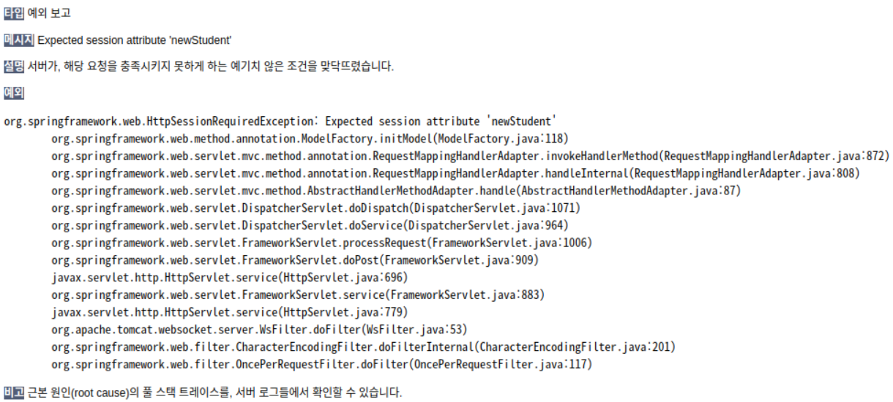
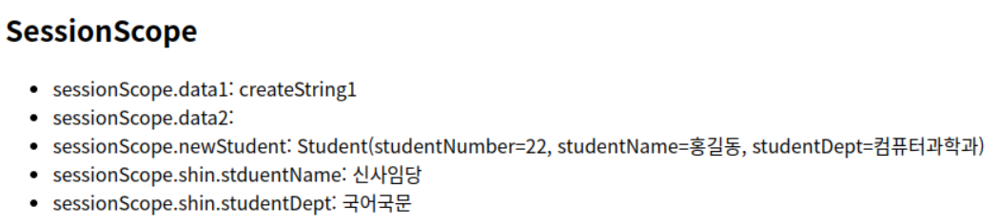

# 세션

## 세션 객체

정확히는 HttpSession.  
Request.getSession()을 통해 얻어올 수 있었음.

스프링프레임워크에서도 이렇게 하면 안된다는 것은 아니지만, 매번 같은 코드를 중복적으로 사용해야함. 대안으로 세션을 편하게 사용할 수 있도록 한 것이 @SessionAttributes (@SessionAttribute와 혼동 주의. 역할이 다름)

- @SessionAttributes
    - 세션에 값을 저장하거나 찾을 수 있도록 지정. 이 어노테이션이 일을 하는 것이 아니라, 이걸 붙여놓으면 세션에서 찾거나 저장하는 것이 가능해짐
    - 위치: 컨트롤러 위에 붙임
- @SessionAttribute
    - 필터 등 컨트롤러 외부에서 세션으로 저장한 객체를 사용하기 위해 사용
    - 위치: 메서드(핸들러, 일반 메서드) 인자 앞에 붙임
    - 쓸 일이 많지는 않음

## 실습 1: 리퀘스트 스코프

#### HTML 및 JS 설정

resources/sample07/sessionForm.html

```html
<!DOCTYPE html>
<html>
<head>
<meta charset="UTF-8">
<title>Insert title here</title>

<!-- jQuery -->
<script src="https://code.jquery.com/jquery-2.2.4.min.js" integrity="sha256-BbhdlvQf/xTY9gja0Dq3HiwQF8LaCRTXxZKRutelT44=" crossorigin="anonymous"></script>

<script src="../js/common.js"></script>
</head>
<body>

</body>
</html>
```

&nbsp;

resources/sample07/js/common.js

#### HTML 작성

```html
<!DOCTYPE html>
<html>
<head>
<meta charset="UTF-8">
<title>Insert title here</title>

<!-- jQuery -->
<script src="https://code.jquery.com/jquery-2.2.4.min.js" integrity="sha256-BbhdlvQf/xTY9gja0Dq3HiwQF8LaCRTXxZKRutelT44=" crossorigin="anonymous"></script>

<script src="../js/common.js"></script>
</head>
<body>
	<h1>학생 정보 등록</h1>
	<hr>
	<form id="myForm" action="" method="post">
		Action:
		<select>
			<option selected="selected">/springweb/sessionAttributesTest01</option>
			<option>/springweb/sessionAttributesTest02</option>
			<option>/springweb/sessionAttributesTest03</option>
			<option>/springweb/sessionAttributesTest04</option>
			<option>/springweb/sessionAttributesTest05</option>
			<option>/springweb/sessionAttributesTest06</option>
			<option>/springweb/sessionAttributesTest07</option>
		</select>
		<br><br>
		
		전달할 메시지: <input type="text" name="msg"><br>
		
		학생 번호: <input type="number" name="studentNumber"><br>
		
		학생 이름: <input type="text" name="studentName"><br>
		
		학생 이름: <input type="text" name="studentDept"><br>
		<br><br>
		
		<input type="submit" value="등록" onclick="myFunc()">
		
	</form>
</body>
</html>
```

```javascript
function myFunc() {
	// 사용자가 선택한 URL을 form의 action에 지정
	let url = $('#myForm > select > option:selected').text();
	$('#myForm').attr('action', url);
	// 이후 디폴트 이벤트가 발동되어 submit됨
}
```

#### vo 작성

커맨드 객체로 사용할 VO 작성


```java
package my.spring.springweb.sample07.vo;

import lombok.AllArgsConstructor;
import lombok.Data;
import lombok.NoArgsConstructor;

@Data
@NoArgsConstructor
@AllArgsConstructor
public class Student {

	// 커맨드 객체로 쓸 것이기 때문에
	// 클라이언트 측 폼 name과 필드명이 같아야 함

	private int studentNumber;
	private String studentName;
	private String studentDept;
}

```

#### 컨트롤러 생성

```java
package my.spring.springweb.sample07;

import org.apache.logging.log4j.LogManager;
import org.apache.logging.log4j.Logger;
import org.springframework.stereotype.Controller;
import org.springframework.web.bind.annotation.ModelAttribute;
import org.springframework.web.bind.annotation.PostMapping;
import org.springframework.web.bind.annotation.RequestMapping;
import org.springframework.web.bind.annotation.RequestParam;

import my.spring.springweb.sample07.vo.Student;

@Controller
@RequestMapping(value = "sessionAttributesTest01")
public class SessionAttributeController01 {

	Logger log = LogManager.getLogger("case3");
	
	// 핸들러 호출 직전 아래 메서드가 호출됨
	// 아래 메서드의 리턴값이 모델에 저장됨. key는 "data1"
	@ModelAttribute("data1")
	public String createString1() {
		log.debug("[Invoked] createString1");
		return "createString1";
	}
	
	// 역시 핸들러 호출 직전 아래 메서드가 호출됨
	// createString1, createString2 간 호출 순서는 알 수 없음.
	@ModelAttribute("data2")
	public String createString2() {
		log.debug("[Invoked] createString2");
		return "createString2";
	}	
	
	@PostMapping
	public String handler(@ModelAttribute("data1") String str1,
			@ModelAttribute("data2") String str2, // 위의 리턴값을 인자로 주입받음
			@RequestParam(value = "msg") String strFromReq, // 리퀘스트 오는 데이터 중 VO에 없는 것
			@ModelAttribute("newStudent") Student studentVO) { // 레퀘스트 데이터를 VO로 받음 (키값 지정)
		
		log.debug("[Invoked] handler(): " + str1 + ", " + str2);
		log.debug("\t msg: " + strFromReq);
		log.debug("\t student: " + studentVO);
		
		return "sample07/sessionResult01";
	}
}

```

#### JSP 작성

```jsp
<%@ page language="java" contentType="text/html; charset=UTF-8"
    pageEncoding="UTF-8"%>
<%@ taglib uri="http://java.sun.com/jsp/jstl/core" prefix="c" %>
<%@ taglib uri="http://java.sun.com/jsp/jstl/fmt" prefix="fmt"%>
<!DOCTYPE html>
<html>
<head>
<meta charset="UTF-8">
<title>Insert title here</title>
</head>
<body>
	<h1>수행된 결과</h1>
	<h2>RequestScope</h2>
	<ul>
		<li>requestScope.data1: ${ requestScope.data1 }</li> <!-- createString1 -->
		<li>requestScope.data2: ${ requestScope.data2 }</li> <!-- createString2 -->
		<li>param.msg: ${ param.msg }</li>
		<li>requestScope.studentVO: ${ requestScope.studentVO }</li>
		<li>requestScope.student: ${ requestScope.student }</li>
		<li>requestScope.newStudent: ${ requestScope.newStudent }</li>
	</ul>
</body>
</html>
```


리퀘스트 스코프의 값이므로 요청이 소멸되면 사라짐.

## 실습 2: 세션 스코프

### 2-1

컨트롤러를 수정해본다.

클래스 레벨에 @SessionAttributes를 달아보자.

```
@SessionAttributes(value = {"a", "b", "c"})
```

위와 같이 쓰면, 모델에 a, b, c 키로 저장되는 데이터가 세션에도 저장된다.  'value ='은 생략할 수 있다. 


```java
@Controller
@SessionAttributes({"data1"})
@RequestMapping(value = "sessionAttributesTest01")
public class SessionAttributeController01 {
    
    // 후략
```

```jsp
<%@ page language="java" contentType="text/html; charset=UTF-8"
    pageEncoding="UTF-8"%>
<%@ taglib uri="http://java.sun.com/jsp/jstl/core" prefix="c" %>
<%@ taglib uri="http://java.sun.com/jsp/jstl/fmt" prefix="fmt"%>
<!DOCTYPE html>
<html>
<head>
<meta charset="UTF-8">
<title>Insert title here</title>
</head>
<body>
	<h1>수행된 결과</h1>
	<h2>RequestScope</h2>
	<ul>
		<li>requestScope.data1: ${ requestScope.data1 }</li> <!-- createString1 -->
		<li>requestScope.data2: ${ requestScope.data2 }</li> <!-- createString2 -->
		<li>param.msg: ${ param.msg }</li>
		<li>requestScope.studentVO: ${ requestScope.studentVO }</li>
		<li>requestScope.student: ${ requestScope.student }</li>
		<li>requestScope.newStudent: ${ requestScope.newStudent }</li>
	</ul>
	<h2>SessionScope</h2>
	<ul>
		<li>sessionScope.data1: ${ requestScope.data1 }</li> <!-- createString1 -->
		<li>sessionScope.data2: ${ requestScope.data2 }</li> <!-- createString2 -->
		<li>sessionScope.newStudent: ${ requestScope.newStudent }</li>
	</ul>
</body>
</html>
```


### 2-2

#### 세션을 직접 다루는 것과 @SessionAttributes를 통해 다루는 것의 차이

```java
	@ModelAttribute("data2")
	public String createString2(HttpServletRequest request) {
		// 세션 직접 이용
		//	true => 접속 클라리언트에 대한 세션이 없으면 만들고 레퍼런스를 가져옴.
		//			있으면 레퍼런스만 가져옴.
		HttpSession session = request.getSession(true);
		Student student = new Student(30, "신사임당", "국어국문");
		session.setAttribute("currentStudent", student); 
		
		log.debug("[Invoked] createString2");
		return "createString2";
	}	
```

이 작업은 세션을 직접 다루며, 세션 내의 모든 객체에 접근할 수 있다. @SessionAttributes를 쓰면 지정한 특정 어트리뷰트에만 접근할 수 있으며 세션 자체에는 접근할 수 없다.

#### 테스트 1
직전의 컨트롤러를 02로 복사한다.  
직전의 JSP도 02를 붙여 복사한다.

```java
	@ModelAttribute("data2")
	public String createString2(HttpServletRequest request) {
		// 세션 직접 이용
		//	true => 접속 클라리언트에 대한 세션이 없으면 만들고 레퍼런스를 가져옴.
		//			있으면 레퍼런스만 가져옴.
		HttpSession session = request.getSession(true);
		Student student = new Student(30, "신사임당", "국어국문");
		session.setAttribute("currentStudent", student); 
		
		log.debug("[Invoked] createString2");
		return "createString2";
	}	
	
	@PostMapping
	public String handler(@ModelAttribute("data1") String str1,
			@ModelAttribute("data2") String str2, // 위의 리턴값을 인자로 주입받음
			@RequestParam(value = "msg") String strFromReq, // 리퀘스트 오는 데이터 중 VO에 없는 것
			@ModelAttribute("newStudent") Student studentVO) { // 레퀘스트 데이터를 VO로 받음 (키값 지정)
		
		log.debug("[Invoked] handler(): " + str1 + ", " + str2);
		log.debug("\t msg: " + strFromReq);
		log.debug("\t student: " + studentVO);
		
		return "sample07/sessionResult02";
	}
```


#### 테스트 2

03으로 컨트롤러와 JSP를 복사한다.

```java
package my.spring.springweb.sample07;

import javax.servlet.http.HttpServletRequest;
import javax.servlet.http.HttpSession;

import org.apache.logging.log4j.LogManager;
import org.apache.logging.log4j.Logger;
import org.springframework.stereotype.Controller;
import org.springframework.web.bind.annotation.ModelAttribute;
import org.springframework.web.bind.annotation.PostMapping;
import org.springframework.web.bind.annotation.RequestMapping;
import org.springframework.web.bind.annotation.RequestParam;
import org.springframework.web.bind.annotation.SessionAttributes;

import my.spring.springweb.sample07.vo.Student;

@Controller
@SessionAttributes({"data1", "shin"})
@RequestMapping(value = "/sessionAttributesTest03")
public class SessionAttributeController03 {

	Logger log = LogManager.getLogger("case3");
	
	@ModelAttribute("data1")
	public String createString1() {
		log.debug("[Invoked] createString1");
		return "createString1";
	}
	
	@ModelAttribute("shin")
	public Student createString2(HttpServletRequest request) {
		// 세션 직접 이용
		//	true => 접속 클라리언트에 대한 세션이 없으면 만들고 레퍼런스를 가져옴.
		//			있으면 레퍼런스만 가져옴.
		HttpSession session = request.getSession(true);
		Student student = new Student(30, "신사임당", "국어국문");
		
		log.debug("[Invoked] createString2");
		return student;
	}	
	
	@PostMapping
	public String handler(@ModelAttribute("data1") String str1,
			@ModelAttribute("data2") String str2, // 위의 리턴값을 인자로 주입받음
			@RequestParam(value = "msg") String strFromReq, // 리퀘스트 오는 데이터 중 VO에 없는 것
			@ModelAttribute("newStudent") Student studentVO) { // 레퀘스트 데이터를 VO로 받음 (키값 지정)
		
		log.debug("[Invoked] handler(): " + str1 + ", " + str2);
		log.debug("\t msg: " + strFromReq);
		log.debug("\t student: " + studentVO);
		
		return "sample07/sessionResult03";
	}
}

```

```jsp
<%@ page language="java" contentType="text/html; charset=UTF-8"
    pageEncoding="UTF-8"%>
<%@ taglib uri="http://java.sun.com/jsp/jstl/core" prefix="c" %>
<%@ taglib uri="http://java.sun.com/jsp/jstl/fmt" prefix="fmt"%>
<!DOCTYPE html>
<html>
<head>
<meta charset="UTF-8">
<title>Insert title here</title>
</head>
<body>
	<h1>수행된 결과</h1>
	<h2>RequestScope</h2>
	<ul>
		<li>requestScope.data1: ${ requestScope.data1 }</li> <!-- createString1 -->
		<li>requestScope.data2: ${ requestScope.data2 }</li> <!-- createString2 -->
		<li>param.msg: ${ param.msg }</li>
		<li>requestScope.studentVO: ${ requestScope.studentVO }</li>
		<li>requestScope.student: ${ requestScope.student }</li>
		<li>requestScope.newStudent: ${ requestScope.newStudent }</li>
	</ul>
	<h2>SessionScope</h2>
	<ul>
		<li>sessionScope.data1: ${ sessionScope.data1 }</li> <!-- createString1 -->
		<li>sessionScope.data2: ${ sessionScope.data2 }</li> <!-- createString2 -->
		<li>sessionScope.newStudent: ${ sessionScope.newStudent }</li>
		<li>sessionScope.shin.stduentName: ${ sessionScope.shin.studentName }</li>
		<li>sessionScope.shin.studentDept: ${ sessionScope.shin.studentDept }</li>
	</ul>
</body>
</html>
```

@SessionAttributes({ "shin"})를 사용하여 값을 모델과 세션 동시에 저장하였다.  
앞으로는 어지간하면 세션을 직접 다루지 않고 이 방법을 이용한다.

#### 테스트 3

```java
package my.spring.springweb.sample07;

// 중략

public class SessionAttributeController04 {
    
	@ModelAttribute("data2")
	public String createString2(Model model) {
		Student student = new Student(30, "신사임당", "국어국문");
		
		model.addAttribute("shin", student);
		
		log.debug("[Invoked] createString2");
		return "createString1";
	}
    
    // 후략
```

위와 같이 컨트롤러로 등록된 클래스의 내부 메소드는 핸들러가 아니더라도 Model을 주입받을 수 있다.

모델에 shin을 넣을 때, shin이라는 키가 @SessionAttributes 어노테이션에 등록되어있기 때문에 세션에도 들어가게 된다.

#### 테스트 4


#### 테스트 5

같은 코드에 @SessionAttributes 어노테이션 값을 바꾸었다.

```
@SessionAttributes({"data1", "shin", "newStudent"})
```

그럼 이러한 오류가 발생한다.



이는 핸들러 메서드에서 

```
	@PostMapping
	public String handler(@ModelAttribute("data1") String str1,
			@ModelAttribute("data2") String str2,
			@RequestParam(value = "msg") String strFromReq,
			@ModelAttribute("newStudent") Student studentVO) { 
```

마지막 인자에 대해,  
우리는 사용자로부터의 입력을 VO에 담아 커맨드 객체를 생성하고, 모델에 "newStudent"라는 키로 값을 등록하는 작업을 의도한 것이다.

그러나 이 경우, newStudent가 @SessionAttributes에 등록되어있기 떄문에,  @ModelAttribute는 newStudent라는 키의 데이터가 세션 스코프에 있는지를 찾아 맵핑해주려고 시도한다. 그런데 현재 세션에는 newStudent라는 키로 추가된 값이 없으므로 오류가 발생하게 된 것이다.

_**오류가 나지 않도록 하려면,  **_
아래 메서드를 하나 더 만들어 핸들러가 호출되기 전 세션에 해당 키의 값을 추가하면 된다.

```
// SessionAttributeController06
	@ModelAttribute("newStudent")
	public Student createString3(Model model) {
		Student student = new Student();
		
		log.debug("[Invoked] createString3");
		return student;
	}
```

그럼 핸들러 실행 전 createString3()이 호출되고,  빈 커맨드 객체를 newStudent라는 키로 모델에 넣는다. 이때 @SessionAttributes 설정에 의해 세션에도 newStudent라는 키로 빈 객체가 들어간다.

이후 핸들러가 호출되면 

```
@ModelAttribute("newStudent") Student studentVO
```

에서  @SessionAttributes 설정을 읽고, newStudent를 세션에서 찾으며, 빈 객체로 가져와 인자로 넣어준다. 즉, 여기서는 커맨드 객체를 세션에서 가져오며, 새로 만들지는 않는 것이다. 그 다음 사용자로부터 들어온 값을 해당 객체에 세터를 통해서 넣어주게 된다.  
이렇게 하면, 사용자 입력 데이터를 컨트롤러에서만 다룰 수 있는 것이 아니라, 모델에도, 세션에도 자동으로 들어간다는 장점이 있다.

(원래 @SessionAttributes 설정이 없으면,  @ModelAttribute는 가장 인자가 적은 생성자로 객체를 생성하고, 사용자로부터의 데이터를 세터를 이용하여 객체에 추가, 해당 객체를 모델에 넣어준다.)

**즉, @SessionAttributes 어노테이션은 두 가지 기능을 한다. 먼저, 모델에 값을 저장할 때 세션에도 저장할 값을 지정한다. 또한, 핸들러 메서드에서 세션으로부터 가져올 값을 지정한다.**



**어디에 써먹나?**
- 페이지 넘어가도 데이터를 유지해야할 때
    - 하나의 작업을 여러 페이지로 나누는 경우,
    - 예컨대 회원가입시 정보를 여러 페이지에 나누어 받는 기입하는 경우, 이전으로 돌아가도 정보가 날라가지 않음. Dao Insert 후 세션을 날리면 됨.
- 데이터 입력, 수정 시 중복 요청을 막을 때
    - 저장 버튼을 여러번 클릭시 순차적으로 DB로 요청 전달됨.
    - 이 기능을 응용하여 중복 요청 방지 가능

