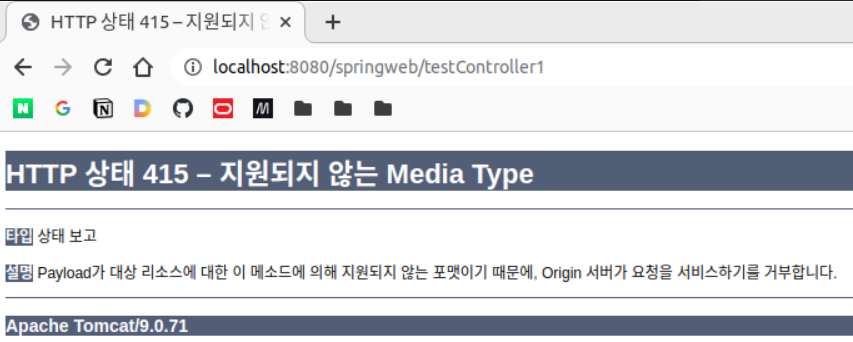
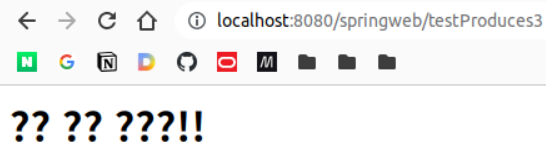
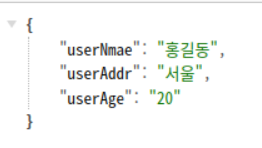
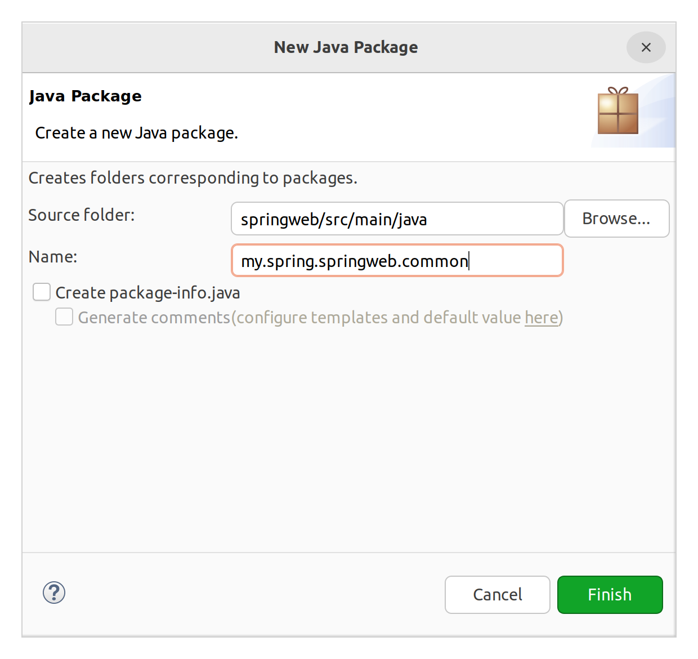
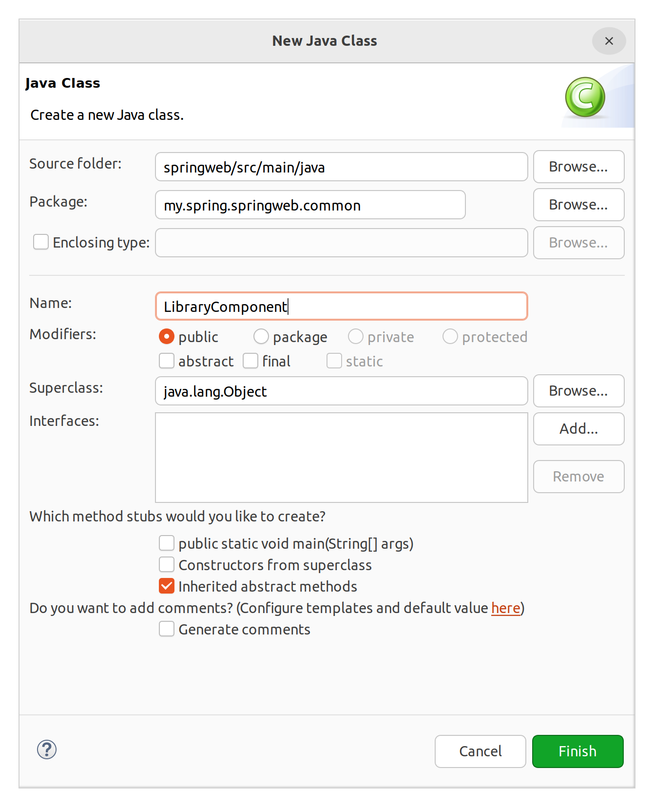
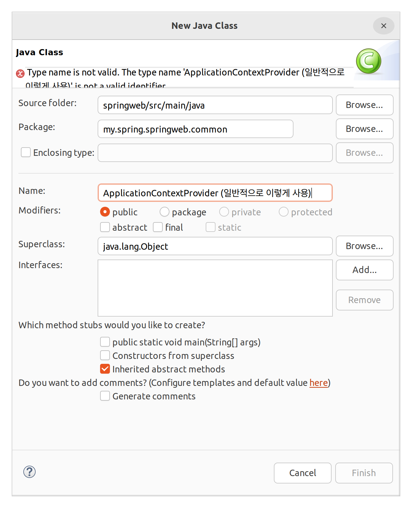

# @RequestMapping 더보기

@RequestMapping(value='URL', ____)

## consumes

### 개요

- consumes
    - Client의 request를 제한하는 용도: 같은 URL이라도 원하는 요청만 골라 받을 수 있음
    - Request의 헤더 정보 중 content-type이 기준이 됨. content-type은 Request Body의 유형이 무엇인지를 지정하는 헤더. MIME 타입으로 데이터의 형식을 나타냄.
        > HTTP Request 구조  
        > - start line
        > - header
        > - body
    - 다만, GET 요청을 받을 수 없게됨.
        - Get 요청시에는 정보를 URL 말단 Query String에 붙여 전송함. 이때에는 HTTP Request의 Start Line의 URL에 데이터가 실리는 것으로, Request Body에는 데이터가 실리지 않고, content-type 헤더 자체가 존재하지 않음.
        - 따라서, consumes 옵션을 통해 content-type을 기준으로 데이터를 가리면, GET 요청시에는 content-type 헤더가 없으므로 요청이 무조건적으로 필터링된다는 것.

### 실습

```html
<!-- sample08/requestMappingConsumesTest.html -->

<!DOCTYPE html>
<html>
<head>
<meta charset="UTF-8">
<title>Insert title here</title>
</head>
<body>
	<h1>Test Link</h1>
	<hr>
	GET 방식으로 호출(header에 content-type 없음):
	<a href="/springweb/testController1">comsumes의 content-type: application/json</a>
</body>
</html>
```

```java
// smaple08.RequestMappingComsumesController

package my.spring.springweb.sample08;

import org.apache.logging.log4j.LogManager;
import org.apache.logging.log4j.Logger;
import org.springframework.stereotype.Controller;
import org.springframework.web.bind.annotation.RequestMapping;
import org.springframework.web.bind.annotation.RequestMethod;

@Controller
public class RequestMappingComsumesController {

	Logger log = LogManager.getLogger("case3");
	
	@RequestMapping(value = "/testController1", method = RequestMethod.GET,
			consumes = {"application/json", "application/xml"})
	public String myMethod() {
		log.debug("GET 방식 요청 받음");
		
		return null;
	}
}

```

크롬에서 개발자도구를 연 상태에서 html로 접속하여 링크를 눌러본다.



HTTP 415가 반환되었다. 우선 관리자 도구에서 content-type이 헤더에 없음을 확인할 수 있다.  
GET 방식 요청이므로 content-type이 헤더에 없어 415 코드가 응답이 반환된 것이다. 따라서 GET 요청을 받아야하는 경우 consumes를 지정하면 곤란하다.

그럼 HTML을 수정하여 POST 방식으로 요청해보자.

```html
<!DOCTYPE html>
<html>
<head>
<meta charset="UTF-8">
<title>Insert title here</title>
</head>
<body>
	<h1>Test Link</h1>
	<hr>
	GET 방식으로 호출(header에 content-type 없음):
	<a href="/springweb/testController1">comsumes의 content-type: application/json</a>
	
	<br><br>
	
	POST 방식으로 호출
	<form action="/springweb/testController2" method="post">
		<input type="submit" value="comsumes의 content-type: application/json">
	</form>
</body>
</html>
```

```java
	@RequestMapping(value = "/testController2", method = RequestMethod.POST,
			consumes = {"application/json"})
	public String myMethod2() {
		log.debug("POST 방식 요청 받음");
		
		return null;
	}
```

역시 동일한 415 코드가 반환된다.

그러나 이번에는 개발자 도구에서 "Content-Type: application/x-www-form-urlencoded" 헤더를 확인할 수 있다. 즉, HTML 폼을 통해 POST 요청을 전송하는 경우 content-type이 application/x-www-form-urlencoded임을 알 수 있다.

이 경우 동일한 415 코드가 반환되기는 했지만, 헤더를 찾지 못해서가 아니라, 컨트롤러에 지정한 content-type과 요청 헤더의 content-type이 달라서 오류가 발생하는 것이라고 할 수 있다.

아래와 같이 컨트롤러를 호출하면 요청을 받을 수 있을 것이다.

```java
	@RequestMapping(value = "/testController2", method = RequestMethod.POST,
			consumes = {"application/json", "application/x-www-form-urlencoded"})
	public String myMethod2() {
		log.debug("POST 방식 요청 받음");
		
		return null;
	}
```
이클립스에서 로그를 확인할 수 있다. 404 오류가 발생했지만, 이것은 적절한 뷰가 없기 때문에 발생한 것이므로, 일단 컨트롤러가 작동하기는 했음을 알 수 있다.

### 소결

consumes를 통해 클라이언트의 요청을 제한할 수 있음을 볼 수 있었다.

일반적인 경우에서는 이와 같이 요청을 제한하는 경우가 많지 않지만, JSON 요청만을 처리하도록 의도된 ajax 서버 등에 사용하는 경우가 있기는 하다.

보통은 요청 자체를 제한하기 보다, 요청을 처리한 후 클라이언트에 응답을 반환할 때 HTML, JSON, XML 등 어떤 형식의 데이터를 반환할지 정해주는 식으로 대응하는 경우가 대부분이다. 즉 반환시 서버측에서 헤더에 content-type을 정해주는 것이다.

## produces

### 개요

클라이언트에게 반환하는 데이터에 대한 content-type을 지정할 때 사용하는 옵션

> content-type 지정 이유  
> 브라우저가 반환 데이터가 어떤 타입인지 인식하여 적절한 방식으로 후처리 및 화면 처리를 할 수 있도록 명시하기 위함

주의할 것은, 헤더에 content-type을 명시한다는 것이지, 리턴할 데이터 형식을 자동으로 변환해준다는 것은 아님. 이 작업은 MessageConverter가 수행하며, MessageConverter가 produces 옵션에 지정된 content-type을 보고 변환 destination을 결정하게 됨. 흔히 produces를 지정하면, 지정한 content-type으로 데이터가 자동 변환된다고 인식하는 것이 이 때문이지만, 실제로는 별개의 과정으로 진행된다는 것.

일반적으로 @RequestBody와 함께 사용함. 우선 단독으로 사용 예제를 보도록 하겠음.


### 실습

#### 지정 안함

```html
<!-- requestMappingProduceTest.html -->

<!DOCTYPE html>
<html>
<head>
<meta charset="UTF-8">
<title>Insert title here</title>
</head>
<body>
	<h1>Test Link</h1>
	<hr>
	GET 방식:
	<a href="/springweb/testProduces1">produces의 content-type: 설정 안함. 실제 전송 결과는 JSP</a>
	
</body>
</html>
```

```java
package my.spring.springweb.sample08;

import org.apache.logging.log4j.LogManager;
import org.apache.logging.log4j.Logger;
import org.springframework.stereotype.Controller;
import org.springframework.ui.Model;
import org.springframework.web.bind.annotation.RequestMapping;

@Controller
public class RequestMappingProducesController {

	Logger log = LogManager.getLogger("case3");
	
	@RequestMapping(value = "/testProduces1")
	public String method01(Model model) {
		model.addAttribute("msg", "소리 없는 아우성!");
		return "sample08/requestMappingProducesView";
	}
}

```

```jsp
<%@ page language="java" contentType="text/html; charset=UTF-8"
    pageEncoding="UTF-8"%>
<%@ taglib uri="http://java.sun.com/jsp/jstl/core" prefix="c" %>
<%@ taglib uri="http://java.sun.com/jsp/jstl/fmt" prefix="fmt"%>
<!DOCTYPE html>
<html>
<head>
<meta charset="UTF-8">
<title>requestMappingProducesView</title>
</head>
<body>
	<h1>수행 결과</h1>
	
	<span>메시지: ${ msg }</span>
</body>
</html>
```


웹브라우저로 접속하여 링크를 누르면, 응답 결과 헤더에 "Content-Type: text/html;charset=UTF-8"이 들어가있다. produces를 설정하지 않아도, 컨트롤러에서 String을 리턴했고, View Resolver가 JSP를 찾기 떄문에 해당 값이 들어간 것이다.

#### text/plain으로 지정하고 JSP 전송

```html
<!-- requestMappingProduceTest.html -->

<!DOCTYPE html>
<html>
<head>
<meta charset="UTF-8">
<title>Insert title here</title>
</head>
<body>
	<h1>Test Link</h1>
	<hr>
	GET 방식 1:
	<a href="/springweb/testProduces1">produces의 content-type: 설정 안함. 실제 전송 결과는 JSP</a>
	
	<br><br>
	
	GET 방식 2:
	<a href="/springweb/testProduces1">produces의 content-type: text/plain. 실제 전송 결과는 JSP</a>
	
	
</body>
</html>
```

```java
	@RequestMapping(value = "/testProduces2", produces = "text/plain; charset=UTF-8")
	public String method02(Model model) {
		model.addAttribute("msg", "소리 없는 아우성!");
		return "sample08/requestMappingProducesView";
	}
```

평문이 표시될 것으로 예상할 수도 있지만, HTML이 잘 렌더링 되었다. 헤더에도 "Content-Type: text/html;charset=UTF-8"가 잘 들어가있다. 결국 리턴 값에 의해 produces에 지정한 content-type이 덮어씌워진 것이다.

#### text/html로 지정하고 Stream을 통해 출력 (GSON 사용)

pom.xml에 추가

```xml
<!-- https://mvnrepository.com/artifact/com.google.code.gson/gson -->
<dependency>
    <groupId>com.google.code.gson</groupId>
    <artifactId>gson</artifactId>
    <version>2.10.1</version>
</dependency>

```

```html
<!DOCTYPE html>
<html>
<head>
<meta charset="UTF-8">
<title>Insert title here</title>
</head>
<body>
	<h1>Test Link</h1>
	<hr>
	GET 방식 1:
	<a href="/springweb/testProduces1">produces의 content-type: 설정 안함. 실제 전송 결과는 JSP</a>
	
	<br><br>
	
	GET 방식 2:
	<a href="/springweb/testProduces2">produces의 content-type: text/plain. 실제 전송 결과는 JSP</a>
	
	<br><br>
	
	GET 방식 3:
	<a href="/springweb/testProduces3">produces의 content-type: text/html. Stream을 이용해 직접 리스폰스 출력</a>
	
</body>
</html>
```

```java
	@RequestMapping(value = "/testProduces3", produces = "text/html; charset=UTF-8")
	public void method03(HttpServletResponse response) {
		
		try {
			PrintWriter out = response.getWriter();
			out.println("<html><head></head>");
			out.println("<body>소리 없는 아우성!!</body></html>");
			out.close();
		} catch (IOException e) {
			e.printStackTrace();
		}
	}
```

잘 표시될 것으로 생각했으나, 한글이 깨져 출력된다.



응답 헤더에 content-type이 없다. produces가 제 역할을 못하고 있는 것일까?

JSP를 반환한 앞의 예제와 마찬가지로, 직접 Response 객체로부터 PrintWriter를 얻어 응답을 반환하고 있으므로, Response 객체에 지정된 타입이 반영되게 된다. 이 예제에서는 Response.setContentType을 사용하지 않았으므로 헤더에 값 자체가 들어가지 않게 되었다.  
produces에 지정한 content-type이 실제 응답에 반영될 수 없었던 것이다.

즉, 이런 식으로 produces 옵션은 단독으로 사용되지 않으며, @RequestBody와 함께 사용되어야 제 역할을 한다.

#### (사족) Gson으로 JSON 응답 만들어 보내기 및 스프링 빈 자세히

##### 외부 라이브러리 사용하는 일반적인 방법

```html
GET 방식 4:
	<a href="/springweb/testProduces4">produces의 content-type: application/json. Stream을 이용해 직접 리스폰스 출력</a>
	
```

```java
	@RequestMapping(value = "/testProduces4",
					produces = "application/json; charset=UTF-8") // stream으로 직접 출력되므로 어짜피 의미 없다.ㄴ
	public void method04(HttpServletResponse response) {
		
		try {
			response.setContentType("application/json; charset=UTF-8"); // produces 무시
			PrintWriter out = response.getWriter();
			
			// 데이터 작성
			Map<String, String> map = new HashMap<String, String>();
			map.put("userNmae", "홍길동");
			map.put("userAge", "20");
			map.put("userAddr", "서울");
			
			// 객체 to JSON 변환
			Gson gson = new Gson();
			String str = gson.toJson(map);
			
			// Stream을 통해 클라이언트에게 전송
			out.println(str);
			out.close();
		} catch (IOException e) {
			e.printStackTrace();
		}
	}
```



json이 잘 출력된다. 응답 헤더에 "Content-Type: application/json;charset=UTF-8"가 추가되어있는 것을 확인할 수 있다.

##### 외부 라이브러리의 객체를 빈으로 수동 등록하여 사용

그러나 매번 Gson 객체를 생성하여 사용하는 것은 비효율적이다. Gson 객체는 무상태이므로 빈으로 등록하여 싱글톤으로 주입받아 사용할 수 있을 것이다. 어노테이션으로 빈을 자동 등록하려면 Gson 클래스를 찾아 @Component 어노테이션을 붙여줘야 하는데, 우리는 Gson의 소스 코드를 가지고있지 않으므로 불가능하다. 이럴 때 @Configuration 어노테이션을 이용해 수동으로 등록해주는 방법을 사용할 수 있다.






```java
package my.spring.springweb.common;

import org.springframework.context.annotation.Bean;
import org.springframework.context.annotation.Configuration;

import com.google.gson.Gson;

// ApplicationContext에 수동으로 빈 등록
@Configuration // 일단 이 클래스를 빈으로 등록
public class LibraryComponent {

	// 그럼 컨텍스트가 이 클래스를 스캔
	
	@Bean // 아래 메서드의 리턴 객체를 빈으로 등록
	public Gson getGson() { // 메서드 명이 빈 ID
		return new Gson();
	}
}

```

이러한 수동 등록 방법은 여러 용도로 많이 활용되니 기억해둘것.

아래와 같이 Gson을 필드로 잡고 @Autowired를 통해 자동 주입받을 수 있다.

```java
package my.spring.springweb.sample08;

// import 생략

@Controller
public class RequestMappingProducesController {

	Logger log = LogManager.getLogger("case3");
	
	@Autowired
	private Gson gson;
    
    // 후략
```

그럼 new Gson을 매번 할 필요가 없다. method04를 수정해준다.

테스트해보면 잘 작동한다.

⇒ 외부 라이브러리를 사용하는 대표적인 방법이니 숙지해둘 것.

위와 같이 빈을 수동으로 등록하는 방법은 번거로워보이지만, 몇가지 장점이 있다. 정리하면 아래와 같다.

1. 외부 라이브러리(Gson 등)를 Bean으로 등록하여 효율적으로 사용 가능
2. 프로그램 스케일이 커지고 기능 변경이 빈번한 경우에는 수동으로 등록하는 경우가 오히려 좋을 수 있음.
    - 라이브러리 추가 후 해당 라이브러리를 계속 사용하는 경우에는 상관 없음.
    - 그러나 기능 추가 제거가 빈번하여 클래스 변경이 잦은 경우에는, **인터페이스를 기반으로 구현 클래스를 수동으로 등록하여 전략패턴 활용 가능**

```java
@Configuration
public class ServiceComponentConfig {
	@Bean
	public ServiceInterface getService() { // 선언부의 리턴 타입을 인터페이스로 지정
		return new MemberServiceImpl(); // 실제로는 구현 클래스 리턴
	}
}

// 컨트롤러의 필드에는 인터페이스를 넣고, 주입받아 사용. 기능 변경으로 클래스 변경 시 @Configuration 클래스 메서드의 리턴 클래스만 변경하면 됨.

```

##### @Autowired를 사용 하지 않고 직접 Root Application Context로부터 빈 가져오기 (Root Application Context 직접 참조)

우선 이것이 가능한가? 가능하다. 그러나 구현체를 만들어야 한다. 스프링 Web MVC는 Application Context에 참조할 수 있는 레퍼런스를 제공하는데, 이를 인터페이스로서 제공한다. ⇒ **ApplicaitonContextAware**  

해당 인터페이스를 구현하여 활용할 수 있다. 하위 클래스로 구현하고, 이를 빈으로 등록하여 사용해보자.



ApplicationContextProvider 클래스 (관용적으로 사용되는 명칭)를 만들고, ApplicaitonContextAware 인터페이스를 선언부에 추가하면, setApplicationContext(ApplicationContext)을 오버라이딩 하도록 강제된다.  ApplicationContext
인자의 ApplicationContext가 바로 스프링 프레임워크가 관리하는 ApplicationContext를 가리킨다.

아래와 같이 필드에 ApplicationContext를 놓고, 아래와 같이 작성한다.

```java
@Component
public class ApplicationContextProvider implements ApplicationContextAware {

	private static ApplicationContext ctx;
	
	@Override
	public void setApplicationContext(ApplicationContext applicationContext) throws BeansException {
		ctx = applicationContext;
	}
}
```

그럼 ApplicationContextProvider 클래스의 객체가 빈으로 등록될 떄, setApplicationContext가 자동 호출된다. 이때 이 객체의 필드에 현재 ApplicationContext 객체가 들어가게 되는 것이다.  이제 getter를 만들어 객체를 얻을 수 있도록 한다.

```java
@Component
public class ApplicationContextProvider implements ApplicationContextAware {

	private static ApplicationContext ctx;
	
	public static ApplicationContext getApplicationContext() {
		return ctx;
	}
	
	@Override
	public void setApplicationContext(ApplicationContext applicationContext) throws BeansException {
		this.ctx = applicationContext;
	}
}
```

그럼 컨트롤러의 필드에서 @Autowired를 떼고 아래와 같이 수정할 수 있다.

```java
// 객체 to JSON 변환
			ApplicationContext ctx = ApplicationContextProvider.getApplicationContext();
			Gson gson = ctx.getBean("getGson", Gson.class);
			String str = gson.toJson(map);
```

#### produces와 @RequestBody를 함께 사용

위에서 봤듯이, produces를 단독으로 쓰면 유명무실하다. 보통은 @RequestBody와 함께 사용한다.

**HTTP의 기본 통신 방식**  
- Request를 보냄
- Response를 받음  
→ 무상태, 단순 구조

**HttpRequest의 기본 구조**  
- start line: 요청 메서드, URL, HTTP 버전 등 공백으로 구분
    - POST /springweb/ajax HTTP/1.1
- 두 줄 띔
- headers: content type 등
- 두 줄 띔
- body: JSON, XML, plain text 등 여러 형태의 데이터 (GET 전송인 경우 비어져 있음)

**HttpResponse의 기본 구조**  
- status line
    - 상태 코드 (200 OK, 201 Created, 404 Not Found, 403 Forbbiden, 415 Unsupported Media Type, 500 Internal Server Error, ...)
- 두 줄 띔
- header
- 두 줄 띔
- body
⇒ 거의 같음.

여기서 @RequestBody와 @ResponseBody는 http request와 response의 각 body와 관련된 어노테이션인 것이다.  

@RequestBody는 GET 요청에는 활용할 수 없으므로(http request body가 비어있어서) 자주 사용되지는 않다.  
클라이언트가 body에 json을 보내는 경우 그 데이터를 바로 VO로 받을 수 있다. 다만 get으로 받거나 html 폼으로부터 post를 받는 경우 @RequestParam이나 @ModelAttribute를 사용해야 할 것이다.

반면에 @ResponseBody는 자주 사용된다. 이 어노테이션을 사용하면 반환할 http resoponse의 바디 및 헤더를 편리하게 채워 전송할 수 있다. 즉, 위의 예제처럼 직접 HttpResponse 객체로부터 스트림을 얻어 한 줄 한 줄 전송할 필요가 없는 것이다.

Rest API 서버 구현을 위해서는 이 기능을 잘 숙지해야 한다. 단순히 JSP 뷰를 전송하는 경우와 리턴 방식이나 어노테이션이 달라지는 것이므로, 컨트롤러 작성시 Rest용 컨트롤러와 일반 JSP 뷰 컨트롤러를 애초에 별개로 설계하는 것이 좋겠다.

comsumes 옵션은 @ResponseBody로 리스폰스 바디를 구성할 때, 데이터 타입을 지정해주는 목적으로 사용된다.


 
