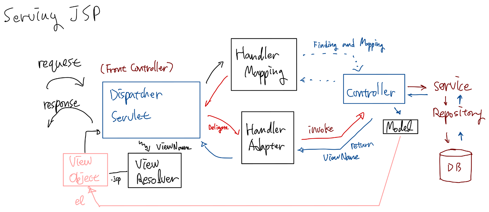
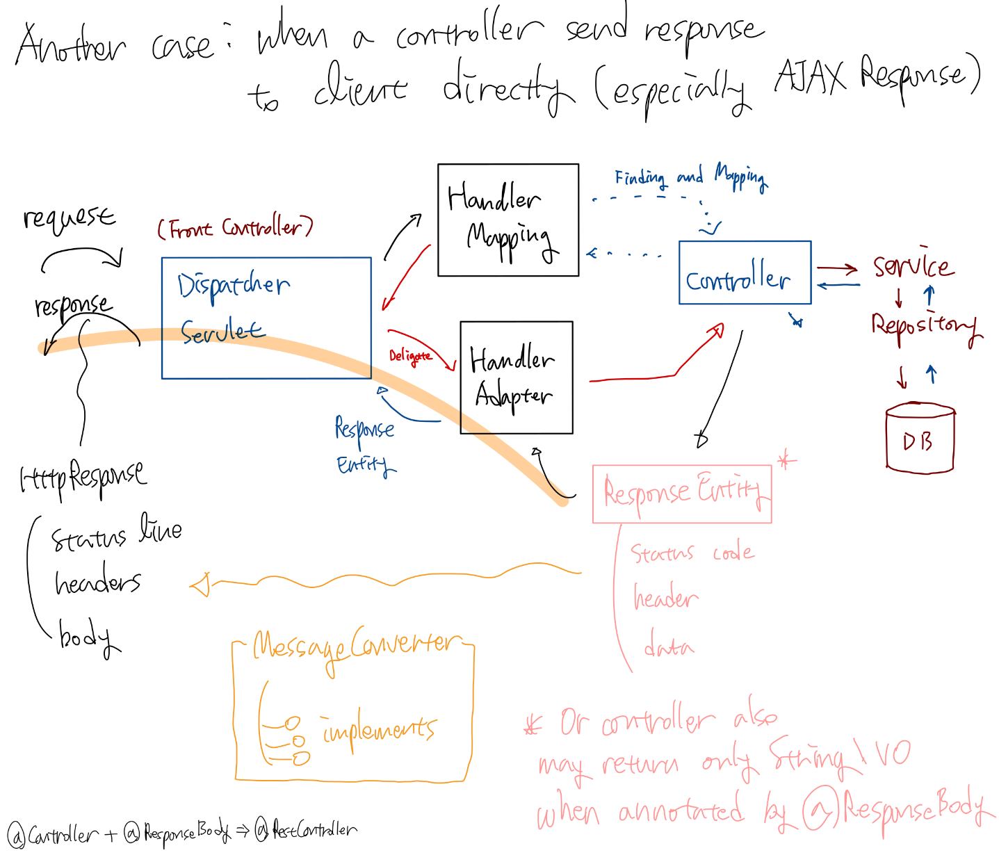
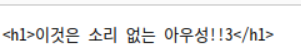
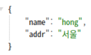
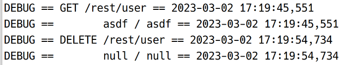
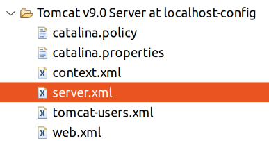
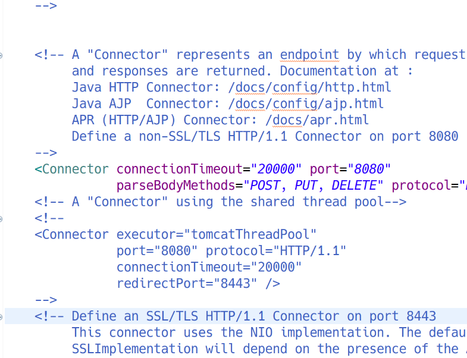
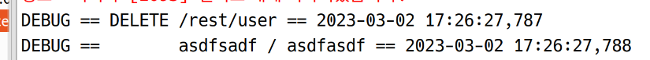

# @RequestBody와 @ResponseBody / 그리고 Rest

## @RequestBody와 @ResponseBody 개요

### 일반적인 경우: JSP 뷰 제공



### 다른 경우: 컨트롤러가 직접 Data를 클라이언트에게 전송



JSP를 전송하지 않고 JSON, XML 등 자체를 리스폰스로 반환하고자 할 경우, 컨트롤러에서 ResponseEntity 객체에 data, header, 상태코드 등을 채워 리턴하면 됨. 혹은 바디에 들어갈 데이터만을 간단하게 String, VO 등의 Object로 리턴할 수도 있음. (이 경우 데이터 외의 상태코드, 헤더 등은 설정 불가)

컨트롤러에 의해 리턴된 ResponseEntity 혹은 리스폰스 본문에 해당하는 객체는 MessageConverter를 통해 변환되는 과정을 거침.
MessageConverter는 여러 개의 구현체가 있는 인터페이스임. 이때 @RequestMapping의 produces에 지정된 mime type을 읽어 JSON, XML 등 변환될 형식에 맞는 구현체가 이용되며, DispatcherServlet는 그 변환 결과로부터 http response를 만들어 클라이언트에 반환.

## @RequestBody와 @ResponseBody 실습: sample09

### ㅁ

```html
<!-- sample09/responseBodyTest.html -->
<!DOCTYPE html>
<html>
<head>
<meta charset="UTF-8">
<title>Insert title here</title>
</head>
<body>
	<h1>Test Link</h1>
	<hr>
	<a href="/springweb/body/text/3">text/plain 반환 (일반문자열 반환)</a>
</body>
</html>
```

```java
package my.spring.springweb.sample09;

import org.springframework.stereotype.Controller;
import org.springframework.web.bind.annotation.PathVariable;
import org.springframework.web.bind.annotation.RequestMapping;
import org.springframework.web.bind.annotation.ResponseBody;

@Controller
@RequestMapping(value = "/body")
public class ResponseBodyController {

	@RequestMapping(value = "text/{id}",
			produces = "text/plain; charset=UTF-8") // PathVariable로 받을 수 있음
	@ResponseBody
	public String method01(@PathVariable String id) {
		
		return "<h1>이것은 소리 없는 아우성!!" + id + "</h1>";
		// 리턴되면 MessageConverter에 의해 변환
		// 이때 @RequestMapping을 읽어 produces의 형태에 맞는 구현체를 이용
		// 변환 결과를 DispathcerServlet에서 받아 http response 전송
	}
	
}
```

브라우저로 접속해보면 \<h1>를 포함한 문자열이 순수한 문자열로서 화면에 표시됨. 개발자도구를 보면  상태코드 200, "Content-Type: 
text/plain;charset=UTF-8"




### ㅁ

```html
	<a href="/springweb/body/textObject/3">content-type: text/plain (ResponseEntity 리턴)</a>
	<br><br>
```

```java
	@RequestMapping(value = "textObject/{id}",
			produces = "text/plain; charset=UTF-8")
	@ResponseBody
	public ResponseEntity<String> method02(@PathVariable String id) { // data의 타입을 제네릭으로 지정
		String msg = "<h1>이것은 소리 없는 아우성!! " + id + " </h1>"; // data
		HttpHeaders headers = new HttpHeaders(); // headers
		headers.setContentType(new MediaType("text", "plain",
				Charset.forName("UTF-8"))); // text/plain
		
		return new ResponseEntity<String>(msg, headers, HttpStatus.OK); // 200
	}
```

잘 표시되며, 개발자도구에도 의도된 대로 표시된다. 상태코드를 HttpStatus.CREATED (201) 등으로 바꿔도 바뀐 코드가 개발자도구로 잘 표시된다.  
201 코드는 회원가입 등 어떤 작업이 완료된 후 자원이 서버에 생성되었음을 알려주는 것이다.

만약,  produces의 타입과 실제 헤더의 타입이 다르면 어떻게 될까?

```java
	@RequestMapping(value = "textObject/{id}",
			produces = "text/plain; charset=UTF-8")
	@ResponseBody
	public ResponseEntity<String> method02(@PathVariable String id) { // data의 타입을 제네릭으로 지정
		String msg = "<h1>이것은 소리 없는 아우성!! " + id + " </h1>"; // data
		HttpHeaders headers = new HttpHeaders(); // headers
		headers.setContentType(new MediaType("text", "html",
				Charset.forName("UTF-8"))); // text/plain
		
		return new ResponseEntity<String>(msg, headers, HttpStatus.CREATED); // 201
	}
```

HTML로 렌더링된다. 메시지 컨버터는 produces에 지정된 타입을 참조하여 변환하지만, 실제 헤더는 text/html로 덮어 씌워지기 때문이다.

### VO 리턴

```html
	<a href="/springweb/body/json/hong">content-type: application/json (VO 리턴)</a>
	<br><br>
```

```java
package my.spring.springweb.sample09.vo;

import lombok.AllArgsConstructor;
import lombok.Data;
import lombok.NoArgsConstructor;

@Data
@AllArgsConstructor
@NoArgsConstructor
public class User {

	private String name;
	private String addr;
}

```

```java
	@RequestMapping(value = "/json/{name}",
			produces = "application/json; charset=UTF-8")
	@ResponseBody
	public User method03(@PathVariable String name) {
		User user = new User();
		user.setName(name);
		user.setAddr("서울");
		
		return user;
	}
```



이때, @Controller와 @RequestBody를 합쳐 @RestController이라는 어노테이션을 제공하므로, 아래와 같이 바꾸어 써도 동일하게 동작한다. 결과적으로 Rest 컨트롤러는 일반 JSP 제공 컨트롤러와 분리하여 설계하는 것이 편리하며, 유지보수에 있어서도 효율적이다.

```java
package my.spring.springweb.sample09;

import java.nio.charset.Charset;

import org.springframework.http.HttpHeaders;
import org.springframework.http.HttpStatus;
import org.springframework.http.MediaType;
import org.springframework.http.ResponseEntity;
import org.springframework.web.bind.annotation.PathVariable;
import org.springframework.web.bind.annotation.RequestMapping;
import org.springframework.web.bind.annotation.RestController;

import my.spring.springweb.sample09.vo.User;

@RestController
@RequestMapping(value = "/body")
public class ResponseBodyController {

	@RequestMapping(value = "text/{id}",
			produces = "text/plain; charset=UTF-8") // PathVariable로 받을 수 있음
	public String method01(@PathVariable String id) {
		
		return "<h1>이것은 소리 없는 아우성!! " + id + " </h1>";
		// 리턴되면 MessageConverter에 의해 변환
		// 이때 @RequestMapping을 읽어 produces의 형태에 맞는 구현체를 이용
		// 변환 결과를 DispathcerServlet에서 받아 http response 전송
	}
	
	@RequestMapping(value = "textObject/{id}",
			produces = "text/plain; charset=UTF-8")
	public ResponseEntity<String> method02(@PathVariable String id) { // data의 타입을 제네릭으로 지정
		String msg = "<h1>이것은 소리 없는 아우성!! " + id + " </h1>"; // data
		HttpHeaders headers = new HttpHeaders(); // headers
		headers.setContentType(new MediaType("text", "plain",
				Charset.forName("UTF-8"))); // text/plain
		
		return new ResponseEntity<String>(msg, headers, HttpStatus.OK); // 200
	}
	
	@RequestMapping(value = "/json/{name}",
			produces = "application/json; charset=UTF-8")
	public User method03(@PathVariable String name) {
		User user = new User();
		user.setName(name);
		user.setAddr("서울");
		
		return user;
	}
	
}

```

## Rest?

### 개요

대표적인 웹서비스 프로토콜에는,  

- SOAP 기반
    - Simple Object Access Protocol
    - Request, Response 등 개념이 HTTP와 비슷한 부분도 있지만, HTTP보다 복잡한 별개의 프로토콜
    - 장점: 보안, 데이터 무결성(트랜잭션)
    - 단점: 부가기능을 위해 프로토콜 자체가 복잡 → 웹의 C/S 구조와 잘 맞지 않는 부분이 있음.
    - 최근에는 웹이 아닌 플랫폼에서의 엔터프라이즈 프로그램 정도에 적용되는 추세 (인트라넷을 이용하는 조직 전용 프로그램으로 보안성 유지가 중요한 경우)
- HTTP 기반
    - 웹과 잘 어울림. 경략/간단


   REST는 HTTP에 대한 아키텍쳐 스타일이다. 즉, HTTP와 상충되거나 대립되는 개념이 아니라는 것이다. HTTP의 대표적인 창시자 중 한 명인 로이 필딩(Roy Fielding)이 HTTP를 더욱 효율적인 방식으로 사용할 수 있게 고안하였다.
   
   ### 구성요소
   
   1. 리소스 (자원): 서버측에 존재하는 사용 가능한 모든 것들
      - 파일, 이미지, 문서, 프로그램 등.
      - 각 자원에는 ID가 부여되며, 이것이 URI
          - /springweb/counter, /springweb/resources/sample07/index.html 등
          - URL과의 차이
              - URI는 자원을 구별하기 위해 자원에 부여한 것.
              - URL은 자원의 위치를 표시하는 것.
              - 외관상으로는 거의 차이 없음.
              - URI가 URL을 포함하는 상위개념이라고 보는 관점도 있음
  2. 메서드 (행위): 자원에 대해 수행할 작업. HTTP Method로 표현
       - GET, POST, PUT, DELETE 등 이용 (실제 HTTP 스펙에는 총 7개의 메서드가 있음)
           - GET: 자원을 조회
           - POST: 자원을 생성
           - PUT: 자원을 수정
           - DELETE: 자원을 삭제
       - 위와 같이 기본 HTTP 메서드 4개 만으로 CRUD 작업을 표현하는 것이 가능
  3. 리프레젠테이션 (표현): 서버는 요청에 대한 처리를 끝내면 적절한 응답을 보냄
      - 서버 응답의 형식은 여러가지 형태의 표현이 될 수 있음.
          - plain text
          - JSON
          - XML
      - 보통 JSON이 가장 많이 사용됨

### REST API

#### 정의

Rest 스타일 기반으로 서비스 API를 구현한 것. API는 일반적으로 다른 프로그램 간 메시지 교환을 위해 제공되는 인터페이스를 칭함.

#### URI 디자인 가이드

1. URI는 Resource만을 표현하는 수단이어야 한다.
    - 전략: 동사를 배제하고 명사만으로 구성
    - 예시
        - [POST]  /member/delete/3
            - 부적절한 사례
            - 이유: URI에 삭제의 행위가 명시되었다. REST에서 행위와 자원은 메서드와 URI로 분리되어야 한다.
            - 개선: [DELETE] /member/3
        - [GET] /member/3
            - 적절한 사례
            - URI에 자원만을 명시. 메서드를 함께 고려할 때, 3번 회원의 정보를 조회하겠다는 의도가 분명히 들어난다
        - [POST] /member
            - 적절한 사례
            - 회원 등록
        - 스프링에서 URI를 처리하려면,
            - @RequestMapping의 value에 {parameter}와 같이 지정하여, 자원에 대한 id 값을 받을 수 있게 함
            - 핸들러 메서드의 선언부 인자에 @PathVariable을 지정하여 맵핑하여 사용
2. URI는 '/'로 끝나지 않도록 디자인한다.
    - "/member/3/"과 같은 경우 디렉토리인지, 불완전한 URI인지 모호함
    - 이러한 모호함으로 인한 혼동을 방지하기 위해 URI는 '/'로 끝내지 않는 것이 좋음
3. URI에는 특수문자를 포함하지 않도록 주의한다.
    - /member/student_score
        - 부적절한 사례
        - 언더스코어를 사용하면 가독성에 좋지 않다.
        - 쓴다고 해서 심각한 오류가 발생하지는 않지만 Restful한 서비스는 될 수 없다.
    - /member/student-score
        - 적절한 사례
        - 구분자를 써야할 경우 언더스코어 대신 '-'를 쓴다.
4. URI는 소문자로 쓴다.
5. 확장자는 URI에 포함하지 않는다.
    - /member/3/profile-img.jpg
        - 부적절한 사례
        - 파일의 형식은 Accept-header에 MIME 타입으로 명시한다.
            - image/jpg

#### 응답

- REST 원칙에 따라 서버는 클라이언트에게 상태정보를 보내줘야 한다.
- 이때 상황에 맞게 적절한 응답코드를 반환해줘야 한다.

#### 인증

클라이언트가 REST API를 사용하려면 인증 절차를 거쳐야 한다.

1. HTTP 인증
    - 데이터를 암호화시켜 서버와 주고받음
2. key base 인증
    - 서버가 클라이언트에게 키를 발급해줌
    - 클라이언트는 Request를 할때 마다 키을 포함하여야 함
    - OpenAPI에서 자주 사용
3. OAuth 인증
    - 카카오 아이디로 로그인하기 등.
    - 토큰 기반으로 인증함.
    - 프로젝트 때 해보는 것도 좋겠음.

### 실습

```html
<!-- sample10/restTest.html -->
<!DOCTYPE html>
<html>
<head>
<meta charset="UTF-8">
<title>Insert title here</title>

<script src="https://code.jquery.com/jquery-2.2.4.min.js" integrity="sha256-BbhdlvQf/xTY9gja0Dq3HiwQF8LaCRTXxZKRutelT44=" crossorigin="anonymous"></script>
<script>
function myFunc(restMethod) {
	$.ajax({
		url: '/springweb/rest/user',
		method: restMethod,
		data: {
			id: $("#id").val(),
			name: $("#name").val()
		},
		success: function() {
			alert("성공");
		},
		error: function() {
			alert("실패");
		}
	});
}

</script>

</head>
<body>
	<h1>AJAX 호출</h1>
	ID: <input type="text" id="id">
	<br><br>
	Name: <input type="text" id="name">
	<br><br>
	
	<button onclick="myFunc('get')">GET 호출</button>
	<button onclick="myFunc('delete')">DELETE 호출</button>
	
</body>
</html>
```

```java
package my.spring.springweb.sample10;

import org.apache.logging.log4j.LogManager;
import org.apache.logging.log4j.Logger;
import org.springframework.http.ResponseEntity;
import org.springframework.web.bind.annotation.DeleteMapping;
import org.springframework.web.bind.annotation.GetMapping;
import org.springframework.web.bind.annotation.RequestMapping;
import org.springframework.web.bind.annotation.RestController;

@RestController
@RequestMapping(value = "/rest/user")
public class MyRestController {
	
	Logger log = LogManager.getLogger("case3");
	
	@GetMapping
	public ResponseEntity<?> method01(String id, String name) {
		log.debug("GET /rest/user");
		log.debug("\t" + id + " / " + name);
		return null;
	}
	
	@DeleteMapping
	public ResponseEntity<?> method02(String id, String name) {
		log.debug("DELETE /rest/user");
		log.debug("\t" + id + " / " + name);
		return null;
	}
}

```




@RequestParam을 통해 패러미터를 맵핑받게 하였으나, GET은 잘 되지만, DELETE(PUT도 마찬가지)는 데이터를 잘 받아오지 못했다.  
리퀘스트 바디에 들어오는 데이터를 POST의 경우 톰캣이 잘 파싱해주지만, DELETE/PUT의 경우 톰캣이 기본적으로 파싱을 안해주고 있기 떄문이다.

아래와 같이 톰캣의 server.xml을 수정한다.





```xml
  <Connector connectionTimeout="20000" port="8080"
    		   parseBodyMethods="POST, PUT, DELETE" protocol="HTTP/1.1" redirectPort="8443"/>
    
```



그럼 DELETE 요청의 경우에도 리퀘스트 바디를 잘 파싱하여 가져오게 된다.

