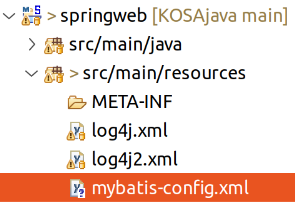
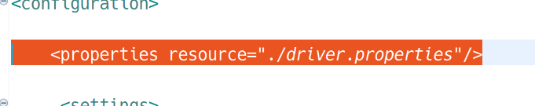
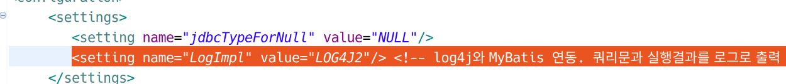
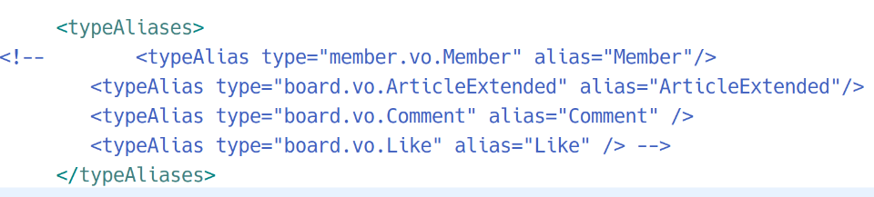
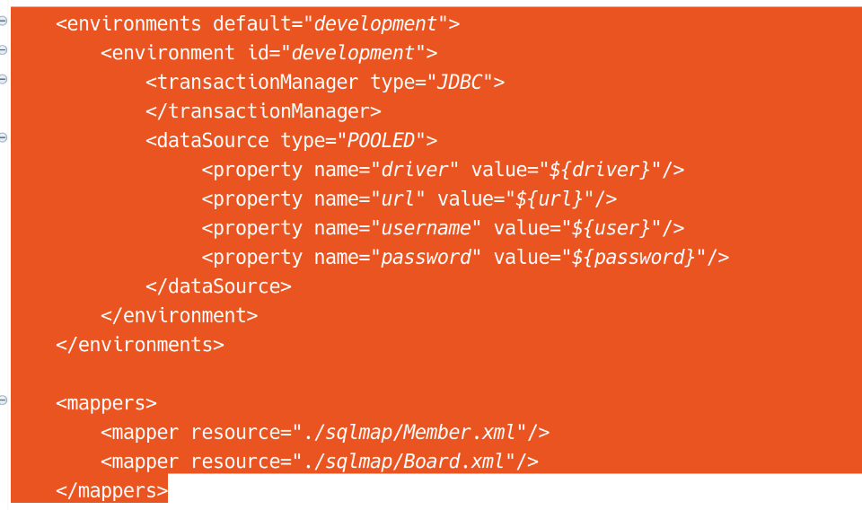
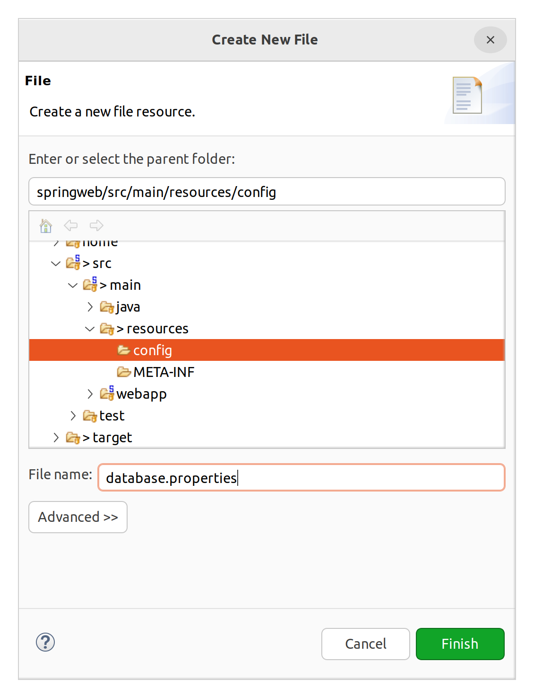
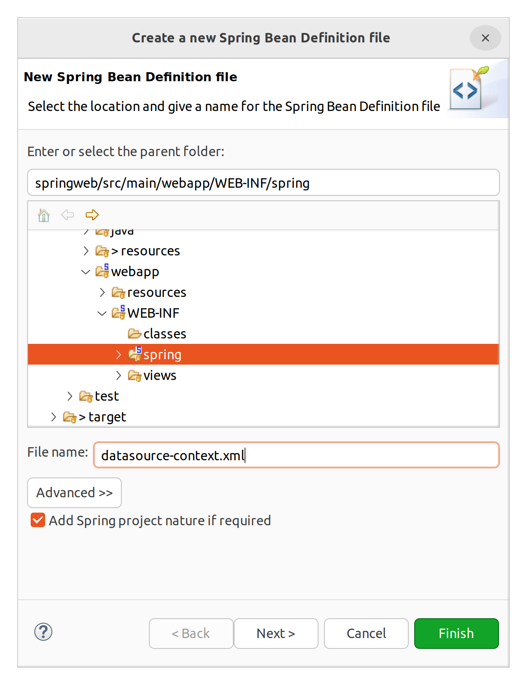
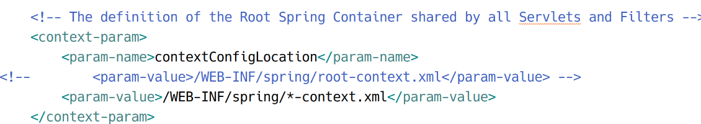
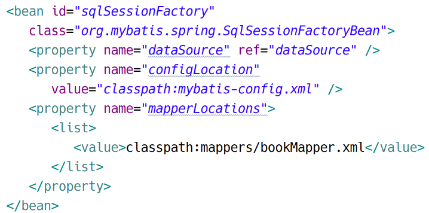
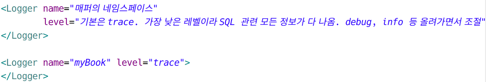

# 스프링 - MyBatis 세팅

## 준비물

스프링에서 마이바티스를 사용하기 위해서는 MyBatis와 연동 모듈인 mybatis-spring이 필요하다. MyBatis는 JDBC를 필요로 하는데, 순수 JDBC가 아닌 spring-jdbc를 사용할 것이다. 여기에 MySQL connector/j도 필요하다.

사용할 버전은 다음과 같다.

- MyBatis 3.5.9
- mybatis-spring 2.0.7
- spring-jdbc 5.3.22
- MySQL Connector/j

이에 대한 설정은 이미 이 프로젝트를 만들 때 해놨다. pom.xml을 확인해보면 spring-jdbc, mybatis, mybatis-spring 등이 이미 의존성으로 잡혀있는 것을 확인할 수 있다. 커넥터 J는 넣어줘야 한다.

## MyBatis 설정

기존 프로젝트 중에서 SqlMapConfig.xml을 찾고 복사하여 붙여넣는다.

- 파일 이름
    - SqlMapConfig.xml → src/main/resources/mybatis-config.xml



파일을 열어 아래의 한 줄을 삭제한다.



MySQL 접속 정보는 다른 위치에서 수정해줄 것이다.

&nbsp;

로그 기록 관련 설정을 추가한다.



```xml
<setting name="logImpl" value="LOG4J2"/>
```

&nbsp;

앨리아스 관련 설정은 나중에 넣어줄 것이므로 주석처리 해준다..



&nbsp;



접속 환경 등 설정은 빈으로 따로 잡아줄 것이므로 주석처리하거나 지운다.

전체 mybatis-config.xml

```xml
<?xml version="1.0" encoding="UTF-8"?>
<!DOCTYPE configuration 
          PUBLIC "-//mybatis.org/DTD Config 3.0//EN" 
          "http://mybatis.org/dtd/mybatis-3-config.dtd" >
<configuration>
	 <settings>
	 	<setting name="jdbcTypeForNull" value="NULL"/>
	 	<setting name="LogImpl" value="LOG4J2"/>
	 </settings>
	 
	 <typeAliases>
<!-- 	 	<typeAlias type="member.vo.Member" alias="Member"/>
	 	<typeAlias type="board.vo.ArticleExtended" alias="ArticleExtended"/>
	 	<typeAlias type="board.vo.Comment" alias="Comment" />
	 	<typeAlias type="board.vo.Like" alias="Like" /> -->
	 </typeAliases>
</configuration>
```

## DataSource 설정

DataSource는 커넥션 풀을 가지고 있는 객체이다.  
우선 연결정보가 있어야 DataSource를 만들 수 있을 것이다. 연결정보는 별도의 properties 파일로 분리시킨다.

파일 경로:  
src/main/resources/config/database.properties



```properties
db.driverClassName=com.mysql.cj.jdbc.Driver
db.url=jdbc:mysql://localhost:3306/spring?characterEncoding=UTF-8&serverTimezone=UTC&useSSL=false&autoReconnect=true
db.username=root
db.password=test1234
```

이제 DataSource 및 그로부터 얻을 수 있는 SqlSessionFactory → SqlSession 등의 객체를 모조리 XML에 빈으로 등록할 것이다. 이 빈은 Root Web Application Context에 등록되어야 할 것이다. 그렇다면 src/main/webapp/WEB-INF/spring/root-context.xml에 직접 등록할 수도 있지만, 이 방법은 유지보수성에 대해 좋은 방법은 아니다.

따라서 독립된 XML을 만들고, 이 파일을 web.xml에 등록하여 Root Web Application Context가 읽도록 설정할 것이다.

그럼 root-context.xml과 같은 위치에 스프링 빈 설정 파일을 만든다.




web.xml을 연다.



\*을 이용하여 WEB-INF/spring 디렉터리에서 root-context.xml과 datasource-context.xml을 모두 불러들일 수 있도록 지정했다.

datasource-context.xml에 다음을 추가한다. 각 설정에 대한 설명은 주석을 참고.

```xml
<!-- src/main/resources 경로는 classpath에 포함됩니다. 
        location경로의 파일을 property파일로 불러와 사용하겠다는 설정입니다. -->
   <context:property-placeholder
      location="classpath:config/database.properties" />
    <!-- (영택) property-placeholder를 잡으면 내용물을 변수처럼 사용할 수 있게 된다 -->

   <!-- dataSource를 Bean으로 등록합니다. 
        dataSource는 connection에 필요한 정보가지고 있습니다. -->
   <bean id="dataSource"
      class="org.springframework.jdbc.datasource.DriverManagerDataSource">
      <property name="driverClassName" value="${db.driverClassName}" /> <!-- (영택) 세터로 내용 등록 -->
      <property name="url" value="${db.url}" />
      <property name="username" value="${db.username}" />
      <property name="password" value="${db.password}" />
   </bean>

   <!-- sqlSessionFactory를 Bean으로 등록합니다. 
        SqlSessionFactory는 SqlSession을 만들기 위한 정보들을 가지고 있습니다. 
        mapper를 생성하면 list에 추가해야 합니다. -->
   <bean id="sqlSessionFactory"
      class="org.mybatis.spring.SqlSessionFactoryBean">
      <property name="dataSource" ref="dataSource" /> <!-- (영택) 위에서 빈으로 등록한 DataSource의 객체를 주입 -->
      <property name="configLocation"
         value="classpath:mybatis-config.xml" />
      <property name="mapperLocations">
         <list> <!-- (영택) 매퍼 XML은 여기에 등록하면 된다 -->
            <value></value>
         </list>
      </property>
   </bean>

   <!-- sqlSession를 Bean으로 등록합니다. 기존의 sqlSession은 Thread-Sage하지 않습니다. 
             그래서 Bean으로 등록해서 사용하면 Transaction처리에 문제가 발생할 수 있지만 
             여기서는 Thread-Safe한 SqlSessionTemplate 클래스를 사용합니다. -->
   <bean id="sqlSession"
      class="org.mybatis.spring.SqlSessionTemplate"> <!-- sqlSession은 쓰레드간 공유되어서는 안된다. 동기화 문제가 발생할 수 있다. 대신에 스프링에 맞게 새로 만든 SqlSessionTemplate을 제공하고 있으며, 이를 사용하면 쓰레드 세이프하다. -->
      <constructor-arg ref="sqlSessionFactory" /> <!-- 생성자로 주입 -->
   </bean> <!-- 이제 sqlSession 객체를 @Autowired를 통해 편리하게 주입받을 수 있다. 게다가 이 객체는 싱글톤이다. -->
```

## 매퍼 만들기

springweb/src/main/resources에 mappers 디렉토리를 만든다. 해당 디렉토리에 bookMapper.xml을 생성한다.

```xml
<?xml version="1.0" encoding="UTF-8"?>

<!DOCTYPE mapper
  PUBLIC "-//mybatis.org//DTD Mapper 3.0//EN"
  "http://mybatis.org/dtd/mybatis-3-mapper.dtd">

<mapper namespace="myBook">

   <select id="countBooks" resultType="int">
      select count(*) from book
   </select>

   <!-- resultMap의 일반적인 사용법 -->
   <!-- 테이블의 컬럼명과 VO 필드명이 다른 경우 맵핑해줌 -->
   <!-- property: VO 필드명 / coulmn: 테이블 컬럼명 -->
   <!-- 대부분 DB 설계시 컬럼명과 VO 필드명이 다르므로 resultMap을 많이 설정함 -->
   <resultMap id="result"
      type="my.spring.springweb.sample11.vo.Book">
      <result property="bookIsbn" column="bisbn" jdbcType="VARCHAR"
         javaType="String" />
      <result property="bookTitle" column="btitle" jdbcType="VARCHAR"
         javaType="String" />
      <result property="bookAuthor" column="bauthor" />
      <result property="bookPrice" column="bprice" />
   </resultMap>

   <select id="selectAll" resultMap="result">
       <![CDATA[   
         SELECT bisbn, btitle, bauthor, bprice
         FROM book         
      ]]>
   </select>

   <select id="selectBookByKeyword" parameterType="String"
      resultMap="result">
       <![CDATA[   
         SELECT bisbn, btitle, bauthor, bprice
         FROM book         
         WHERE btitle LIKE CONCAT('%', #{Keyword}, '%')
      ]]>
   </select>

</mapper>
```

VO도 만든다.

```java
package my.spring.springweb.sample11.vo;

import lombok.AllArgsConstructor;
import lombok.Data;
import lombok.NoArgsConstructor;

@Data
@NoArgsConstructor
@AllArgsConstructor
public class Book {

	private String bookIsbn;
	private String bookTitle;
	private String bookAuthor;
	private int bookPrice;
}

```

datasource-context.xml로 다시 돌아가서 매퍼를 추가한다.



톰캣에 띄워보면 오류가 나지 않고 컨텍스트가 정상적으로 기동된다.

니중에 매퍼를 추가하고 싶으면, list 요소에 value 요소만 늘려주면 된다.

## Log4j 연동

log4j2.xml을 열어 Loggers 요소 아래에 새로운 Logger 요소를 추가한다. 



이 외에도 스파이를 써서 MyBatis와 Log4j를 연동할 수 있는데 권장할만한 방법은 아니다.

## SQL 스크립트 실행

워크벤치나 디비버로 제공된 SQL 스크립트를 실행