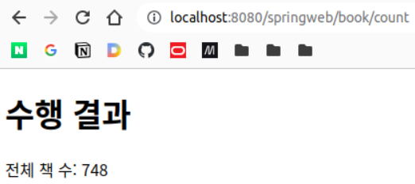
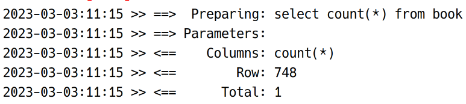

# 스프링 - MyBatis 예제

## 예제 1

### 모든 책의 개수 조회
```html
<!-- sample11/bookSearch.html -->

<!DOCTYPE html>
<html>
<head>
<meta charset="UTF-8">
<title>Insert title here</title>
</head>
<body>

	<h1>Spring-MyBatis 테스트</h1>
	
	<a href="/springweb/book/count">모든 책의 개수 조회</a> <!-- Restful 하지는 않음  -->
	<br><br>
	<a href="/springweb/book/all">모든 책의 정보 조회</a>
	<br><br>
	
	<form action="/springweb/book/search" method="post">
		제목 키워드: <input type="text" name="keyword">
		<input type="submit" value="조회">
	</form>
</body>
</html>
```

컨트롤러를 만든다.

```java
package my.spring.springweb.sample11;

import org.springframework.stereotype.Controller;
import org.springframework.web.bind.annotation.GetMapping;
import org.springframework.web.bind.annotation.PostMapping;
import org.springframework.web.bind.annotation.RequestMapping;

@Controller
@RequestMapping(value = "/book")
public class BookController {
	
	@GetMapping(value = "/count")
	public String method01() {
		
		return null;
	}
	
	@GetMapping(value = "/all")
	public String method02() {
		
		return null;
	}
	
	@PostMapping(value = "/search")
	public String method03() {
		
		return null;
	}
}

```

예제이므로 간단히 하기 위해 서비스 구현은 생략하고 바로 DAO를 작성하자. (실제 프로젝트에서는 반드시 만들어야 한다.)

우선 DAO에 대한 인터페이스를 만든다. (dao 패키지 아래에 만들기)

```java
package my.spring.springweb.sample11.dao;

import java.util.List;

import my.spring.springweb.sample11.vo.Book;

public interface BookDao {

	int getBookCount();
	
	List<Book> gettAllBooks();
	
	List<Book> getSearchBooks();
}
```

인터페이스를 잡고 이를 구현하는 식으로 하면, 보다 유연하게 변경이 가능하다. DAO의 간단한 버전, 자세한 버전을 따로 작성할 수 있고, @Reposiotry를 원하는 구현체에 붙여 주입할 것을 정해줄 수 있다.

```java
package my.spring.springweb.sample11.dao;

import java.util.List;

import org.apache.ibatis.session.SqlSession;
import org.springframework.beans.factory.annotation.Autowired;
import org.springframework.stereotype.Repository;

import my.spring.springweb.sample11.vo.Book;

@Repository
public class BookDaoImpl implements BookDao {

	@Autowired
	private SqlSession session;
	// SqlSession은 SqlSessionTemplate 상위 인터페이스. 타입을 기준으로 주입되게 됨.
	
	@Override
	public int getBookCount() {
		return session.selectOne("myBook.countBooks");
	}

	@Override
	public List<Book> gettAllBooks() {
		// TODO Auto-generated method stub
		return null;
	}

	@Override
	public List<Book> getSearchBooks() {
		// TODO Auto-generated method stub
		return null;
	}

}

```

컨트롤러를 아래와 같이 수정한다.

```java
@Controller
@RequestMapping(value = "/book")
public class BookController {
	
	@Autowired
	private BookDao dao;
	
	@GetMapping(value = "/count")
	public String method01(Model model) {
		model.addAttribute("result", dao.getBookCount());
		return "sample11/bookCount";
	}
	
    // 후략
```





## 나머지 예제

직접 해보기. 다 하면 게시판 예제도 스프링으로 바꿔보기.

