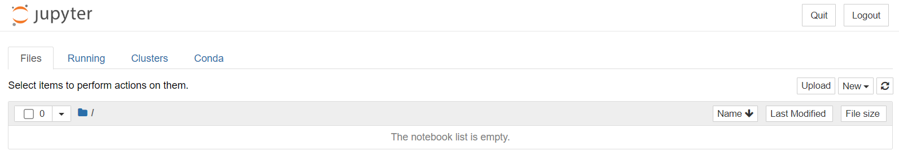

# 파이썬 소개
## 1. 파이썬 개관

파이썬은 1990년대 등장함. 이때는 C와 C++, Java 등이 성행하던 시기. 당시 객체지향 개념이 막 도입되는 등 프로그래밍 언어의 기능은 막강해졌지만 전공자가 아니면 배우기 어려웠던 한계가 있었음. 이러한 배경에서 파이썬은 교육적 목적이 있다고 할 수 있으며, 배우고 활용하기 쉬움.

배우기 쉽다는 점에서 데이터 처리, 머신러닝, 딥러닝 등에서 많이 활용됨. Java나 C++에서도 이러한 처리를 할 수 있으며, 라이브러리가 일부 존재하지만, 파이썬으로 공부하는 것이 자료가 풍부하고 활용이 쉬움.

다만 문법적 차이가 있어서 적응에 어려움이 다소 있을 수는 있음. 예컨대 중괄호가 없다는 것. 블럭 구분을 중괄호가 아닌 들여쓰기로 대신함.

**특징**  
- 인터렉티브하게 실행할 수 있음
    - 정적 컴파일 언어와 달리 코드를 나누어 일정 단위에 따라 실행할 수 있음.
    - 데이터 처리에 있어 편리함. 단계적으로 데이터를 변형, 계산하고 그 결과를 바로 확인 → 그 후 다음 단계의 코드를 실행
- 활용할 수 있는 라이브러리가 많음
- 버전에 따라 2.x와 3.x가 있음.
    - 코드 외형적으로는 큰 차이가 없어 보일 수도 있으나, 코드가 호환되지 않으며, 인터프리터 내부적으로 큰 차이가 있음.
    - 우리는 파이썬 3.x를 사용
    - 2.x 예제가 나오면 넘기기

## 2. 파이썬 개발환경 세팅

### 개발환경 선택지

보통 파이썬 IDE로는 파이참(PyCharm)이 거론되지만, 보통은 Django 등을 이용한 웹서비스 개발 등에 주로 활용됨.  
데이터 분석, 머신러닝에도 파이참을 쓸 수는 있지만 다소 불편할 것임.

Jupyter Notebook을 대신 이용할 것임. 웹 기반의 도구로, 데이터 분석에 특화되어 있음.  
로컬에 직접 세팅하거나, 클라우드에 세팅된 노트북을 사용할 수도 있음.

- 로컬
    - 로컬에 세팅하는 경우 좋은 컴퓨터를 사용하는 것이 아니라면, 모델 학습에 있어 시간이 많이 소요됨
    - 우리 과정에서는 데이터 사이언스에는 로컬 세팅을 이용
- 클라우드
    - 구글 colab 등
    - 클라우드를 이용하는 경우 좋은 성능의 하드웨어를 사용할 수 있으나 세션 제한 시간이 있음 (코랩의 경우)
    - 우리 과정에서는 ML/DL에 클라우드 세팅을 이용

### 로컬 세팅

기본 파이썬을 설치해도 되지만, 여러 의존성 문제가 발생할 수 있으므로, 파이썬 배포판 중 하나인 아나콘다를 설치할 것임.

우선 아나콘다 인스톨러를 다운로드하는데 시간이 오래 걸리므로, 구글 드라이브에 접속하여 colab을 실습해보자.  
실습 파일이 저장될 위치에 우클릭하여 더보기 – Google Colaboratory를 클릭한다. 없다면 연결할 앱 더 보기를 눌러, colab을 설치한다.


파일 이름을 0327-파이썬실습으로 변경한다.

코드를 입력할 수 있는 창이 보인다. 이를 셀이라고 한다.


print 함수를 사용하면 값을 출력할 수 있다.


컨트롤 + 엔터를 입력하면 셀의 코드가 실행된다.  
최초 실행은 조금 오래걸린다. 하드웨어 자원을 할당받아 초기화하기 떄문이다. 할당 자원 정보는 우상단에서 볼 수 있다.


문법적 특징  
문자열 리터럴 표현에 홑따옴표를 사용할 수 있으며 디폴트이다. 쌍따옴표도 사용할 수는 있다. 표현식의 마지막에 세미콜론은 쓰지 않는다.

셀의 오른쪽 부분 (실행 아이콘 있는 부분)을 클릭하고 B를 입력하면 아래에 새로운 셀이 생긴다.

A를 입력하면 위에 새로운 셀이 생긴다.


## 3. 문법 기초

### 주석


### 변수


### 빌트인 데이터타입


#### 1. 뉴메릭


#### 2. 시퀀스

파이썬에서는 리스트, 맵과 같은 자료구조도 하나의 데이터 타입으로 간주됨.

##### (1) 리스트


##### (2) 튜플

튜플은 리스트와 가본적으로 동일하나, 리스트와 달리 read-only라는 차이가 있다.
리터럴: ( )


파이썬에서의 비구조화에 대해서는 아래의 아티클을 참고.  
[참고 자료](https://blog.teclado.com/destructuring-in-python/)

##### (3) 레인지

리터럴로 쓰지 않는다. range라는 클래스를 이용하여 표현한다.

```python
a = range(10) # 0부터 시작하여 10전까지, 1씩 증가하는 숫자 범위
print(a)
# range(0, 10)
# 객체 내에 실제 데이터를 가지고 있지 않음.
# 이 말은, 아주 큰 수까지의 범위를 지정해도 메모리 낭비가 생기지 않는다는 것.
b = range(0, 1000000000000)

a = range(2, 20, 2) # 시작, 끝(제외), 증가량
print(list(a)) # 2부터 2씩 증가하되, 20보다 작은 숫자 범위
print(a[4]) ## 10. 인덱싱이 가능. 마찬가지로 for문을 이용한 iteration도 가능.
```

#### 3. 텍스트 시퀀스

- 문자열.
- 클래스: str
- 리터럴: '' 혹은 "" \- 둘 다 사용 가능 (default는 '')
- 문자(char) 개념이 없음. 한 글자라도 길이가 1인 문자열일뿐임.

```python
a = '이것은 소리 없는 아우성!'
print(type(a)) # <class 'str'>

# 실제로 내부적으로는 리스트를 기반으로 구현되어 있음.
a = '홍'
b = '길동'
print(a + b) # 홍길동. concatenated same as a list

print(a[0]) # 인덱싱 가능. 이
print(a[0:3]) # 슬라이싱 가능. 이것은

# 문자열만의 독특한 연산자
print('소리' in a) # 서브스트링 포함 여부 검사. 파이썬은 Bool 값이 True, False

# str 클래스의 내장 메서드
print('이것은 {} 없는 {}'.format('소리', '아우성')) # 이것은 소리 없는 아우성
                                              # 중간에 편하게 문자열을 삽입할 수 있음.
```

#### 4. 매핑

키-밸류 쌍의로 데이터를 나타내는 자료구조
리터럴을 보면 JSON이랑 거의 똑같이 생겼음.
파이썬에서는 이러한 자료 구조를 Dictionary라고 부름.

* 클래스: dict
* 리터럴: { }

```python
a = { # JSON과 유사하지만 JSON은 아님. JSON은 중간에 주석 불가하며, 문자열은 "". 그저 문자열일 뿐임. 
    'name': '홍길동',
     'age': 20
}

print(type(a)) # <class 'dict'>

# 자바와 달리 파이썬의 딕셔너리에는 동적으로 데이터를 추가할 수 있음.
# 자바스크립트와 유사.
a['주소'] = '서울' # 특정 키에 해당하는 데이터를 수정하거나, 없으면 새롭게 만듦.
print(a) # {'name': '홍길동', 'age': 20, '주소': '서울'}

# 내장 메서드
print(a.keys()) # dict_keys(['name', 'age', '주소'])
                # 딕셔너리 내 키만 추출하여 리스트로 반환!하는 것처럼 보임.
                # 정확히 말하면 리스트가 아니라, dict_keys라는 별도 자료구조.
                # 그러나 사용할 때에는 리스트라고 생각하고 사용해도 큰 문제 없음.
                # 그러나 리스트의 내장 메서드를 모두 사용할 수는 없음.
                # 보통 딕셔너리에 대해 for 문을 이용할 때 사용.

## for in 구문
#### for ~ in <리스트 혹은 튜플, 리스트와 유사한 자료구조>
for key in a.keys():
  print(key) # 들여쓰기 중요 (기본 4칸)
```

#### + 아나콘다 설치 및 세팅

인스톨러 실행후 기본 옵션대로 설치한다.

**아나콘다 가상환경**  
아나콘다를 이용하면 여러 개의 독립된 가상 환경을 만들 수 있다. 필요와 목적에 따라 가상환경을 만들고, 저마다 필요한 버전의 파이썬과 라이브러리를 세팅해둘 수 있는 것이다.  

기본적으로 주어지는 환경은 base이다. 이 외에 새로 환경을 만들어 웹 개발을 하거나, 데이터분석을 하거나, 딥러닝을 위한 각각의 의존 라이브러리를 세팅할 수 있는 것이다. 

base 환경에서도 진행할 수 있지만, 일반적으로 프로젝트마다 가상환경을 만들어 세팅한다.

우선 아나콘다 프롬프트를 실행하고 아래의 명령을 입력한다. data_env라는 이름으로 가상환경을 만들고, 파이썬 3.8 및 openssl 라이브러리를 설치하라는 의미이다. 버전을 명시하지 않으면 최신 버전을 설치하게 되는데, 파이썬은 다른 라이브러리와 의존성 문제가 있을 수 있으니 3.8 버전을 명시해준다.

```powershell
> conda create -n data_env python=3.8 openssl
```


의존성이 걸린 패키지들도 엔터를 입력하여 모두 설치한다.

설치가 완료되면 아래의 명령을 입력하여 data_env 가상 환경을 활성화한다.

```powershell
> conda activate data_env
```

데이터 취급을 위한 세 개의 모듈과, Jupyter Notebook 실행 및 설치를 위한 개발환경 모듈을 설치한다. 

**numpy**  
```powershell
> conda install numpy
```

numpy는 쉽게 말하면 벡터와 매트릭스를 다루기 위해 설치하는 것이다. 파이썬에는 기본적으로 배열 개념이 없으므로, 매트릭스를 다룰 수 없다. numpy는 ndarray라는 다차원 배열 자료구조를 사용할 수 있게 해준다.

**pandas**  
```powershell
> conda install pandas
```

pandas는 numpy의 다차원배열로 저장한 데이터를 가지고 분석을 하기 위해 설치한다.

**matplotlib**  
```powershell
> conda install matplotlib
```

matplotlib은 분석한 데이터를 시각화하기 위해 설치한다.

**nb_conda**  
```powershell
> conda install nb_conda
```

notebook conda의 축약이다. Jupyter Noteboook 사용을 위해 설치해준다.

**Jupyter Notebook 세팅**

우선 노트북이 저장될 디렉토리를 만든다.  이제 이 디렉토리의 위치를 설정 파일에 추가해야한다.

우선 기본 설정 파일을 생성한다.

```powershell
> jupyter notebook --generate-config
> code C:\Users\limo\.jupyter\jupyter_notebook_config.py
```

디렉토리 설정을 변경해주기 위해, notebook_dir을 찾아준다.


450번째 라인에 설정이 있다. 주석을 해제하고 디렉토리 경로를 넣는다. 이때 백슬래시 대신 슬래시를 써야한다.


저장하고, 아래의 명령을 실행하여 주피터 노트북을 실행한다.

```powershell
>jupyter notebook
```

그럼 웹서버가 실행되며, 아래와 같이 빈 리스트가 보이게 된다.



New를 눌렀을 때, 방금 만든 data_env 가상환경이 보이면 세팅이 잘 된 것이다.


data_env 가상환경을 선택하면 colab에서 봤던 화면과 비슷한 레이아웃이 나온다.

일단 새 파일을 닫고, 아까 colab에서 작업하던 파일을 다운로드 받아 jupyter_home에 복사한다.


그럼 Jupyter Notebook 화면에서 파일을 확인할 수 있다. 열어본다.


커널을 data_env 가상환경으로 바꿔주고, trust를 눌러준다.


