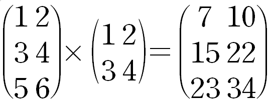

# Numpy (이어서)

## 복습

### 파이썬 문법

- 데이터타입
    - Numeric
    - Sequence
        - list
        - tuple
        - range
    - Text Sequence
        - str
    - Mappting
        - dict
    - Set
        - set
    - Bool

- 흐름 제어
    - for, if

### numpy

파이썬의 기본 자료구조인 리스트는 편하기는 하지만, 엄연히 배열은 아니기 때문에 몇 가지 한계가 있다.

1. 대용량 데이터 처리시 속도가 느리다.
2. 중첩 리스트를 사용할 수는 있지만, 차원 개념이 없어 다차원의 매트릭스 계산은 어렵다.

이를 보완하기 위해 도입할 수 있는 것이 numpy 라이브러리이며, numpy가 제공하는 ndarray 자료구조를 대신 이용할 수 있다.

## 실습

### 주피터 노트북 실행

```powershell
(base) PS C:\Users\limo> conda activate data_env
(data_env) PS C:\Users\limo> jupyter notebook
```

### 생성: ndarray.zeros, ndarray.arange
```python
# ndarray를 만드는 기본 방법: numpy.array()

# 영행렬 numpy.zeros(shape_tuple)
print('numpy.zeros((3, 4))')
# 인자로 주어진 shape에 해당하는 배열을 만들고 0으로 채운다.
arr = np.zeros((3, 4)) # 3행 4열
print(arr)
# [[0. 0. 0. 0.]
# [0. 0. 0. 0.]
# [0. 0. 0. 0.]]
print()

# 범위 numpy.arange(start, end, step)
# 특정 범위에 해당하는 1차원 배열 출력
print('numpy.arange(0, 10, 2)')
arr = np.arange(0, 10, 2) # 기본 클래스인 range와 다름
print(arr) # [0 2 4 6 8]
# 주의: 범위에 대한 개념을 가지고 있는 range와 다르게, numpy.arange는 실제 해당 범위의 값을 메모리에 할당하여 가지고 있음
```

### 변형: ndarray.reshape

```python
# ndarray.reshape(n, m [, o])
# ndarray를 특정 형태로 변형

print('# arr')
arr = np.arange(0, 12, 1) # 1차원 ndarray
print(arr)
print()

print('# arr.reshape(2, 6)')
arr_reshaped = arr.reshape(2, 6)
print(arr_reshaped)
print()

print('# reshaped ndarray share values with original ndarray')
print('arr[-1] = 100')
arr[-1] = 100
print('arr')
print(arr)
print('arr_reshaped')
print(arr_reshaped) # reshape된 ndarray에도 값이 변해있음.
                    # 즉, ndarray.reshape는 원본 데이터를 복사하는 것이 아니라,
                    # 기존 데이터로부터 형태만 바꿔서 보여주는 것이라고 보면 됨.
                    # 데이터는 여전히 원본이 가지고 있음.
                    # 따라서 이를 view라고 부름
print()

print('# reshape to 3 demensional matrix')
print('# arr.reshape(2, 2, 3)')
arr_reshaped = arr.reshape(2, 2, 3) # 2면 2행 3열
print(arr_reshaped)
print()

print('# reshape but fix the number of columns')
print('arr.reshape(-1, 2)')
arr_reshaped = arr.reshape(-1, 2)
print(arr_reshaped)
print()

print('# or you can fix the number of rows')
print('arr.reshape(3, -1)')
arr_reshaped = arr.reshape(3, -1)
print(arr_reshaped)
print()

print('# and ok with 3 dimensional matrix')
print('arr.reshape(-1, 2, 2)')
arr_reshaped = arr.reshape(-1, 2, 2)
print(arr_reshaped)
print()

print('# but should not ambiguous')
print('arr.reshape(-1, 3, -1)')
try:
    arr_reshaped = arr.reshape(-1, 3, -1)
    print(arr_reshaped)
except ValueError as e:
    print('an exception throwed')
    print('detail:', e)
print()
```

### 1차원 ndarray의 indexing과 slicing

```python
arr = np.arange(0, 5, 1)
print('whole:')
print(arr) # [0 1 2 3 4]

print('\nlast value / arr[-1]')
print(arr[-1]) # 4

print('\nslicing / arr[0:2]')
print(arr[0:2]) # [0 1]

print('\nslicing / arr[2:-1]')
print(arr[2:-1]) # [2 3]

print('\nslicing / arr[0::2]') # arr[start:end:step]
print(arr[0::2]) # [0 2 4]
```

### 2차원 ndarray의 indexing과 slicing
```python
arr = np.arange(1, 17, 1).reshape(4, 4)
print(arr)
# [[ 1  2  3  4]
#  [ 5  6  7  8]
#  [ 9 10 11 12]
#  [13 14 15 16]]

print('\nindexing (1, 2)')
print(arr[1, 2]) # 7

print('\nindexing + slicing (1, 2:4)')
print(arr[1, 2:4]) # [7 8] (1차원 ndarray)

print('\nindexing + slicing (:, 2)')
print(arr[:, 2]) # [ 3  7 11 15] 모든 행에 대해 2번째 값들을 가져오기
```

### Boolean indexing

```python
# indexing에 Boolean mask를 이용
# 예> arr[boolean_mask]

arr = np.arange(0, 5, 1)
print(arr)

# Boolean mask는 인덱싱을 적용할 ndarray와 shape이 같으며,
# Bool 값을 가지는 ndarry
boolean_mask = np.array([True, False, True, True, False])

print()
print(arr)
print(boolean_mask)
print(arr[boolean_mask]) # [0 2 3]

# boolean_mask가 True인 위치의 값들만 걸러져 반환되었다.

#### [참고] ndarray의 연산 기초 ####
arr = np.array([1, 2, 3, 4, 5])
print(arr)

arr1 = np.array([5, 4, 3, 2, 1])
print(arr1)

print(arr + arr1) # [6 6 6 6 6] / 연결되는 것이 아니라, 행렬의 덧셈이 이뤄짐

print(arr > arr1) # [False False False  True  True] / 위치마다 각 값이 비교됨 -> Boolean mask로 사용 가능
######## 끝 ########

# 짝수만 뽑기
arr = np.arange(0, 10, 1)
print(arr[arr % 2 == 0]) # [0 2 4 6 8]
```

### Fancy indexing

```python
arr = np.arange(0, 12, 1).reshape(3, 4).copy() # 값을 복사했으므로 뷰가 아닌 실제 값의 집합

print(arr)
# [[ 0  1  2  3]
#  [ 4  5  6  7]
#  [ 8  9 10 11]]

# 일반적인 인덱싱
print(arr[2, 2]) # 10 (스칼라)
print(arr[1:2, 2]) # [6] / 한 쪽만 슬라이싱이므로 1차원 ndarray가 반환됨 (벡터)
print(arr[1:2, 1:2]) # [[5]] / 두 쪽 모두 슬라이싱이므로 2차원  ndarray가 반환됨 (행렬)
print()

# [0 1 2]
# [4 5 6]
# 을 뽑아내려면,
print(arr[:2, :-1]) # -1 마지막열은 배제
print()

# 그럼,
# [0 2]
# [4 6]
# 을 뽑아내려면, => Fancy indexing 사용
print(arr[:2, [0, 2]]) # 추출하고 싶은 인덱스를 리스트로 넣어줌
# => EDA(Exploratory Data Analysis, 탐색적 데이터 분석)
```

### ndarray의 연산

#### 행렬간의 합

```python
arr = np.array([
    [1, 2, 3],
    [4, 5, 6]
])

arr1 = np.arange(1, 7, 1).reshape(3, 2)
arr2 = np.arange(1, 7, 1).reshape(2, 3)
print(arr1, '\n')
print(arr2)

try:
    print(arr1 + arr2) # ValueError: operands could not be broadcast together with shapes (3,2) (2,3) 
except ValueError as e:
    print('ValueError', e)
    print('연산을 수행하려면 shape이 무조건 가능해아 함')
```

#### 브로드캐스팅

```python
arr = np.array([1, 2, 3, 4, 5])
print(arr)
print(arr + 3) # shape가 달라서(1차원/0차원) 연산이 불가할 것같지만,
               # arr + [3, 3, 3, 3, 3]와 같이 차원을 높여줌.
               # 이러한 과정을 브로드캐스팅 Braodcating이라고 부름
# [1 2 3 4 5]
# [4 5 6 7 8]
print()
        
        
arr = np.arange(0, 6, 1).reshape(2, 3)
print(arr + 3)
# [[3 4 5] \2차원 배열로 브로드캐스팅됨.
# [6 7 8]]
print()

arr1 = np.array([1, 2, 3])
print(arr)
print(arr + arr1)
```

#### 행렬곱연산



**3행** _2열_  \* _2행_ **2열** = 3행 2열 

- 행렬 A, B, C에 대해, C = A * B를, A의 각 행의 요소와 B의 각 열의 요소를 곱해 C라는 새로운 행렬을 만드는 연산으로 정의한다.
- 이때 A의 열과, B의 행이 같아야 하며, C의 크기는 A의 행 수 * B의 열 수

numpy를 이용하여 행렬곱연산을 수행할 수 있다.

```python
# 행렬곱연산 (Matrix Multiplication)
# 기본적인 사칙연산, 비교연산 외에 행렬곱연산도 가능.
# 머신러닝에서 사용되므로 알아야함.

arr1 = np.array([
    [1, 2],
    [3, 4],
    [5, 6]
])
print(arr1)
print()

arr2 = np.array([
    [1, 2],
    [3, 4]
])
print(arr2)
print()

print(np.dot(arr1, arr2)) # 행렬곱
```

#### 집계함수

```python
arr = np.arange(1, 6, 1)
print(arr)

# 합계
print(arr.sum()) # 15

# 평균 (산술평균)
print(arr.mean()) # 3.0

# 최대값
print(arr.max()) # 5

# 최대값의 인덱스
print(arr.argmax()) # 4
```

for문을 이용해 직접 로직을 수행하는 것보다 훨씬 퍼포먼스(시간, 메모리 점유)가 좋다.

#### 축(axis)

- n차원 ndarray는 축이 n개
- 축을 0부터 시작하는 수로 표현함 (1차원 축 1개 -> 0번 축) (2차원 축 2개 -> 0번 축, 1번 축

##### 1차원 ndarray의 축

```python
arr = np.arange(1, 6, 1)
print(arr.sum(axis=0), end='\n\n') # 0번 축(열 방향)의 진행 방향으로 진행하는 값의 합계
```

##### 2차원 ndarray의 축

```python
arr = np.arange(1, 7, 1).reshape(2, 3)
print(arr)
# [[1 2 3]
# [4 5 6]]

print(arr.sum()) # axis를 생략하면 기본값으로 축에 상관 없이 합계를 구함
# 21

# 2차원 ndarray의 축
# 1. 행이 증가하는 방향의 축 => 0번 축 (위에서 아래로)
# 2. 열이 증가하는 방향의 축 => 1번 축 (왼쪽에서 오른쪽으로)
#
# *이때 0번 축이 1차원 ndarray에서는 열 방향 축이었는데, 2차원 ndarray에서는 행 방향 축이 되었음에 주의.
# 축의 번호는 차원에 따라 변하게 됨

print(arr.sum(axis=0)) # 행방향(위에서 아래로)으로 더하면 값이 3개가 나옴. 1차원 ndarray 반환.
# [5 7 9]

print(arr.sum(axis=1)) # 열방향(왼쪽에서 오른쪽로)으로 더하면 값이 2개가 나옴. 1차원 ndarray 반환.
# [ 6 15]
```

#### 예제

```python
# 다음의 2차원 ndarray에서, 10보다 큰 값의 합을 구하라

arr = np.array([
    [1, 2, 3, 4],
    [5, 6, 7, 8],
    [9, 10, 11, 12],
    [13, 14, 15, 16]
])

print(arr[arr > 10])
print(arr[arr > 10].sum()) # 답: 81
```

