# Pandas

- 실질적으로 데이터 처리를 위해 사용하는 모듈
- 두 개의 자료구조를 제공 (ndarray 기반)
    1. Series: 1차원 ndarray를 기반으로 만든 자료구조
    2. DataFrame: Series를 세로로 이어 붙여 만든 2차원 자료 구조

## 임포트

```python
import numpy as np # numpy를 필요로 함
import pandas as pd

print('pandas imported!')
```

## Series

```python
s = pd.Series([-1, 5, 10, 99], dtype="float64") # 값의 타입을 정수가 아닌 실수로 지정
print(s)

# 0    -1.0
# 1     5.0
# 2    10.0
# 3    99.0
# dtype: float64

## 가로가 아닌 세로로 표현됨
## 인덱스 번호 및 데이터 타입까지 표시됨.
## 내부적으로는 ndarray에 값이 들어가있음.

print(s.values) # Series 내부의 ndarray를 뽑아내기
# [-1.  5. 10. 99.]

print(s.index) # 인덱스 정보 보기
# RangeIndex(start=0, stop=4, step=1)
```

```python
s = pd.Series([1, 5, -10, 30],
              dtype=np.float64, # 데이터 타입 지정시 문자열을 지정할 수도 있고 Numpy의 속성을 지정할 수도 있음
              index=['c', 'b', 'a', 'k']) # 인덱스를 지정할 수 있음.

print(s, end='\n\n')


# c     1.0
# b     5.0
# a   -10.0
# k    30.0
# dtype: float64
## 지정한 인덱스와 그에 따른 값이 출력됨

print(s[1]) # 숫자 인덱스는 index 옵션으로 지정하지 않더라도 사용 가능
print(s['b']) # index 옵션으로 지정한 인덱스도 사용 가능
```

```python
s = pd.Series([1, 5, -10, 30],
              dtype=np.float64,
              index=[0, 2, 100, 6]) # 숫자를 인덱스로 지정할 수도 있음.

print(s, end='\n\n')

print(s[100]) # 위에서 지정한 인덱스에 해당하는 값이 출력

try:
    print(s[1])
except KeyError as e:
    print('인덱스를 수로 지정하는 경우 기본적으로 부여되는 숫자 인덱스는 사용 불가')
    # 따라서 보통 사용자 지정 인덱스로 숫자를 지정하지는 않음.
```

```python
s = pd.Series([1, 5, -10, 30],
              dtype=np.float64,
              index=['c', 'b', 'a', 'k'])

print(s, end='\n\n')

print(s[0:3], end='\n\n') # Series를 슬라이스했으므로 슬라이스된 Series 반환
# c     1.0
# b     5.0
# a   -10.0
# dtype: float64

print(s['c':'k']) # 지정 인덱스로 슬라이스 하는 경우 뒤에 지정한 인덱스의 값도 포함되므로 주의
```

```python
# 특수한 인덱싱 방법과 집계함수

print(s[s % 2 == 0]) # Boolean Mask 사용
# a   -10.0
# k    30.0
# dtype: float64
## => Boolean indexing 및 Fancy indexing 모두 사용 가능

print(s.shape) # np의 shape 사용 가능
print(s.sum()) # np의 sum 사용 가능


```

```python
# Series를 dictionary를 이용해 생성

my_dict = {
    '서울': '2000원',
    '부산': '3000원',
    '인천': '500원'
}

print(type(my_dict)) # <class 'dict'>

s = pd.Series(my_dict)
print(s)

# 서울    2000원
# 부산    3000원
# 인천     500원
# dtype: object
```

키를 인덱스로 하여 값이 잘 추가되었다.

⇒ 정리하자면 Series는 1차원 ndarray에 사용자 지정 index를 추가한 자료 구조라고 할 수 있다.  
일반적으로 Series를 직접 만들어 사용하지는 않고, DataFrame을 만들어 사용하게 된다. 훨씬 기능이 많다.  
다만 DataFrame도 Series의 집합이므로 Series도 숙지하고 있어야 한다.

## DataFrame

DataFrame은 엑셀과 유사한 2차원 배열 구조이다. Series를 합친 형태이다.

```python
my_dict = {
             # 행0       # 행1      # 행2
    'names': ['홍길동', '신사임당', '강감찬'], # 열0
    'year': [2020, 2021, 2022], # 열1
    'point': [3.0, 4.0, 5.0] # 열2
}

df = pd.DataFrame(my_dict)
display(df) # print 대신 display를 사용하면 이쁘게 출력됨

# names	year	point
# 0	홍길동	2020	3.0
# 1	신사임당	2021	4.0
# 2	강감찬	2022	5.0
## 컬럼명, 행번호(인덱스), 각 데이터가 출력되었다.


try:
    my_dict2 = {
        'names': ['홍길동', '신사임당', '강감찬'],
        'year': [2020, 2021, 2022],
        'point': [3.0, 4.0] # 값이 한 개가 부족하다
    }

    df2 = pd.DataFrame(my_dict2)
    display(df2)
except ValueError as e:
    print('각 열의 길이가 다르면 오류가 발생')
    print(e)

# 특정 값을 알 수 없는 경우, np.nan을 넣어준다.
my_dict3 = {
    'names': ['홍길동', '신사임당', '강감찬', '이순신'],
    'year': [2020, 2021, 2022, '2023'],
    'point': [3.0, 4.0, np.nan, 5.0]
}

df3 = pd.DataFrame(my_dict3)
display(df3)
print(df3.shape) # (4, 3)
print(df3.size) # 12
print(df3.index) # RangeIndex(start=0, stop=4, step=1)
print(df3.columns) # Index(['names', 'year', 'point'], dtype='object')
```

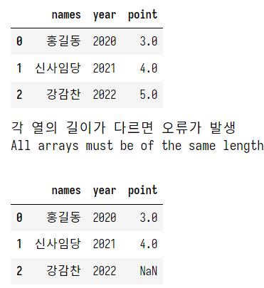

이제부터의 작업의 핵심은 이전에 SQL을 공부할 때처럼 원하는 데이터를 빠르게 수합하고 가공하는 것이다.

```python
my_dict = {
    'names': ['홍길동', '신사임당', '강감찬', '이순신'],
    'year': [2020, 2021, 2022, '2023'],
    'point': [3.0, 4.0, np.nan, 5.0]
}

df = pd.DataFrame(my_dict)
display(df)

new_df = df.set_index('names', inplace=False) # names 컬럼을 인덱스로 지정
                                             # inplace가 True이면, 원본이 변하게 됨.
                                             # False이면, 복사본을 만들어 변형을 만들게 됨. 일반적으로 False 지정
display(new_df) # name이 인덱스로 잡히게 됨
```

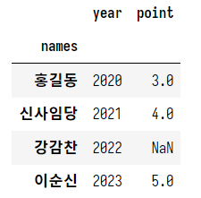

### 외부의 데이터를 DataFrame으로 불러오기

외부 CSV 파일 임포트를 위해 제공 받은 CSV 파일을 jupyter_home 아래 data 디렉토리를 만들어 복사해둔다.

```python
# 외부 CSV 파일 Import

df = pd.read_csv('./data/movies.csv')
display(df.head())
print(df.shape) # (9742, 3)

# 이 방법 외에도 Open API나 Database로부터 데이터를 받아
# DataFrame을 생성할 수 있다.
```

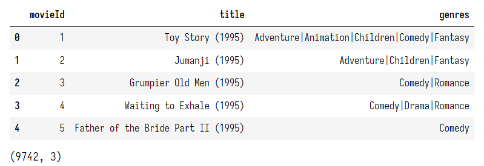


### DataFrame 조작/가공

#### colum, index 옵션

```python
# 데이터 프레임의 조작

my_dict = {
    '이름': ['홍길동', '신사임당', '강감찬', '이순신', '연개소문'],
    '학과': ['컴퓨터과학', '철학', '기계공학', '영어영문', '예술학'],
    '학년': [1, 2, 2, 4, 3],
    '학점': [1.5, 2.0, 3.1, 1.1, 4.2]
}

df = pd.DataFrame(my_dict,
                 columns=['학과', '이름', '학점', '학년', '등급'], # 출력 순서를 바꿀 수 있음
                 index=['one', 'two','three', 'four', 'five']) # 인덱스를 지정

display(df)

# 학과	이름	학점	학년	등급
# one	컴퓨터과학	홍길동	1.5	1	NaN
# two	철학	신사임당	2.0	2	NaN
# three	기계공학	강감찬	3.1	2	NaN
# four	영어영문	이순신	1.1	4	NaN
# five	예술학	연개소문	4.2	3	NaN
## 없는 값은 NaN으로 채워줌
```

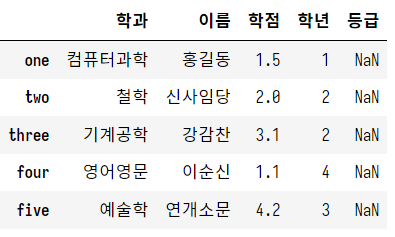

#### describe

```python
display(df.describe()) # 계산이 가능한 컬럼에 대해 기본 통계 정보를 알려줌

# count  값의 개수
# mean   평균
# std   표준 편차 (평균으로부터 얼마나 떨어져 있는가, 데이터의 분산 정도)
# min   최소
# 25%   사분위 값
# 50%   사분위 값 (중위)
# 75%   사분위 값
# max   최대
```

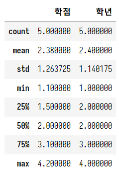

#### 원하는 컬럼 추출

##### 1개 컬럼
```python
# 원하는 컬럼 1개 추출
print(df['이름'])

# one       홍길동
# two      신사임당
# three     강감찬
# four      이순신
# five     연개소문
# Name: 이름, dtype: object
## 인덱스와 지정한 컬럼(->시리즈) 반환됨
```

주의!!

```python
s = df['이름'] # 뷰 반환
s['one'] = '임영택' # 뷰의 값을 수정하려고 시도하면, 원본 데이터가 변하게 됨
print(s)

display(df) # 원본까지 바뀌게 됨. 즉, df['컬럼']은 시리즈에 대한 뷰를 반환.
```

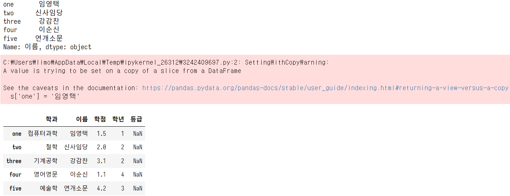

뷰를 가져오지 않고, 새로운 시리즈를 만들고 싶다면, copy()를 사용

```python
s2 = df['이름'].copy() # 새로운 시리즈로 복사
s2['one'] = '임영택아닙니다' # 복사된 시리즈의 값 변경
print(s2)

display(df) # 원본이 바뀌지 않음.
```

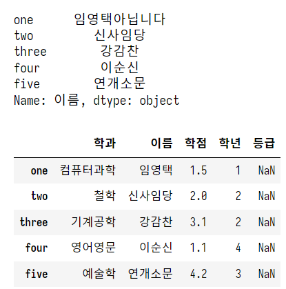

##### 여러 개 컬럼

```python
# 원하는 컬럼 여러 개 추출
## Fancy Indexing 사용

display(df[['학과', '이름']])
```

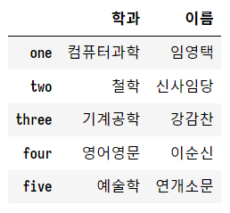

해당하는 컬럼으로 구성된 DataFrame이 반환됨

#### 컬럼 추가

```python
# 컬럼 추가

df['나이'] = [20, 21, 22, 21, 19] # 리스트 -> ndarray -> Series [내부적으로 변환 과정을 거쳐 DataFrame에 삽입됨]
display(df)
```

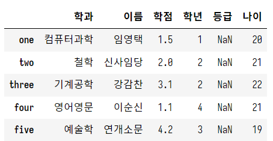

####  특정 조건 부여

```python
# 특정 조건 부여
# 학점 3.0 이상의 학생을 장학생으로 선정

df['장학여부'] = df['학점'] > 3.0
# 스칼라(3.0)가 브로드캐스팅되어 벡터로 변환
#   -> 동일 위치의 값이 각각 비교되어 비교 결과(Bool)로 이루어진 ndarray 생성, Series로 변환
#   -> DataFrame에 추가 

display(df)
```

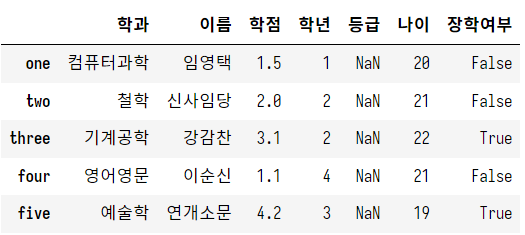

#### 컬럼 삭제

```python
# 컬럼 삭제

new_df = df.drop('이름', axis=1, inplace=False) # 열 방향에서 지워야 하므로, 0이 아닌 1
display(new_df)
```

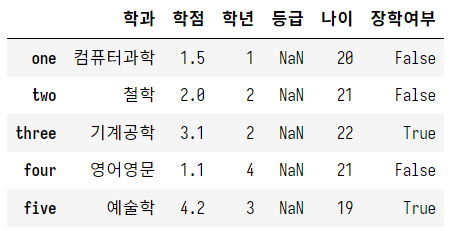

#### 컬럼에 대한 slicing -> 불가능

```python
display(df['학과':'학점']) # 오류 발생. 불가능함.
```

#### 행 가져오기 (Row Indexing)

```python
# Row Indexing

display(df[0:2]) # 슬라이싱은 가능

try:
    display(df[0]) # 한 개는 불러오려고 하면 오류 발생
except:
    print('에러 발생\n\n')
# 이렇게 일관성 없는 방법은 좋지 않음


# 행 가져오기 (Row Indexing)는 DataFrame.loc를 사용
# loc에는 반드시 지정 인덱스를 사용해야함
print(df.loc['one'], end='\n\n')

# 순번으로 가져오기
# iloc에는 반드시 숫자 인덱스를 사용해야함
print(df.iloc[0], end='\n\n')

# loc를 이용한 슬라이싱 & 인덱싱 고급
display(df.loc['one' : 'three']) # 가능
display(df.loc['one':]) # 가능
# display(df.loc['one' : -1])  # 불가능
display(df.loc[['one', 'four']]) # Fancy Indexing 가능
df.loc[['two', 'four'], ['이름', '학년']] # Fancy Indexing에서 행, 열의 인덱스를 모두 사용 가능
```

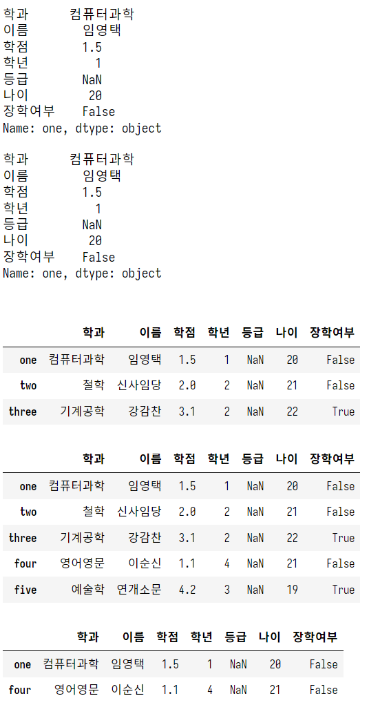

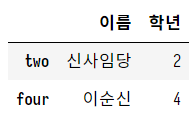

