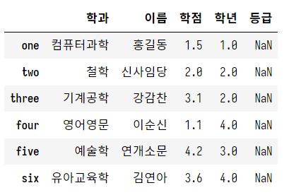
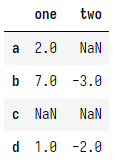
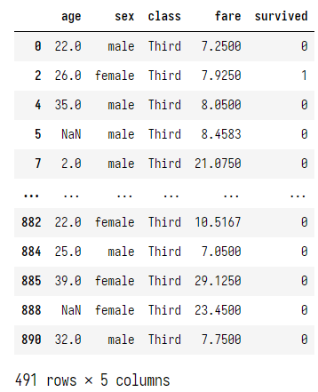

# Pandas (이어서)

## 복습

### Pandas 사용 이유

Numpy는 다차원 배열을 제공하지만 사용하기 불편. Pandas는 ndarray를 기반으로한 Series, Dataframe 등 편리한 자료구조를 제공.

### Pandas 사용 목적

1. 데이터 분석 (특히 탐색적 데이터 분석)
2. 데이터 전처리
    - 머신러닝을 위해 데이터를 추출하고 정제
    - 최근에는 모델을 만들어내는 과정 자체가 많이 간편해졌기 때문에, 오히려 데이터 전처리에 신경쓸 필요가 있음.

### Series와 DataFrame

#### Series

- 1차원 ndarray 기반
- 기본 인덱스(0, 1, 2, ...) 외에 사용자 지정 인덱스 사용 가능
    - 보통 날짜, 시각을 인덱스로 많이 잡음
- Series 객체를 독립적으로 사용할 일은 많지 않음. 보통 Series의 집합적 구조인 DataFrame을 이용하게 됨.

#### DataFrame

- 여러 개의 Series로 이루어진 2차원 자료구조.
- 하나의 Series가 하나의 열이 됨.
- 어제 딕셔너리를 이용해 데이터를 준비하고, DataFrame에 넣어주는 방법을 사용했음
- 그러나 일반적으로는 외부 데이터 소스에서 대용량 데이터를 읽어 넣어주게 됨
    - 일반적으로 CSV 파일
    - 그외에도 JSON이나 DB로부터 읽을 수도 있음


> **+ 추가 팁 **
> 가상환경 확인하기  
>   
> 가상환경 제거시 표시된 폴더까지 제거해줘야 함


## DataFrame 데이터 추출, 변형

### 데이터 추출

#### 예제 1

학점이 2.0을 초과하는 학생의 이름과 학점을 DataFrame으로 출력하라

```python
my_dict = {
    '이름': ['홍길동', '신사임당', '강감찬', '이순신', '연개소문'],
    '학과': ['컴퓨터과학', '철학', '기계공학', '영어영문', '예술학'],
    '학년': [1, 2, 2, 4, 3],
    '학점': [1.5, 2.0, 3.1, 1.1, 4.2]
}

df = pd.DataFrame(my_dict,
                 columns=['학과', '이름', '학점', '학년', '등급'], # 출력 순서를 바꿀 수 있음
                 index=['one', 'two','three', 'four', 'five']) # 인덱스를 지정
```

```python
# 예제 1
# 학점이 2.0을 초과하는 학생의 이름과 학점을 DataFrame으로 출력하라
display(df.loc[df['학점'] > 2.0, ['이름', '학점']]) # 행에는 Boolean Mask를, 열에는 Row Index를 넣어줌
```


#### 예제 2

학점이 3.0 이상인 학생의 등급을 A로 만들고 DataFrame으로 출력하라

```python
# 예제 2
# 학점이 3.0 이상인 학생의 등급을 A로 만들고 DataFrame으로 출력하라
df.loc[df['학점'] >= 3.0, '등급'] = 'A' # 원본의 데이터가 바뀜
display(df) # 원본 출력
```


#### 예제 3

학점이 1.5 이상 2.5 이하인 학생의 학과, 이름, 학점을 출력하라

```python
# 예제 3
# 학점이 1.5 이상 2.5 이하인 학생의 학과, 이름, 학점을 출력하라
df.loc[(df['학점'] >= 1.5) & (df['학점'] <= 2.5), '학과' : '학점']
```


#### 예제 4

신사임당의 학과와 학년 정보를 출력하라

```python
# 예제 4
# 신사임당의 학과와 학년 정보를 출력하라
df.loc[df['이름'] == '신사임당', ['이름', '학과', '학년']]
```


### 데이터 변경

#### 새로운 행 추가

```python
df.loc['six', :] = ['유아교육학', '김연아', '3.6', 4, np.nan] # loc[새로운 인덱스, :]
                                                              # ':' 전체 열을 의미
display(df)
```



#### 행 또는 열 삭제

```python
df.drop('three', axis=0, inplace=True) # 행을 지우므로 2차원 배열의 행 방향 축인 axis=0 지정
                                       # 원본에서 제거하기 위해 inplace=True 지정 
display(df)
```


## DataFrame 제공 함수

### 예제 데이터시트 불러오기

예제 파일인 auto-mpg.csv를 jupyter_home/data에 복사한다.

```python
# 헤더가 없는 CSV 불러오기

df = pd.read_csv('./data/auto-mpg.csv')
display(df) # 헤더가 없으므로 첫 행의 값이 헤더로 잡히게 됨

df = pd.read_csv('./data/auto-mpg.csv', header=None) # 숫자 인덱스로 컬럼명을 잡아줌
df.columns = ['mpg', 'cylinders', 'displacement', 'horsepower',
              'weight', 'acceleration', 'model year', 'origin', 'name']
display(df)
```


- mpg는 연비를 의미한다. (1갤런당 마일)
- cylinders: 실린더 수
- displacement: 배기량
- horsepower: 마력
- weight: 무게
- acceleration: 가속력
- model year: 연식
- origin: 제조국 (이산값)
    - 1: 미국
    - 2: 유럽(EU)
    - 3: 일본
- name: 모델명

많이 사용되는 데이터분석 예제 파일이다. (버클리대학)

### head(), tail()

```python
# head(), tail()
# 위에서, 아래에서 N개 출력

display(df.head(3))
display(df.tail(3))
```

### shape

```python
# shape
# 데이터 개수 / 행과 열의 개수
print(df.shape)
# numpy부터 나오는 프로퍼티
```

### count()

```python
# count()
# 각 컬럼이 가지는 값의 개수 반환. 이때 유효한 값만 반환 (잘못된 값이나 빈 경우는 제외)
print(df.count())
# mpg             398
# cylinders       398
# displacement    398
# horsepower      398
# weight          398
# acceleration    398
# model year      398
# origin          398
# name            398
# dtype: int64
```

출력 값이 모두 같으므로, 모든 컬럼이 유효함을 알 수 있음.  
머신러닝에 사용되는 데이터는 결측치가 존재해서는 안됨. 결측치란 빠진 데이터를 말함. 따라서 결측치가 있는 경우 반드시 해당 행을 제거하거나, 채워줘야 함. 이때 count()를 이용

### value_counts()

시리즈에 적용 가능. 유니크한 값의 개수를 셀 수 있음.

```python
# value_counts()
# DataFrame 자체가 아니라 Series에 적용
# 고유한 값의 개수를 셀 때 사용
print(df['origin'].value_counts())
# 1    249
# 3     79
# 2     70
# Name: origin, dtype: int64
## 미국 생산, EU 생산, 일본 생산별 개수를 알 수 있음.
```

### unique()

시리즈에 적용 가능. 중복 제거.

```python
# unique()
# DataFrame 자체가 아니라 Series에 적용
# 중복 제거
print(df['model year'].unique())
# array([70, 71, 72, 73, 74, 75, 76, 77, 78, 79, 80, 81, 82], dtype=int64)
# 몇 년부터 몇 년까지 생산된 차량의 정보인지를 알 수 있음.
```

### isin()

컬럼의 특정 값이 인자로 주어진 리스트 안에 있는 값인지 판단  
Boolean Mask가 반환됨

```python
# isin()
# 컬럼의 특정 값이 인자로 주어진 리스트 안에 있는 값인지 판단
# Boolean Mask가 반환됨
df['origin'].isin([1, 2])
# 0      True
# 1      True
# 2      True
# 3      True
# 4      True
#        ... 
df.loc[df['origin'].isin([1, 2]), :] # 미국과 유럽에서 제조한 자동차
```


### sort()

먼저 랜덤 값으로 채워진 DataFrame을 만든다.

> **난수를 이용해서 ndarray 생성**  
> ```python  
> # np.array([1, 2, 3, 4])  
> # np.arange(10)  
>   
> # 난수를 이용해서 ndarray 생성하기  
> print(np.random.randint(0, 10)) # 정수 난수 생성. randint(최소값<포함>, 최대값<제외>)  
> print(np.random.randint(0, 10, (6, 4))) # 마지막 인자로 shape 튜플을 넣으면 해당하는 shape의 난수 행렬 생성  
>   
> np.random.seed(100) # 난수 생성 알고리즘의 seed 부여 가능  
> print(np.random.randint(0, 10, (5, 6))) # 여러 번 실행해도 값이 불변  
>   
> df = pd.DataFrame(np.random.randint(0, 10, (6, 4))) # 2차원 ndarray를 통해 DataFrame 생성 가능  
> df.columns = ['A', 'B', 'C', 'D']  
> df.index = pd.date_range('20230101', periods=6) # '20230101'로부터 시작하여 6일간의 범위를 인덱스로 지정  
> display(df)  
>   
> # index를 랜덤하게 배치  
> random_date = np.random.permutation(df.index) # 인덱스의 위치를 랜덤하게 바꿈  
> print(random_date)  
> display(df)  
>   
> df2 = df.reindex(index=random_date, columns=['B', 'A', 'D', 'C']) # 인덱스를 다시 만듦 (index는 로우 인덱스, columns는 컬럼 인덱스)  
> display(df2)  
> ```

sort()를 통해 정렬한다.

```python
# index를 기준으로 정렬
print('\n\n열 방향으로 정렬된 DataFrame:')
display(df2.sort_index(axis=1, ascending=True)) # 열 방향으로 정렬
print('\n\n행 방향으로 정렬된 DataFrame:')
display(df2.sort_index(axis=0, ascending=True)) # 행 방향으로 정렬

# 값에 대해 정렬
print('\n\nB열의 값을 기준으로 정렬된 DataFrame:')
display(df2.sort_values(by='B')) # 대상 컬럼을 지정. 기본값 오름차순

print('\n\nB열의 값 기준 -> A열의 값 기준')
display(df2.sort_values(by=['B', 'A'])) # 동률 시 A열의 값을 기준으로 정렬
```


### 집계 함수

**기술 통계 (Descriptive Statistics)**  
- 분포를 다루지 않는 통계를 말함
- 평균, 합, 편차, 분산, 표준편차, 사분위, 공분산, 상관관계 등의 데이터를 가지고 데이터의 특성을 기술하는 것
- 공식을 기억하지 못하더라도 pandas가 제공하는 함수를 이용하면 값을 구할 수 있음

```python
# 테스트용 DataFrame 생성
# 2차원 배열로 변환할 수 있는 중첩된 list 생성
data = [
    [2, np.nan], # 결측치 등 없는 값은 np.nan이라는 상수로 표현
    [7, -3],
    [np.nan, np.nan],
    [1, -2]
]
# DataFrame으로 변환
# (내부적으로 list -> ndarray -> Series 변환)
df = pd.DataFrame(data,
                  columns=['one', 'two'],
                  index=['a', 'b', 'c', 'd']) # 생성시 바로 인덱스 지정 가능
display(df)
```



#### sum()

```python
# sum()
# ndarray와 DataFrame에는 차이가 있음
print(df.sum())
# one    10.0
# two    -5.0
# dtype: float64
## 2차원 ndarray에 대해 sum() 호출시 모든 데이터의 합계가 반환되었으나,
## 컬럼별 합계 반환됨
## DataFrame.sum()은 기본값으로 axis=0(행방향 = 위에서 아래로)이기 때문
print('\n')
print(df.sum(axis=1))
```

#### mean()

```python
# mean()
print('\n')
print(df.mean()) # 평균 계산시 기본값으로 NaN은 무시
print('\n')
print(df.mean(axis=0, skipna=False)) # NaN을 포함 (계산할 수 없으므로 결과는 NaN)
```

#### fillna()

그렇다면 NaN은 NaN으로 남겨두기 보다 어떠한 방식이든 처리하는 것이 좋다.
1. 삭제: 불확실한 데이터라면 소거하는 것이 가장 바람직하다.
    - 그러나 데이터가 충분하지 않다면 삭제했을 때 문제가 발생할 수 있다.
    - 통계적으로 데이터는 많을수록 분석 결과가 정확하다.
    - 충분한 데이터 수의 기준? -> 그때 그때 다르다. 다만 일반적으로 10만건이 기준
2. 보간(Interpolation): NaN을 적당한 값으로 수정해서 사용
    - 해당 열의 평균 값으로 대체
    - 해당 열의 최대/최소 값으로 대체
    - 가까운 위치의 다른 값으로 대체 등.

```python
# fillna()

mean_one = df['one'].mean() # 3.3333333333333335
mean_two = df['two'].mean() # -2.5

df['one'] = df['one'].fillna(value=mean_one) # fillna를 통해 NaN을 다른 값으로 대체한 새로운 Series 원본에 할당
display(df)
```

## DataFrame의 연결

### concat()

####  위, 아래 방향으로 이어 붙이기
```python
# 1. 위, 아래 방향으로 이어 붙이기
df1 = pd.DataFrame({
    'a': ['a0', 'a1', 'a2', 'a3'],
    'b': [1, 2, 3, 4],
    'c': ['c0', 'c1', 'c2', 'c3']
})
display(df1)

df2 = pd.DataFrame({
    'b': ['b0', 'b1', 'b2', 'b3'],
    'c': ['c0', 'c1', 'c2', 'c3'],
    'd': ['d0', 'd1', 'd2', 'd3'],
    'e': ['e0', 'e1', 'e2', 'e3']
})
display(df2)

display(pd.concat([df1, df2], axis=0)) # 연결할 DataFrame을 갖는 리스트를 넘겨줌
                                       # 컬럼명을 기준으로 붙임
                                       # Index도 그대로 붙임
display(pd.concat([df1, df2], axis=0, ignore_index=True)) # 기존 인덱스를 무시하고 새로운 인덱스
## 인덱스가 날짜, 고유번호 등 의미가 있다면 그대로 붙일 떄도 있음.
```


#### # 가로 방향으로 이어 붙이기

```python
# 2. 가로 방향으로 이어 붙이기

df1 = pd.DataFrame({
    'a': ['a0', 'a1', 'a2', 'a3'],
    'b': [1, 2, 3, 4],
    'c': ['c0', 'c1', 'c2', 'c3']
})
display(df1)

df2 = pd.DataFrame({
    'b': ['b0', 'b1', 'b2', 'b3'],
    'c': ['c0', 'c1', 'c2', 'c3'],
    'd': ['d0', 'd1', 'd2', 'd3'],
    'e': ['e0', 'e1', 'e2', 'e3']
}, index=[2, 3, 4, 5]) # 인덱스를 따로 지정함
display(df2)

display(pd.concat([df1, df2], axis=1)) # 연결할 DataFrame을 갖는 리스트를 넘겨줌
                                       # 인덱스를 기준으로 붙임
                                       # Index도 그대로 붙임
```


### merge()

```python
# 특정 열을 기준으로 옆으로 이어붙이기
data1 = {"학번" : [1,2,3,4],
         "이름" : ["홍길동","신사임당","강감찬","이순신"],
         "학년" : [2,4,1,3]}

data2 = {"학번" : [1,2,4,5],
         "학과" : ["CS","MATH","MATH","CS"],
         "학점" : [3.4,2.9,4.5,1.2]}

df1 = pd.DataFrame(data1)
df2 = pd.DataFrame(data2)

display(pd.merge(df1, df2, on='학번', how='inner')) # INNER JOIN
display(pd.merge(df1, df2, on='학번', how='outer')) # OUTER JOIN

# 기준열의 컬럼 인덱스가 다른 경우
data1 = {"학번" : [1,2,3,4],
         "이름" : ["홍길동","신사임당","강감찬","이순신"],
         "학년" : [2,4,1,3]}

data2 = {"학생학번" : [1,2,4,5],
         "학과" : ["CS","MATH","MATH","CS"],
         "학점" : [3.4,2.9,4.5,1.2]}

df1 = pd.DataFrame(data1)
df2 = pd.DataFrame(data2)

display(pd.merge(df1, df2, left_on='학번', right_on='학생학번', how='inner')) # INNER JOIN
```


## DataFrame 함수 매핑

### seaborn 설치

데이터 분포 시각화 모듈인 seaborn이 필요하다. 시각화를 여기서 하려는 것은 아니고, seaborn에 내장된 타이타닉 데이터셋을 사용해보려고 한다.

```powershell
(base) PS C:\Users\limo> conda activate data_env
(data_env) PS C:\Users\limo> conda install seaborn

...

Proceed ([y]/n)? y [엔터]
```

### seaborn 불러오기

```python
import seaborn as sns
```

### apply(): Series에 함수 매핑

```python
titanic = sns.load_dataset('titanic') # seaborn의 데이터 셋 로드
display(titanic)

# 모든 행에 대해 age와 fare 열만 추출
df = titanic.loc[:, ['age', 'fare']]
display(df) # (891, 2)

# 사용자 정의 함수
def add_10(n):
    return n + 10

def myFunc(a, b): # Series 내의 요소가 첫번째 인자로 들어감. 다음 인자는 지정 필요.
    return a + b

# age 열의 모든 행에 대해
# 위에서 정의한 함수를 적용하고 싶은 경우
# <=> 특정 Series에 대해 함수 적용 -> 이를 함수 매핑이라고 함
# apply() 함수 사용
# 처리 완료 Series 반환
result1 = df['age'].apply(add_10)
print(result1.head()) # 기존 나이 데이터가 10씩 증가되어 출력됨
print()

result2 = df['age'].apply(myFunc, b=20)
print(result2.head()) # 기존 나이 데이터가 20씩 증가되어 출력됨
print()

# 람다 함수 이용
result3 = df['age'].apply(lambda x: x + 30)
print(result3.head()) # 기존 나이 데이터가 30씩 증가되어 출력됨
```


### applymap(): DataFrame에 함수 매핑

```python
# DataFrame에 함수를 적용하려면
# applymap() 사용

df = titanic.loc[:, ['age', 'fare']]
display(df)

def add_10(n):
    return n + 10

result = df.applymap(add_10)
display(result.head())
```


## DataFrame 그룹핑

### 1차 그룹핑

groupby() 사용

```python
# Grouping
# groupby() 사용

df = titanic.loc[:, ['age', 'sex', 'class', 'fare', 'survived']]
display(df.head())

# Group 단위로 묶기
grouped = df.groupby(['class'])
print(grouped) # 바로 볼 수는 없음.

for key, group in grouped: # group에 그룹된 DataFrame이 할당됨
    print('KEY: {}'.format(key))
    print('ROWS: {}'.format(len(group)))
    display(group.head())
    print('\n')

avg = grouped.mean() # 각 그룹별로, 평균을 낼 수 있는 컬럼 별 평균이 출력됨
display(avg)

# 개별 그룹 뽑기
third_group = grouped.get_group('Third')
display(third_group)
```




### 2차 그룹핑

```python
# 그루핑 고급: 2차 그룹핑

df = titanic.loc[:, ['age', 'sex', 'class', 'fare', 'survived']]
display(df.head())

grouped = df.groupby(['class', 'sex']) # 여러 개 줄 수 있음. 2차 그룹핑.
                                       # class별로 그룹핑된 상태에서 각 그룹을 다시 sex별로 그룹핑
display(grouped.mean())

group4 = grouped.get_group(('Third', 'female')).head() # 개별 그룹을 뽑을 때에는 인자로 튜플을 줘야 함
display(group4)
```


## 연습

### 데이터셋

[https://data.kma.go.kr/cmmn/main.do](https://data.kma.go.kr/cmmn/main.do) 접속


기본 조건으로, 모든 기간의 데이터 조회


CSV 파일 다운로드


대구로도 조회하여 CSV 다운로드

#### 문제 1: 기상 관측 이래, 서울의 최고 기온이 가장 높았던 날은 언제였고, 몇도인가요?


#### 문제 2: 서울 지역에서, 역사적으로 일교차가 가장 큰 날짜는 몇년 몇월 몇일 인가요?


#### 문제 3: 서울 지역에서, 1년 중 평균적으로 일교차가 가장 큰 날짜는 몇월 몇일 인가요?


#### 문제 4: 가장 덥다고 알려진 대구보다 서울이 더 더운날이 가장 많은 연도는 언제인가요?