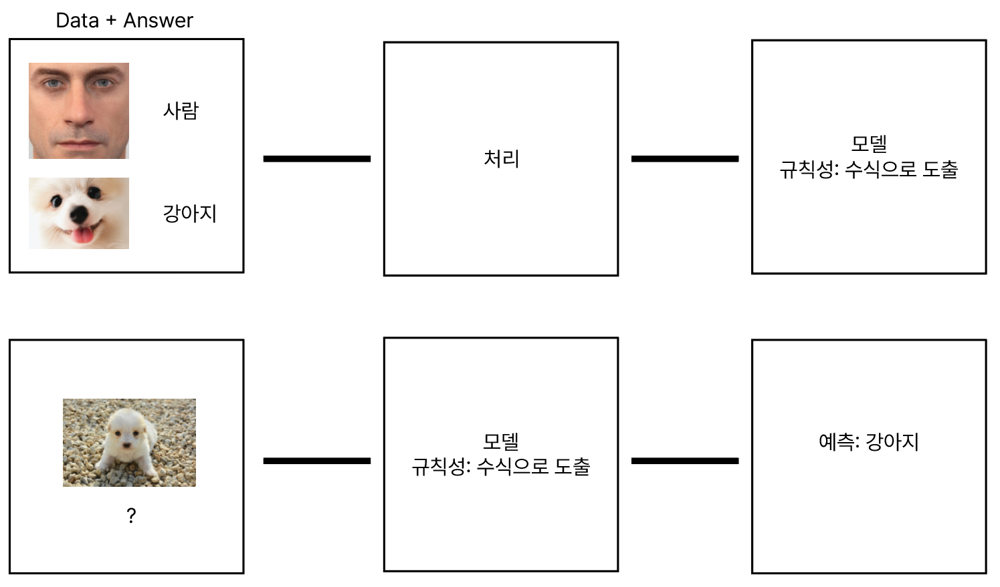

# 머신러닝 개요

## AI

- AI: Artificial Intelligence, 인공지능
- 정의: 사람의 사고 능력을 구현한 소프트웨어. 시스템
- 분류
    1. Strong AI: 사람과 완전히 구별할 수 없는 AI. 궁극적 지향점. 안타깝게도 만드는 방법을 모름.
    2. Weak AI: 특정 분야에 국한해서는 사람에 준하는 수준으로 동작하는 AI
        - 예시: 바둑, 자율주행, 챗봇 등. 최근의 AI 기술 대다수가 여기에 해당
        - 생화학적 사고(사람)와 전자기적 사고(AI)의 성능 차이는 약 100만배. 지능이 우수한 인간 집단이 2만년간 처리해야하는 작업을 AI에 맡기면 13일만에 처리 가능.

## Weak AI는 어떻게 만들까?

- 인간의 사고에 대한 가설
    - 인간은 과거부터 학습한 내용을 바탕으로 사고를 한다.
    - 따라서 사람처럼 데이터에 기반하여 학습할 수 있는 기능이 있는 소프트웨어를 만들자.

- 머신 러닝
    - Data -> 학습 ->  모델 ->  예측
    - 기존의 프로그램은 Rule Based 프로그램. 사용자가 의도한 규칙, 과정에 따라서만 동작함. (Rule Based Program, or Explicit Program)
    - 그러나 머신러닝은 개발자가 특정한 규칙과 알고리즘을 사전에 세우고 입력하면 그에 따라 동작하는 방식이 아니라, 데이터에 기반한 학습을 통해 규칙(->모델)을 만들어내는 방식

## 머신러닝 기법 - 딥러닝이란?

1. Regression: 본래 통계 기법
2. SVM(Support Vector Machine)
3. Decision Tree, Random Forest (Decision Tree의 앙상블)
4. KNN
5. Naive Bayes
6. Artificial Neural Network (인공신경망, ANN): 뇌공학의 영역 -> 이를 발전시킨 것이 Depp Learning
    - 오랜 기간 막대한 투자가 이뤄졌으나 성과가 미미했음.
    - 최근에 알파고 등 여러 성과들이 생기면서 재조명되고, 딥러닝이라는 이름으로 지칭됨
7. k-Means, DBSCAN
8. Reinforcement Learning (강화학습)
9. 등등

- 1~6: 지도학습
- 7: 비지도학습
- 8: 강화학습

### 딥러닝 v.s. 다른 기법

- 가장 큰 차이는 취급 데이터의 형태
    - 정형 데이터를 취급하는 경우 다른 머신러닝 기법도 괜찮음
    - 비정형 데이터를 취급하는 경우 딥러닝이 유리
        - 소리, 이미지, 영상, 자연어 등 정해진 형태가 없고, 대용량 데이터인 경우
- 딥러닝은 시간이 오래걸리고 많은 자원을 필요로 하기 때문에 정형 데이터를 다룬다면 다른 머신러닝 기법을 사용하는 것이 유리할 수도 있음.
    - 예측은 정확도만큼 신속함이 중요함.

- 즉, 무조건 딥러닝을 사용해야하는 것이 아니라, 상황에 따라 택해야한다는 것.
- 우리는 Regression을 공부하고, 이를 기반으로 하여 인공신경망으로 넘어가, 딥러닝을 다루겠음.
    - 다른 기법들은 이미 이론과 알고리즘, 구현체(라이브러리)가 정립되어 있으므로 따로 원리를 공부하여 쓰기만 하면 됨.

## 머신러닝 종류

입력 데이터에 따라 차이가 남

### 지도학습 (Supervised Learning)

> 데이터 + 라벨 -> 프로그램 -> (model) 규칙성

라벨링이 필요하므로 수작업이 들어감. 학습할 데이터를 정제하고 그에 대한 라벨링을 해주는 작업이 아주 중요함.  
대부분의 시스템이 지도학습에 해당.

### 비지도학습 (Unsupervised Learning)

> 데이터 -> 프로그램 -> 클러스터링 / 모델

라벨이 없더라도 데이터를 분류해줌 (클러스터링)  
예컨대 특정 기사를 입력하면, 카테고리에 따라 분류 (정치/경제/사회)

### 준지도학습 (Semisupervised Learning)

> 라벨링이 되어있는 데이터 + 라벨링되지 않은 데이터 혼재

### 강화학습

예> 틱택토  
특정 시점에 어떤 위치에 말을 둬야 하는지, 현재 상태보다 더 최적인 환경을 찾아감. 

금융 쪽에서도 많이 활용되고 있음. 상품 가격을 어제보다 오늘 높일 수 있는 방법. 과거 데이터를 기반으로 하는 다른 학습 방법들보다 현재 시점의 최적화를 목적으로 하는 강화학습이 보다 적절함.

딥러닝이 나오므로 가장 마지막에 공부.   