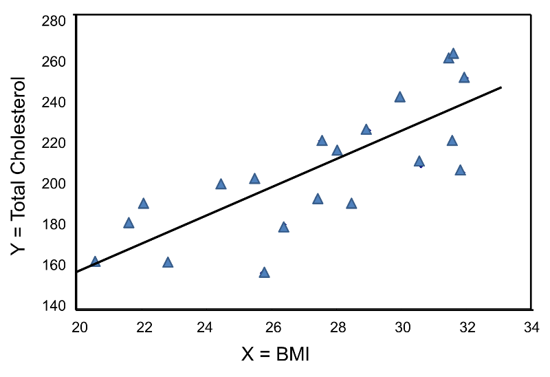
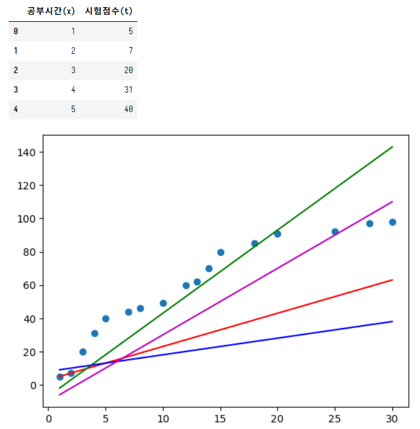
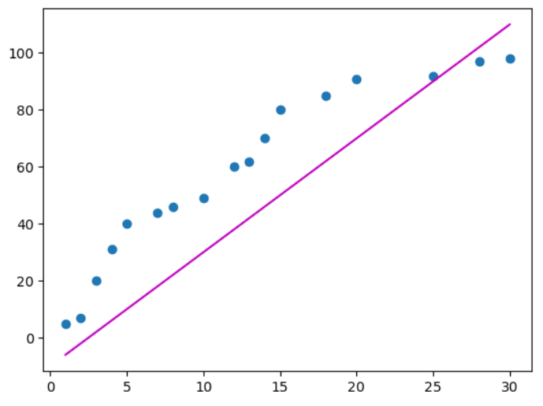
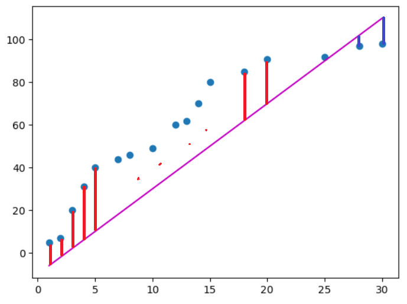
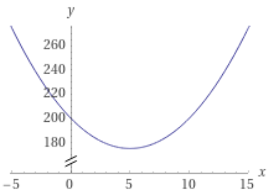
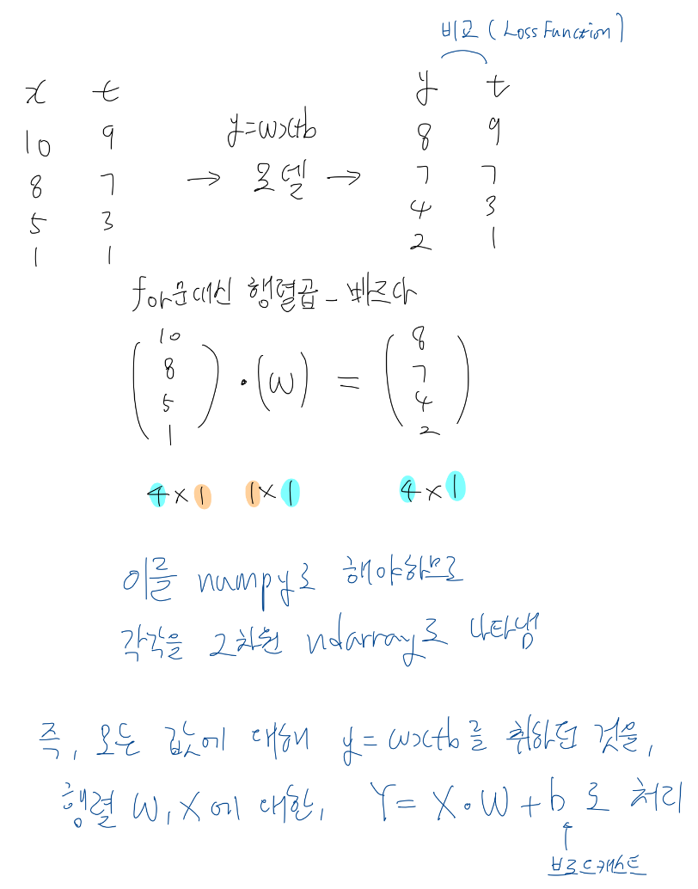
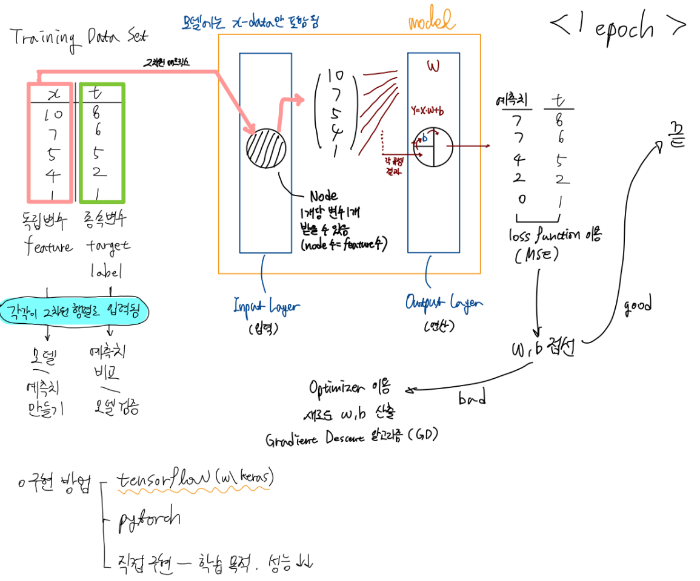
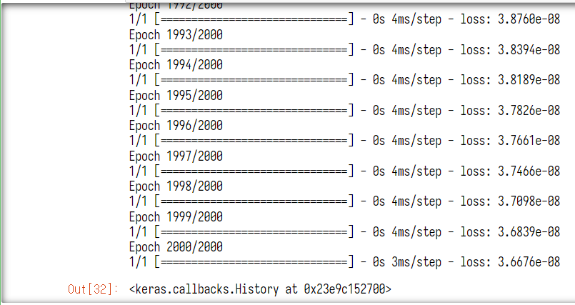
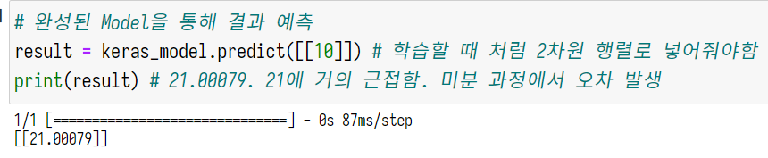

# 지도학습

## 개요

> [ 학습 데이터 | 레이블 ] -- ( 입력 ) --> [ 학습 ] ------> 모델(수식)  
>                                           |  
>                                          예측  

- 레이블은 여러 개가 될 수 있다. (다변량)
    - 예) 사람, 남자, 성인
- 그러나 머신러닝에서는 기본적으로 한 개의 레이블을 취급한다 (단변량)

### Regression

| 공부시간 | 성적 |
|------|----|
| 2    |    |
| 5    |    |
| 7    |    |
|      |    |
예측 예시: 6시간 공부했는데, 몇 점 나올까? -> 53점  
연속적인 수로 예측

\* 이 떄의 Regression이란, 머신러닝 기법 중의 Regression이 아니다. 머신러닝 기법인 Regression은 통계학에서 사용되는 알고리즘이며, 여기서의 Regression은 지도학습에서 학습 데이터와 예측치가 연속적인 숫자인 경우를 말하는 분류이다.

### Classification

| 공부시간 | 합격여부 |
|------|------|
| 2    | 0    |
| 5    | 0    |
| 7    | 1    |
| 8    |      |

예측 예시: 6시간 공부했는데, 합격 할 수 있을까? -> 0 (불합격)  
연속적인 수가 아닌, 이산적인 수로 예측

## Regression (회귀)

### 개요

- 통계적 기법
- 어떤 데이터에 대해 그 데이터에 영향을 주는 **조건들의 영향력**을 이용해서 데이터에 대한 조건부 *평균*을 구하는 방법
- 데이터를 가장 잘 표현하는 값을 반환하는 함수를 찾는 것.

- 평균: 대푯값으로 가장 많이 이용하는 값
- 대푯값: 최소값, 최대값, *평균*, 최빈값 등.

- 예시
    - 대한민국의 아파트 가격은?
        - 방법 1
            - 모든 아파트의 가격을 더해 평균을 구함 -> N억
            - 대한민국 아파트의 가격을 대표할 수 있는 값인가?
            - 지역에 따라 위치에 따라 의미 없는 값일 수 있음.
        - **방법 2**
            - 위와 같은 괴리는 아파트 가격이 몇몇 조건에 영향을 받기 때문에 발생. 평수, 학군, 교통, 층 수 등.
                - 이때 각 조건은 가격에 미치는 영향력이 다름.
                - 영향력에 따라 조건에 가중치를 부여하여 가격을 구하는 수식을 작성
                    - 가격 y = 평수 * 8000 + 역세권<0또는1> * 3000 + 인근학교<0또는1> * 5000
                    - 그렇다면 특정 조건 (예컨대 20평, 역세권1, 인근학교1)의 아파트의 평균 가격이 위의 수식의 계산 결과와 가까우면 의미있는 수식이라고 할 수 있음.
                    - 따라서 조건을 설정하고, 조건에 대한 가중치를 설정하여 식을 만드는 것이 주요 작업
                - 수식이 나오면 수식에 조건을 대입하여 값을 예측할 수 있음

### 모델

모델은 수식의 형태이다.

#### 독립변수와 종속변수, 데이터와 레이블

**예시1** 
> BMI지수 = 몸무게(kg) ÷ (신장(m) × 신장(m))

- 독립변수(feature)
    - 위의 예시에서 몸무게와 신장에 해당.
    - 독립적으로 입력되는 값.
    - 비지도학습의 데이터(X-data)에 해당.
- 종속변수(target)
    - 위의 예시에서 BMI 지수에 해당.
    - 독립변수에 의해 결정되는 값.
    - 비지도학습의 레이블에 해당.

**예시2**
| 해외연수기간 | 공부시간 | 성적 |
|--------|------|----|
| 1      | 2    | 10 |
| 3      | 1    | 70 |
| 5      | 10   |    |
성적 → 종속변수, 레이블  
해외연수기간, 공부시간 → 독립변수, 데이터

#### 독립변수가 1개일 때

$$y = \beta_0 x + \beta_1$$

(이때, y는 예측치, x는 독립변수, $b_0$는 가중치, $b_1$은 보정 상수)

이는 y=ax+b 꼴의 1차 함수와 같다.



예컨대, 위와 같은 측정치가 있을 때, 이를 가장 잘 표현하는 직선을 그리는 작업과 같다고 보면 된다.

그렇다면, 독립변수가 2개 이상의 N개라면, 좌표평면이 3차원 이상이 되고, 함수 역시 선이 아닌 면 이상이 될 것이다. 3차원 이상이라면 이해가 어려우므로 독립변수가 1개인 경우를 중심으로 다룰 것이나, 차원이 올라가도 비슷한 패턴이라는 것을 기억하라.

#### 독립변수가 2개일때

이 경우 식이 아래의 꼴을 띤다.
$$y = a x_1 + b x_2 + c$$
이때, y는 예측치, $x_1$ 및 $x_2$는 독립변수, a 및 b는 가중치, c는 보정상수

상술했듯이, 직선이 아니라 y, $x_1$, $x_2$를 축으로 하는 3차원 평면에 그려지는 면이다.

여기서 a, b, c를 회귀계수라고 하며, 이 값을 찾으면 식을 완성할 수 있다.

이러한 수식을 **Classical Linear Regression Model**이라고 한다.

### 적용

회귀를 적용하기 위해서는, 만약 데이터가 평균을 사용하여 잘 표현될 수 있는지를 확인해야 한다. 평균이 의미를 가지지 못하는 데이터의 경우 회귀를 적용하기 어렵다.

- 예컨대 신장에 따른 성인 남성 인구는 정규 분포를 가지므로, 전체 평균이 의미를 가진다.  
- 반면 연봉 분포는 저소득자가 아주 많고, 고소득자가 아주 적으므로, 전체 평균이 의미를 가지지 못한다. 이를 편향된 데이터라고 하며, 이러한 경우에는 회귀를 적용하기 힘들다.

### 회귀는 왜 회귀라고 불리는가

1800년대 찰스 다윈이 <종의 기원>을 쓴 후, 사촌인 프랜시스 골턴은 우생학적 가설을 증명하기 위해 주변 사람들의 키를 전수조사하였다. 이때, 재미있는 것은 키가 큰 아버지라고 해도 아들이 키가 작거나, 키가 작은 아버지라고 해도 아버지보다는 키가 큰 아들이 있었다는 점이다. 즉, 그는 데이터가 평균으로 회귀한다(Regression toward mean)는 것을 발견하였다. 회귀 분석은 이 발견에 바탕한다.

### matplotlib으로 그려보기

```python
import numpy as np
import pandas as pd
import matplotlib.pyplot as plt
print('modules imported!')
```

```python
df = pd.DataFrame({
 '공부시간(x)' : [1,2,3,4,5,7,8,10,12,13,14,15,18,20,25,28,30], # 독립변수. data
 '시험점수(t)' : [5,7,20,31,40,44,46,49,60,62,70,80,85,91,92,97,98] # 종속변수. target
})

display(df.head())

# 그래프로 데이터 분포를 알고 싶은 경우
# matplotlib.pyplot.scatter(독립변수_시리즈, 종속변수_시리즈)
plt.scatter(df['공부시간(x)'], df['시험점수(t)'])

# Classical Linear Regression Model 그리기
# y = ax + b 직선
# matplotlib.pyplot.plot(x데이터, t데이터)
plt.plot(df['공부시간(x)'], 2 * df['공부시간(x)'] + 3, color='r')
plt.plot(df['공부시간(x)'], 5 * df['공부시간(x)'] - 7, color='g')
plt.plot(df['공부시간(x)'], 1 * df['공부시간(x)'] + 8, color='b')
plt.plot(df['공부시간(x)'], 4 * df['공부시간(x)'] - 10, color='m')

plt.show()
```



다양한 모델을 그래프에 나타나보았다. 이렇게 모델을 점차 개선하는 것이 기계 학습에서 말하는 학습이다. 회귀 계수를 정확하게 계산하여 점차 개선된 모델을 찾는 것이다.

### 학습 매커니즘

그럼 단순히 눈대중으로 모델을 구할 것이 아니라, 논리적이고 수학적인 방법으로 정확한 모델을 구하는, 혹은 개선시켜나가는 방법을 고안해야한다.

머신러닝에서는 독립변수가 1개인 Classical Linear Regression Model를 아래와 같이 표현한다.

$$y = w x + b$$

w는 weight(가중치)를 의미하며, b는 bias(편중)를 의미한다. w와 b를 잘 찾으면 된다.

우선 아래와 같이 적당한 시작값을 w와 b에 줘서 그려보자.



그려본 모델이 정확한지의 여부는 각 점과 모델 간의 차이가 큰 지, 작은 지를 따져보면 된다. 이를 오차(Error)라고 하며, 아래와 같이 나타내볼 수 있다.

$$E = t-y \\ = t-(wx+b)$$




오차는 각 변량마다 생기므로, 모두 더해서 하나의 값으로 만들면, 해당 직선이 정확한지를 판단하기가 더 쉬워질 것 같다. 그러나 문제가 있는데, 오차가 음수인 경우도 있다는 것이다.  
그래서 오차를 제곱하여 더해주는 방법이 고안되었다. 오차를 제곱하여 더하면, 부호가 모두 양수가 되며, 오차의 정도를 더 극명하게 볼 수 있다는 장점이 있다.

비교하기 쉽도록 이 값을 평균낸 것을 MSE(평균제곱오차)라고 하며, 이 값을 따져 모델의 정확성을 쉽게 지표화할 수 있다. 이렇게 모델을 만들었을 때, 모델이 좋은지 좋지 않은지를 판단하는 식을 손실 함수(Loss Function)라고 하며, 독립변수가 1개인 Classical Linear Regression Model을 만들었을 때에는 MSE를 손실 함수로 사용하면 된다.

$$\textrm{전체 변량의 수가 n이고, } \textrm{x의 각 변량을 } x_i, \textrm{t의 각 변량을 } t_i \textrm{라고 할 때, }   \\ MSE = \frac{E_1 ^2 + E_2 ^2 + E_3 ^2 + … + E_i ^2}{n}$$

$$\textrm{이때, } \\ E_i = t_i - y_i \\ = t_i - (w x_i + b_i) \\ \textrm{이므로}$$

    $$\textrm{Loss Function을 l이라고 하면, }\\ l = \frac{1}{n} \sum_{i = 1}^{n}{(t_i - y_i)^2} \\ = \frac{1}{n} \sum_{i = 1}^{n}{(t_i - (w x_i + b))^2}$$
    

그렇다면, $n$, $x_i$, $t_i$는 상수이므로, Loss Function l은 $w$와 $b$에 대한 2차함수의 합이다. 

그래프로 그리면 아래와 같은 곡선일 것이며, 이 곡선의 최소값인 w 및 b가 모델이 가장 정확할 수 있는 위치이다. 이 값을 구하면 되는 것이다. 이때 l의 접선의 기울기는 0이다.

  
(y축은 loss function, y축은 w)

따라서 우선 적당한 w, b를 시작값으로 시작하여, l의 미분함수에 대입한다. 기울기가 0에 가까워질 수 있도록 w를 이동시키면 된다. 이는 다음과 같이 표현된다.

$$w' = w - \alpha \cdot (w지점에서접선의기울기) \\ \textrm{(이때 w'는 다음 w의 위치이며, } \alpha \textrm{는 학습률 상수)}$$

$$b' = b - \alpha \cdot (b지점에서접선의기울기) \\ \textrm{(이때 b'는 다음 b의 위치이며, } \alpha \textrm{는 학습률 상수)}$$

그럼 새로운 위치 w'에서 위와 같은 과정을 반복(for loop)한다. 그러다 기울기가 0이 되면 이 때의 w값을 가져오며 계산이 종료된다. 이러한 방식을 최소제곱법이라고 한다.

구체적으로, 독립변수와 종속변수가 아래와 같이 주어질 때,  프로그램은 임의의 모델을 만든 후, 해당 모델을 통해 구한 예측값을 반환한다. 그럼 MSE를 이용한 Loss Function을 통해 실제 값과 예측 값 사이의 오차를 바탕으로 모델의 정확성을 판단한다. 이 과정을 w, b 각 위치에서의 접선의 기울기가 0에 가까워질 때까지 w, b를 갱신해가며 반복하게 되는 것이다. 이 과정을 학습이라고 하는 것이다.

### 학습 구현





위 그림에서 Input Layer는 텐서플로우에서 Faltten, Output Layer는 Dense로 지칭된다.

&nbsp;

텐서플로우 설치

```powershell
(base) PS C:\Users\limo> conda activate data_env
(data_env) PS C:\Users\limo> conda install tensorflow
```

Sequential 모델을 사용. 모델 내의 레이어를 순차적으로 거치기 때문임.

```python
# Training Data Set
x_data = np.array([1, 2, 3, 4, 5]).reshape(-1, 1) # 1열로 만들고 행은 알아서 계산
t_data = np.array([3, 5, 7, 9, 11]).reshape(-1, 1) # 테스트용으로 t=2x+1로 t 값을 넣어줬음

# Model 만들기
keras_model = Sequential()

# Layer 생성
input_layer = Flatten(input_shape=(1,)) # 튜플로 노드의 개수를 지정
output_layer = Dense(1, activation='linear') # 노드 개수 지정, 에측치 계산 후 추가 가공 없이 바로 출력되므로 activation은 linear로 지정

# Model에 Layer 추가
keras_model.add(input_layer)
keras_model.add(output_layer) # 모델 완성

# Model 동작 설정
keras_model.compile(optimizer=SGD(learning_rate=1e-2), # w, b 갱신시 사용할 옵티마이저 지정. 러닝 레이트는 정해진 기준이 없음. 잘 찾아서 넣어줘야함.
                    loss='mse')                        # Loss Function을 MSE로 지정

# Model 학습
keras_model.fit(x_data,
               t_data,
               epochs=2000) # 이 과정을 몇 번 반복할지

# Model 완성됨
```



```python
# 완성된 Model을 통해 결과 예측
result = keras_model.predict([[10]]) # 학습할 때 처럼 2차원 행렬로 넣어줘야함
print(result) # 21.00079. 21에 거의 근접함. 미분 과정에서 오차 발생
```



