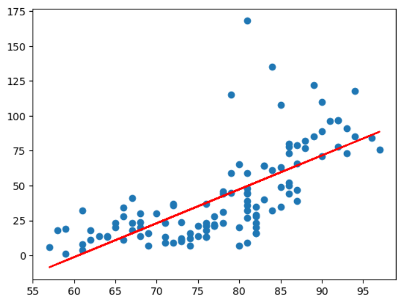
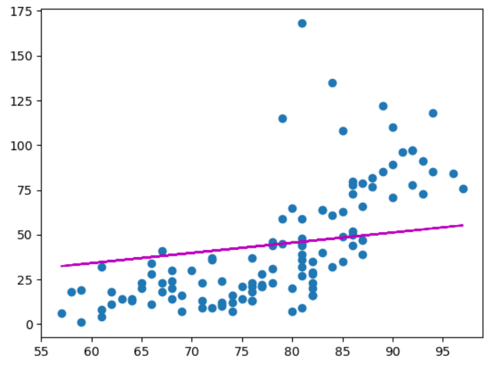
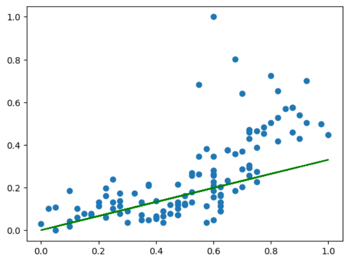

# Regression
## 복습

- AI
	- String AI
	- Weak AI
		- 머신러닝
- 데이터 기반 학습을 통해 예측
			- 지도학습
				- Regression
					- 우리가 어제 공부한 알고리즘
						1. 연속적인 수를 예측 (Regression)
							- Linear Regression Model
                                - Simple Linear Regression Model (독립변수 1개)
                                - Multiple Linear Regression Model (독립변수 1개 이상)
                                    - 대부분의 경우
						2. 이산적인 수(-> 분류)를 예측 (Classification)
							- Logistic Regression Model
                                - Binary Classification (이진 분류): 두 개의 분류 중 한 개로 예측
                                - Multinonial Classification (다항 분류): 여러 개의 분류 중 한 개로 예측
				- SVM
				- Decision Tree
				- Naive Boyes
				- KNN
				- 그외
				- 많은 이유
					- 데이터에 따라 유리한 알고리즘 선택
				- 각 알고리즘에 대해 구현체는 이미 시중에 많음
					- 우리는 텐서플로우-케라스 사용
					- 따라서 구현체를 만들 필요는 없고 데이터를 어떻게 넣어주고 다루는지를 공부해야 함
				- 다만 ANN(인공신경망)의 경우 범용적인 라이브러리는 제공되지만, 사용 조건에 맞는 특수한 모델은 직접 만드는 것이 좋음
					- 이때 Regression이 활용됨
					- 그래서 우리도 Regression을 먼저 공부했음
			- 비지도학습(클러스터링)
			- 준지도학습
			- 강화학습

## 실습

ozone.csv

종속변수를 오존량으로 잡으면, 독립변수가 여러 개가 된다. 우리는 이 중 기온을 독립변수로 잡아 Simple Linear Regression Model을 만들어보려고 한다.


```python
# 온도에 따른 오존량

# 필요 모듈
import numpy as np
import pandas as pd
from tensorflow.keras.models import Sequential
from tensorflow.keras.layers import Flatten, Dense
from tensorflow.keras.optimizers import SGD
import matplotlib.pyplot as plt

# Raw Data Loading
df = pd.read_csv('./data/ozone.csv')
display(df.head())

# 필요한 열만 가져오기 (팬시 인덱싱)
df = df[['Ozone', 'Temp']]
display(df.head(), df.shape) # (153, 2)
```

```python
# 결측치 처리
# 공부한 것이 없으므로 삭제하자.
df = df.dropna(how='any')
display(df.head(), df.shape) # (116, 2)
```

```python
# Training Data Set

x_data = df['Temp'].values.reshape(-1, 1) # Series -> 2d-array
# print(x_data)

t_data = df['Ozone'].values.reshape(-1, 1)
# print(t_data)

# Model
keras_model = Sequential()

# Layer
input_layer = Flatten(input_shape=(1,))
output_layer = Dense(1, activation='linear') # w, b는 여기 안에 있음

# Model에 Layer를 추가
keras_model.add(input_layer)
keras_model.add(output_layer)

# Model 설정
keras_model.compile(optimizer=SGD(learning_rate=1e-6),
                    loss='mse')

# Model 학습
keras_model.fit(x_data,
               t_data,
               epochs=2000,
               verbose=0) # 학습 로그 출력 안함

```

```python
# 학습이 끝나면 모델 평가가 이뤄져야 함
# 그러나 그 판단 기준은?
# 평가가 완료되었다고 치고 우선 넘어가자
```

```python
# 만든 모델을 가지고 예측
result = keras_model.predict([[62]]) # 62'F에서의 오존량 예측
print(result)
```

```python
# 이미 잘 만들어진 라이브러리를 이용해서 예측값이 정확한지 비교해보자.
# 사이킷런 사용
from sklearn import linear_model

# x_data, t_data는 위에 있다.
# 모델만 만들면 된다.
sklearn_model = linear_model.LinearRegression() # Optimizer 등 지정 안함. 알아서 잘 한다.

# 학습
sklearn_model.fit(x_data,
                  t_data) # 알아서 잘 돌린다

# 예측
result_sklearn = sklearn_model.predict([[62]])
print(result_sklearn) # [[3.58411393]]

# 우리가 구현한 모델에 비해 차이가 너무 크다
# 우리 모델에 어떤 문제가 있다는 것을 짐작할 수 있다

# 사이킷런 모델이 잘못됐을 가능성도 있다.
# 입력값의 산점도와 모델 직선을 눈으로 확인해보자.
plt.scatter(x_data, t_data) # 자기가 알아서 2-d 배열을 1-d로 바꿔준다.

weight = sklearn_model.coef_
bias = sklearn_model.intercept_ # 언더바 주의
plt.plot(x_data, x_data * weight + bias, color='r') # plot는 직선을 그릴 때 사용

plt.show() # 만족스러운 모델을 눈으로 확인할 수 있다.
```



```python
# 텐서플로우로 직접 학습한 모델도 그려보자.

plt.scatter(x_data, t_data)

weight, bias = output_layer.get_weights() # 텐서플로우의 아웃풋 레이어에서 가져온다.

plt.plot(x_data, x_data * weight + bias, color='m')

plt.show() # 그럴 듯해보이지만...
           # 사실 우리가 아직 공부를 많이 안헀기 때문에 사이킷런과 비교해보는 것밖에는 판단 기준이 없다.
    
# 모델을 만드는 과정이 잘못되었다기보다는,
# 데이터 전처리가 잘못되었다.
# 싸이킷런은 데이터를 알아서 전처리해준 것이다.
```



```python
# 차이가 생기는 이유
# 데이터 전처리

# 데이터 전처리 과정
# 최소 3 단계
# 1. 결측치 제거/대체 (완료)
# 2. 이상치 처리
##    그래프에서, 오존량이 175 선으로 높은 데이터가 있다.
##    기계가 고장났거나, 사람이 데이터를 옮기는 도중에 잘못 입력되었을 수도 있다.
##    전체 데이터 평균에까지 영향을 주므로 이런 데이터를 없애줘야 한다.
##    우선 수학적 접근이 필요하므로 설명은 넘어간다.


# 3. 정규화(Normalization)
##    어떠한 독립변수는 값 자체는 작으나 종속변수에 미치는 영향이 클 수 있다.
##    반대로 값 자체는 크지만 종속변수에 미치는 영향이 작을 수도 있다.
##    예를 들어서 아파트 가격을 예측할 때, 방 개수와 전체 평수는 실제 수치를 기준으로 할 때
##    가격에 미치는 영향이 다르다.
### 여기서는 min-max 스케일링(최대값 1, 최소값 0으로 수치를 변환 0~1)을 이용해 처리할 것이다.
### 사이킷런을 사용한다.

# 아래 과정을 다음부터는 x_data, t_data를 불러온 직후 해주면 된다.
from sklearn.preprocessing import MinMaxScaler

scaler_x = MinMaxScaler()
scaler_x.fit(x_data) # scaler_x에게 x_data가 가지고 있는 데이터의 최대, 최소값을 알려줌
x_data_norm = scaler_x.transform(x_data)

scaler_t = MinMaxScaler()
scaler_t.fit(t_data) # scaler_x에게 x_data가 가지고 있는 데이터의 최대, 최소값을 알려줌
t_data_norm = scaler_t.transform(t_data)

print('x')
print(x_data_norm)

print('\nt')
print(t_data_norm)
```

```python
# 다시 학습
keras_model2 = Sequential()

input_layer2 = Flatten(input_shape=(1,))
output_layer2 = Dense(1, activation='linear') # w, b는 여기 안에 있음

keras_model2.add(input_layer2)
keras_model2.add(output_layer2)

keras_model2.compile(optimizer=SGD(learning_rate=1e-6),
                    loss='mse')

keras_model2.fit(x_data_norm,
               t_data_norm,
               epochs=2000,
               verbose=0) # 학습 로그 출력 안함

# 다시 그려보기
plt.scatter(x_data_norm, t_data_norm)
weight, bias = output_layer2.get_weights()
plt.plot(x_data_norm, x_data_norm * weight + bias, color='g')
plt.show()
```


```python
# 만든 모델을 가지고 예측
scaled_data = scaler_x.transform([[62]])
result = keras_model2.predict(scaled_data) # 62'F에서의 오존량 예측

# 원래 스케일로 복귀
real_result = scaler_t.inverse_transform(scaled_data)
print(real_result) # [[21.875]]
```

