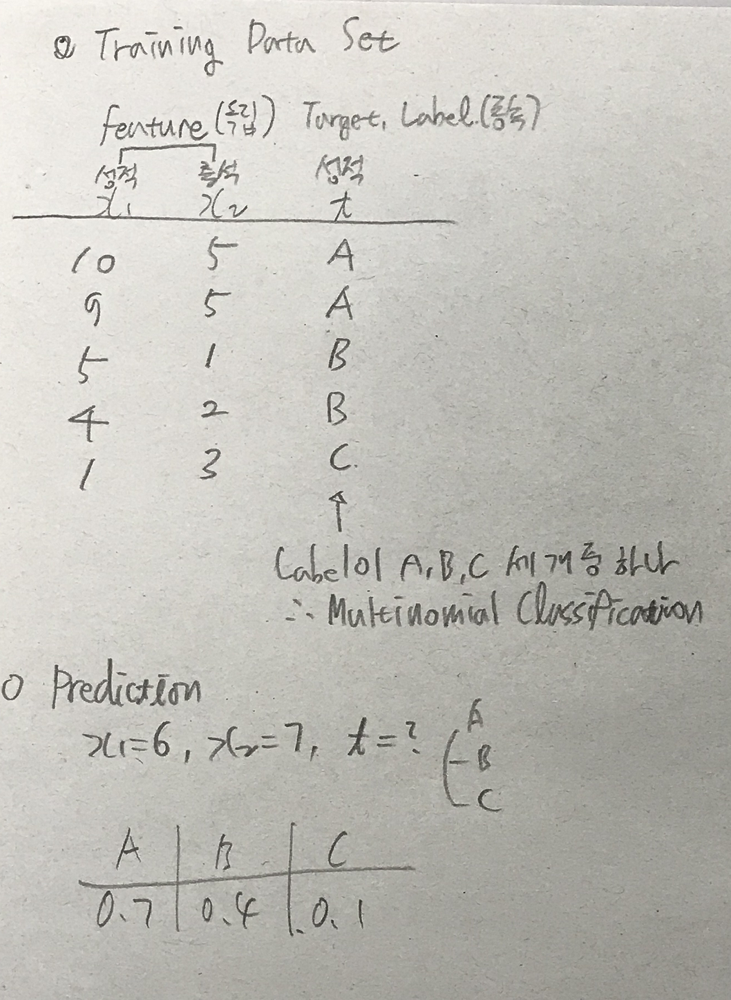
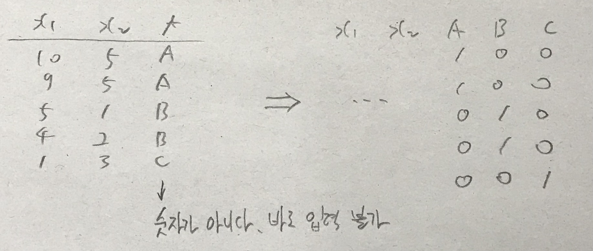
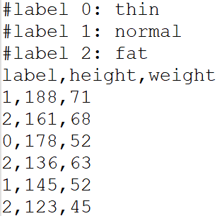
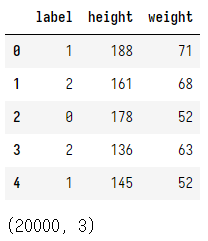
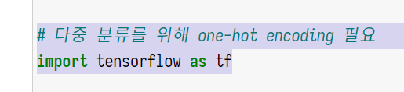
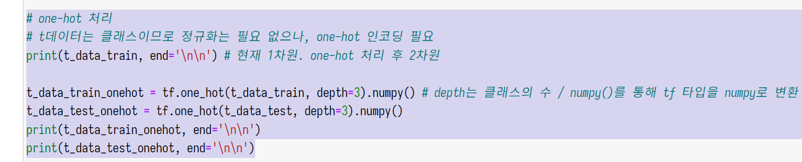
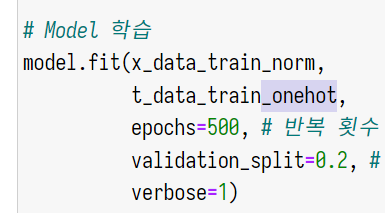
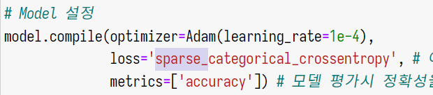

# 다항분류

## 개요

*



이러한 다항분류는 이진분류를 여러 개 모아 놓은 것으로 생각하면 된다.  
이진분류의 경우 **Sigmoid** 함수를 통해 각 값이 0과 1 사이의 확률 값으로 예측되었다. 다항분류는 각 행에 대해 이진분류를 N번 하는 문제로 바꾸어 생각할 수 있다. 예컨대 x1이 10, x2가 5인 경우에 대해 t가 A일 수 있는 확률을, B일 수 있는 확률을, C일 수 있는 확률을 각각 계산하는 것이다.

예컨대 A일 확률이 0.7  
B일 확률이 0.4  
C일 확률이 0.1과 같이 결과가 떨어진다.

그렇다면 이를 전체에 대한 확률로 다시 나타내는 것이다.
A 0.6  /  B 0.3  /  C 0.1

이렇게 각각의 독립적인 확률을 전체에 대한 확률로 변환시키는 함수가 **Softmax**이다.  
즉 클래스의 개수만큼 결과가 떨어진다. Sigmoid의 결과 값이 한 개인 것과 차이가 있다.

그렇다면 가장 확률이 큰 레이블을 찾아 반환해주면 되며, 이 값과 실제 값을 비교하여 Loss 값을 내고, 학습을 반복시키면 된다.

*

이때 t의 값은 레이블 A, B, C이므로 수치가 아니기 때문에, 이 자체로 입력할 수 없다. 0, 1, 2로 치환하게 되면 선형회귀로 인식될 수 있다. 따라서 아래와 같이 가공한다.




이러한 변환 작업을 one-hot encoding이라고 한다. 이러한 형태로 가공하면 상술했던 것과 같이 A, B, C 각각 따로 이항분류를 진행하는 과정을 수행하기 용이해진다.


## 실습

**bmi.csv**  


label 열의 0, 1, 2는 분류를 의미한다. 즉 다항분류를 위한 데이터셋임을 알 수 있다.

&nbsp;

모듈을 불러온다.

```python
# Modules Import
import numpy as np
import pandas as pd

# 학습 데이터와 테스트 데이터 분리 (일반적으로 7:3 혹은 8:2)
from sklearn.model_selection import train_test_split

# 정규화
from sklearn.preprocessing import MinMaxScaler

# 이번에 사용할 데이터에는 결측치와 이상치가 없음

# 텐서플로우 - 케라스
from tensorflow.keras.models import Sequential
from tensorflow.keras.layers import Flatten, Dense
from tensorflow.keras.optimizers import Adam # 항상 평균 이상의 성능

# 다중 분류를 위해 one-hot encoding 필요
import tensorflow as tf

print('modules imported!')
```

&nbsp;

데이터를 불러온다.

```python
# Raw Data Loading

df = pd.read_csv('./data/bmi.csv', skiprows=3) # 4번째 줄부터 load. 1-3 라인은 정보가 적혀있음.
display(df.head(), df.shape)

# 이 데이터에는 결측치와 이상치는 존재하지 않으므로 넘어간다.
# 실제 작업시에는 확인해야한다.
```



&nbsp;

데이터를 학습용과 테스트용으로 나누고, 정규화 및 one-hot 처리를 수행한다.

```python
# 데이터를 학습데이터와 테스트데이터를 분리

x_data_train, x_data_test, t_data_train, t_data_test = \
train_test_split(df[['height', 'weight']].values, # train_test_split(df[['height', 'weight']]) # 알아서 df를 ndarray로 변환한다
                 df['label'].values,
                 test_size=0.3) # 7:3
print(x_data_train, x_data_train.shape, end='\n\n') # (14000, 2)

# 정규화
scaler = MinMaxScaler()
scaler.fit(x_data_train)
x_data_train_norm = scaler.transform(x_data_train)
x_data_test_norm = scaler.transform(x_data_test)
print(x_data_train_norm, x_data_train_norm.shape, end='\n\n\n') # 정규화됨

# one-hot 처리
# t데이터는 클래스이므로 정규화는 필요 없으나, one-hot 인코딩 필요
print(t_data_train, end='\n\n') # 현재 1차원. one-hot 처리 후 2차원

t_data_train_onehot = tf.one_hot(t_data_train, depth=3).numpy() # depth는 클래스의 수 / numpy()를 통해 tf 타입을 numpy로 변환
t_data_test_onehot = tf.one_hot(t_data_test, depth=3).numpy()
print(t_data_train_onehot, end='\n\n')
print(t_data_test_onehot, end='\n\n')
```
&nbsp;

모델을 만들고 학습한다.

```python
# 모델 만들기

model = Sequential()

# Layer 추가
model.add(Flatten(input_shape=(2,))) # node 2개
model.add(Dense(3, activation='softmax')) # node 3개

# Model 설정
model.compile(optimizer=Adam(learning_rate=1e-4),
              loss='categorical_crossentropy', # 이항분류시 binary_crossentropy
              metrics=['accuracy']) # 모델 평가시 정확성을 accuracy로 측정하도록 지정

# Model 학습
model.fit(x_data_train_norm,
          t_data_train_onehot,
          epochs=500, # 반복 횟수
          validation_split=0.2, # 전체 학습 데이터의 일부를 평가에 사용. 평가하면서 학습 진행
          verbose=1)
```

학습 로그를 보자,  
Epoch 169/500
350/350 \[==============================\] - 0s 897us/step - loss: 0.4577 - accuracy: 0.9066 - val\_loss: 0.4631 - val\_accuracy: 0.9046

loss, accuracy와, val\_loss, val\_accuracy가 있다.

val\_loss는 낮으면 낮을 수록, val\_accuracy는 높으면 높을수록 좋다.

&nbsp;

만든 모델을 평가한다.

```python
# 모델 평가
print(model.evaluate(x_data_test_norm, t_data_test_onehot)) # [0.2736673057079315, 0.9713333249092102]
```

최종 loss는 0.27, accuracy는 0.97  
꽤 정확한 모델이 만들어졌다.

&nbsp;

만들어진 모델을 가지고 예측해보자.

```python
# 예측
predict_data = np.array([[187, 81]])
scaled_predict_data = scaler.transform(predict_data)
print(model.predict(scaled_predict_data)) # [[0.02638307 0.703346   0.2702709 ]]
                                          # 클래스별 확률이 출력된다. 가장 높은 확률의 클래스가 예측된 클래스이다.
```

0, 1, 2 중의 1의 확률이 가장 높다. 즉, Normal로 예측되었다.

## One-hot 작업 스킵

귀찮은 One-hot 작업을 스킵해보자.




삭제한다.



삭제한다.


 
 one-hot 인코딩이 되지 않은 데이터를 입력한다.  
 이 상태로는 당연히 학습이 되지 않는다.
 
 모델을 학습하기 전에,
 


loss를 sparse_categorical_crossentropy로 변경해준다. 그럼 one-hot 인코딩되지 않은 데이터를 자동으로 처리해준다.

