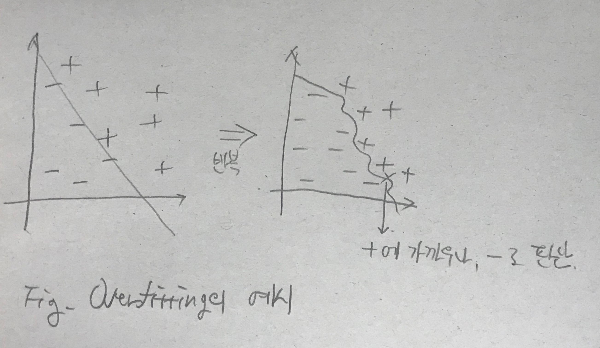

# 이미지

그동안 정형 데이터를 다루어왔다. 이제는 비정형 데이터, 그 중 이미지 데이터를 취급해본다.

대표적인 데이터셋인 MNIST 데이터셋으로 손글씨로 쓴 숫자 이미지를 분류해보자.


보통 이러한 비정형데이터는 딥러닝을 활용하여 처리하면 효율이 좋은데, 우선 우리는 그 전에 일반적인 회귀 기법을 사용하여 다루어보려고 한다.

## 캐글 예제 풀이 1

### 데이터셋 알아보기

[https://www.kaggle.com/competitions/digit-recognizer/](https://www.kaggle.com/competitions/digit-recognizer/)에 접속한다.

Data 탭에서 우선 train.csv를 다운로드한다.

파일을 열어보면 아래와 같다  


이미지의 픽셀 데이터를 각 행에 전개한 형태이다. 첫 열인 label에 해당 이미지의 분류를 명기하고 있다.

이미지는 기본적으로 3차원이다. 각 픽셀의 데이터가 행, 열별로 있으며, 각 데이터는 색상정보를 담고 있기 때문이다.  
이렇게 된다면 처리하기 너무 어렵기 때문에 머신러닝에서는 흑백 이미지를 사용하는 경우가 많다. 그러면 각 픽셀 데이터는 그레이스케일 값(0~255)이 되어 2차원 데이터가 된다.

보통 이미지를 구별할 때에는 색보다는 모양, 즉 사물의 경계선을 가지고 파악하기 때문에, 많은 경우 흑백 데이터를 활용하여도 무방하다.  
이 데이터의 경우에도 28\*28px(784개 픽셀)의 그레이스케일 이미지를 담고 있으며, 따라서 각 행은 785(레이블 1개 열 + 픽셀당 밝기 정보 784열)개의 열로 이루어진다.

> Each image is 28 pixels in height and 28 pixels in width, for a total of 784 pixels in total. Each pixel has a single pixel-value associated with it, indicating the lightness or darkness of that pixel, with higher numbers meaning darker. This pixel-value is an integer between 0 and 255, inclusive.

본래 전체 데이터는 2차원 이미지 데이터를 여러 개 가지고 있으므로 3차원이 될 것이다. 그러나 우리는 행렬 곱 기반으로 머신러닝을 하고 있으므로 입출력 데이터가 2차원일 경우만 처리가 가능하다. 따라서 이 데이터에는 이미지 데이터의 픽셀 정보를 행, 열에 상관 없이 1차원 데이터로 바꾸어 담은 것이다.

### 실습

```python
# Import Modules
import numpy as np
import pandas as pd
import matplotlib.pyplot as plt

print('imported')
```

```python
# Raw Data Loading
# 이미지 데이터이므로 결측치나 이상치가 없음

df = pd.read_csv('./data/mnist/train.csv')
display(df.head(), df.shape) # (42000, 785)

# 이미지 데이터 확인
# 이미지를 출력해보기 위해 label 제거
img_data = df.drop('label', axis=1, inplace=False).values # 열 방향에서 label 제거
fig = plt.figure()
fig_arr = []

# interpolation은 보간법을 뜻하며, 픽셀들의 축 위치 간격을 보정하여 이미지가 자연스러운 모양으로 
# 보일 수 있게 하는 방법입니다. 
# imshow()에서는 16가지 보간법이 있고, 'nearest'는 가장 고해상도인 보간법입니다.

for n in range(10):
    fig_arr.append(fig.add_subplot(2,5,n+1))
    fig_arr[n].imshow(img_data[n].reshape(28,28), cmap='Greys', interpolation='nearest')
    
plt.tight_layout()
plt.show()
```

```python
# 이 데이터를 이용해 머신러닝해보기
from sklearn.model_selection import train_test_split
from sklearn.preprocessing import MinMaxScaler

# Prepareing Training Data Set
# 1. 학습 데이터와 테스트 데이터 분리
x_data_train, x_data_test, t_data_train, t_data_test = \
train_test_split(df.drop('label', axis=1, inplace=False).values,
                 df['label']. values,
                 test_size=0.2) # 8:2 비율

# 2. 정규화
scaler = MinMaxScaler()
scaler.fit(x_data_train)
x_data_train_norm = scaler.transform(x_data_train)
x_data_test_norm = scaler.transform(x_data_test)

# 3. one-hot 처리는 스킵. keras를 이용
```

```python
from tensorflow.keras.models import Sequential
from tensorflow.keras.layers import Flatten, Dense
from tensorflow.keras.optimizers import Adam

# 모델 생성
model = Sequential()

# 모델에 레이어 추가
model.add(Flatten(input_shape=(784,))) # 28*28
model.add(Dense(10, activation='softmax')) # 0~9

# 모델 설정
model.compile(optimizer=Adam(learning_rate=1e-4),
              loss='sparse_categorical_crossentropy', # one-hot + crossentropy
              metrics=['accuracy']) # 평가 기준

# 모델 학습
model.fit(x_data_train_norm,
          t_data_train,
          epochs=50,
          validation_split=0.2,
          verbose=1,
          batch_size=100) # 전체 42000행을 한 번에 다 메모리에 불러오지 않고, 100개씩 잘라서 읽어들임

# 269/269 [==============================] - 1s 2ms/step - loss: 0.2809 - accuracy: 0.9225 - val_loss: 0.3056 - val_accuracy: 0.9125

# val_accuracy: 0.9125
# epochs, learning_rate를 다르게 줘도 0.91 정도가 한계
```

```python
# 만든 모델에 대한 최종 평가
print(model.evaluate(x_data_test_norm, t_data_test)) # [0.3150741159915924, 0.9126190543174744]
# 예측 10번 중 한 번은 틀리게 된다는 것
```

간단한 이미지임에도 불구하고 accuracy의 한계가 0.91 정도이다. 단순 회귀의 한계를 볼 수 있다.

## 캐글 예제 풀이 2
비슷하지만 조금 더 복잡한 예제를 풀어보자.

[https://www.kaggle.com/datasets/zalando-research/fashionmnist](https://www.kaggle.com/datasets/zalando-research/fashionmnist)

불러오는 데이터만 다를 뿐 사용 로직은 같으므로 최종 평가 결과만 첨부한다.

```python
# 만든 모델에 대한 최종 평가
print(model.evaluate(x_data_test_norm, t_data_test)) # [0.4436834752559662, 0.8504166603088379]

# 이미지가 복잡해지니까 기본 MNIST 예제보다 accuracy가 더 감소하였다. 0.91 -> 0.85
```

정확도가 훨씬 감소하였다. 비정형데이터를 취급하는 경우의 한계가 잘 드러난다.

반복 학습을 더 많이 하면 정확도가 오를까? 반복 수를 무한정 높이는 것은 오히려 악영향을 불러올 수도 있다.




위의 도판처럼, 학습을 반복하면, 제공된 데이터에 과적합(Overfitting)되어 오히려 부정확한 예측을 이끌어 낼 수 있다는 것이다.

