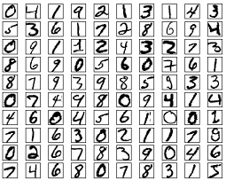
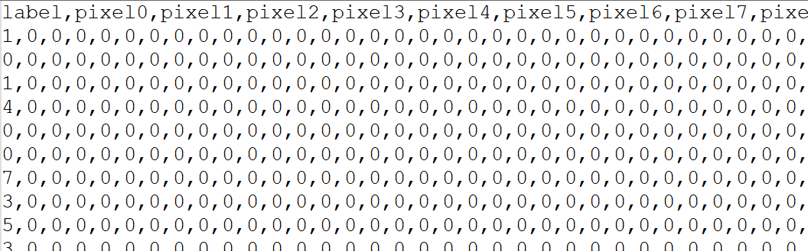

# 이미지

그동안 정형 데이터를 다루어왔다. 이제는 비정형 데이터, 그 중 이미지 데이터를 취급해본다.

대표적인 데이터셋인 MNIST 데이터셋으로 손글씨로 쓴 숫자 이미지를 분류해보자.

보통 이러한 비정형데이터는 딥러닝을 활용하여 처리하면 효율이 좋은데, 우선 우리는 그 전에 일반적인 회귀 기법을 사용하여 다루어보려고 한다.

## 캐글 예제 풀이

[https://www.kaggle.com/competitions/digit-recognizer/](https://www.kaggle.com/competitions/digit-recognizer/)에 접속한다.

Data 탭에서 우선 train.csv를 다운로드한다.

파일을 열어보면 아래와 같다  

이미지의 픽셀 데이터를 각 행에 전개한 형태이다. 첫 열인 label에 해당 이미지의 분류를 명기하고 있다.

이미지는 기본적으로 3차원이다. 각 픽셀의 데이터가 행, 열별로 있으며, 각 데이터는 색상정보를 담고 있기 때문이다.  
이렇게 된다면 처리하기 너무 어렵기 때문에 머신러닝에서는 흑백 이미지를 사용하는 경우가 많다. 그러면 각 픽셀 데이터는 그레이스케일 값(0~255)이 되어 2차원 데이터가 된다.

보통 이미지를 구별할 때에는 색보다는 모양, 즉 사물의 경계선을 가지고 파악하기 때문에, 많은 경우 흑백 데이터를 활용하여도 무방하다.  
이 데이터의 경우에도 28\*28px(784개 픽셀)의 그레이스케일 이미지를 담고 있으며, 따라서 각 행은 785(레이블 1개 열 + 픽셀당 밝기 정보 784열)개의 열로 이루어진다.

> Each image is 28 pixels in height and 28 pixels in width, for a total of 784 pixels in total. Each pixel has a single pixel-value associated with it, indicating the lightness or darkness of that pixel, with higher numbers meaning darker. This pixel-value is an integer between 0 and 255, inclusive.

본래 전체 데이터는 2차원 이미지 데이터를 여러 개 가지고 있으므로 3차원이 될 것이다. 그러나 우리는 행렬 곱 기반으로 머신러닝을 하고 있으므로 입출력 데이터가 2차원일 경우만 처리가 가능하다. 따라서 이 데이터에는 이미지 데이터의 픽셀 정보를 행, 열에 상관 없이 1차원 데이터로 바꾸어 담은 것이다.

