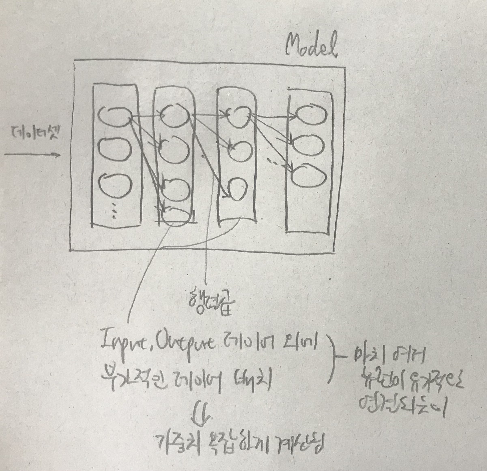
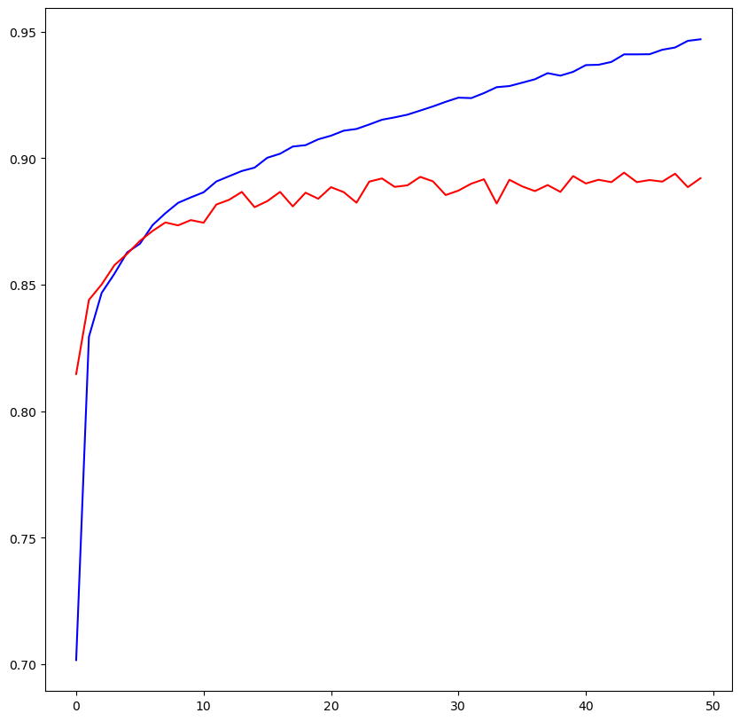
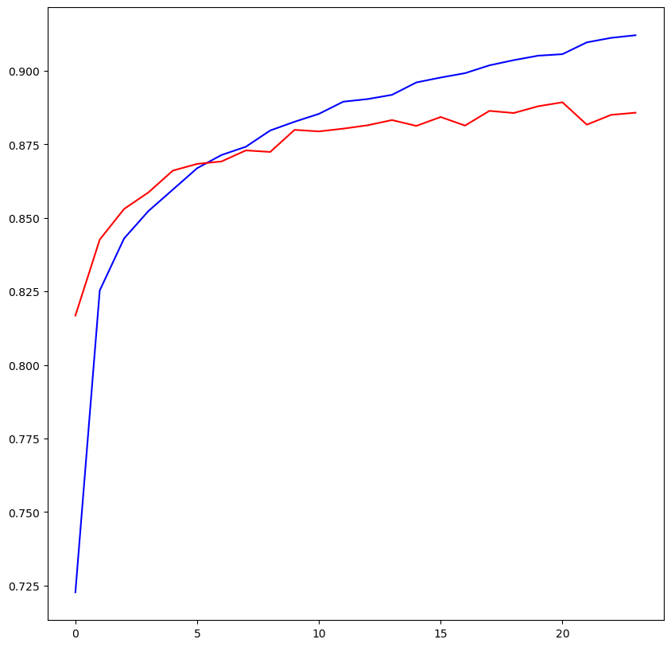

# 딥러닝

## 인공신경망 기본

인공신경망이란, 수 많은 뉴런으로 연결된 인간의 뇌구조를 모방하여 구성된 인공지능 모델이다. 다수의 인공 뉴런이 복잡하게 연결되어 복잡한 연산이 가능해진다.



위의 도판처럼, Input Output 레이어 외에 부차적인 레이어가 마치 뉴런처럼 복잡하게 연결된다. 이를 Hidden Layer라고 한다. 여기서 몇 개의 레이어를 배치할지 등은 Learning Rate처럼 하이퍼 파라미터로, 직접 적절한 값을 넣어줘야 한다.

이때, hidden layer가 많아져 학습이 반복되는 경우 과적합의 가능성이 커진다. 연구 결과에 따르면 hidden layer가 1개일 때 성능 향상 비율가 가장 높고, 이후 1개씩 추가될 때마다 정확성은 높아지지만 1배씩 증가하지는 못한다.

## 인공신경망 실습

### 기본

이전의 fashion mnist 예제에 인공신경망을 적용해보자.

**0404-Fashion-MNIST-deep**  
```python
from tensorflow.keras.models import Sequential
from tensorflow.keras.layers import Flatten, Dense
from tensorflow.keras.optimizers import Adam

# 모델 생성
model = Sequential()

# 모델에 레이어 추가
# input layer
model.add(Flatten(input_shape=(784,))) # 28*28
# hidden layer
model.add(Dense(256, activation='relu')) # Hidden Layer의 activation은 relu로 잡는다. sigmoid로 잡으면 전파가 되지 않는다.
model.add(Dense(128, activation='relu'))
model.add(Dense(64, activation='relu'))
# output layer
model.add(Dense(10, activation='softmax')) # 0~9

print(model.summary()) # 현재 레이어가 어떻게 구성되어 있는지 출력.
# Param은 w를 의미한다. 한 번 계산할 때마다 편미분이 필요하다. (Total params: 242,762)
# 많은 계산이 필요하게 되는 것이다.

# 모델 설정
model.compile(optimizer=Adam(learning_rate=1e-4),
              loss='sparse_categorical_crossentropy', # one-hot + crossentropy
              metrics=['accuracy']) # 평가 기준

# 모델 학습
model.fit(x_data_train_norm, # 우리 데이터가 간단하므로 크게 느려지지는 않을 것이다.
          t_data_train,
          epochs=50,
          validation_split=0.2,
          verbose=1,
          batch_size=100)
# val_accuracy: 0.8851
# 정확도가 높아지기는 했지만, 생각보다 상승 폭이 크지 않다. 과적합이 발생했을 가능성이 있다.
```

### Dropout: 과적합 방지

정확도가 높아지기는 했지만, 생각보다 상승 폭이 크지 않다. 과적합이 발생했을 가능성이 있다. 다른 기법을 적용하여 정확도를 더 높여보자.  
Dropout을 중간에 배치하여 연산의 복잡도를 낮춰본다.

```python
# === Dropout: 과적합 방지 ===

# Dropout: 과적합을 방지하기 위해 hidden layer의 몇 가지 노드를 비활성화.
# 복잡도를 낮춤.
from tensorflow.keras.models import Sequential
from tensorflow.keras.layers import Flatten, Dense, Dropout
from tensorflow.keras.optimizers import Adam

# 모델 생성
model = Sequential()

# 모델에 레이어 추가
# input layer
model.add(Flatten(input_shape=(784,))) # 28*28
# hidden layer
model.add(Dense(256, activation='relu'))
model.add(Dropout(rate=0.25)) # hideen layer 사이에 Dropout을 추가한다
model.add(Dense(128, activation='relu'))
model.add(Dropout(rate=0.25))
model.add(Dense(64, activation='relu'))
# output layer
model.add(Dense(10, activation='softmax')) # 0~9

print(model.summary())

# 모델 설정
model.compile(optimizer=Adam(learning_rate=1e-4),
              loss='sparse_categorical_crossentropy',
              metrics=['accuracy']) # 평가 기준

# 모델 학습
model.fit(x_data_train_norm, # val_accuracy: 0.8982
          t_data_train,
          epochs=50,
          validation_split=0.2,
          verbose=1,
          batch_size=100)

# 0.88 -> 0.89

# 만든 모델에 대한 최종 평가
print(model.evaluate(x_data_test_norm, t_data_test)) # [0.2957453727722168, 0.8967499732971191]
```

accuracy가 소폭 상승했다.

### Early Stopping

#### 학습 진행 과정을 그래프로 그려보기

```python
# 모델 학습
history = model.fit(x_data_train_norm, # 별도의 변수를 잡으면 학습 진행 과정을 그래프로 그려볼 수 있다.
                    t_data_train,
                    epochs=50,
                    validation_split=0.2,
                    verbose=1,
                    batch_size=100)

# 학습 과정을 그래프로 그려보기
fig = plt.figure(figsize=(10, 10)) # 그림 그릴 공간 생성. 크기 10*10
fig_acc = fig.add_subplot(1, 1, 1) # 공간의 내부 영역 생성 (1행 1열의 내부 공간 중 1번째 영역 = 즉 공간의 전체)

# epoch이 증가할 때 마다 나오는 accuracy, val_accuracy(평가된 정확도)를 그래프로 그린다
fig_acc.plot(history.history['accuracy'], color='b') # 학습 결과를 저장한 history 내에 history라는 속성이 있다.
fig_acc.plot(history.history['val_accuracy'], color='r')
fig.show()
```



- accuracy: 학습 데이터로 평가 후 학습 데이터로 평가
- val_accuracy: 학습 데이터로 평가 후 테스트 데이터로 평가

=> 당연히 accuracy는 학습이 진행되면서 계속 높아질 수밖에 없다.  
    - val_accuracy는 학습이 진행되며 증가하다가 어느 순간 정체하게 된다.
    - 즉, 이 시점부터 Overfitting이 발생했다는 것으로, 이 시점 이후에는 모델이 최적화되지 않기 시작하는 것이다.
    - 학습을 진행하는 것이 무의미해지기 시작한다.

- 그렇다면, 적절한 Epoch 수는 무엇일까?  
- 경험적으로 무작위 수를 대입해야 하는가?
    - 데이터 양이 많아지면 학습 시간이 매우 오래 걸린다.
    - 값을 바꿔가면서 여러 번 학습하는 것이 불가능하다.
- 따라서 학습시 Epoch을 제한하는 메커니즘이 필요하다.
- 케라스는 이 기능을 **Early Stopping**이라는 이름으로 제공하고 있다.
    - 조기 종료: 더 이상 학습해봤자 의미가 없다

#### Early Stopping 실습

```python
# === Keras의 Early Stopping ===

from tensorflow.keras.models import Sequential
from tensorflow.keras.layers import Flatten, Dense
from tensorflow.keras.optimizers import Adam
from tensorflow.keras.callbacks import EarlyStopping

# 모델 생성
model = Sequential()

# 모델에 레이어 추가
# input layer
model.add(Flatten(input_shape=(784,)))
# hidden layer
model.add(Dense(256, activation='relu'))
model.add(Dense(128, activation='relu'))
model.add(Dense(64, activation='relu'))
# output layer
model.add(Dense(10, activation='softmax')) # 0~9

print(model.summary()) # 현재 레이어가 어떻게 구성되어 있는지 출력.

# 모델 설정
model.compile(optimizer=Adam(learning_rate=1e-4),
              loss='sparse_categorical_crossentropy', # one-hot + crossentropy
              metrics=['accuracy']) # 평가 기준

# Keras의 Early Stopping 기능 이용
early_stopping = EarlyStopping(monitor='val_loss', # 학습이 점차 진행되는데 loss가 떨어지지 않는 경우를 조기 종료의 기준으로 지정
                               patience=3, # val_loss가 떨어지지 않는 경우가 3번 반복되면 학습 종료
                               mode='auto',
                               restore_best_weights=True, # 가장 좋았던 weights 값을 저장; 정확도가 좋아지지 않으면 이 값으로 대체
                               verbose=1)
# ^ 과적합 상태가 되면 loss가 떨어지지 않는다는 점을 이용

# 모델 학습
history = model.fit(x_data_train_norm, # 별도의 변수를 잡으면 학습 진행 과정을 그래프로 그려볼 수 있다.
                    t_data_train,
                    epochs=50,
                    validation_split=0.2,
                    verbose=1,
                    callbacks=[early_stopping], # Early Stopping 지정
                    batch_size=100)
# Epoch 24: early stopping
# early stopping이 작동하였다.

# 학습 과정을 그래프로 그려보기
fig = plt.figure(figsize=(10, 10))
fig_acc = fig.add_subplot(1, 1, 1)

# epoch이 증가할 때 마다 나오는 accuracy, val_accuracy(평가된 정확도)를 그래프로 그린다
fig_acc.plot(history.history['accuracy'], color='b') # 학습 결과를 저장한 history 내에 history라는 속성이 있다.
fig_acc.plot(history.history['val_accuracy'], color='r')
fig.show()

print(model.evaluate(x_data_test_norm, t_data_test)) # [0.3178851008415222, 0.8848333358764648]
```



학습이 점차 진행되는데 loss가 떨어지지 않는 경우를 조기 종료의 기준으로 지정하였다.

