# CNN

## 등장 배경

- DNN을 이용해 이미지 학습
    - 이미지는 3차원 데이터이며, 이미지의 집합은 4차원 데이터이나, DNN에는 2차원 데이터가 입력됨
    - 따라서 이미지 데이터에서 색상정보를 제거한 2차원 데이터를 일렬로 나열해 1차원으로 변환
    - 변환된 데이터의 집합은 2차원 형태가 되어 입력 가능
        - 그러나 이 경우 공간정보가 무시되며, 그저 나열된 수치 정보일 따름이라는 한계가 있음.
        - 학습 정확도 낮음
    - 그 대안으로 CNN이 고안됨

## 실습 환경

[구글 Colab](https://drive.google.com/drive/u/0/folders/1JZ_EBmUb70AzSbjM9IGZpRciFUjmEPVG)을 사용.  
성능 문제 + 의존성 문제. Colab에는 어지간한 라이브러리가 모두 설치되어 있음.

### GPU 가속 설정
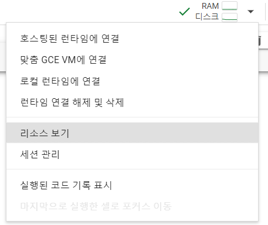

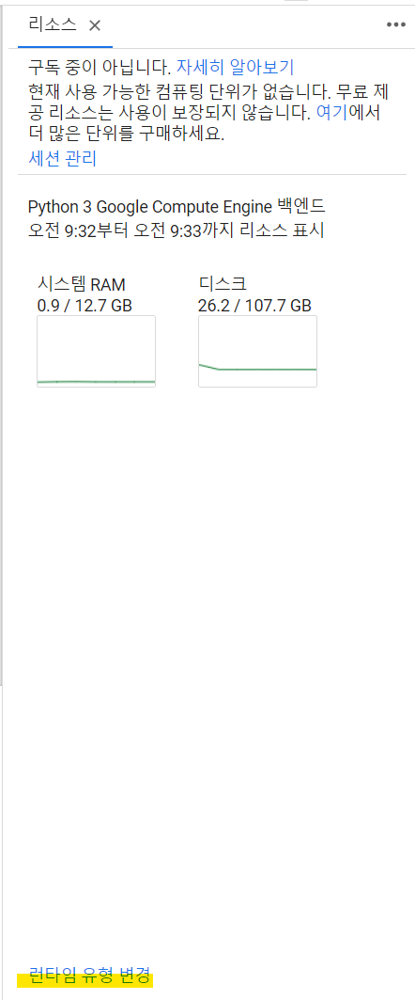

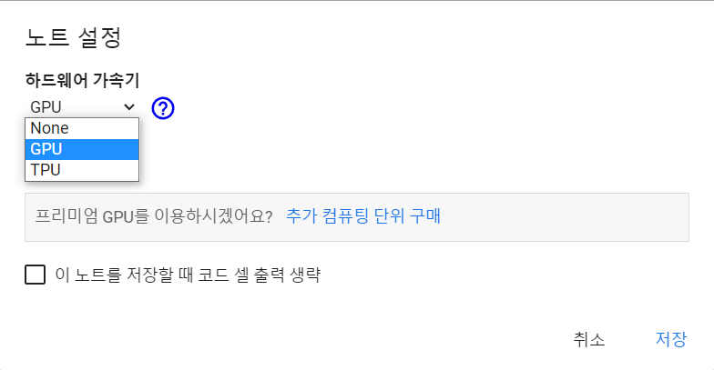

할당받은 런타임의 유형을 GPU 가속으로 변경해준다. None으로 지정된 경우 CPU로 연산되는데, 그럼 너무 오래 걸린다.

### 구글 드라이브 연결

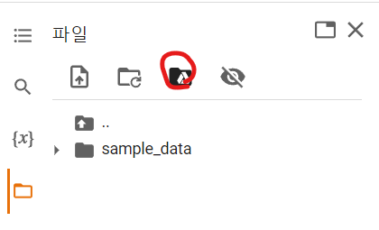

연결하겠냐는 메시지가 나오면 허용을 눌러준다. 그럼 Colab 상에서 나의 구글 드라이브에 참조할 수 있게 된다.

##  이미지 처리

### 1. 좌표계

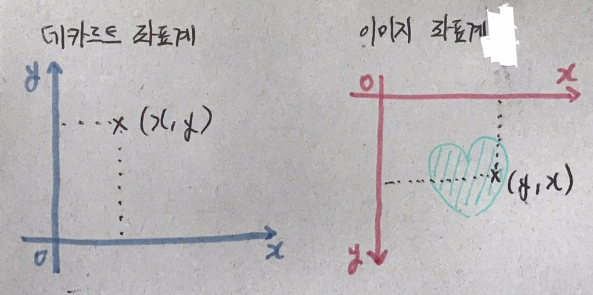

일반적인 데카르트 좌표계와 이미지 좌표계는 다르다. 이미지 좌표계는 좌상에 원점(0,0)이 있으며, 좌표를 말할 때, y좌표를 먼저 말하고 x좌표를 말한다.

### 2. 색상정보와 차원

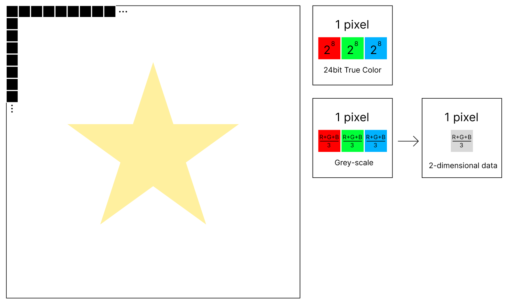

상술했듯 이미지는 3차원 데이터이다. 이를 머신러닝에서 그레이 스케일로 변환하여 2차원 데이터와 같이 다룰 수 있다.  
그레이 스케일로 변환하기 위해서는 각 픽셀의 색상 정보의 R, G, B 값의 평균을 일괄적으로 지정해주면 된다.

## 이미지 처리 실습

### 이미지 출력

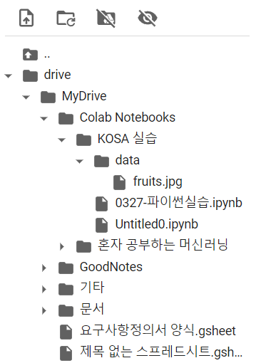

예제 이미지를 구글 드라이브의 적절한 위치에 복사한다.  
해당 이미지에 대해 우클릭 - 경로 복사를 하면 코드 상에서 쉽게 참조할 수 있다.

```python
import numpy as np
from PIL import Image # 이미지 처리를 도와주는 라이브러리
import matplotlib.pyplot as plt

color_img = Image.open('/content/drive/MyDrive/Colab Notebooks/KOSA 실습/data/fruits.jpg')

plt.imshow(color_img)
plt.show()
```


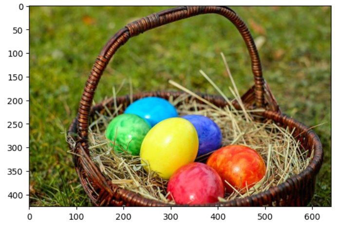

y좌표가 위에서 아래로 내려가면서 증가함을 확인할 수 있다.

이 데이터가 정말 3차원 데이터인지 확인해보기 위해 ndarray로 변환해보자. numpy를 이용해 쉽게 처리할 수 있다. ndarray로 변환된 데이터를 가지고 출력할 수도 있다.

### ndarray 변환

```python
color_pixel = np.array(color_img) # numpy를 이용하여 이미지 정보를 ndarray로 변환할 수 있다.

plt.imshow(color_pixel) # 픽셀 데이터로도 이미지를 그릴 수 있다.
plt.show()

print('shape: {}'.format(color_pixel.shape)) # shape: (426, 640, 3)
```

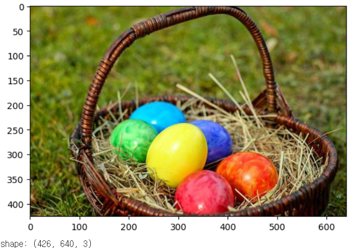
shape이 (426, 640, 3)로 출력되었다. 순서대로 세로 픽셀 수, 가로 픽셀 수, 색상 정보 수(R, G, B)를 나타낸다.

### 흑백 이미지 변환

#### 3차원 컬러 → 3차원 흑백

```python
# 흑백 이미지로 변환
# 각 픽셀 RGB 값의 평균을 지정

grey_pixel = color_pixel.copy()

for y in range(grey_pixel.shape[0]): # 모든 픽셀 순회
  for x in range(grey_pixel.shape[1]):
    grey_pixel[y, x] = np.mean(grey_pixel[y, x]) # R, G, B의 평균을 다시 대입. 브로드캐스팅됨.

plt.imshow(grey_pixel)
plt.show()
print(grey_pixel.shape)
```


3차원 컬러 이미지를 3차원 흑백 이미지로 변환하였다.

#### 3차원 흑백 → 2차원 흑백

```python
# 2차원 데이터로 변환

grey_2d_pixel = grey_pixel[:, :, 0] # 색상 정보 중 0번 값만 가져옴
print(grey_2d_pixel.shape) # (426, 640) / 2차원 데이터가 되었다

plt.imshow(grey_2d_pixel, cmap='gray') # 2차원 그레이스케일의 데이터라는 것을 cmap을 지정하여 알려준다
plt.show()
```

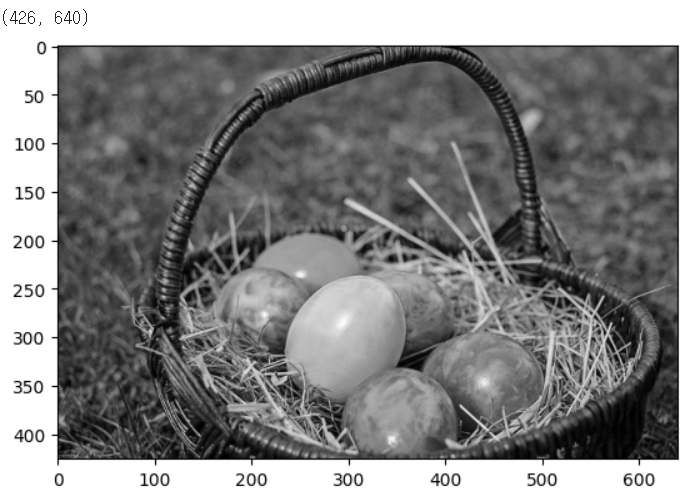

3차원 흑백 이미지가 2차원으로 변환되었다.


## CNN을 이용한 이미지 학습

- CNN (Convolutional Neural Network, 합성곱 신경망, aka. convnet 컨브넷)

### 구조

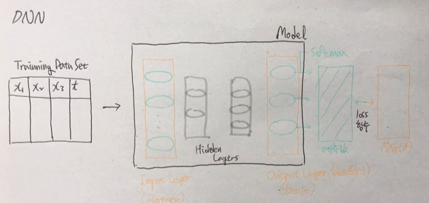


CNN은 뒷부분은 DNN과 유사하다. 다만 Flatten으로 들어오는 데이터를 변형하는 단계가 추가된 것이 CNN의 특징이다.

Input Layer 뒷 단에 Convolution Layer 한 개 또는 여러 개가 배치되어, 입력된 데이터를 학습에 용이하도록 conv 연산을 수행하여 변형한다. Convolution Layer 사이에는 Pulling Layer가 추가될 수 있다.  
이렇게 변형된 데이터가 Flatten으로 입력되면 일반적인 DNN과 같은 학습이 이뤄지게 된다. 이때 Hidden Layer는 1개 정도로 적게 쓰거나 사용하지 않기도 한다. 사용하지 않으면 일반 회귀와 동일한 연산을 하게 된다.

### 합성곱 연산 (Convolution)

- 정의: 함수 f, g가 있을 떄, f를 반전(inverse), 전이시켜 g와 곱하고 그 결과를 적분하는 연산

이미지에 대한 합성곱 연산은 다음과 같이 진행된다.

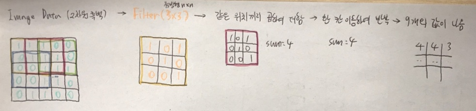  \* 이미지 데이터에는 실제로 0-255의 값이 들어가지만, 0과 1로 간소화하여 표현했다.  
\* Filter 내부 값은 임의로 넣은 갑이다.

여기서 필터는 커널이라고도 한다.

필터를 이동시킬 때 몇 칸 이동할지는 사용자가 지정할 수 있다. (stride)  
stride가 커지면 이동 간격이 넓어진다는 것이므로, 합성곱의 결과 데이터 개수는 적어진다.

위의 다이어그램에 따르면 큰 이미지는 합성곱을 거치면 점차 작아지게 된다. 데이터가 점차 소실되는 것이다. 이 경우는 필요하다면, 패딩을 지정하여 방지할 수 있다.

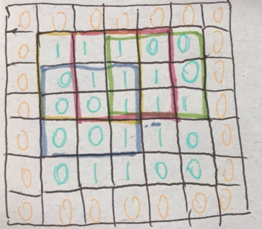

이렇게 주변에 0을 채우는 것을 Zero Padding이라고 한다. 그렇다면 합성곱을 거치더라도 5\*5의 데이터가 반환되므로 해상도가 작아지지 않게 된다.

한편, 이러한 필터는 일반적으로 여러 개를 사용한다. 물론 각 필터는 값이 각각 다르다. 결과적으로 여러 개의 필터를 거쳐 변형된 이미지 데이터가 여럿 생기게 되는 것이다. ⇒ 즉, 한 이미지에 대해 여러 개의 변형본을 만드는 작업이라고 할 수 있다.  
그렇다면 학습시킬 데이터가 여러 변형본을 포함하여 늘어나게 되며, 유사 데이터가 많아지기 때문에 학습의 결과가 정확해지게 되는 것이다. 물론 이 경우 학습 시간이 매우 늘어나기 때문에 합성곱이 거듭될 때마다 이미지 해상도가 작아지도록 처리하는 것이다.

## CNN 처리 과정

```python
import numpy as np
from PIL import Image # 이미지 처리를 도와주는 라이브러리
import matplotlib.pyplot as plt

color_img = Image.open('/content/drive/MyDrive/Colab Notebooks/KOSA 실습/data/fruits.jpg')

plt.imshow(color_img)
plt.show()
```

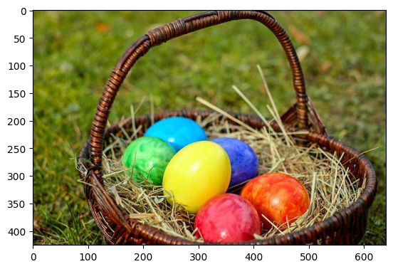

```python
color_pixel = np.array(color_img) # numpy를 이용하여 이미지 정보를 ndarray로 변환할 수 있다.

plt.imshow(color_pixel) # 픽셀 데이터로도 이미지를 그릴 수 있다.
plt.show()

print('shape: {}'.format(color_pixel.shape)) # shape: (426, 640, 3)
```


```python
# 3차원 흑백 이미지로 변환
# 각 픽셀 RGB 값의 평균을 지정

grey_pixel = color_pixel.copy()

for y in range(grey_pixel.shape[0]): # 모든 픽셀 순회
  for x in range(grey_pixel.shape[1]):
    grey_pixel[y, x] = np.mean(grey_pixel[y, x]) # R, G, B의 평균을 다시 대입. 브로드캐스팅됨.

plt.imshow(grey_pixel)
plt.show()
print(grey_pixel.shape)
```


```python
# 2차원 데이터로 변환

grey_2d_pixel = grey_pixel[:, :, 0] # 색상 정보 중 0번 값만 가져옴
print(grey_2d_pixel.shape) # (426, 640) / 2차원 데이터가 되었다

plt.imshow(grey_2d_pixel, cmap='gray') # 2차원 그레이스케일의 데이터라는 것을 cmap을 지정하여 알려준다
plt.show()
```

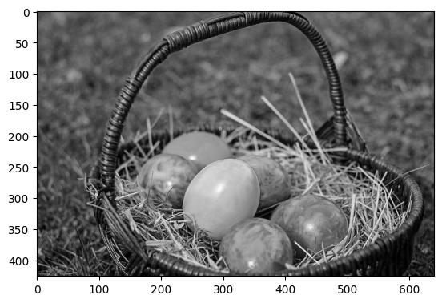

```python
import numpy as np
import tensorflow as tf
import matplotlib.pyplot as plt
import matplotlib.image as img

print('imported!')
```

```python
# 이미지 원본 불러오기
ori_image = img.imread('/content/drive/MyDrive/Colab Notebooks/KOSA 실습/data/girl-teddy.jpg')
print(ori_image.shape) # (429, 640, 3) / 429 * 640 3채널 이미지

# 합성곱 시 입력이미지의 형태
# (1, 429, 640, 3) => (이미지 개수, height, width, color)
input_image = ori_image.reshape((1,) + ori_image.shape)
input_image = input_image.astype(np.float32)
print('Convolution input image.shape : {}'.format(input_image.shape))

# 입력이미지 channel 변경
# (1, 429, 640, 1) => (이미지 개수, height, width, color)
# slicing을 이용하여 첫번째 R(Red) 값만 이용
channel_1_input_image = input_image[:,:,:,0:1]
print('Channel 변경 input_image.shape : {}'.format(channel_1_input_image.shape)) # (1, 429, 640, 1)

# filter 생성
# filter도 4차원이어야 함
# 3*3 / 필터의 채널은 이미지의 채널과 같아야 함
# (3,3,1,1) => (filter height, filter width, filter channel, filter 개수)

weight = np.array([[[[-1]],[[0]],[[1]]],
                   [[[-1]],[[0]],[[1]]],
                   [[[-1]],[[0]],[[1]]]])
print('적용할 filter shape : {}'.format(weight.shape)) # (3, 3, 1, 1)

# 텐서플로우 제공 함수를 이용하여 합성곱
conv2d_result = tf.nn.conv2d(channel_1_input_image,
                      weight,
                      strides=[1,1,1,1], # 이동 간격
                      padding='VALID').numpy() # VALID -> 패딩 없음

print('합성곱 결과 shpae: {}'.format(conv2d_result.shape)) # (1, 427, 638, 1) / 원본 이미지보다 작아짐

t_img = conv2d_result[0,:,:,:] 

# 출력
# figure 공간 준비
fig = plt.figure(figsize=(10,10))  # 가로세로 크기 inch단위

# 공간을 두 부분으로 나눔
ax1 = fig.add_subplot(1,2,1) # 1행 2열로 나눈 공간의 1번째
ax2 = fig.add_subplot(1,2,2) # 1행 2열로 나눈 공간의 2번째

ax1.imshow(ori_image)
ax2.imshow(t_img) # 세밀한 부분이 날아간 이미지가 출력됨

fig.tight_layout()
plt.show()
```

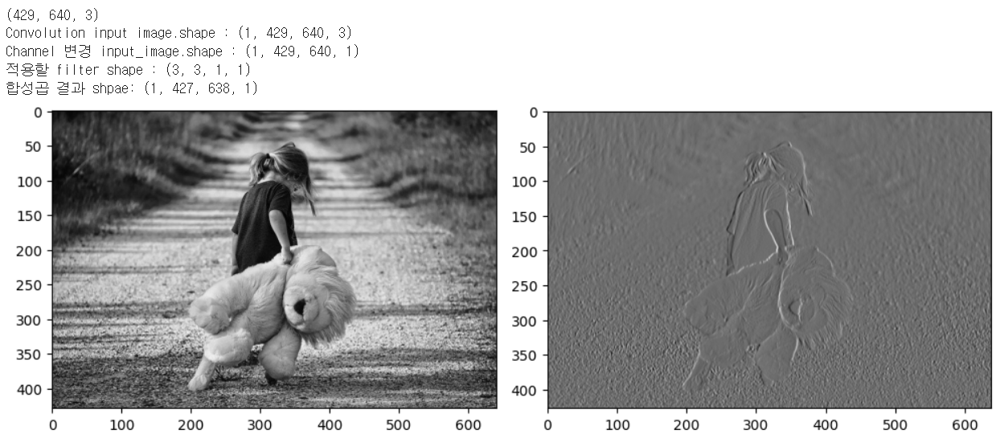

### 소결

#### 합성곱을 하는 이유
디테일이 날아간 이미지가 출력되었다. 그 결과 사물의 경계선이 두드러지게 된다.

인간이 이 이미지를 보면 <어린 아이와 곰인형>이라고 답할 것이기 때문에 길의 재질이나 배경의 잡초 이미지는 필요가 없다. 

즉, 합성곱 연산은 이미지의 특징을 뽑아내 학습에 유리한 이미지를 여러 개 만드는 작업인 것이다.

> 이미지 1개 → 특징만 추출한 여러 개의 이미지

#### Pooling

다만 그 결과 너무 많은 데이터가 생성되기 때문에 시간이 많이 소요된다는 문제가 있다. 합성곱을 하게 되면 생성 이미지가 원본 이미지보다 해상도가 약간 줄어들기는 하지만(429 \* 640 → 427 \* 638) 그에 비해 필터가 생성해내는 이미지는 기하급수적으로 늘어나게 된다.

따라서 데이터 수 증가를 상쇄하기 위해 이미지의 해상도가 대폭 줄어들게 처리해준다. 이를 담당하는 Layer가 **Pooling Layer**이다.  

#### 향상되는 값

그렇다면 의문이 생긴다. Loss 비교 후 다시 학습을 반복할 떄에는, 어떠한 값을 갱신해줘야 할까? → DNN 부분의 weight와 함께 필터의 값을 바꾼다. 이미지의 특성을 더욱 잘 뽑아낼 수 있는 필터 값이 나오도록 값을 계속해서 갱신해주게 된다. 즉, CNN에서 학습 과정은 필터를 고도화하는 과정이라고 할 수 있다.

예컨대,   
```python
weight = np.array([[[[-1]],[[0]],[[1]]],
                   [[[-1]],[[0]],[[1]]],
                   [[[-1]],[[0]],[[1]]]])
```

위와 같은 필터 데이터 내에 변수가 들어가고, 학습이 반복될 떄마다 변수 내의 값이 갱신되는 것으로 보면 된다.

#### MAX Pooling

위에서 합성곱 연산 후 데이터의 수가 기하급수적으로 증가하는 만큼 이미지의 해상도를 줄여주는 Pooling 과정을 거친다는 것을 보았다. Pooling에는 여러 방법이 있지만, 그 중 많이 사용되는 MAX Pooling에 대해 알아본다.

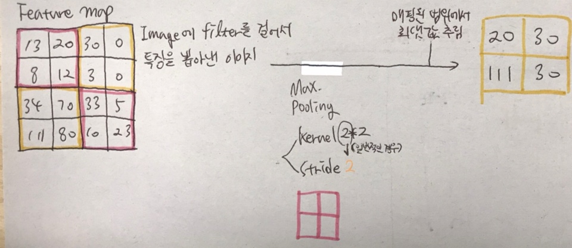

1차적으로 합성곱 연산의 결과로 생성된 픽셀 데이터를 특성이 추출되었다는 의미에서 Feature map이라고 한다. 여기에 특정 커널 크기, stride를 지정하여 Pooling을 해준다.  
이때 Pooling 되는 범위에서 가장 큰 값을 찾아 저장하는 방식이 MAX Pooling이다.

```python
# 이미지 Pooling 처리

import numpy as np
import tensorflow as tf
import matplotlib.pyplot as plt
import matplotlib.image as img

fig = plt.figure(figsize=(10,10))  # 가로세로 크기 inch단위

ax1 = fig.add_subplot(1,3,1) # 1행 3열
ax2 = fig.add_subplot(1,3,2)
ax3 = fig.add_subplot(1,3,3)

ori_image = img.imread('/content/drive/MyDrive/Colab Notebooks/KOSA 실습/data/girl-teddy.jpg')

# 1. 첫번째 영역 - 이미지 원본
ax1.imshow(ori_image)

# 입력이미지의 형태 변경
# (1, 429, 640, 3) => (이미지 개수, height, width, color)
input_image = ori_image.reshape((1,) + ori_image.shape)
input_image = input_image.astype(np.float32)
print('Convolution input image.shape : {}'.format(input_image.shape))

# 입력이미지 channel 변경
# (1, 429, 640, 1) => (이미지 개수, height, width, color)
# slicing을 이용하여 첫번째 R(Red) 값만 이용
channel_1_input_image = input_image[:,:,:,0:1]
print('Channel 변경 input_image.shape : {}'.format(channel_1_input_image.shape))

# filter
# (3,3,1,1) => (filter height, filter width, filter channel, filter 개수)
# weight = np.random.rand(3,3,1,1)
weight = np.array([[[[-1]],[[0]],[[1]]],
                   [[[-1]],[[0]],[[1]]],
                   [[[-1]],[[0]],[[1]]]])
print('적용할 filter shape : {}'.format(weight.shape))

# stride : 1 (가로1, 세로1)
# padding = 'VALID'

# # 2. 두번째 영역 - conv 연산 후 특징이 뽑아진 이미지 출력
conv2d = tf.nn.conv2d(channel_1_input_image,
                      weight,
                      strides=[1,1,1,1],
                      padding='VALID').numpy()
t_img = conv2d[0,:,:,:]
ax2.imshow(t_img, cmap='gray')

# # 2. 세번째 영역 - Pooling conv 연산 후 특징이 뽑아진 이미지 출력
# ksize = pooling filter의 크기
pool = tf.nn.max_pool(conv2d, 
                      ksize=[1,3,3,1], # 커널 크기 3*3
                      strides=[1,3,3,1], # Stride 3
                      padding='VALID').numpy()

t_img = pool[0,:,:,:]
ax3.imshow(t_img, cmap='gray')
```

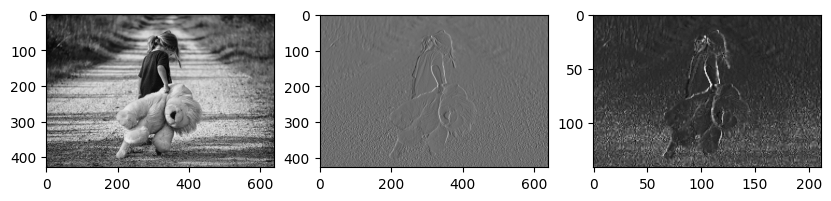

좌측부터 원본 이미지, 1차 conv 연산 후 이미지, conv 연산된 이미지를 pooling한 이미지

이미지의 크기가 매우 줄어들었으며, 이 과정에서 conv 직후 이미지보다 이미지의 특징이 더욱 명확해졌다. 다음 conv 연산, 또는 conv layer가 없는 경우 DDN 학습 단에는 pooling되어 줄어든 이미지가 입력되게 된다.

다시 한 번 생각해볼만한 것은, CNN 과정 자체는 학습이 아니라는 점이다. 이 과정을 특징을 뽑아낸다는 점에서 Feature Extraction(특성 추출)이라고 부른다. \* 앞서서 설명을 위해 전처리라는 말을 쓰기도 했는데, 엄연히 말하자면 전처리와는 다르다.

위와 같은 코드는 실제로는 사용되지 않으며, Keras등 구현된 라이브러리를 사용하게 된다.


