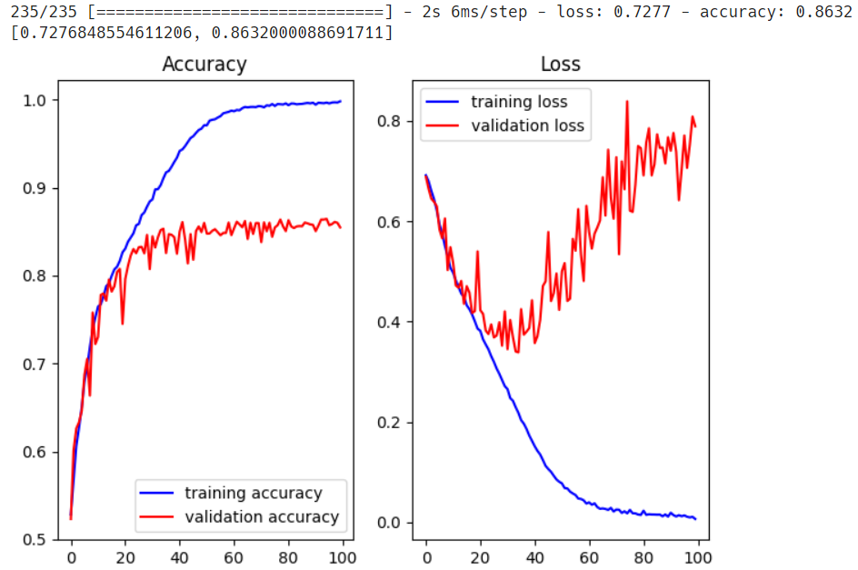

# 실사 이미지

## 개요

이전에 CNN을 이용하여 MNIST 데이터에 대한 분류 모델을 만들었다. CNN은 이미지의 특성을 뽑아 학습하는 방법이기 때문에, 학습 효율이 올라가고 정확도가 상승하였다. 그러나 문제는 MNIST와 같이 간단한 샘플 데이터의 학습이 아니라, 실사이미지의 학습이다.

오늘은 개, 고양이의 실사 이미지를 분류하는 모델을 만들어본다.

## 실습 준비

[https://www.kaggle.com/c/dogs-vs-cats/data](https://www.kaggle.com/c/dogs-vs-cats/data)

train.zip을 다운로드 받아 풀어보면 고양이 혹은 강아지의 이름이 있고, 파일의 이름이 cat~ 혹은 dog~로 되어 있다. 이 파일을 학습하기 편하도록 다음과 같은 작업을 수행하려고 한다.

1. 이미지 파일을 읽는다
2. JPG 파일을 RGB 픽셀 값으로 디코딩한다
3. 정규화를 진행한다
4. 레이블을 포함하여 csv 파일 1개로 만든다.

여기까지는 개인 PC Local에서 진행하고, 이후 만들어진 csv를 이용한 학습은 Google Colab에서 진행한다.

우선 로컬에서 env를 activate하고, 다음과 같은 라이브러리를 설치한다.

```powershell
(base) PS C:\Users\limo> conda activate data_env
(data_env) PS C:\Users\limo> conda install tqdm
(data_env) PS C:\Users\limo> conda install -c conda-forge ipywidgets
(data_env) PS C:\Users\limo> conda install -c conda-forge opencv
```

## 데이터셋 전처리

train.zip을 압축 해제한 디렉토리를 jupyter_home 아래 적절한 곳에 배치한다.

주피터 노트북을 열고, 아래의 코드를 실행한다.

```python
import numpy as np
import pandas as pd 
from PIL import Image
import matplotlib.pyplot as plt
import random
import os
import cv2 as cv 
from sklearn import utils
from tqdm.notebook import tqdm

# 파일 경로
train_dir = './large-data/dogs-cats/train/'


# img = 파일 이름
def labeling(img):
    class_name = img.split('.')[0]
    if class_name == 'cat': return 0
    elif class_name == 'dog': return 1
    
# label data와 pixel data 담을 변수
x_data = []
t_data = []

# os.listdir(): 인자로 준 폴더 경로 안에 있는 모든 파일들 이름 리스트                               ):
for img in tqdm(os.listdir(train_dir),
                total=len(os.listdir(train_dir)),
                position=0,
                leave=True):
    # 위에서 만든 labeling()을 통해 이름이 cat이면 0 / dog면 1 반환
    label_data = labeling(img)

    # 이미지 파일 경로 설정
    path = os.path.join(train_dir, img)

    # 이미지 파일 nd.array로 불러오기 (cv2.imread())
    # 형태만 필요해서 흑백으로 불러오기 (cv2.IMREAD_GRAYSCALE)
    # 이미지 pixel size 조정하기
    img_data = cv.resize(cv.imread(path, cv.IMREAD_GRAYSCALE), (80, 80))

    # 리스트 변수에 담아주기
    t_data.append(label_data)
    x_data.append(img_data.ravel()) # 이미지 shape이 2차원: (80,80)
    # 이게 그대로 들어가면 차원 하나 더 있어서 결국 3차원이므로 
    # 1차원으로 바꿔주기: ravel()

# labeling data ==> DataFrame으로 만들기
t_df = pd.DataFrame({
  'label': t_data
})

# 이미지 픽셀 data ==> DataFrame으로 만들기
x_df = pd.DataFrame(x_data)

# 2개 dataframe 합치기
df = pd.merge(t_df, x_df, left_index=True, right_index=True)

# utils.shuffle() ==> pandas dataframe 행을 shuffle 한다.
shuffled_df = utils.shuffle(df)

# DataFrame을 csv 파일로 저장하기
result = shuffled_df.to_csv('./large-data/dogs-cats/train/train_full.csv', index=False)
```

540메가바이트 정도의 csv 파일이 생성된다. 이 파일을 구글드라이브에 업로드한다.

## 모델 학습

### 라이브러리 불러오기

```python
# 라이브러리 불러오기
import numpy as np 
import pandas as pd
import matplotlib.pyplot as plt
import tensorflow as tf
from sklearn.preprocessing import MinMaxScaler
from sklearn.model_selection import train_test_split
from tensorflow.keras.models import Sequential
from tensorflow.keras.layers import Flatten, Dense, Conv2D, MaxPooling2D, Dropout
from tensorflow.keras.optimizers import Adam, RMSprop
import matplotlib.pyplot as plt
```

### 데이터 읽기

```python
# 1. Raw Data Loading
df = pd.read_csv('/content/drive/MyDrive/Colab Notebooks/KOSA 실습/data/dogs-and-cats.csv')
display(df.head(), df.shape) # (25000, 6401) # 80 * 80 픽셀 + 레이블
```

```python
# 2. 레이블 데이터와 이미지 데이터 분리
label_data = df['label'].values
img_data = df.drop('label', axis=1, inplace=False).values # 2차원 ndarray
```

```python
# 3. 샘플 이미지 확인
plt.imshow(img_data[150:151].reshape(80, 80), cmap='gray')
plt.show()
```


### 모델 생성 및 레이어 추가

```python
# 4. 학습용 데이터와 테스트용 데이터 나누기
x_data_train, x_data_test, t_data_train, t_data_test = \
train_test_split(img_data, label_data, test_size=0.3, random_state=0)
```

```python
# 5. 정규화 처리
# MNIST(0~255)와 달리 픽셀 데이터의 최대, 최소값을 모르기 때문에 정규화 필요
scaler = MinMaxScaler()
scaler.fit(x_data_train)
x_data_train_norm = scaler.transform(x_data_train)

scaler.fit(x_data_test)
x_data_test_norm = scaler.transform(x_data_test)
```

```python
# 6. 모델 생성 - CNN 레이어 추가

model = Sequential()

model.add(Conv2D(filters=32, 
                 kernel_size=(3,3), 
                 activation='relu', 
                 padding='same', # 필터를 거쳐도 이미지 크기가 줄어들지 않음
                 input_shape=(80,80,1)))
model.add(MaxPooling2D(pool_size=(2,2))) # 이미지 해상도를 줄임

model.add(Conv2D(filters=64, 
                 kernel_size=(3,3), 
                 padding='same', 
                 activation='relu'))
model.add(MaxPooling2D(pool_size=(2,2)))

model.add(Conv2D(filters=128, 
                 kernel_size=(3,3), 
                 padding='same', 
                 activation='relu'))
model.add(Conv2D(filters=128, 
                 kernel_size=(3,3), 
                 padding='same', 
                 activation='relu'))
model.add(MaxPooling2D(pool_size=(2,2)))

model.add(Conv2D(filters=256, 
                 kernel_size=(3,3), 
                 padding='same', 
                 activation='relu'))
model.add(Conv2D(filters=256, 
                 kernel_size=(3,3), 
                 padding='same', 
                 activation='relu'))
model.add(MaxPooling2D(pool_size=(2,2)))

# 이미지 개수가 기하급수적으로 증가
# 특징만 추려진 매우 작은 이미지가 매우 많이 생성됨
```

```python
# 6. 모델 생성 - DNN 레이어 추가

# Input Layer
model.add(Flatten())

# Dropout Layer
model.add(Dropout(rate=0.5)) # 오버피팅 방지

# Hidden Layer
model.add(Dense(units=256, 
                kernel_initializer='he_normal',
                activation='relu'))

# Output Layer
model.add(Dense(units=1, # 이미지 한 개의 확률을 뽑아내기 떄문에 1개 (고양이 / 강아지)
                kernel_initializer='he_normal',
                activation='sigmoid')) # Logistic Regression - Binary Classification

print(model.summary()) # Trainable params: 2,764,417 / 어마어마하다
```


### 모델 설정 및 학습 진행

```python
# 7. 모델 설정
model.compile(optimizer=RMSprop(learning_rate=1e-4), # Adam 사용해도 무방함
              loss='binary_crossentropy', 
              metrics=['accuracy'])

# 8. 모델 학습
history = model.fit(x_data_train_norm.reshape(-1,80,80,1), 
                    t_data_train.reshape(-1,1), 
                    epochs=100, 
                    batch_size=100, 
                    verbose=1, 
                    validation_split=0.3)
```

아래와 같이 학습이 100회 반복되었다.

```
Epoch 100/100
123/123 [==============================] - 5s 39ms/step - loss: 0.0110 - accuracy: 0.9962 - val_loss: 0.7881 - val_accuracy: 0.8552
```

### 모델 평가 및 학습 결과 표시

```python
# 9. 모델 평가
print(model.evaluate(x_data_test_norm.reshape(-1,80,80,1), t_data_test.reshape(-1,1)))
# [0.7276848554611206, 0.8632000088691711]

# 10.학습 결과 그래프 표시
train_acc = history.history['accuracy']
train_loss = history.history['loss']

validation_acc = history.history['val_accuracy']
validation_loss = history.history['val_loss']

fig = plt.figure()
fig_1 = fig.add_subplot(1,2,1)
fig_2 = fig.add_subplot(1,2,2)

fig_1.plot(train_acc, color='b', label='training accuracy')
fig_1.plot(validation_acc, color='r', label='validation accuracy')
fig_1.set_title('Accuracy')
fig_1.legend()

fig_2.plot(train_loss, color='b', label='training loss')
fig_2.plot(validation_loss, color='r', label='validation loss')
fig_2.set_title('Loss')
fig_2.legend()

plt.tight_layout()
plt.show()
```



정확도가 0.86 정도가 나왔다. 현업에서 사용하기는 어려운 수준이다.  
25,000장이라는 이미지가 일상적으로는 많아보이지만, 결과적으로는 불충분해보인다.

그래프를 보면, 학습이 진행되며 증가할 것으로 기대되는 Accuracy의 상승이 어느 시점부터 정체되고 있다. 심지어 Loss는 학습이 진행되며 감소할 것으로 예상되나, 실제로는 어느 지점부터 다시 증가하기 시작한다. 과적합된 것이다.
