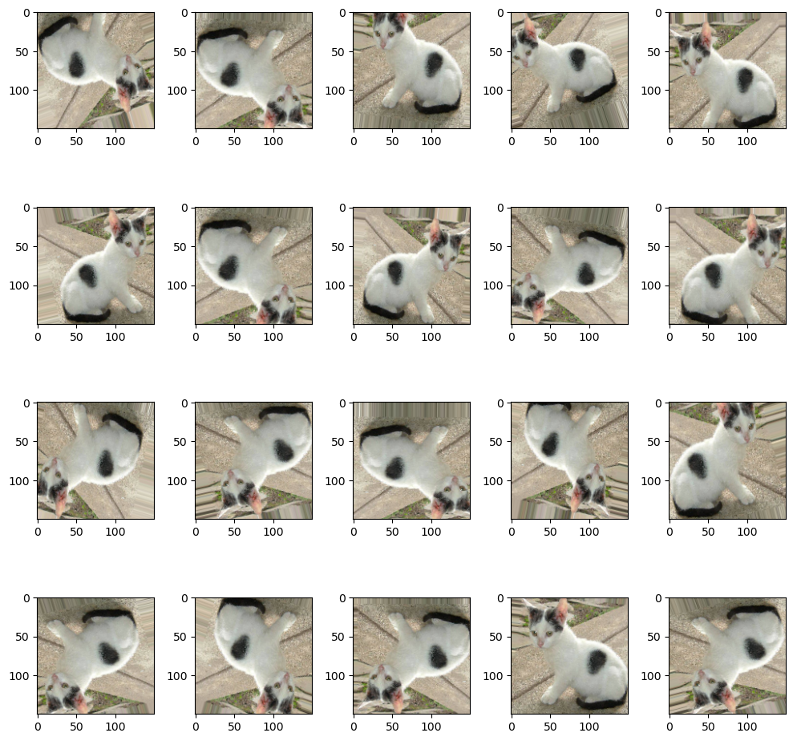

# 이미지 제너레이터 이용

앞선 실습의 문제점을 해결하기 위해, 이미지 제너레이터를 사용해보자. 이미지 제너레이터를 사용하면 한정된 이미지를 가지고 여러 이미지를 생성할 수 있다.

## 적은 이미지로 학습

우선 이미지를 4000개로 줄이고, 이렇게 하더라도 학습이 잘 되는지 확인해보자.

### 이미지 선별

```python
# 일부 이미지 분리(총 4000개)

import os, shutil

original_dataset_dir = './large-data/dogs-cats/train/'

## directory 생성 ##

base_dir = './large-data/dogs-cats-small'
os.mkdir(base_dir)

train_dir = os.path.join(base_dir,'train').replace('\\','/')
os.mkdir(train_dir)
validation_dir = os.path.join(base_dir,'validation').replace('\\','/')
os.mkdir(validation_dir)
test_dir = os.path.join(base_dir,'test').replace('\\','/')
os.mkdir(test_dir)

train_cats_dir = os.path.join(train_dir,'cats').replace('\\','/')
os.mkdir(train_cats_dir)
train_dogs_dir = os.path.join(train_dir,'dogs').replace('\\','/')
os.mkdir(train_dogs_dir)

validation_cats_dir = os.path.join(validation_dir,'cats').replace('\\','/')
os.mkdir(validation_cats_dir)
validation_dogs_dir = os.path.join(validation_dir,'dogs').replace('\\','/')
os.mkdir(validation_dogs_dir)

test_cats_dir = os.path.join(test_dir,'cats').replace('\\','/')
os.mkdir(test_cats_dir)
test_dogs_dir = os.path.join(test_dir,'dogs').replace('\\','/')
os.mkdir(test_dogs_dir)

## file 복사 ##

fnames = ['cat.{}.jpg'.format(i) for i in range(1000)]
for fname in fnames:
    src = os.path.join(original_dataset_dir,fname).replace('\\','/')
    dst = os.path.join(train_cats_dir, fname).replace('\\','/')
    shutil.copyfile(src,dst)

fnames = ['cat.{}.jpg'.format(i) for i in range(1000,1500)]
for fname in fnames:
    src = os.path.join(original_dataset_dir,fname).replace('\\','/')
    dst = os.path.join(validation_cats_dir, fname).replace('\\','/')
    shutil.copyfile(src,dst)
    
fnames = ['cat.{}.jpg'.format(i) for i in range(1500,2000)]
for fname in fnames:
    src = os.path.join(original_dataset_dir,fname).replace('\\','/')
    dst = os.path.join(test_cats_dir, fname).replace('\\','/')
    shutil.copyfile(src,dst)
    

fnames = ['dog.{}.jpg'.format(i) for i in range(1000)]
for fname in fnames:
    src = os.path.join(original_dataset_dir,fname).replace('\\','/')
    dst = os.path.join(train_dogs_dir, fname).replace('\\','/')
    shutil.copyfile(src,dst)

fnames = ['dog.{}.jpg'.format(i) for i in range(1000,1500)]
for fname in fnames:
    src = os.path.join(original_dataset_dir,fname).replace('\\','/')
    dst = os.path.join(validation_dogs_dir, fname).replace('\\','/')
    shutil.copyfile(src,dst)
    
fnames = ['dog.{}.jpg'.format(i) for i in range(1500,2000)]
for fname in fnames:
    src = os.path.join(original_dataset_dir,fname).replace('\\','/')
    dst = os.path.join(test_dogs_dir, fname).replace('\\','/')
    shutil.copyfile(src,dst)
```

### 모델 생성 및 학습

```python
model = Sequential()

model.add(Conv2D(filters=32,
                    kernel_size=(3,3),
                    activation='relu',
                    input_shape=(150,150,3)))
model.add(MaxPooling2D(pool_size=(2,2)))

model.add(Conv2D(filters=64,
                    kernel_size=(3,3),
                    activation='relu'))
model.add(MaxPooling2D(pool_size=(2,2)))

model.add(Conv2D(filters=128,
                    kernel_size=(3,3),
                    activation='relu'))
model.add(MaxPooling2D(pool_size=(2,2)))

model.add(Conv2D(filters=128,
                    kernel_size=(3,3),
                    activation='relu'))
model.add(MaxPooling2D(pool_size=(2,2)))

model.add(Flatten())
model.add(Dense(units=512,
                activation='relu'))
model.add(Dense(units=1,
                activation='sigmoid'))

# print(model.summary())

model.compile(optimizer=RMSprop(learning_rate=1e-4),
                loss='binary_crossentropy',
                metrics=['accuracy'])

## keep in mind that by default, batch_size is 32 in model.fit()
## steps_per_epoch = len(X_train) // batch_size

history = model.fit(train_generator,
                    steps_per_epoch=100,
                    epochs=30,
                    validation_data=validation_generator,
                    validation_steps=50) # val_loss: 1.0149 - val_accuracy: 0.7300
```

Accuracy가 0.73으로 매우 감소한 것을 볼 수 있다.

## 제너레이터 예제 - 증식

학습이 잘 완료되었지만, 예상했던대로 데이터 수가 줄어들었기 떄문에 정확도가 매우 낮아졌다.
이와 같이 데이터 셋 수가 적은 상태에서 취할 수 있는 방법 중 하나가 Augmentation(증식)이다.

Augmentaition (증식)  
    - 데이터가 부족한 경우, 가지고 있는 데이터를 늘려 학습 데이터 셋으로 사용한다.
    - 적은 데이터를 가지고 학습할 떄보다 오버피팅의 확률이 낮아질 것이다.
    - 회전 (30', 70', ...), 부분 크롭, 확대, 축소, 상하좌우 이동 등의 방법으로 변형된 이미지 다수를 생성한다.

위의 코드에서는 ImageDataGenerator를 사용은 했지만, 리스케일(크기 정규화)만 옵션으로 지정했기 때문에 증식이 적용되지 않았다. 여기에 옵션을 지정하여 여러 변형 이미지를 생성하도록 해보자.

### 이미지 증식

```python
# 이미지 증식(Augmentaition) 예제

from tensorflow.keras.preprocessing import image
from tensorflow.keras.preprocessing.image import ImageDataGenerator
import matplotlib.pyplot as plt

datagen = ImageDataGenerator(rotation_range=20,    
                             # 지정된 각도 범위내에서 임의로 원본이미지를 회전
                             width_shift_range=0.1,
                             height_shift_range=0.1,
                             # 지정된 방향 이동 범위내에서 임의로 원본이미지를 이동. 
                             # 수치는 전체 넓이의 비율(실수)                             
                             shear_range=0.1,
                             # 밀림 강도 범위내에서 임의로 원본이미지를 변형. 
                             # 수치는 시계반대방향으로 밀림 강도를 라디안으로 표시
                             zoom_range=0.1,
                             # 지정된 확대/축소 범위내에서 임의로 원본이미지를 확대/축소. 
                             # "1-수치"부터 "1+수치"사이 범위로 확대/축소 
                             horizontal_flip=True,
                             vertical_flip=True,  
                             # 수평, 수직방향으로 뒤집기.
                             fill_mode='nearest')

img = image.load_img('./large-data/dogs-cats-small/train/cats/cat.3.jpg',
                     target_size=(150,150))

x = image.img_to_array(img)  # (150,150,3)
x = x.reshape((1,) + x.shape) # (1,150,150,3)


fig = plt.figure(figsize=(10,10))
axs = []

for i in range(20):
    axs.append(fig.add_subplot(4,5,i+1))

idx = 0
for batch in datagen.flow(x, batch_size=1):
    imgplot = axs[idx].imshow(image.array_to_img(batch[0]))
    idx += 1
    if idx % 20 == 0:
        break
        
fig.tight_layout()        
plt.show()        
```



그럼, 다음과 같이 증식된 이미지를 가지고 학습을 돌려보자

### 모델 생성 및 학습

```python
# 증식된 이미지를 가지고 모델 학습
import numpy as np
import pandas as pd
import tensorflow as tf
from tensorflow.keras.models import Sequential
from tensorflow.keras.layers import Conv2D, MaxPooling2D 
from tensorflow.keras.layers import Flatten, Dense, Dropout
from tensorflow.keras.optimizers import Adam, RMSprop
from tensorflow.keras.preprocessing.image import ImageDataGenerator

train_dir = './large-data/dogs-cats-small/train/'
validation_dir = './large-data/dogs-cats-small/validation'

# ImageDataGenerator 생성
# 모든 이미지 데이터의 값을 1/255로 scaling 하면서 augmentation
train_datagen = ImageDataGenerator(rescale=1/255,
                                   rotation_range=40,
                                   width_shift_range=0.1,
                                   height_shift_range=0.1,
                                   shear_range=0.2,
                                   zoom_range=0.2,
                                   horizontal_flip=True)

# Validation data에 대해서는 당연히 증식을 사용하면 안된다.
validation_datagen = ImageDataGenerator(rescale=1/255)

train_generator = train_datagen.flow_from_directory(
    train_dir,                    # target directory
    classes=['cats', 'dogs'],     # cats, dogs 순서로 label 0,1
                                  # (생략하면 폴더순서로 label적용)
    target_size=(150,150),        # image size scaling
    batch_size=32,                # 한번에 32개의 이미지를 가져온다. 
                                  # label에 상관없이 가져온다.
    class_mode='binary')          # 고양이와 멍멍이만 존재하므로 
                                  # 2진 분류이기 때문에 binary
                                  # 다중분류인 경우 'categorical'(기본값), 
                                  # 'sparse' 이용가능
                                  # 오토인코더처럼 입력을 target으로 하는 경우 'input'
                     
validation_generator = validation_datagen.flow_from_directory(
    validation_dir,
    classes=['cats', 'dogs'],
    target_size=(150,150),
    batch_size=32,
    class_mode='binary')

# 모델 생성 및 레이어 배치
model = Sequential()

model.add(Conv2D(filters=32,
                 kernel_size=(3,3),
                 activation='relu',
                 input_shape=(150,150,3)))
model.add(MaxPooling2D(pool_size=(2,2)))

model.add(Conv2D(filters=64,
                 kernel_size=(3,3),
                 activation='relu'))
model.add(MaxPooling2D(pool_size=(2,2)))

model.add(Conv2D(filters=128,
                 kernel_size=(3,3),
                 activation='relu'))
model.add(MaxPooling2D(pool_size=(2,2)))

model.add(Conv2D(filters=128,
                 kernel_size=(3,3),
                 activation='relu'))
model.add(MaxPooling2D(pool_size=(2,2)))

model.add(Flatten())
model.add(Dropout(rate=0.5))
model.add(Dense(units=512,
                activation='relu'))
model.add(Dense(units=1,
                activation='sigmoid'))

print(model.summary())

model.compile(optimizer=RMSprop(learning_rate=1e-4),
              loss='binary_crossentropy',
              metrics=['accuracy'])

## keep in mind that by default, batch_size is 32 in model.fit()
## steps_per_epoch = len(X_train) // batch_size
## validation_steps = len(X_test) // batch_size

# 학습 시작
history = model.fit(train_generator,
                    steps_per_epoch=62,
                    epochs=100,
                    validation_data=validation_generator,
                    validation_steps=31) # val_loss: 0.4266 - val_accuracy: 0.8034
```

최종 val_accuracy가 0.80으로 여전히 높지 않지만, 직전보다 증가한 것을 볼 수 있다.
