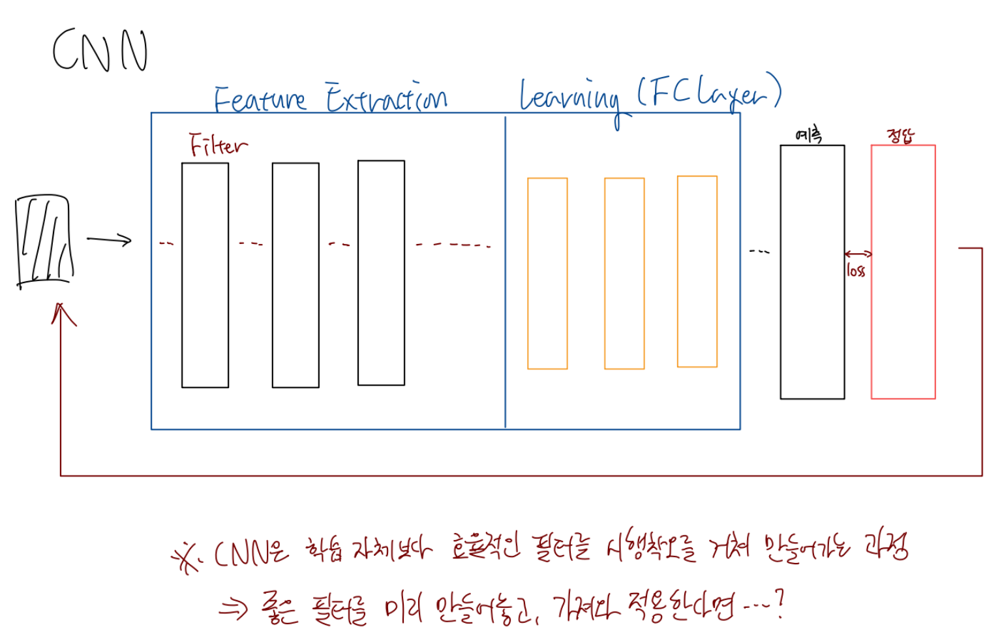
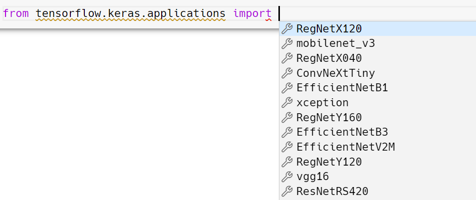
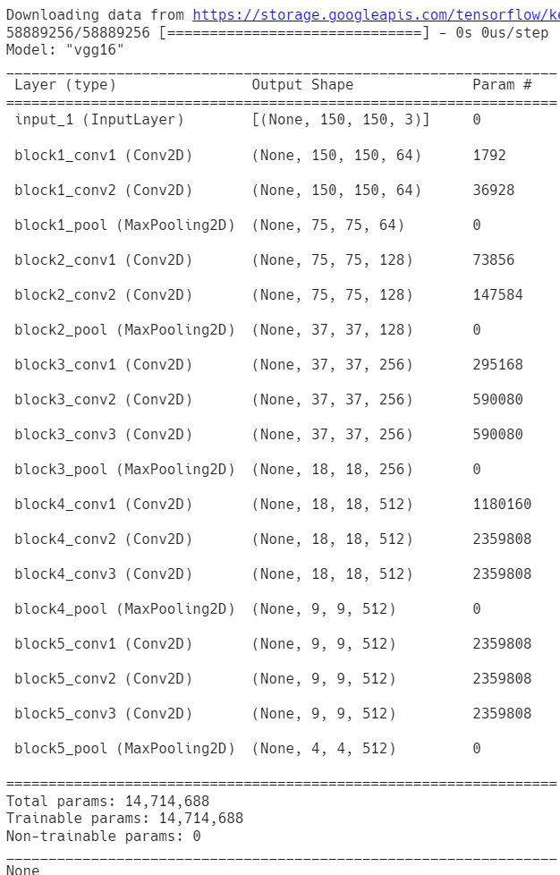

# 전이학습

## 복습

- CNN
	- DNN 보완을 위해 고안됨
	- 과정
		- Feature Extraction
			- convolution
				- 특징이 추출된 이미지
				- 이미지 개수 증가
			- pooling
				- 각 이미지의 size 축소
		- 학습 (DNN)
	- 한계점
		- 실사 이미지 학습
			- 데이터 양이 많아야함
				- 그러나 정제가 잘 된 데이터라면 데이터 수가 적더라도 학습 가능
			- 독립변수의 수가 작아야 한다
				- 실사 이미지의 경우 사이즈가 큰 편. 해상도를 줄이는 것도 한계가 있음
			- 어제 실습
				- 충분한 데이터가 있더라도 생각보다 결과가 만족스럽지 못함 (86% 정도)
				- 데이터를 더 줄였더니 모델이 더 안좋아짐 (73% 정도)
					- 실제 현실적인 상황과 유사
        - 대안
            - Augmentaition (증식) 기법 사용
                - 보유한 이미지 데이터를 회전, 이동, 크롭 등의 방법으로 변형하여 다수 생성
                - 어제 실습에는 ImageDataGenerator 사용
            - 전이

## 전이학습 개요



위의 다이어그램과 같이, CNN은 뒷단의 학습 레이어 이전에, 효율적인 필터를 찾아가는 과정이라고 할 수 있다. 그렇다면 관점을 바꾸어 이미 성능이 검증이 된 필터를 적용하여 학습을 해보면 어떨까?

이미 만들어져 공개된 고성능의 CNN 모델들이 있다.

(Pretrained Networks)  
- Google의 Inception
    - Convolution 45개, Pooling 20개
    - ImageNet의 대용량 이미지 데이터셋을 가지고 학습
- MS의 ResNet
    - Inception의 3배 스케일
- EfficientNet
- VGG
- MobileNet
- 등

이들을 활용하면 고품질의 필터를 제공받아, 최종적인 이미지 학습만을 수행하면 된다. 위의 모델에서 필터만을 취하고, 학습만 구현하는 것이다. 이것이 전이학습의 시작이다.  
Kearas를 통해 각 모델을 쉽게 다운로드할 수 있다.

우리는 기학습 네트워크 중 연습용 모델 격인 VGG를 사용해볼 것이다. 다른 모델들은 상용목적으로 사용되는 모델로, 크기가 너무 커서 다루기 힘들다.

## 전이학습 실습

### VGG16 불러오기



Google Colab에 들어가 텐서플로우를 임포트한다. 여러가지 모델들이 보인다.

```python
# 전이학습 모델로 VGG16 이용
# 기학습 네트워크

from tensorflow.keras.applications import VGG16


model_base = VGG16(weights='imagenet', # VGG16의 각 레이어에는 Weight가 있다.
                                       # imagenet을 대상으로 만들어진 weight를 가져오게 지정
                   include_top=False, # 모델 뒷단의 분류기(학습 레이어)는 포함하지 않음
                   input_shape=(150, 150, 3)) # (세로, 가로, 채널) / 150*150 컬러 이미지

print(model_base.summary())
```



VGG16 모델을 잘 다운로드했으며, 원하는 설정이 지정되었다. 전체 연산 수는 14,714,688이다.

### VGG16을 이용해 이미지의 특징 추출

```python
import os
import numpy as np
from tensorflow.keras.preprocessing.image import ImageDataGenerator

base_dir = '/content/drive/MyDrive/Colab Notebooks/KOSA 실습/Materials/cat_dog_small'
train_dir = os.path.join(base_dir, 'train')
validation_dir = os.path.join(base_dir, 'validation')
test_dir = os.path.join(base_dir, 'test')

datagen = ImageDataGenerator(rescale=1/255) # 이미지 정규화
batch_size=20

def extract_feature(directory, sample_count):
    features = np.zeros(shape=(sample_count,4,4,512))
    labels = np.zeros(shape=(sample_count,))
    
    generator = datagen.flow_from_directory(
        directory,
        target_size=(150,150),
        batch_size=batch_size,
        class_mode='binary')

    i = 0

    for x_data_batch, t_data_batch in generator:
        feature_batch = model_base.predict(x_data_batch) # VGG16의 필터를 이용해 대상 이미지 특성 추출
        features[i*batch_size:(i+1)*batch_size] = feature_batch
        labels[i*batch_size:(i+1)*batch_size] = t_data_batch
        
        i += 1
        if i * batch_size >= sample_count:
            break;
    
    return features, labels

train_features, train_labels = extract_feature(train_dir,2000)
validation_features, validation_labels = extract_feature(validation_dir,1000)
test_features, test_labels = extract_feature(test_dir,1000)
```

### 모델 생성 및 학습

```python
# VGG16 필터를 이용해 특징을 추출한 이미지셋을 가지고 모델 학습

train_features = np.reshape(train_features, (2000,4 * 4 * 512))
validation_features = np.reshape(validation_features, (1000,4 * 4 * 512))
test_features = np.reshape(test_features, (1000,4 * 4 * 512))

from tensorflow.keras.models import Sequential
from tensorflow.keras.layers import Dense, Dropout
from tensorflow.keras.optimizers import RMSprop

model = Sequential()
model.add(Dense(256,
                activation='relu',
                input_shape=(4 * 4 * 512,)))
model.add(Dropout(0.5))
model.add(Dense(1,
                activation='sigmoid'))

model.compile(optimizer=RMSprop(learning_rate=2e-5),
              loss='binary_crossentropy',
              metrics=['accuracy'])

history = model.fit(train_features,
                    train_labels,
                    epochs=30,
                    batch_size=20,
                    validation_data=(validation_features, validation_labels)) # val_loss: 0.2364 - val_accuracy: 0.9030
```

앞서서 Feature Extraction을 따로 해줬기 때문에 학습 자체가 빠르게 끝난다.  
또한 최종 정확도가 0.90으로 매우 높아졌다.

그렇다면, 전체 25000장의 데이터셋을 사용하고, VGG16이 아닌 다른 사용 전이 모델을 사용한다면 정확도가 더 높아질 것이다.


