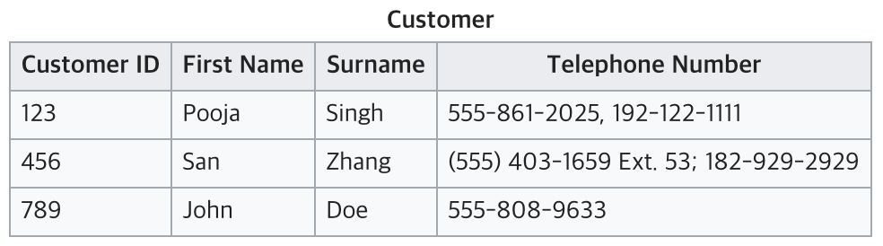
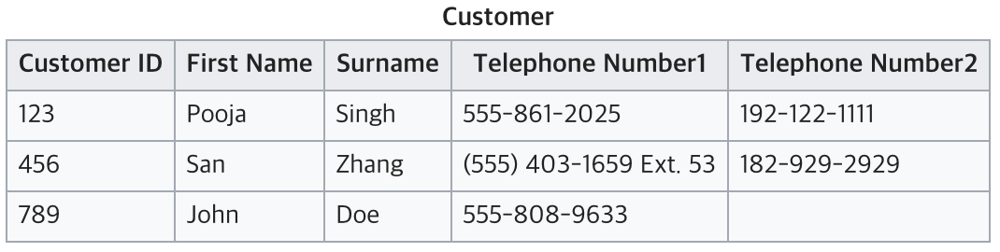
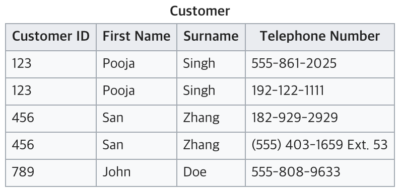
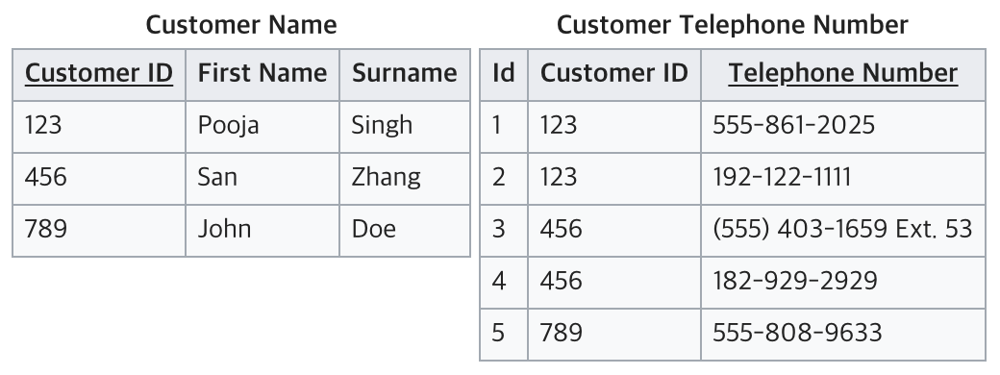
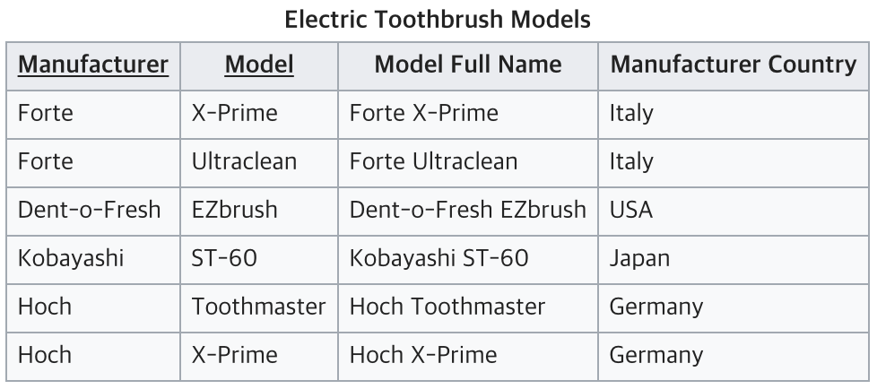
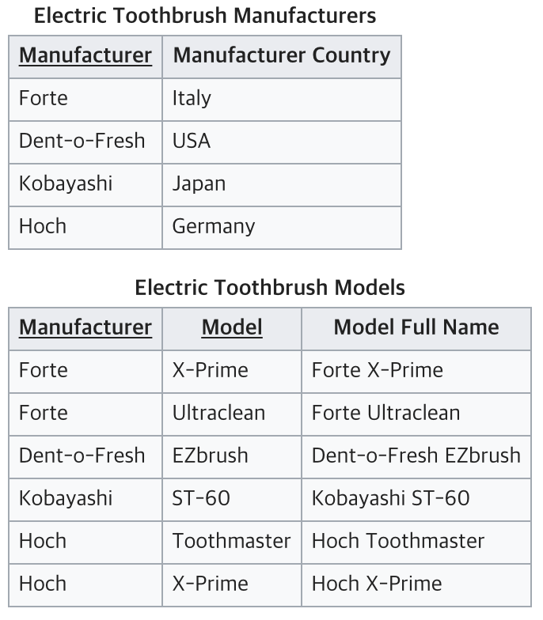
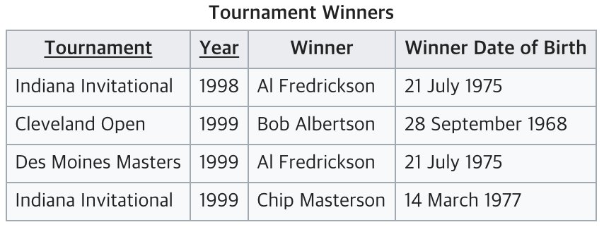
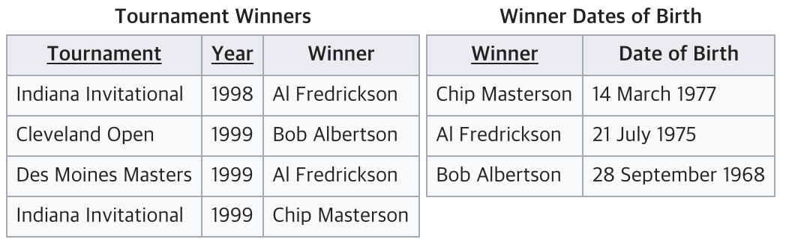

# 정규화

## 관계형 DB와 비관계형 DB
- 관계형 DB: MySQL 등
- 비관계형 DB: NoSQL(Not Only SQL). MongoDB, 카산드라 등

우리가 익숙한 관계형 DB는 자료구조로 Table을 사용하고 입출력을 위해 SQL을 사용한다. 비관계형 DB는 자료구조로 Key, Value 맵(JSON, ...)을 사용하고 독자적인 방식으로 입출력을 수행한다.

- Structured Data과 Unstructured Data (오라클 기준)
    - Simple Structured Data: Table
    - Complex Structured Data: 중첩된 Row
    - Semi-Structured Data: XML, JSON
    - Unstructured Data: 이미지, 동영상 등 비정형 데이터

기존에는 관계형 DB를 Structured하다고 했으며, 비관계형 DB는 Unstructured하다고 표현했으나, 사실 관계가 없고 구조가 없는 데이터는 없다. 따라서 관계형 DB는 Structured DB라는 표현 대신 Tabular DB라고 하기도 한다.  
본래 NoSQL DB는 전통적인 관계형 DB의 대안으로서 제안되었으나, 최근에는 NoSQL DB도 테이블을 지원하면서 결국 테이블 형태로 데이터를 보관하는 방식은 여전히 성행하게 되었다.  
Tabular DB를 잘 활용하기 위해서는 정규화와 비정규화를 잘 수행해야하며, 이를 위해 ER을 만들어 볼 수 있다.

## 정규화, 반정규화
- 개요
    - 정규화: Placement. 컬럼의 위치를 찾는 일. 이 컬럼이 이 테이블에 있는게 맞는지, 옮겨야 하는지, 새 테이블을 만들어야 하는지 등을 고민.
    - 관계형 모델의 창시자 E. F. Codd가 고안한 기술이며, 12가지 방법이다. ER모델링 등장 몇년 전에 등장하였다.
    - 정규화를 항상 순서대로 할 필요는 없다

    - 반정규화: 필요에 따라 정규화를 어기는 것
    - 몇가지 방법을 나중에 소개하겠으나, 오히려 정규화 하는 것보다 어려움

- 정규화
    - 정규화 시작 전: 중복(한 셀에 여러 개의 데이터가 들어간 경우)을 제거
        - 정규화의 기본 전제: 모든 셀에는 한 종류의 값 하나만 들어가야 함.
    - 제1정규화(Normalization): Repeating Group 제거 -> 결과: 제1정규형 (1NF)
    - 제2정규화: 복합 UID에 대한 부분 종속 제거 -> 결과: 제2정규형 (2NF)
    - 제3정규화: Non-UID에 대한 종속 제거 -> 결과: 제3정규형 (3NF)

참고 자료: [https://wkdtjsgur100.github.io/database-normalization/](https://wkdtjsgur100.github.io/database-normalization/
)

- 식별자: 한 테이블 내에는 동일한 Row가 두 개 이상 있으면 안된다. 이때 각 Row를 구분할 수 있는 유일한 값이 식별자이다.
    - 식별자는 인공 데이터인 일련번호로 잡을 수도 있고, 컬럼의 일부로 잡을 수도 있다.

## 제1정규화: Repeating Group 제거

한 셀에 여러 개의 데이터가 들어감

전화번호를 추가할 때마다 컬럼을 추가해야함

컬럼을 추가해야하는 문제는 해소됐지만, 반복되는 그룹(Customer ID, First Name, Surname)이 있음

이를 제거하기 위해 테이블 자체를 나눈다. 전화번호 컬럼을 떼어서 별도의 테이블로 만들고, 고객 아이디를 넣으면 된다.

의미 없는 인공값으로 ID를 만들 수도 있고, 기존 값을 PK로 삼을 수도 있다. 이때 값이 중복되어서는 안된다. 

## 제2정규화

1열과 2열이 복합키이다.  
3열은 키에 종속되지만, 4열은 1열에만 종속된다.

이 경우 아래와 같이 테이블을 나눌 수 있다.

1, 2, 3 정규형을 모두 만족한다.

이렇게 제2정규형은 복합키의 경우에만 따져주면 된다. 즉, 복합키가 아니면 무조건 제2정규화를 만족한다.

## 제3정규화

Winner는 Tonarmaent와 Year가 확정되어야 종속되므로 완전종속이 맞다. 그러나 Winner Date of Birth는 Winner에 종속되는 값인데, Winner는 uid가 아니므로 제3정규화에서 제거해야할 대상이 된다.

그럼 그냥 Tonarment, Year와 Winner와 Winner Date of Bitrh를 나누면 된다. 이때, 그냥 나누면 왼쪽 테이블에 WInner 정보가 없게 되므로 Winner 이름 (PK)를 FK로 넣어준다.

