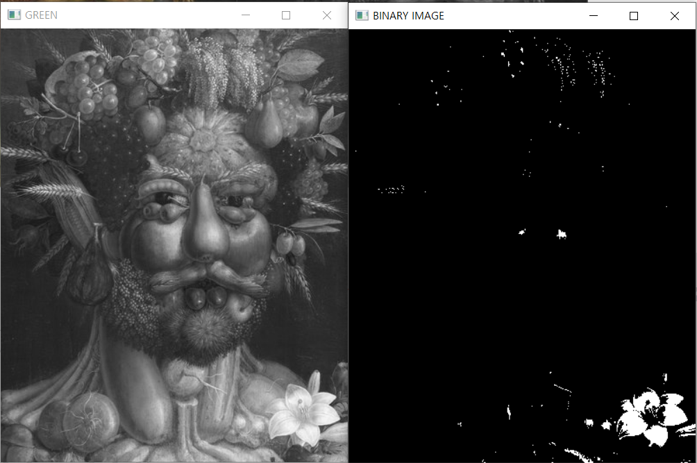
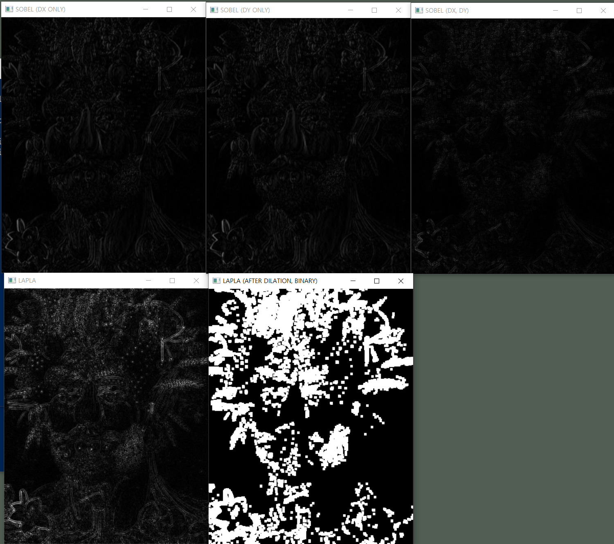

# 영상처리 1

## 강의 개요

다음 주 수요일까지 AI Labs 강의. 영상처리는 내일 오전까지 진행.

영상처리파트 이영원 파트장님

## 영상이란

- 영상: 2차원 평면 위에 그려진 시각적 표현물. 정지영상과 동영상을 포괄
- 영상처리: 영상을 가공, 활용하여 원하는 정보를 추출

- 영상의 구성 요소
    - 픽셀
    - 색상
    - 해상도

- 영상처리: 입력으로 주어진 영상에서 원하는 정보를 얻어내기 위한 처리
    - 원하는 정보?: 색상 조절, 대상 검출, 객체 인식 등.
        - 카메라 필터 어플 등 색상이나 shape 조절
        - 사물, 사람을 인식하고 라벨링
    - 전통적인 방법부터 딥러닝을 통한 방법까지 다양한 방법 존재

## 오늘 사용할 영상 파일 준비


실습 프로젝트 루트에 image.jpg로 저장하였다.

## 환경설치
- Python: 3.8.10
- Numpy
    - pip install numpy
- OpenCy
    - pip install opencv-python

```python
>>> import cv2
>>> print(cv2.__version__)
4.7.0
>>> image = cv2.imread('image.jpg', -1)
>>> cv2.imshow('test_window', image)
>>> cv2.waitKey(0) # 키 입력을 기다리게 한다
13
>>> cv2.destroyAllWindows() # 윈도우를 닫는다.
```

## 영상 구조
- 메모리로 불러온 영상은 배열로 저장된다.
    - 높이 * 너비 * 채널 (numpy의 경우)
- 영상 크기 정보 확인하기
```
>>> image = cv2.imread('image.jpg', -1)
>>> print(image.shape)
(720, 581, 3)
```

| 0, 0	 | 0, 1	 | 0, 2	 |
| :--: | :--: | :--: |
| 1, 0	 | 1, 1	 | 1, 2	 |
| 2, 0	 | 2, 1	 | 2, 2	 |
3차원 채널의 이미지라면 각 셀의 뒤에 색상 정보가 depth 3로 붙어있다고 생각하면 된다. 큐브 모양을 떠올리면 쉽다.

- 색상 정보에 따라 영상은 데이터 타입을 다르게 가진다
```
>>> image.dtype
dtype('uint8')
```
unsigned int -> 0~255까지 표현 가능

- 실제 픽셀 값 확인해보기
```python
>>> print(image)
```


실제 각 숫자는 B, G, R 순서의 색상 정보이다.  
모니터는 색상 정보를 들어오는 순서로 읽게 된다. 예컨대 R, G, B 값은 들어오는 순서대로 B, G, R로 읽힌다. 그래서 cv2에서도 기본 B, G, R 순서로 표시하는 것이다.

## 이미지 색상 정보 수정
### 흑백으로 변환

```python
>>> isGrayImage = cv2.imshow('test', image[:,:,0])
>>> cv2.waitKey(0)
13
>>> cv2.destroyAllWindows()
```

한 채널만 따오면 확실히 회색 이미지로 보인다. 그러나 이 경우 그냥 한 채널을 기준으로 보여주는 것이지 엄밀한 의미의 흑백 이미지는 아닐 것이다.

```python
>>> realGrayImage = cv2.cvtColor(image, cv2.COLOR_BGR2GRAY)
>>> cv2.imshow('test', realGrayImage)
>>> cv2.waitKey(0)
13
>>> cv2.destroyAllWindows()
```

위와 같이 cv2.cvtColor(image, cv2.COLOR_BGR2GRAY)를 쓰면 아래와 같은 색 영역에서 세 가지 색상 정보를 흑백으로 환산해주게 된다.

### 이미지 반전

```python
>>> invertedImage = 255 - image
>>> cv2.imshow('test', invertedImage)
>>> cv2.waitKey(0)
```


### 특정 색상 조정 (파란색)

```python
>>> colorMod = image;
>>> colorMod[:,:,0] = colorMod[:,:,0] + 50
>>> cv2.imshow('test', colorMod)
>>> cv2.waitKey(0)
>>> cv2.destroyAllWindows()
```


## Anaconda로 환경 변경

```
conda create -n vision-env python=3.8
conda activate vision-env

pip install opencv-python
pip install numpy
conda install nb_conda
jupyter notebook --notebook-dir="C:\Users\limo\git\KOSAjava\To-Be-Luxian\Ai-Labs\video\jupyter_home"
```

vision-env 커널로 노트북을 하나 만들었다.  
새로운 노트북 홈 루트에 image.jpg를 복사한다.

## 아나콘다 환경 테스트


## 이미지 색상 정보 수정 (이어서)

### RGB -> BGR

```python
# RGB -> BGR
rgbImage = cv2.cvtColor(image, cv2.COLOR_BGR2RGB)
cv2.imshow('test', rgbImage)
cv2.waitKey(0)
cv2.destroyAllWindows()
```


R과 B의 위치가 바뀌어 입력된 모습

### 반전 (다시)

```python
invertImage = 255 - image
cv2.imshow('test', invertImage)
cv2.waitKey(0)
cv2.destroyAllWindows()
```


## 영상 수정

### ROI

- ROI: Region of Interest. 영상의 관심 영역을 말함. 이미지에서 변경할 부분의 영역을 변수에 지정하는 것.

```python
roi = image[0:500, 100:500, :] # 높이, 가로, 채널 전체
flipped_roi = cv2.flip(roi, 1)

cv2.imshow('ROI', roi)
cv2.imshow('ROI-FLIPPED', flipped_roi)
cv2.waitKey(0)
cv2.destroyAllWindows()
```


## 영상 이진화

특정 색상 영역에 대해 일정 기준에 따라 있으면 1, 없으면 0으로 처리하여 색상을 이진화시키는 처리

```python
roi = image[0:500, 100:500, :]
flipped_roi = cv2.flip(roi, 1)
gr_flipped_roi = flipped_roi[:, :, 1] # G 영역

# G 영역 이미지 확인
cv2.imshow('ORIGINAL', flipped_roi)
cv2.imshow('GREEN', gr_flipped_roi) # 어두울수록 초록 값이 큼
cv2.waitKey(0)
cv2.destroyAllWindows()
```


```python
# 이진화
gr_bin_image = cv2.threshold(gr_flipped_roi, 200, 255, cv2.THRESH_BINARY) # 이미지 ndarry, 기준값, 최대값
# print(gr_bin_image)
# # (200.0, array([[0, 0, 0, ..., 0, 0, 0],
# #        [0, 0, 0, ..., 0, 0, 0],
# #        [0, 0, 0, ..., 0, 0, 0],
# #        ...,
# #        [0, 0, 0, ..., 0, 0, 0],
# #        [0, 0, 0, ..., 0, 0, 0],
# #        [0, 0, 0, ..., 0, 0, 0]], dtype=uint8)) # 튜플로 떨어지는 것에 주의. 0번째에 임계치, 1번째에 결과 데이터가 있다.
cv2.imshow('BINARY IMAGE', gr_bin_image[1])
cv2.waitKey(0)
cv2.destroyAllWindows()
```



G 채널이 200 이상인 픽셀은 블랙처리, 200이하인 처리는 화이트처리가 되었다. 초록색이 거의 없는 픽셀만이 하얀색으로 표시되는 것이다.

임계치를 100으로 주면 아래와 같이 나온다. 진한 초록이 사용된 픽셀만 추려진 것이다.


## 영상의 형태학적 연산 (Morphological Operation)

- 영상의 형태학적 정보를 유지
    - 침식, 팽창 등의 연산이 있음

```python
import numpy as np
kernel = np.ones((5, 5), dtype=np.uiㅜt8) # 연산에 사용할 커널
# [[1, 1, 1, 1, 1],
# [1, 1, 1, 1, 1],
# [1, 1, 1, 1, 1],
# [1, 1, 1, 1, 1],
# [1, 1, 1, 1, 1]]
```

- 원본 이미지의 각 픽셀이 커널의 중점에 대응되며 주변 값과 함께 곱연산을 수행하게 된다. 그 결과 주변 픽셀에 따라 침식되거나 팽창되게 보이게 된다. [참고 자료](https://pyimagesearch.com/2021/04/28/opencv-morphological-operations/)

- 침식 연산 (erosion)
    - cv2.erode(image, kernel)
- 팽창 연산 (dilation)
    - cv2.dilate(image, kernel)

이전의 이진화 영상을 보면 잡읍이 많다. 이때 침식 연산이나 팽창 연산을 통해 잡읍을 제거할 수 있다.

```python

```


## 영상 필터링

### 가우시안 블러링

- 가우스 평균 분산 분포를 이미지에 곱해서 픽셀간 경계를 완화하거나 잡음을 제거
- 잡읍 제거에 사용될 수 있어 다른 필터링 연산 이전에 전처리를 위해 많이 사용됨.

```python
# 가우시안 블러링

import cv2;
import numpy as np;

image = cv2.imread('image.jpg', -1)

roi = image[0:500, 100:500, :]
flipped_roi = cv2.flip(roi, 1)
gr_flipped_roi = flipped_roi[:, :, 1] # G 영역

# 이진화
bin = cv2.threshold(gr_flipped_roi, 100, 255, cv2.THRESH_BINARY) # 이미지 ndarry, 기준값, 최대값, 임계처리 타입

# 가우시안 블러링
kernel = np.ones((5, 5), dtype=np.uint8)
blur_result = cv2.GaussianBlur(bin[1], (5, 5), 3); # 커널이 커질수록 번짐이 심함

# 출력하여 확인
cv2.imshow('BINARY IMAGE', bin[1])
cv2.imshow('GAUSSIAN BLUR', blur_result)
cv2.waitKey(0)
cv2.destroyAllWindows()
```


### 소벨 필터링

- 1차 미분 연산을 통해 x, y축에 대한 기울기를 각각 계산
- x, y 축 각각의 생상 변화량을 계산해야하므로 두 번 수행해야 함
- 외곽선 검출에 사용

- cv2.Sobel(gray_image, ddepth, dx, dy, kernel_size,scale)
- cv2.convertScalAbs()

```python
# 소벨 필터링

import cv2;
import numpy as np;

image = cv2.imread('image.jpg', -1)[0:500, 100:500, :]

gray = cv2.cvtColor(image, cv2.COLOR_BGR2GRAY)
gauss = cv2.GaussianBlur(gray, (3, 3), 3)

# 소벨 필터링
kernel = np.ones((5, 5), dtype=np.uint8)

x_edge = cv2.Sobel(gauss, cv2.CV_32F, 1, 0, 3, 1) # CV_32S: 32비트 영역으로 늘려 연산 / dx=1 dy=0: x축에 대해서만 연산 
x_edge = cv2.convertScaleAbs(x_edge) # 32비트 영역에서 연산했던 것을 다시 0-255 범위로 환산

y_edge = cv2.Sobel(gauss, cv2.CV_32F, 1, 0, 3, 1) # CV_32S: 32비트 영역으로 늘려 연산 / dx=1 dy=0: x축에 대해서만 연산 
y_edge = cv2.convertScaleAbs(y_edge) # 32비트 영역에서 연산했던 것을 다시 0-255 범위로 환산

whole_edge = cv2.Sobel(gauss, cv2.CV_32F, 1, 0, 3, 1) # CV_32S: 32비트 영역으로 늘려 연산 / dx=1 dy=0: x축에 대해서만 연산 
whole_edge = cv2.convertScaleAbs(whole_edge) # 32비트 영역에서 연산했던 것을 다시 0-255 범위로 환산

# 출력하여 확인
cv2.imshow('ORIGINAL (BLUR)', gauss)
cv2.imshow('SOBEL (DX ONLY)', x_edge)
cv2.imshow('SOBEL (DY ONLY)', y_edge)
cv2.imshow('SOBEL (DX, DY)', whole_edge)
cv2.waitKey(0)
cv2.destroyAllWindows()
```


### 라플라시안 필터링

- 2차 미분 연산을 통해 외곽선 검출
- 잡음에 약하다는 단점.
- 그러나 2차 미분이므로 x, y축을 한 번에 연산해준다는 장점.

- cv2.Laplacian(gray, ddepth, ksize)

```python
# 라플라시안 필터링

import cv2;
import numpy as np;

image = cv2.imread('image.jpg', -1)[0:500, 100:500, :]

gray = cv2.cvtColor(image, cv2.COLOR_BGR2GRAY)
gauss = cv2.GaussianBlur(gray, (3, 3), 3)

# 소벨 필터링
kernel = np.ones((5, 5), dtype=np.uint8)

x_edge = cv2.Sobel(gauss, cv2.CV_32F, 1, 0, 3, 1) # CV_32S: 32비트 영역으로 늘려 연산 / dx=1 dy=0: x축에 대해서만 연산 
x_edge = cv2.convertScaleAbs(x_edge) # 32비트 영역에서 연산했던 것을 다시 0-255 범위로 환산

y_edge = cv2.Sobel(gauss, cv2.CV_32F, 1, 0, 3, 1) # CV_32S: 32비트 영역으로 늘려 연산 / dx=1 dy=0: x축에 대해서만 연산 
y_edge = cv2.convertScaleAbs(y_edge) # 32비트 영역에서 연산했던 것을 다시 0-255 범위로 환산

whole_edge = cv2.Sobel(gauss, cv2.CV_32F, 1, 1, 3, 1) # CV_32S: 32비트 영역으로 늘려 연산 / dx=1 dy=0: x축에 대해서만 연산 
whole_edge = cv2.convertScaleAbs(whole_edge) # 32비트 영역에서 연산했던 것을 다시 0-255 범위로 환산

# 라플라시안 필터링
lapla = cv2.Laplacian(gauss, cv2.CV_32F, ksize=3)
lapla = cv2.convertScaleAbs(lapla)
lapla_bin = cv2.threshold(lapla, 50, 255, cv2.THRESH_BINARY)
dilate_result = cv2.dilate(lapla_bin[1], kernel=np.ones((5, 5), dtype=np.uint8)) # 잘 보이게 팽창 연산

# 출력하여 확인
cv2.imshow('ORIGINAL (BLUR)', gauss)
cv2.imshow('SOBEL (DX ONLY)', x_edge)
cv2.imshow('SOBEL (DY ONLY)', y_edge)
cv2.imshow('SOBEL (DX, DY)', whole_edge)
cv2.imshow('LAPLA', lapla)
cv2.imshow('LAPLA (AFTER DILATION, BINARY)', dilate_result)
cv2.waitKey(0)
cv2.destroyAllWindows()
```



## 소결

이렇게 전통적인 영상 처리에서는 필요한 영상을 얻기 위해 필요한 과정을 설계하고, 세팅 값을 직접 넣어주는 등 번거롭고 어렵다. 최근에는 딥러닝을 이용하여 비교적 손쉽게 이러한 처리가 가능하게 되었다.

