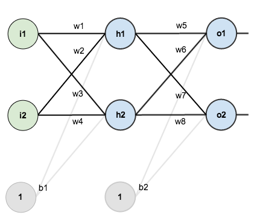
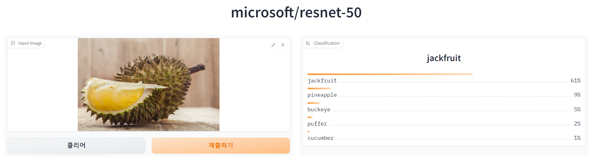

# 영상처리 2

##  딥러닝 영상처리 개요

### 딥러닝의 학습 과정

[참고 자료(역전파)](https://mattmazur.com/2015/03/17/a-step-by-step-backpropagation-example/)

특정 조건에 따라 기댓값이 있을 때, 우선 임의의 가중치로 모델을 거치게 한다. 그렇다면 결과값은 높은 확률로 기댓값과 차이가 클 것이다. 그렇다면 해당 결과값을 역산하여 올바른 가중치를 구하고, 모델을 수정한다.

신경망에서는 각 노드가 한 픽셀에 대응하고, 각 노드에 대한 가중치가 붙게 되어 이 학습 과정 자체가 속도가 매우 오래 걸린다. 그래서 딥러닝은 이론 자체는 10-20년 전에 이미 있었지만 고성능의 하드웨어가 필요하여 본격적으로 활용된 것은 최근이다.

### 인공 신경망의 구현 요소
- 입력 크기 -> 영상의 크기
- 노드 개수, 레이어 깊이 -> 모델의 연산량
- 활성 함수 -> 필터링 요소
- 에러 함수 -> 학습을 위한 에러 계산
- 역전파 -> 계산한 에러에 기반에 모델의 가중치를 수정

28\ * 28의 이미지는 실제로는 2차원의 배열이며, 1차원으로 늘어뜨리면 28\*28개의 각 노드에 픽셀 하나씩 대응될 수 있다. 각 노드에는 고유한 가중치가 붙는다.

실제 신경망를 본따 설계한 초창기의 인공신경망에서는, 첫 단의 입력 노드 각각이 모두 다음 단의 히든 레이어 모두에 연결되어 있다. (Fully Connected Layer) 모든 입력 값과 모든 레이어가 연관관계에 있는 것이다.  
이 방식의 성능이 그다지 높지는 않아서, 최근에는 CNN이라고 하는 개선된 방식을 사용한다.

이러한 방식으로 입력값에 대한 예측치가 나오게 되면, 기댓값과 비교하여 에러 수치를 산출한다. 기댓값과 에러 수치의 차이로부터 가중치를 얼마나, 어떤 방향으로 움직일지를 계산(미분방정식을 이용하여 기울기 산출)할 수 있으며, 그 결과 값을 모델의 가중치에 반영한다. 이렇게 점진적으로 모델의 성능이 개선되게 된다.

### 딥러닝(ANN) 실습

파트장님이 제공해주신 1_simple_network.ipynb 파일을 바탕으로 진행한다.

## CNN

### LeNet(LeCun)
이전 실습에서는 2차원 이미지를 1차원으로 나열해서 학습을 진행했다. 이 경우 위치값은 무시된다는 단점이 있어, 아무리 실습해도 정확도 향상에 한계가 있다.

이번에는 컨볼루션 신경망을 살펴본다. 컨볼루션 신경망에서는 필터를 통해 영상의 특징을 추출해 영상의 해상도를 줄여나간다. 

#### LeNet 실습

이번에는 파이토치 대신 텐서플로우를 사용한다. 대개 파이토치는 연구 목적으로, 텐서플로우는 제품 개발 목적으로 사용하는 경향이 있었지만, 요즘에는 거의 비슷하다.

mnist 학습에는 정확도가 98% 이상 뽑히지만, cifar10 학습에는 정확도가 50%대이다.

### AlexNet

실습 생략

### ResNet

실습 생략

레이어가 깊어짐에 따라 신호를 잃어버리는 것을 보강하기 위해 현재 연산 이전의 원본 값을 참조해 잔차를 학습

### GAN

생성형 모델의 기반이 되는 모델.  
생성적 적대 네트워크.

도둑과 경찰에 비유하여 설명 가능.  
생성자와 판별자가 있으며, 생성자는 가짜 데이터를 생성하며, 판별자는 진짜 데이터와 비교해 가짜 데이터를 판별하려고 노력. 생성자는 점차 구별하기 어려운 데이터를 생성하게 됨. 최종 모델에는 생성자를 취함.

CNN은 인식과 검출이 목표였다. 모델을 지날수록 입력 데이터의 크기는 작아지게 된다. 반면에 GAN의 생성자는 거쳐가면서 입력한 데이터가 점차 커져가야 한다. 결과적으로 모델이 생긴게 조금 달라진다.  
판별자는 CNN과 거의 생긴게 같다.

# 허깅페이스에서 여러가지 모델 테스트해보기

[https://huggingface.co/](https://huggingface.co/)

[ResNet](https://huggingface.co/spaces/awacke1/Image-Classifier-microsoft-resnet-50)

